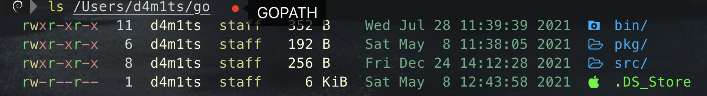
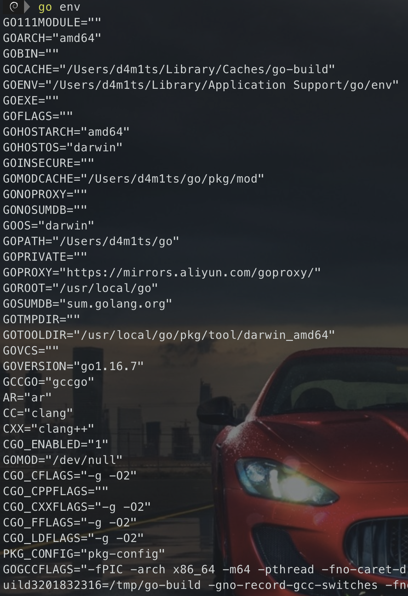
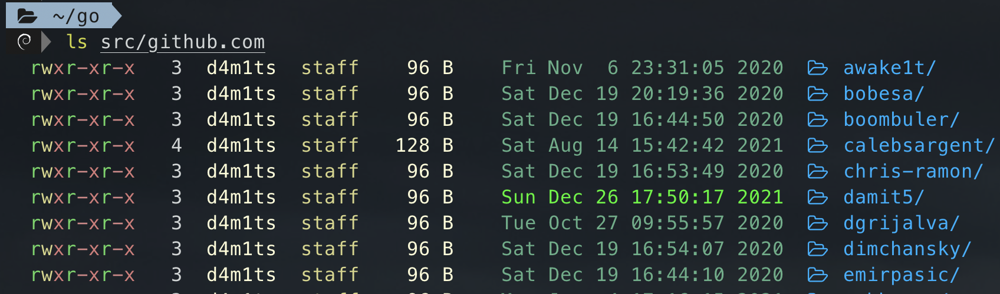
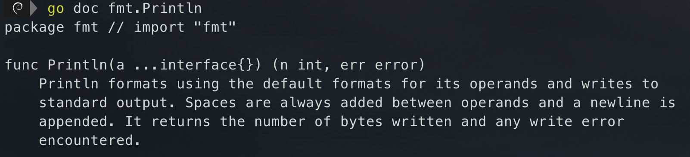
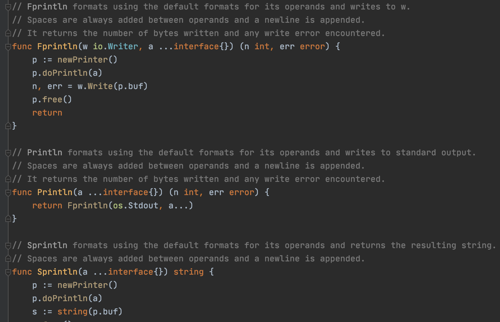
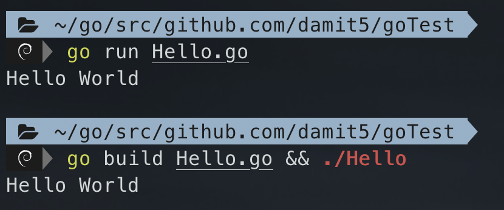
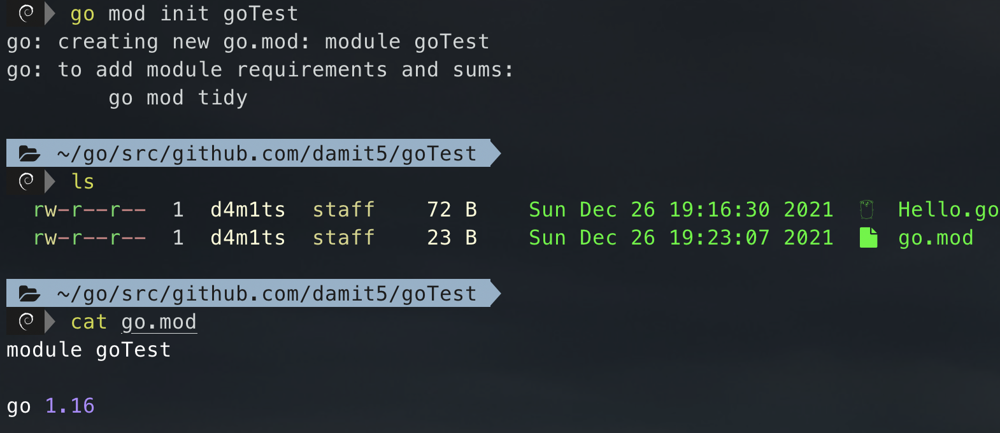
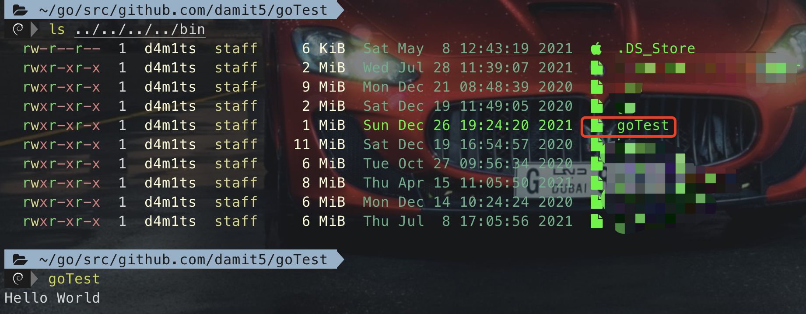
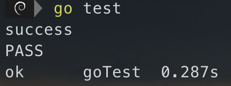
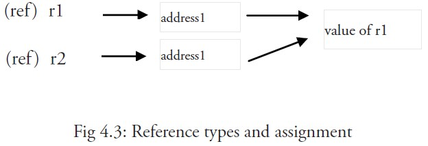

## 介绍
Go语言(Golang)最初是由**Robert Griesemer, Rob Pike**, 和 **Ken Thompson**在谷歌于2007年开发出来的编程语言。Go编程语言是静态类型语言，语法类似于C语言，它提供了垃圾收集，类型安全，动态的输入能力，还有很多先进的内置类型，例如，可变长度数组和映射（键-值对）。它还提供了丰富的标准库。
Go编程语言是在2009年11月正式对外发布，主要是应用谷歌的于一些生产系统链中。
## Hello World
```go
package main
import "fmt"
func main() {
	fmt.Println("HELLO WORLD")
}
```
```bash
go run Hello.go
```

## GO语言基础
### 工作空间
`go`工具为公共代码仓库中维护的开源代码而设计。 无论会不会公布代码，该模型设置工作环境的方法都是相同的。
Go代码必须放在**工作空间**内。它其实就是一个目录，其中包含三个子目录：

- `src` 目录包含Go的源文件，它们被组织成包（每个目录都对应一个包）
- `pkg` 目录包含包对象
- `bin` 目录包含可执行命令


`go` 工具用于构建`src`目录中的源码包，并将其生成的二进制文件安装到 `pkg` 和 `bin` 目录中。
`src` 子目录通常包会含多种版本控制的代码仓库（例如Git或Mercurial）， 以此来跟踪一个或多个源码包的开发。
结构举例如下：
```
bin/
	hello                 # 可执行命令
pkg/
	linux_amd64/          # 这里会反映出你的操作系统和架构
		github.com/user/
			stringutil.a  # 包对象
src/
	github.com/user/
		hello/
			hello.go      # 命令源码
		stringutil/
			reverse.go       # 包源码
```
### 环境变量
```bash
go env
```

而 `GOPATH` 环境变量指定了你的工作空间位置，这也是很重要的一个变量。
首先创建一个工作空间目录，并设置相应的 `GOPATH`，工作空间可以放在任何地方，我们使用 `$HOME/go`。
注意，它**绝对不能**和你的Go安装目录相同。（另一种常见的设置是 `GOPATH=$HOME`。）
设置GOPATH
```shell
export GOPATH=$HOME/go
```
然后将`bin`添加到环境变量中
```shell
export PATH=$PATH:$GOPATH/bin
```
### 包路径
标准库中的包有给定的短路径，比如 `"fmt"` 和 `"net/http"`。 对于你自己的包，你必须选择一个基本路径，来保证它不会与将来添加到标准库， 或其它扩展库中的包相冲突。
如果你将你的代码放到了某处的源码库，那就应当使用该源码库的根目录作为你的基本路径。 例如，若你在 [GitHub](https://github.com/) 上有账户 `github.com/user` 那么它就应该是你的基本路径。
我们将使用 `github.com/user` 作为基本路径。在你的工作空间里创建一个目录， 我们将源码存放到其中：
```shell
mkdir -p $GOPATH/src/github.com/user
```

### 包名
源文件中的第一个语句必须是
```go
package 名称
```
这里的 `**名称**` 即为导入该包时使用的默认名称。 （一个包中的所有文件都必须使用相同的 `**名称**`。）
Go的约定是包名为导入路径的最后一个元素：作为 “`crypto/rot13`” 导入的包应命名为 `rot13`。
可执行命令必须使用 `package main`。
链接成单个二进制文件的所有包，其包名无需是唯一的，只有导入路径（它们的完整文件名） 才是唯一的。
### 包文档
1、使用命令`go doc`
```shell
go doc fmt.Println
```

2、另一种比较常用的方式，是直接进去包内查看源码

### 代码结构
Go 语言的基础组成有以下几个部分：

- 包声明
- 引入包
- 函数
- 变量
- 语句 & 表达式
- 注释

以上面的`hello world`代码为例
```go
package main // 定义了包名。必须在源文件中非注释的第一行指明这个文件属于哪个包，如：package main。package main表示一个可独立执行的程序，每个 Go 应用程序都包含一个名为 main 的包。
import "fmt" // 引用fmt包（的函数，或其他元素），fmt 包实现了格式化 IO（输入/输出）的函数
func main() { // 程序开始执行的函数。main 函数是每一个可执行程序所必须包含的，一般来说都是在启动后第一个执行的函数（如果有 init() 函数则会先执行该函数）
	fmt.Println("HELLO WORLD") // 调用fmt包中的函数，将字符串输出到控制台，并在最后自动增加换行字符 \n
}
```
**其他：**

1. `//`开头的为单行注释，`/*`开头，并以`*/`结尾为多行注释
2. 当标识符（包括常量、变量、类型、函数名、结构字段等等）以一个大写字母开头，如：`Group1`，那么使用这种形式的标识符的对象就可以被外部包的代码所使用（客户端程序需要先导入这个包），这被称为导出（像面向对象语言中的 `public`）；标识符如果以小写字母开头，则对包外是不可见的，但是他们在整个包的内部是可见并且可用的（像面向对象语言中的 `protected` ）
3. 函数名首字母小写即为 protected :`func getId() {}`
函数名首字母大写即为 public :  `func Printf() {}`
### 代码编译运行
创建目录`/Users/d4m1ts/go/src/github.com/damit5/goTest`，并编写代码`Hello.go`，代码如上
#### 快速运行
编写完成代码后，有两种方法可以快速运行

- 一种是直接动态运行 `go run xxx.go`
- 另一种则是先编译成二进制文件再手动执行 `go build xxx.go`


#### 安装到本地
还有一种方法可以安装到本地，简单来说就是生成二进制文件并且放到`bin`目录下，如果在项目目录中就直接`go install`即可，在其他路径则需要带上`src`后的路径
```shell
go install
go install github.com/damit5/goTest
```
无论是安装包还是二进制文件，`go` 工具都会安装它所依赖的任何东西
如果提示`go: go.mod file not found in current directory or any parent directory; see 'go help modules'`，说明需要初始化项目，执行
```shell
go mod init {项目名}
```

然后就可以用`go install`了，生成后的二进制文件自动存放在`bin`目录中

#### 远程下载并编译
前提是提前上传到github中
若指定的包不在工作空间中，`go get`就会将会将它放到 GOPATH 指定的第一个工作空间内。（若该包已存在，`go get` 就会跳过远程获取， 其行为与 `go install` 相同）
```shell
go get github.com/damit5/goTest
go get -v github.com/damit5/goTest
```
#### 交叉编译
```shell
CGO_ENABLED=0 GOOS=darwin GOARCH=amd64 go build -ldflags="-s -w" -trimpath -o release/superwebmailerRCE_darwin
CGO_ENABLED=0 GOOS=linux GOARCH=amd64 go build -ldflags="-s -w" -trimpath -o release/superwebmailerRCE_linux
CGO_ENABLED=0 GOOS=windows GOARCH=amd64 go build -ldflags="-s -w" -trimpath -o release/superwebmailerRCE_win.exe
```
### 代码测试
Go拥有一个轻量级的测试框架，它由 `go test` 命令和 `testing` 包构成。
你可以通过创建一个名字以 `_test.go` 结尾的，包含名为 `TestXXX` 且签名为 `func (t *testing.T)` 函数的文件来编写测试。 测试框架会运行每一个这样的函数；若该函数调用了像 `t.Error` 或 `t.Fail` 这样表示失败的函数，此测试即表示失败。
**实例：**
```go
package main
import (
	"fmt"
	"testing"
)
func sum(a int, b int) int {
	return a+b
}
func TestSum(t *testing.T) {
	a := 10
	b := 20
	c := sum(a, b)
	if c == a+b {
		fmt.Println("success")
	} else {
		t.Errorf("error happends")
	}
}
```
代码编写后，使用如下命令即可测试
```go
go test
go test github.com/damit5/goTest
```

### GO标记
Go 程序可以由多个标记组成，可以是关键字，标识符，常量，字符串，符号。如以下 GO 语句由 6 个标记组成：
```go
fmt.Println("Hello, World!")
```
6 个标记是(每行一个)：
```
fmt
.
Println
(
"Hello, World!"
)
```
#### 标识符
标识符用来命名变量、类型等程序实体。一个标识符实际上就是一个或是多个字母( A ~ Z 和 a ~ z)数字(0~9)、下划线_组成的序列，**但是第一个字符必须是字母或下划线而不能是数字**。
#### 关键字
下面列举了 Go 代码中会使用到的 25 个关键字或保留字：

| break | default | func | interface | select |
| --- | --- | --- | --- | --- |
| case | defer | go | map | struct |
| chan | else | goto | package | switch |
| const | fallthrough | if | range | type |
| continue | for | import | return | var |

除了以上介绍的这些关键字，Go 语言还有 36 个预定义标识符：

| append | bool | byte | cap | close | complex | complex64 | complex128 | uint16 |
| --- | --- | --- | --- | --- | --- | --- | --- | --- |
| copy | false | float32 | float64 | imag | int | int8 | int16 | uint32 |
| int32 | int64 | iota | len | make | new | nil | panic | uint64 |
| print | println | real | recover | string | true | uint | uint8 | uintptr |

### 行分隔符;
在Go程序中，一行代表一个语句结束。每个语句不需要像 C 家族中的其它语言一样以分号 `;` 结尾，因为这些工作都将由 Go 编译器自动完成。
如果你打算将多个语句写在同一行，它们则必须使用 `;` 人为区分，但在实际开发中我们并不鼓励这种做法。
### 注释
注释不会被编译，每一个包应该有相关注释。
```go
// 单行注释
/*
多行注释
*/
```
### 字符串连接
和大多数语言一样，连接通过`+`来实现
```go
fmt.Println("HELLO WORLD\t" + "d4m1ts")
```
### 格式化字符串
Go 语言中使用 **fmt.Sprintf** 格式化字符串并赋值给新串
```go
package main
import "fmt"
func main() {
	var keyword = "world"
	var name = "d4m1ts"
	var age = 18
	var template = "hello %s %s %d"
	var sentence = fmt.Sprintf(template, keyword, name, age)
	fmt.Println(sentence)
}
// hello world d4m1ts 18
```
### 数据类型
| 序号 | 类型和描述 |
| --- | --- |
| 1 | **布尔型**布尔型的值只可以是常量 true 或者 false。一个简单的例子：`var b bool = true`
。 |
| 2 | **数字类型**整型 int 和浮点型 float32、float64，Go 语言支持整型和浮点型数字，并且支持复数，其中位的运算采用补码。 |
| 3 | **字符串类型:**字符串就是一串固定长度的字符连接起来的字符序列。Go 的字符串是由单个字节连接起来的。Go 语言的字符串的字节使用 UTF-8 编码标识 Unicode 文本。 |
| 4 | **派生类型:**包括：
(a) 指针类型（Pointer）
(b) 数组类型
(c) 结构化类型(struct)
(d) Channel 类型
(e) 函数类型
(f) 切片类型
(g) 接口类型（interface）
(h) Map 类型 |

#### 数字类型
Go 也有基于架构的类型，例如：int、uint 和 uintptr。

| 序号 | 类型和描述 |
| --- | --- |
| 1 | **uint8** 无符号 8 位整型 (0 到 255) |
| 2 | **uint16** 无符号 16 位整型 (0 到 65535) |
| 3 | **uint32** 无符号 32 位整型 (0 到 4294967295) |
| 4 | **uint64** 无符号 64 位整型 (0 到 18446744073709551615) |
| 5 | **int8** 有符号 8 位整型 (-128 到 127) |
| 6 | **int16** 有符号 16 位整型 (-32768 到 32767) |
| 7 | **int32** 有符号 32 位整型 (-2147483648 到 2147483647) |
| 8 | **int64** 有符号 64 位整型 (-9223372036854775808 到 9223372036854775807) |

#### 浮点型
| 序号 | 类型和描述 |
| --- | --- |
| 1 | **float32** IEEE-754 32位浮点型数 |
| 2 | **float64** IEEE-754 64位浮点型数 |
| 3 | **complex64** 32 位实数和虚数 |
| 4 | **complex128** 64 位实数和虚数 |

#### 其他数字类型
以下列出了其他更多的数字类型：

| 序号 | 类型和描述 |
| --- | --- |
| 1 | **byte** 类似 uint8 |
| 2 | **rune** 类似 int32 |
| 3 | **uint** 32 或 64 位 |
| 4 | **int** 与 uint 一样大小 |
| 5 | **uintptr** 无符号整型，用于存放一个指针 |

### 值类型和引用类型
> 值类型是单独记录在内存中的，每2个数据都是独立的，其中一个修改不会影响到另一个
> 引用类型记录的是指针地址，如果2个数据指向同一个地址，那么其中一个被修改了，另一个也会被修改

所有像 int、float、bool 和 string 这些基本类型都属于值类型，使用这些类型的变量直接指向存在内存中的值
当使用等号 `=` 将一个变量的值赋值给另一个变量时，如：`j = i`，实际上是在内存中将 i 的值进行了拷贝，可以通过 `&i` 来获取变量 i 的内存地址

而更复杂的数据通常会需要使用多个字，这些数据一般使用引用类型保存。
一个引用类型的变量 `r1` 存储的是 `r1` 的值所在的`内存地址（数字）`，或`内存地址中第一个字`所在的位置

这个内存地址称之为指针，这个指针实际上也被存在另外的某一个值中。
同一个引用类型的指针指向的多个字可以是在连续的内存地址中（内存布局是连续的），这也是计算效率最高的一种存储形式；也可以将这些字分散存放在内存中，每个字都指示了下一个字所在的内存地址。
当使用赋值语句 `r2 = r1` 时，只有引用（地址）被复制。
如果 r1 的值被改变了，那么这个值的所有引用都会指向被修改后的内容，在这个例子中，r2 也会受到影响。
## GO开发基础
### 声明变量

1. 变量名由字母、数字、下划线组成，其中首个字符不能为数字。
2. 声明变量的一般形式是使用 `var` 关键字：

**语法：**
```go
// 标准语法
var identifier type
// 也可以同时声明多个变量
var identifier1, identifier2 type
// 1. 指定变量类型，如果没有初始化，则变量默认为零值（没有做初始化时系统默认设置的值）
var a int    // 0
var b bool   // false
var c string // ""
var a []int  // nil
// 2. 没有指定变量类型，则根据值自行判定变量类型
var d = true // 自动识别为bool
// 3. 使用 := 可以快速声明变量
/*
:= 等价于
var name string;
name = "d4m1ts"
这种格式只能在函数体中出现
*/
name := "d4m1ts"
// 4. 如果变量已经使用 var 声明过了，再使用 := 声明变量，就产生编译错误
var name = "d4m1ts"
name := "d4m1ts"
```
**单变量声明实例：**
```go
var a,b int8
a = 1
b = 2
var name = "d4m1ts"
name1 := "d4m1ts"
```
**多变量声明实例：**
```go
var a,b int = 1,2
c,d := 3,4
```
**任意变量：**
如果想接受任意类型的变量，可以用`interface`
比如`var jsonData []map[string]interface{}`
```go
package main
 
import (
	"fmt"
)
 
func init() {
	fmt.Print("init")
}
 
func main() {
	test1("123")
	test1(1)
	test2("123",1, "324", 12)
}
 
// 实现传单个任何类型的参数
 
func test1(v interface{}) {
	fmt.Println(v)                  // 打印 “123” 1
}
 
// 实现传任意多个任意类型的参数
 
func test2(v ...interface{}) {
	for _, m := range v {
		fmt.Println(m)				// 依次打印 123 1 324 12
	}
}
```
`interface{}`转`string`
```go
var a interface{}
a.(string)
```
### 声明常量

1. 常量是一个简单值的标识符，在程序运行时，不会被修改的量，一般形式是使用 `const` 关键字。
2. 常量中的数据类型**只可以是布尔型、数字型（整数型、浮点型和复数）和字符串型。**

**语法：**
和变量一样，`type`可以省略

- 显式类型定义： `const b string = "abc"`
- 隐式类型定义： `const b = "abc"`
```sql
const identifier [type] = value
```
**定义实例：**
```go
const j = 4
const i,j = 3,4
```
**用作枚举：**
```go
package main
import (
	"fmt"
	"unsafe"
)
func main() {
	const (
		a = "abc"
		b = len(a)
		c = unsafe.Sizeof(b)
	)
	fmt.Println(c)
}
// 8
```
**iota：**
特殊常量，可以认为是一个可以被编译器修改的常量
iota 在 const关键字出现时将被重置为 0(const 内部的第一行之前)，const 中每**新增一行常量声明将使 iota 计数一次**(iota 可理解为 const 语句块中的行索引)。
```go
package main
import "fmt"
func main() {
    const (
            a = iota   //0
            b          //1
            c          //2
            d = "ha"   //独立值，iota += 1
            e          //"ha"   iota += 1
            f = 100    //iota +=1
            g          //100  iota +=1
            h = iota   //7,恢复计数
            i          //8
    )
    fmt.Println(a,b,c,d,e,f,g,h,i)
}
// 0 1 2 ha ha 100 100 7 8
```
### 运算符
#### 算术运算符
下表列出了所有Go语言的算术运算符。假定 A 值为 10，B 值为 20。

| 运算符 | 描述 | 实例 |
| --- | --- | --- |
| + | 相加 | A + B 输出结果 30 |
| - | 相减 | A - B 输出结果 -10 |
| * | 相乘 | A * B 输出结果 200 |
| / | 相除 | B / A 输出结果 2 |
| % | 求余 | B % A 输出结果 0 |
| ++ | 自增 | A++ 输出结果 11 |
| -- | 自减 | A-- 输出结果 9 |

#### 关系运算符
下表列出了所有Go语言的关系运算符。假定 A 值为 10，B 值为 20。

| 运算符 | 描述 | 实例 |
| --- | --- | --- |
| == | 检查两个值是否相等，如果相等返回 True 否则返回 False。 | (A == B) 为 False |
| != | 检查两个值是否不相等，如果不相等返回 True 否则返回 False。 | (A != B) 为 True |
| > | 检查左边值是否大于右边值，如果是返回 True 否则返回 False。 | (A > B) 为 False |
| < | 检查左边值是否小于右边值，如果是返回 True 否则返回 False。 | (A < B) 为 True |
| >= | 检查左边值是否大于等于右边值，如果是返回 True 否则返回 False。 | (A >= B) 为 False |
| <= | 检查左边值是否小于等于右边值，如果是返回 True 否则返回 False。 | (A <= B) 为 True |

#### 逻辑运算符
下表列出了所有Go语言的逻辑运算符。假定 A 值为 True，B 值为 False。

| 运算符 | 描述 | 实例 |
| --- | --- | --- |
| && | 逻辑 AND 运算符。 如果两边的操作数都是 True，则条件 True，否则为 False。 | (A && B) 为 False |
| &#124;&#124; | 逻辑 OR 运算符。 如果两边的操作数有一个 True，则条件 True，否则为 False。 | (A &#124;&#124; B) 为 True |
| ! | 逻辑 NOT 运算符。 如果条件为 True，则逻辑 NOT 条件 False，否则为 True。 | !(A && B) 为 True |

#### 位运算符
位运算符对整数在内存中的二进制位进行操作。
下表列出了位运算符 &, |, 和 ^ 的计算：

| p | q | p & q | p &#124; q | p ^ q |
| --- | --- | --- | --- | --- |
| 0 | 0 | 0 | 0 | 0 |
| 0 | 1 | 0 | 1 | 1 |
| 1 | 1 | 1 | 1 | 0 |
| 1 | 0 | 0 | 1 | 1 |

Go 语言支持的位运算符如下表所示。假定 A 为60，B 为13：

| 运算符 | 描述 | 实例 |
| --- | --- | --- |
| & | 按位与运算符"&"是双目运算符。 其功能是参与运算的两数各对应的二进位相与。 | (A & B) 结果为 12, 二进制为 0000 1100 |
| &#124; | 按位或运算符"&#124;"是双目运算符。 其功能是参与运算的两数各对应的二进位相或 | (A &#124; B) 结果为 61, 二进制为 0011 1101 |
| ^ | 按位异或运算符"^"是双目运算符。 其功能是参与运算的两数各对应的二进位相异或，当两对应的二进位相异时，结果为1。 | (A ^ B) 结果为 49, 二进制为 0011 0001 |
| << | 左移运算符"<<"是双目运算符。左移n位就是乘以2的n次方。 其功能把"<<"左边的运算数的各二进位全部左移若干位，由"<<"右边的数指定移动的位数，高位丢弃，低位补0。 | A << 2 结果为 240 ，二进制为 1111 0000 |
| >> | 右移运算符">>"是双目运算符。右移n位就是除以2的n次方。 其功能是把">>"左边的运算数的各二进位全部右移若干位，">>"右边的数指定移动的位数。 | A >> 2 结果为 15 ，二进制为 0000 1111 |

#### 赋值运算符
下表列出了所有Go语言的赋值运算符。

| 运算符 | 描述 | 实例 |
| --- | --- | --- |
| = | 简单的赋值运算符，将一个表达式的值赋给一个左值 | C = A + B 将 A + B 表达式结果赋值给 C |
| += | 相加后再赋值 | C += A 等于 C = C + A |
| -= | 相减后再赋值 | C -= A 等于 C = C - A |
| *= | 相乘后再赋值 | C _= A 等于 C = C _ A |
| /= | 相除后再赋值 | C /= A 等于 C = C / A |
| %= | 求余后再赋值 | C %= A 等于 C = C % A |
| <<= | 左移后赋值 | C <<= 2 等于 C = C << 2 |
| >>= | 右移后赋值 | C >>= 2 等于 C = C >> 2 |
| &= | 按位与后赋值 | C &= 2 等于 C = C & 2 |
| ^= | 按位异或后赋值 | C ^= 2 等于 C = C ^ 2 |
| &#124;= | 按位或后赋值 | C &#124;= 2 等于 C = C &#124; 2 |

#### 其他运算符
下表列出了Go语言的其他运算符。

| 运算符 | 描述 | 实例 |
| --- | --- | --- |
| & | 返回变量存储地址 | &a; 将给出变量的实际地址。 |
| * | 指针变量。 | *a; 是一个指针变量 |

#### 运算符优先级
有些运算符拥有较高的优先级，二元运算符的运算方向均是从左至右。下表列出了所有运算符以及它们的优先级，由上至下代表优先级由高到低：

| 优先级 | 运算符 |
| --- | --- |
| 5 | * / % << >> & &^ |
| 4 | + - &#124; ^ |
| 3 | == != < <= > >= |
| 2 | && |
| 1 | &#124;&#124; |

### 空白标识符
> 用 `_` 可以代表被丢弃的值，避免一些变量因为没使用导致程序报错

**实例：**
变量`j`必须使用，否则会报错
```go
package main
import "fmt"
func main() {
	a := [] int {1,2,3,4,5}
	for j,i := range a {
		fmt.Println(j, i)
	}
}
```
使用`_`来丢弃上面的`j`变量
```go
package main
import "fmt"
func main() {
	a := [] int {1,2,3,4,5}
	for _,i := range a {
		fmt.Println(i)
	}
}
```
### 格式化输出
Go采用的格式化打印风格和C的 `printf` 族类似，但却更加丰富而通用。 这些函数位于 `fmt` 包中，且函数名首字母均为大写：如 `fmt.Printf`、`fmt.Fprintf`，`fmt.Sprintf` 等。 字符串函数（`Sprintf` 等）会返回一个字符串，而非填充给定的缓冲区。

- 常见格式
```go
var t interface{}
t = functionOfSomeType()
switch t := t.(type) {
default:
	fmt.Printf("unexpected type %T", t)       // %T 输出 t 是什么类型
case bool:
	fmt.Printf("boolean %t\n", t)             // t 是 bool 类型
case int:
	fmt.Printf("integer %d\n", t)             // t 是 int 类型
case *bool:
	fmt.Printf("pointer to boolean %t\n", *t) // t 是 *bool 类型
case *int:
	fmt.Printf("pointer to integer %d\n", *t) // t 是 *int 类型
}
```

- 通用格式
```go
package main
import (
	"fmt"
)
type structTest struct {
	name string
	age int
}
func main() {
	a := structTest{
		name: "d4m1ts",
		age: 18,
	}
	fmt.Printf("123 %v 456\n", "aa") // 123 aa 456
	fmt.Printf("123 %v 456\n", a)	// 123 {d4m1ts 18} 456
	fmt.Printf("123 %+v 456\n", a)	// 123 {name:d4m1ts age:18} 456
	fmt.Printf("123 %#v 456\n", a)	// 123 main.structTest{name:"d4m1ts", age:18} 456
}
// 通用的格式 %v（对应“值”），这种格式还能打印任意值，甚至包括数组、结构体和映射。
// 当打印结构体时，改进的格式 %+v 会为结构体的每个字段添上字段名，而另一种格式 %#v 将完全按照Go的语法打印值。
```
### 条件语句
注意大括号`{`的位置，不能单独一行！！！
#### if
```go
package main
import (
	"fmt"
)
func main() {
	name := "d4m1ts"
	if (len(name) > 5){
		fmt.Println(name)
	}
}
```
#### if...else
```go
package main
import (
	"fmt"
)
func main() {
	name := "d4m1ts"
	if (len(name) > 10){
		fmt.Println(name)
	} else {
		fmt.Println("NONONO")
	}
}
```
#### if...else if...else
```go
package main
import (
	"fmt"
)
func main() {
	name := "d4m1ts"
	if (len(name) > 10){
		fmt.Println(name)
	} else if (len(name) == 6) {
		fmt.Println(name, "==6")
	}  else {
		fmt.Println("NONONO")
	}
}
```
#### switch
```go
package main
import "fmt"
func main() {
	name := "d4m1ts"
	switch {
	case len(name) > 5:
			fmt.Print(">5")
	case len(name) < 5:
		fmt.Print("<5")
	default:
		fmt.Print("=5")
	}
}
```
#### select
select 是 Go 中的一个控制结构，类似于用于通信的 switch 语句。每个 case 必须是一个通信操作，要么是发送要么是接收。
select 随机执行一个可运行的 case。如果没有 case 可运行，它将阻塞，直到有 case 可运行。一个默认的子句应该总是可运行的。
**语法:**
Go 编程语言中 select 语句的语法如下：
```go
select {
    case communication clause  :
       statement(s);      
    case communication clause  :
       statement(s);
    /* 你可以定义任意数量的 case */
    default : /* 可选 */
       statement(s);
}
```
以下描述了 select 语句的语法：

- 每个 case 都必须是一个通信
- 所有 channel 表达式都会被求值
- 所有被发送的表达式都会被求值
- 如果任意某个通信可以进行，它就执行，其他被忽略。
- 如果有多个 case 都可以运行，Select 会随机公平地选出一个执行。其他不会执行。否则：
   1. 如果有 default 子句，则执行该语句。
   2. 如果没有 default 子句，select 将阻塞，直到某个通信可以运行；Go 不会重新对 channel 或值进行求值。

**实例：**
```go
package main
import "fmt"
func main() {
   var c1, c2, c3 chan int
   var i1, i2 int
   select {
      case i1 = <-c1:
         fmt.Printf("received ", i1, " from c1\n")
      case c2 <- i2:
         fmt.Printf("sent ", i2, " to c2\n")
      case i3, ok := (<-c3):  // same as: i3, ok := <-c3
         if ok {
            fmt.Printf("received ", i3, " from c3\n")
         } else {
            fmt.Printf("c3 is closed\n")
         }
      default:
         fmt.Printf("no communication\n")
   }    
}
```
### 循环语句
#### for
**语法：**
共有3种语法，分别是
```go
// 1.和 C 语言的 for 一样
for init; condition; post { }
// 2.和 C 的 while 一样
for condition { }
// 3.while true，需要手动break
for { }
```

- init： 一般为赋值表达式，给控制变量赋初值；
- condition： 关系表达式或逻辑表达式，循环控制条件；
- post： 一般为赋值表达式，给控制变量增量或减量。

**实例：**
```go
package main
import "fmt"
func main() {
	sum := 0
	// 1 ==> 10
	for i:=0; i<10; i+=1 {
		sum += 1
	}
	fmt.Println(sum)
	// 2 ==> 40
	for sum < 25 {
		sum += sum
	}
	fmt.Println(sum)
	// 3 ==> 160
	for {
		sum += sum
		if sum > 100{
			break
		}
	}
	fmt.Println(sum)
}
```
#### for each
严格来说是 `for each range` 循环
```go
package main
import "fmt"
func main() {
	ab := []string {"aaa", "bbb"}
	for i,s := range ab{
		fmt.Println(i ,s)
	}
}
/*
0 aaa
1 bbb
*/
```
#### 无限循环
```go
package main
import "fmt"
func main() {
	for true {
		fmt.Println("1")
	}
}
```
### 循环控制
就是让循环停止或者跳过此次循环

| break | 经常用于中断当前 for 循环或跳出 switch 语句 |
| --- | --- |
| continue | 跳过当前循环的剩余语句，然后继续进行下一轮循环。 |
| goto | 将控制转移到被标记的语句。 |

goto见比较少，举个例子吧
```go
package main
import "fmt"
func main() {
	a := 10
	LOOP: for a < 20 {
		if a == 15 {
			a = a + 1
			goto LOOP
		}
		fmt.Printf("a的值为 : %d\n", a)
		a+=1
	}
}
/*
a的值为 : 10
a的值为 : 11
a的值为 : 12
a的值为 : 13
a的值为 : 14
a的值为 : 16
a的值为 : 17
a的值为 : 18
a的值为 : 19
*/
```
### init函数
每个源文件都可以通过定义自己的无参数 `init` 函数来设置一些必要的状态。（其实每个文件都可以拥有多个 `init` 函数。）而它的结束就意味着初始化结束：只有该包中的所有变量声明都通过它们的初始化器求值后 `init` 才会被调用， 而那些`init` 只有在所有已导入的包都被初始化后才会被求值。
除了那些不能被表示成声明的初始化外，`init` 函数还常被用在程序真正开始执行前，检验或校正程序的状态。
```go
package main
import "fmt"
func init() {
	fmt.Println("init ...")
}
func main() {
	fmt.Println("main ...")
}
/*
init ...
main ...
*/
```
### 自定义函数
**语法：**
```go
func function_name( [parameter list] ) [return_types] {
   函数体
}
```
**函数定义解析：**

- `func`：函数由 func 开始声明
- `function_name`：函数名称，参数列表和返回值类型构成了函数签名。
- `parameter list`：参数列表，参数就像一个占位符，当函数被调用时，你可以将值传递给参数，这个值被称为实际参数。参数列表指定的是参数类型、顺序、及参数个数。参数是可选的，也就是说函数也可以不包含参数。
- `return_types`：返回类型，函数返回一列值。return_types 是该列值的数据类型。有些功能不需要返回值，这种情况下 return_types 不是必须的。
- `函数体`：函数定义的代码集合。

**实例：**

- 选出2个数中最大的
```go
package main
import "fmt"
func main() {
	fmt.Println(max(5,9 ))
}
func max (a int, b int) int {
	if a > b {
		return a
	} else {
		return b
	}
}
```

- 返回多个值
```go
package main
import "fmt"
func main() {
	fmt.Println(max(5,9 ))
}
func max (a int, b int) (int,int) {
	if a > b {
		return a,b
	} else {
		return b,a
	}
}
```

- 引用传递值

传入的是地址，函数内值被修改，函数外也会受影响
```go
package main
import "fmt"
func main() {
	a := 66
	test(&a)
	fmt.Println(a)
}
func test(a *int) {
	fmt.Println(*a)
	*a += 10
	fmt.Println(*a)
}
/*
66
76
76
*/
```
### 构造函数与复合字面
有时零值还不够好，这时就需要一个初始化构造函数，如来自 `os` 包中的这段代码所示。
```go
func NewFile(fd int, name string) *File {
	if fd < 0 {
		return nil
	}
	f := new(File)
	f.fd = fd
	f.name = name
	f.dirinfo = nil
	f.nepipe = 0
	return f
}
```
这里显得代码过于冗长。我们可通过**复合字面**来简化它， 该表达式在每次求值时都会创建新的实例
```go
func NewFile(fd int, name string) *File {
	if fd < 0 {
		return nil
	}
	f := File{fd, name, nil, 0}	// 复合字面
	return &f
}
```
### 作用域
#### 局部变量
在函数体内声明的变量称之为局部变量，它们的作用域只在函数体内，参数和返回值变量也是局部变量。
#### 全局变量
在函数体外声明的变量称之为全局变量，全局变量可以在整个包甚至外部包（被导出后）使用；

1. 全局变量可以在任何函数中使用
2. 全局变量与局部变量名称可以相同，但是函数内的局部变量会被优先考虑

**实例：**
```go
package main
import "fmt"
var global string = "全局变量"
func main() {
	fmt.Println(global)
}
```
### 数组
#### 初始化数组

1. 如果数组长度不确定，可以使用 `...` 代替数组的长度，编译器会根据元素个数自行推断数组的长度（也可以使用[切片](#%E5%88%87%E7%89%87)）
2. 初始化数组中 `{}` 中的元素个数不能大于 `[]` 中的数字

**语法：**
```go
var variable_name [SIZE] variable_type
var balance [10] float32
```
**实例：**
```go
package main
import "fmt"
func main() {
	var a [10] string
	var b = [...] int {1,2,3,4,5}
	c := [] string {"aa", "bb", "cc"} // 切片
	fmt.Println(a)
	fmt.Println(b)
	fmt.Println(c)
}
```
#### 访问数组
数组元素可以通过索引（位置）来读取。格式为数组名后加中括号，中括号中为索引的值。
```go
package main
import "fmt"
func main() {
	c := [] string {"aa", "bb", "cc"}
	fmt.Println(c[0])
	for i,s := range c {
		fmt.Println(i, s)
	}
}
```
### 指针
#### 使用指针
会C的指针，这个就很简单了

1. 取地址符是`&`，放到一个变量前使用就会返回相应变量的内存地址
2. 取值符是`*`，放到一个内存地址前使用就会返回相应变量的值
```go
package main
import "fmt"
func main() {
	a := 1		// 实际变量
	var ip *int // 指针变量
	ip = &a
	fmt.Println("a的值：", a)
	fmt.Println("a的地址：", &a)
	fmt.Printf("a的地址：%x", ip)
}
```
#### 空指针
当一个指针被定义后没有分配到任何变量时，它的值为 `nil`。
`nil` 指针也称为空指针。
`nil`在概念上和其它语言的`null`、`None`、`nil`、`NULL`一样，都指代零值或空值。
一个指针变量通常缩写为 ptr
```go
package main
import "fmt"
func main() {
	var ptr *int // 指针变量
	fmt.Printf("ptr空指针地址：%x", ptr)
}
// 0
```
判断空指针
```go
if(ptr != nil)     /* ptr 不是空指针 */
if(ptr == nil)    /* ptr 是空指针 */
```
#### 指针数组
有一种情况，我们可能需要保存数组，这样我们就需要使用到指针
```go
package main
import "fmt"
func main() {
	var a = [] int {1,2,3}
	var ptr [3] *int
	for i,s := range a {
		ptr[i] = &s
	}
	fmt.Println(ptr)	// [0xc000198000 0xc000198000 0xc000198000]
	for i,s := range ptr {
		fmt.Println(i, *s)
	}
}
```
ptr 为整型指针数组，因此每个元素都指向了数组中第一个值的地址
### 结构体
#### 定义结构体
结构体定义需要使用 `type` 和 `struct` 语句。`struct` 语句定义一个新的数据类型，结构体中有一个或多个成员。`type` 语句设定了结构体的名称。结构体的格式如下：
```go
type struct_variable_type struct {
   member definition
   member definition
   ...
   member definition
}
```
一旦定义了结构体类型，它就能用于变量的声明，语法格式如下：
```go
variable_name := structure_variable_type {value1, value2...valuen}
// 或
variable_name := structure_variable_type { key1: value1, key2: value2..., keyn: valuen}
```
**实例：**
```go
package main
import "fmt"
func main() {
	type testStruct struct {
		name string
		age int
	}
	a := testStruct{"d4m1", 18}
	fmt.Println(a)
	
	b := testStruct{name: "d4m1ts", age: 18}
	fmt.Println(b)
}
/*
{d4m1 18}
{d4m1ts 18}
*/
```
#### 访问成员
如果要访问结构体成员，需要使用点号`.`操作符，格式为：
```go
结构体.成员名
```
**实例：**
```go
package main
import "fmt"
func main() {
	type testStruct struct {
		name string
		age int
	}
	a := testStruct{name: "d4m1ts", age: 18}
	fmt.Println(a.name)
}
// d4m1ts
```
#### 结构体作为参数
和其他类型一样，只不过类型是结构体罢了
**实例：**
```go
package main
import "fmt"
type testStruct struct {
	name string
	age int
}
func main() {
	a := testStruct{name: "d4m1ts", age: 18}
	printName(a)
}
func printName(stru testStruct) {
	fmt.Println(stru.name)
}
```
#### 结构体指针
也和其他指针一样
**实例：**
```go
package main
import "fmt"
type testStruct struct {
	name string
	age int
}
func main() {
	a := testStruct{name: "d4m1ts", age: 18}
	fmt.Println(&a)
	printName(&a)
}
func printName(stru *testStruct) {
	fmt.Println(stru.name)
}
/*
&{d4m1ts 18}
d4m1ts
*/
```
### 切片
Go 语言切片是**对数组的抽象**。
Go 数组的长度不可改变，在特定场景中这样的集合就不太适用，Go 中提供了一种灵活，功能强悍的内置类型切片("动态数组")，与数组相比切片的长度是不固定的，可以追加元素，在追加时可能使切片的容量增大。
#### 定义切片
可以声明一个未指定大小的数组来定义切片，切片不需要说明长度
```go
var identifier []type
```
或使用 `make()` 函数来创建切片:
```go
var slice1 []type = make([]type, len)
// 也可以简写为
slice1 := make([]type, len)
```
也可以指定容量，其中 `capacity` 为可选参数。
```go
make([]T, length, capacity)
```
这里 len 是数组的长度并且也是切片的初始长度。
**实例：**
```go
package main
import "fmt"
func main() {
	var slice1 []int
	fmt.Println(slice1)	// []
	var slice2 []int = make([]int, 10)
	fmt.Println(slice2)	// [0 0 0 0 0 0 0 0 0 0]
}
```
#### 初始化切片
```go
package main
import "fmt"
func main() {
	s1 := []int {1,2,3,4,5}
	fmt.Println(s1)	// [1 2 3 4 5]
	
	// 使用数组来初始化切片
	d1 := [10]int {1,3,5,7,9}
	fmt.Println(d1) // [1 3 5 7 9 0 0 0 0 0]
	s2 := d1[:]
	fmt.Println(s2) // [1 3 5 7 9 0 0 0 0 0]
	s3 := d1[2:]
	fmt.Println(s3) // [5 7 9 0 0 0 0 0]
}
```
#### 空(nil)切片
一个切片在未初始化之前默认为 nil，长度为 0
```go
package main
import "fmt"
func main() {
	var s1 []int
	fmt.Println(s1)	// []
	fmt.Println(s1 == nil) // true
}
```
#### 切片截取
和python一样，`array[start:end]`截取即可
```go
package main
import "fmt"
func main() {
	var s1 = []int {1,2,3,4,5}
	fmt.Println(s1[2:4]) // [3 4]
}
```
#### len()和cap()函数
切片是可索引的，并且可以由`len()`方法获取长度。
切片提供了计算容量的方法`cap()`可以测量切片最长可以达到多少。
```go
package main
import "fmt"
func main() {
	s1 := []int {1,2,3,4,5}
	fmt.Println(len(s1)) // 5
	fmt.Println(cap(s1)) // 5
}
```
#### 追加元素
通过`append`函数可以追加元素
```go
package main
import "fmt"
func main() {
	c := [] string {"aa", "bb", "cc"}
	c = append(c, "dd", "ee")
	fmt.Println(c) // [aa bb cc dd ee]
}
```
如果想合并2个切片，也可以使用`append`
注意的是要添加`...`，如果没有 `...`，它就会由于类型错误而无法编译
```go
package main
import "fmt"
func main() {
	c := [] string {"aa", "bb", "cc"}
	c = append(c, "dd", "ee")
	x := [] string {"1","2","3"}
	c = append(c, x...)
	fmt.Println(c) // [aa bb cc dd ee 1 2 3]
}
```
#### append()和copy()函数
如果想增加切片的容量，我们必须创建一个新的更大的切片并把原分片的内容都拷贝过来。
下面的代码描述了从拷贝切片的 copy 方法和向切片追加新元素的 append 方法。
```go
package main
import "fmt"
func main() {
	var s1 = []int {1,2,3,4,5}
	s1 = append(s1, 666)	// [1 2 3 4 5 666]
	s1 = append(s1, 7,8,9)  // [1 2 3 4 5 666 7 8 9]
	fmt.Println(s1)
	s2 := make([]int, len(s1)*2, cap(s1)*2)
	copy(s2, s1)	// 把s1的内容复制给s2
	fmt.Println(s2) // [1 2 3 4 5 666 7 8 9 0 0 0 0 0 0 0 0 0]
}
```
### 集合(Map)
Map 是一种无序的键值对的集合。Map 最重要的一点是通过 key 来快速检索数据，key 类似于索引，指向数据的值。
Map 是一种集合，所以我们可以像迭代数组和切片那样迭代它。不过，Map 是无序的，我们无法决定它的返回顺序，这是因为 Map 是使用 hash 表来实现的。
#### 定义Map
可以使用内建函数 `make` 也可以使用 `map` 关键字来定义 Map:
```go
/* 声明变量，默认 map 是 nil */
var map_variable map[key_data_type]value_data_type
/* 使用 make 函数 */
map_variable := make(map[key_data_type]value_data_type)
```
**实例：**
```go
package main
import "fmt"
func main() {
	// 1.直接使用map创建
	m1 := map[string]string{
		"a": "test1",
		"b": "test2",
	}
	m1 ["c"] = "test3"
	fmt.Println(m1)
	// 2.使用make创建
	m2 := make(map[string]string)
	m2 ["e"] = "f"
	fmt.Println(m2)
}
```
#### 删除元素
`delete()`函数用于删除集合的元素, 参数为`map`和其对应的`key`
```go
package main
import "fmt"
func main() {
	// 1.直接使用map创建
	m1 := map[string]string{
		"a": "test1",
		"b": "test2",
	}
	m1 ["c"] = "test3"
	delete(m1, "a")
	fmt.Println(m1) // map[b:test2 c:test3]
}
```
### 范围(Range)
range 关键字用于 for 循环中迭代数组(array)、切片(slice)、通道(channel)或集合(map)的元素。在数组和切片中它返回元素的索引和索引对应的值，在集合中返回 `key-value` 对
```go
package main
import "fmt"
func main() {
	// 遍历切片
	var s1 = []int {1,2,3,4,5}
	sum := 0
	for _,num := range s1 { // _空白符，表示被舍弃的变量，这里的变量是索引
		sum += num
	}
	fmt.Println(sum)
	// 遍历map
	m1 := map[string]string{
		"a":"test1",
		"b":"test2",
	}
	for k,v := range m1 {
		fmt.Println(k, v)
	}
}
```
### 类型转换
类型转换用于将一种数据类型的变量转换为另外一种类型的变量
**语法：**
`type_name`为类型，`expression`为表达式
```go
type_name(expression)
```
**实例：**
```go
package main
import "fmt"
func main() {
	a := 1
	fmt.Println(string(a))	// 空
	fmt.Println(float32(a)) // 1
}
```
### 递归
递归，就是在运行的过程中调用自己
#### 阶乘实例
```go
package main
import "fmt"
func Factorial(n uint64)(result uint64) {
	if (n > 0) {
		result = n * Factorial(n-1)
		return result
	}
	return 1
}
func main() {
	var i int = 15
	fmt.Printf("%d 的阶乘是 %d\n", i, Factorial(uint64(i)))
}
// 15 的阶乘是 1307674368000
```
#### 斐波那契数列实例
```go
package main
import "fmt"
func fibonacci(n int) int {
	if n < 2 {
		return n
	}
	return fibonacci(n-2) + fibonacci(n-1)
}
func main() {
	var i int
	for i = 0; i < 10; i++ {
		fmt.Printf("%d\t", fibonacci(i))
	}
}
// 0       1       1       2       3       5       8       13      21      34
```
### 接口
Go 语言提供了另外一种数据类型即接口，它把所有的具有共性的方法定义在一起，任何其他类型只要实现了这些方法就是实现了这个接口
> 和其他语言如java的接口一样

#### 声明接口
```go
type interface_name interface {
   method_name1([args ...arg_type]) [return_type]
   method_name2([args ...arg_type]) [return_type]
   method_name3([args ...arg_type]) [return_type]
   ...
   method_namen([args ...arg_type]) [return_type]
}
```
一个接口中可以定义多个方法，根据逻辑需要，自定义参数和返回值。
#### 实现接口
**一个结构体实现了某个接口的所有方法，则此结构体就实现了该接口。**
**实例：**
```go
package main
import "fmt"
// 定义接口
type testImpl interface {
	testFunc1(a int, b int)
}
// 定义结构体
type testStruct struct {
}
// 实现函数
func (testMethod testStruct) TestFunc1(a int, b int) int {
	return a+b
}
// 调用函数
func main() {
	test := testStruct{}	// 实例化方法1
	res := test.TestFunc1(10,20)
	fmt.Println(res)
	test1 := new(testStruct) // 实例化方法2
	res1 := test1.TestFunc1(10,20)
	fmt.Println(res1)
}
```
### new和make
Go提供了两种分配原语，即内建函数 `new` 和 `make`。 它们所做的事情不同，所应用的类型也不同。它们可能会引起混淆，但规则却很简单。
#### new
这是个用来分配内存的内建函数，但与其它语言中的同名函数不同，它不会初始化内存，只会将内存置零。也就是说，`new(T)` 会为类型为 `T` 的新项分配已置零的内存空间，并返回它的地址，也就是一个类型为 `*T` 的值。
它返回一个指针，该指针指向新分配的，类型为`T`的零值
**实例：**
```go
package main
import (
	"fmt"
)
func main() {
	type test struct {
		a int
		b int
	}
	p := new(test)
	fmt.Println(p)	// &{0 0}
	fmt.Println(*p) // {0 0}
}
```
#### make
内建函数 `make(T, args)` 的目的不同于 `new(T)`，它**只用于创建切片、映射和信道**，并**返回类型为 T**（而非 *T）的一个已初始化（而非置零）的值。
注意：`make`只适用于映射、切片和信道且不返回指针。若要获得明确的指针，请使用`new`分配内存。
### defer
`defer` 语句用于预设一个函数调用（即**推迟执行**函数）， 该函数会在执行 `defer` 的函数返回之前立即执行。它显得非比寻常， 但却是处理一些事情的有效方式，例如无论以何种路径返回，都必须释放资源的函数。 典型的例子就是解锁互斥和关闭文件。
被推迟函数的实参（如果该函数为方法则还包括接收者）在**推迟**执行时就会求值， 而不是在**调用**执行时才求值。这样不仅无需担心变量值在函数执行时被改变， 同时还意味着单个已推迟的调用可推迟多个函数的执行。
**实例：**
被推迟的函数按照**后进先出（LIFO）**的顺序执行，因此以上代码在函数返回时会打印 `4 3 2 1 0`
```go
package main
import (
	"fmt"
)
func main() {
	for i := 0; i < 5; i++ {
		fmt.Printf("%d ", i)	// 0 1 2 3 4
		defer fmt.Printf("%d ", i) // 4 3 2 1 0
	}
}
```
### 并发
#### go程
称之为**Go程**是因为现有的术语—线程、协程、进程等等—无法准确传达它的含义。 Go程具有简单的模型：它是与其它Go程并发运行在同一地址空间的函数。它是轻量级的，所有消耗几乎就只有栈空间的分配；而且栈最开始是非常小的，所以它们很廉价，仅在需要时才会随着堆空间的分配（和释放）而变化。
Go语言支持并发，我们只需要通过 `go` 关键字来开启 `goroutine` 即可。
goroutine 是轻量级线程，goroutine 的调度是由 Golang 运行时进行管理的。
**语法：**
```go
go 函数名( 参数列表 )
```
Go 允许使用 go 语句开启一个新的运行期线程， 即 goroutine，以一个不同的、新创建的 goroutine 来执行一个函数。 同一个程序中的所有 goroutine 共享同一个地址空间
**实例：**
```go
package main
import (
	"fmt"
	"time"
)
func loop() {
	i := 1
	for i < 10 {
		fmt.Println(i)
		i += 1
		time.Sleep(100 * time.Millisecond) // 休眠0.1秒
	}
}
func main() {
	go loop()
	go loop()
	loop()
}
```
执行代码后，输出结果为`1 1 1 2 2 2 3 3 3 ...`，因为是3个`goroutine`在同时执行
#### 通道（channel）
通道（channel，也叫信道）是用来传递数据的一个数据结构。
> 主要是获取并发的每个函数返回的数据

通道可用于两个 goroutine 之间通过传递一个指定类型的值来同步运行和通讯。操作符 `<-` 用于指定通道的方向，发送或接收。如果未指定方向，则为双向通道。
```go
ch <- v    // 把 v 发送到通道 ch
v := <-ch  // 从 ch 接收数据
           // 并把值赋给 v
```
声明一个通使用`chan`关键字即可，通道在使用前必须先创建：
```go
ch := make(chan int)
```
**实例：**
```go
package main
import "fmt"
// 计算和
func loop(res chan int) {
	i := 1
	sum := 0
	for i < 5 {
		sum += i
		i += 1
	}
	res <- sum	// 把sum发送到通道res
}
func main() {
	res := make(chan int)
	go loop(res)
	x := <-res	// 从通道接收结果
	fmt.Println(x)
}
```
#### 通道缓冲区
通道可以设置缓冲区，通过 make 的第二个参数指定缓冲区大小
```go
ch := make(chan int, 100)
```
**带缓冲区的通道允许发送端的数据发送和接收端的数据获取处于异步状态，就是说发送端发送的数据可以放在缓冲区里面，可以等待接收端去获取数据，而不是立刻需要接收端去获取数据**。
不过由于缓冲区的大小是有限的，所以还是必须有接收端来接收数据的，否则缓冲区一满，数据发送端就无法再发送数据了。
**注意**：如果通道不带缓冲，发送方会阻塞直到接收方从通道中接收了值。如果通道带缓冲，发送方则会阻塞直到发送的值被拷贝到缓冲区内；如果缓冲区已满，则意味着需要等待直到某个接收方获取到一个值。接收方在有值可以接收之前会一直阻塞。
**实例：**
```go
package main
import "fmt"
// 计算所有通道的和
func loop(res chan int) {
	i := 1
	for i < 5 {
		i += 1
		res <- i
	}
}
func main() {
	res := make(chan int, 100)
	go loop(res)
	fmt.Println(<-res)	// 2
	fmt.Println(<-res) 	// 3
}
```
#### 注意事项
接收者在收到数据前会一直阻塞。若信道是不带缓冲的，那么在接收者收到值前，发送者会一直阻塞；若信道是带缓冲的，则发送者仅在值被复制到缓冲区前阻塞；若缓冲区已满，发送者会一直等待直到某个接收者取出一个值为止。
#### 遍历通道
通过 range 关键字来实现遍历读取到的数据，类似于与数组或切片
**实例：**
```go
package main
import "fmt"
func loop(res chan int) {
	i := 1
	for i < 5 {
		i += 1
		res <- i
	}
}
func main() {
	res := make(chan int, 100)
	go loop(res)
	go loop(res)
	// 遍历通道
	for r := range res{
		fmt.Println(r)
	}
}
```
#### 关闭通道
如果通道接收不到数据后 ok 就为 false，这时通道就可以使用 `close()` 函数来关闭
```go
package main
import "fmt"
func loop(res chan int) {
	i := 1
	for i < 5 {
		i += 1
		res <- i
	}
	close(res)
}
func main() {
	res := make(chan int, 100)
	go loop(res)
	fmt.Println(<- res)
	fmt.Println(<- res)
	fmt.Println(<- res)
	fmt.Println(<- res)
	fmt.Println(<- res)	// 0，说明通道已经关闭
}
```
### 异常处理
在异常处理方面，Go语言不像其他语言，使用`try..catch.. finall...`， 而使用`defer`, `panic`, `recover`，将异常和控制流程区分开。即**通过panic抛出异常，然后在defer中，通过recover捕获这个异常，最后处理**。
但是更加推荐的错误处理方法：
Golang中我们通常会**在函数或方法中返回**`**error**`**结构对象来判断是否有异常出现**，并且可以更具需要自定义各种类型的error。如果返回的 error 值为 nil，则表示未遇到错误，否则 error 会返回一个字符串，用于说明遇到了什么错误。
error类型是一个接口类型，自定义的错误类型必须实现`Error()`方法，这是它的定义：
```go
type error interface {
    Error() string
}
```
#### 生成error
1、原生**New方法**，将字符串 text 包装成一个 error 对象返回
```go
func New(text string) error {
    return &errorString{text}
}
//例如
errorIns := errors.New("test content")
fmt.Println(errorIns)
```
2、定义自己的错误
```go
package main
import (
	"fmt"
	"time"
)
// 定义结构体
type MyError struct {
	When time.Time
	What string
}
// 实现error接口中的方法
func (e MyError) Error() string {
	return fmt.Sprintf("%v: %v", e.When, e.What)
}
// 编写异常函数
func oops() error {
	return MyError{
		time.Date(1989, 3, 15, 22, 30, 0, 0, time.UTC),
		"the file system has gone away",
	}
}
func main() {
	if err := oops(); err != nil {
		fmt.Println(err)
	}
}
```
#### Panic异常
向调用者报告错误的一般方式就是将 `error` 作为额外的值返回；但是这种情况下程序不会退出，如果我们遇到了出现异常就必须停止程序的情况，就会使用到`panic`
Go提供了内建的 `panic` 函数

1. **它会产生一个运行时错误并终止程序**
2. 该函数接受一个任意类型的实参（一般为字符串），并在程序终止时打印
3. 它还能表明发生了意料之外的事情，比如从无限循环中退出了
```go
package main
import "fmt"
func main() {
	panic("sth error !!!")
	fmt.Println("hello world")
}
/*
panic: sth error !!!
goroutine 1 [running]:
main.main()
        /Users/d4m1ts/go/src/goTest/Hello.go:6 +0x39
*/
```
因为会直接停止整个程序，所以实际的库函数应避免 `panic`，若问题可以被屏蔽或解决， 最好就是让程序继续运行而不是终止整个程序
#### 恢复
当 `panic` 被调用后（包括不明确的运行时错误，例如切片检索越界或类型断言失败）， 程序将立刻终止当前函数的执行，并开始回溯Go程的栈，运行任何被推迟（`defer`）的函数。 若回溯到达Go程栈的顶端，程序就会终止。不过我们可以用内建的 `recover` 函数来重新或来取回Go程的控制权限并使其恢复正常执行。
**实例：**
```go
package main
import (
	"fmt"
	"time"
)
func loop(a int){
	defer func() {	// 触发panic异常就会调用这个推迟函数
		if err := recover(); err != nil {	// recover函数恢复
			fmt.Println("loop error: ", err)
		}
	}()
	if a > 3{
		panic("erro a > 3")
	} else {
		fmt.Println("normal: ", a)
	}
}
func main() {
	i := 0
	for i < 5{
		go loop(i)
		i+=1
	}
	time.Sleep(2000 * time.Millisecond)
}
/*
normal:  2
normal:  0
normal:  1
loop error:  erro a > 3
normal:  3
*/
```
通过恰当地使用恢复模式，`do` 函数（及其调用的任何代码）可通过调用 `panic` 来避免更坏的结果。
