## 前期准备
本次为了方便解析html，快速提取登陆时需要的一些数据，类似python中的`bs4`，而不是采用正则表达式去匹配数据，所以会用到一个新的库 `goquery`：[https://github.com/PuerkitoBio/goquery](https://github.com/PuerkitoBio/goquery)
安装：
```shell
go get -v github.com/PuerkitoBio/goquery
```
## goquery基础用法
> [!NOTE]
> 大部分内容匹配规则和jquery类似
> 以 [https://cloud.ctfd.io/login](https://cloud.ctfd.io/login) 页面为例

### 创建document实例
```go
req, _ := http.NewRequest("GET", "https://cloud.ctfd.io/login", nil)
req.Header.Set("User-Agent", "Mozilla/5.0 (Macintosh; Intel Mac OS X 10_15_7) AppleWebKit/537.36 (KHTML, like Gecko) Chrome/96.0.4664.55 Safari/537.36")
client := &http.Client{}
resp, _ := client.Do(req)
// 参数类型为 io.Reader
dom, _ := goquery.NewDocumentFromReader(resp.Body)
```
### 标签选择器
这个比较简单，就是基于`a`,`p`等这些HTML的基本元素进行选择，这种直接使用Element名称作为选择器即可。比如`dom.Find("div")`
**实例：**找到所有的`a`标签，并循环获取值（不是属性，是标签中的值）
```go
dom.Find("a").Each(func(i int, selection *goquery.Selection) {
		fmt.Println(selection.Text())
	})
```
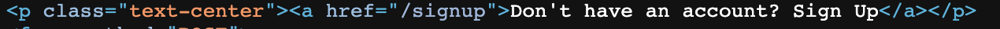
```
Features
Pricing
Store
Contact
Login
Sign
Up
Don't have an account? Sign Up	# 和截图匹配的这一条
Forgot password?
Exiting.
```
### ID选择器
通过ID定位到元素，算是最常用的之一
**实例：**比如我们要定位到`id="navbarResponsive"`的元素，输出它的源码，不过需要注意的是，输出源码并不会输出当前的标签
```go
selection := dom.Find("#navbarResponsive")
// selection := dom.Find("div#navbarResponsive") // 同时匹配标签和id，更准确
fmt.Println(selection.Html())
```
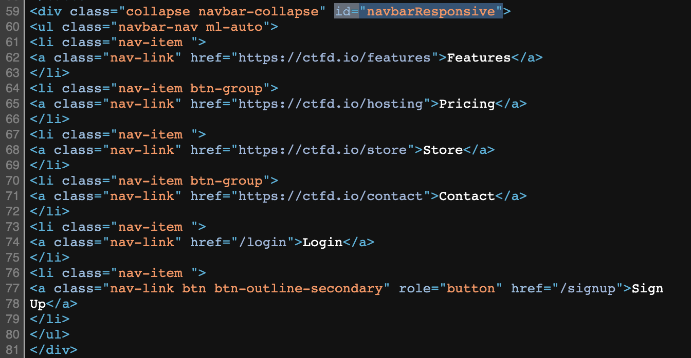
```html
<ul class="navbar-nav ml-auto">
<li class="nav-item ">
<a class="nav-link" href="https://ctfd.io/features">Features</a>
</li>
<li class="nav-item btn-group">
<a class="nav-link" href="https://ctfd.io/hosting">Pricing</a>
</li>
<li class="nav-item ">
<a class="nav-link" href="https://ctfd.io/store">Store</a>
</li>
<li class="nav-item btn-group">
<a class="nav-link" href="https://ctfd.io/contact">Contact</a>
</li>
<li class="nav-item ">
<a class="nav-link" href="/login">Login</a>
</li>
<li class="nav-item ">
<a class="nav-link btn btn-outline-secondary" role="button" href="/signup">Sign
Up</a>
</li>
</ul>
 <nil>
```
### class选择器
它的用法和`ID`选择器类似，为`Find(".class")`
**实例：**寻找所有`class="nav-link`元素，并输出他们的值
```go
dom.Find(".nav-link").Each(func(i int, selection *goquery.Selection) {
	fmt.Println(selection.Text())
})
```
> [!TIP]
> 也可以组合，如 `a.nav-link`：寻找所有a标签且class为`nav-link`的元素

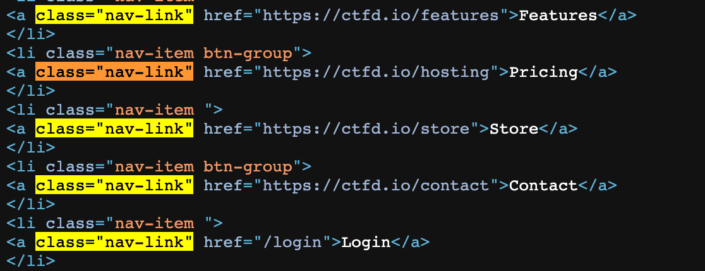
```
Features
Pricing
Store
Contact
Login
Sign
Up
```
### 属性选择器
上面3种有时候还不够用，这个时候就需要属性选择器来帮忙了
**实例**：获取`input`标签中属性`name`为`nonce`的元素的`value`值
> [!Note]
> 就是获取红框中的值，这里放图了下面就不放了
> 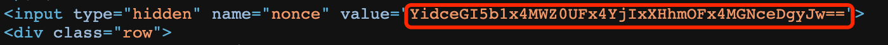

```go
res, exist := dom.Find("input[name=nonce]").Attr("value")
if exist {
	fmt.Println(res) // YidceDA0XHhhZVx4YmE9XHgxNFx4MTVceDhlXHgxNC9ceGUyJw==
}
```
**补充：**
除了完全相等，还有其他匹配方式，使用方式类似，这里统一列举下，不再举例

| 选择器 | 说明 |
| --- | --- |
| Find("div[lang]") | 筛选含有lang属性的div元素 |
| Find("div[lang=zh]") | 筛选lang属性为zh的div元素 |
| Find("div[lang!=zh]") | 筛选lang属性不等于zh的div元素 |
| Find("div[lang¦=zh]") | 筛选lang属性为zh或者zh-开头的div元素 |
| Find("div[lang*=zh]") | 筛选lang属性包含zh这个字符串的div元素 |
| Find("div[lang~=zh]") | 筛选lang属性包含zh这个单词的div元素，单词以空格分开的 |
| Find("div[lang$=zh]") | 筛选lang属性以zh结尾的div元素，区分大小写 |
| Find("div[lang^=zh]") | 筛选lang属性以zh开头的div元素，区分大小写 |

以上是属性筛选器的用法，都是以一个属性筛选器为例，当然你也可以使用多个属性筛选器组合使用，比如： `Find("div[id][lang=zh]")`,用多个中括号连起来即可。当有多个属性筛选器的时候，要同时满足这些筛选器的元素才能被筛选出来
### 内容提取
获取到了标签，当然就像获取到里面的值了
### parent>child子选择器
> [!NOTE]
> 上面的基本都够用了，这里再列举一些可能会用到的筛选器

如果我们想筛选出**某个元素下符合条件的子元素**，我们就可以使用子元素筛选器，它的语法为`Find("parent>child")`,表示筛选parent这个父元素下，符合child这个条件的最直接（一级）的子元素。
**实例：**form标签下的input标签的属性value的值
```go
res, exist := dom.Find("form>input").Attr("value")
if exist {
	fmt.Println(res) // YiJceGU0YTxceGY3alx4MGYnVVx4ZDdceGNlIg==
}
```
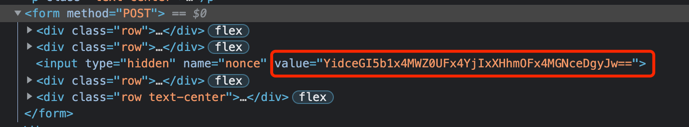
### prev+next相邻选择器
假设我们要筛选的元素没有规律，但是该元素的上一个元素有规律，我们就可以使用这种下一个相邻选择器来进行选择。
**实例：**`h2`标签旁边的`p`标签的值
> [!TIP]
> 如果class的值存在空格，那么可以用属性的格式来匹配，防止空格影响结果

```go
dom.Find("h2[class='block-title text-center']+p.text-center").Each(func(i int, selection *goquery.Selection) {
	fmt.Println(selection.Text()) // Don't have an account? Sign Up
})
```
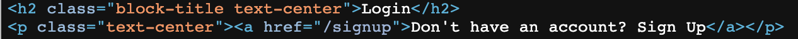
### prev~next兄弟选择器
有相邻就有兄弟，兄弟选择器就不一定要求相邻了，只要他们共有一个父元素就可以。
**实例：**获取lable标签的兄弟标签input
```go
dom.Find("label~input").Each(func(i int, selection *goquery.Selection) {
	fmt.Println(selection.Attr("name")) // email true
})
```
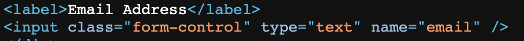
### 内容过滤器
有时候我们使用选择器选择出来后，希望再过滤一下，这时候就用到过滤器了
**实例：**获取包含内容`Email`的label标签
```go
dom.Find("label:contains(Email)").Each(func(i int, selection *goquery.Selection) {
	fmt.Println(selection.Text()) // Email Address
})
```
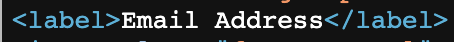
**扩展：**

1. `Find(":contains(text)")`表示筛选出的元素要包含指定的文本
2. `Find(":empty")`表示筛选出的元素都不能有子元素（包括文本元素），只筛选那些不包含任何子元素的元素
3. `Find(":has(selector)")`和`contains`差不多，只不过这个是包含的是元素节点
### :first-of-type过滤器
`:first-child`选择器限制的比较死，必须得是第一个子元素，如果该元素前有其他在前面，就不能用`:first-child`了，这时候`:first-of-type`就派上用场了，它要求只要是这个类型的第一个就可以
**实例：**输出第一个`div`标签的源码
```go
ret, _ := dom.Find("div:first-of-type").Html()
fmt.Println(ret)
```
**扩展：**
`:last-child` 和 `:last-of-type`过滤器正好和上面的2歌过滤器相反，表示最后一个过滤器
### :nth-child(n) 过滤器系列
表示筛选出的元素是其父元素的第n个元素，n以1开始。所以我们可以知道`:first-child`和`:nth-child(1)`是相等的。通过指定`n`，我们就很灵活的筛选出我们需要的元素
同样，`:nth-of-type(n)`和 `:nth-child(n)` 类似，只不过它表示的是同类型元素的第n个,所以`:nth-of-type(1)` 和 `:first-of-type`是相等的
`nth-last-child(n)` 和`:nth-last-of-type(n)` 过滤器是倒序开始计算的，最后一个元素被当成了第一个
> [!WARNING]
> 都不举例了，没必要

### :only-child 过滤器系列
`Find(":only-child")` 过滤器，从字面上看，可以猜测出来，它表示筛选的元素，在其父元素中，只有它自己，它的父元素没有其他子元素，才会被匹配筛选出来。
`:only-of-type` 过滤器和其他的类似，同类型元素只要只有一个，就可以被筛选出来
### 选择器或(|)运算
如果我们想同时筛选出`div`,`span`等元素怎么办？这时候可以采用多个选择器进行组合使用，并且以逗号(,)分割，`Find("selector1, selector2, selectorN")`表示，只要满足其中一个选择器就可以被筛选出来，也就是选择器的或(|)运算操作。
**实例：**筛选出所有的`meta`标签和`input`标签，并且获取到其属性`name`的值
```go
dom.Find("meta,input").Each(func(i int, selection *goquery.Selection) {
		val, exists := selection.Attr("name")
		if exists {
			fmt.Println(val)
		}
	})
```
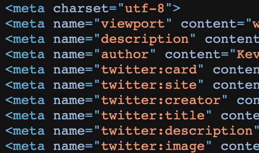
```
viewport
description
author
twitter:card
twitter:site
twitter:creator
twitter:title
twitter:description
twitter:image
email
password
nonce
```
### 补充说明
1、类似函数的位置操作

| 方法 | 说明 |
| --- | --- |
| `Find(selection) *Selection` | 根据选择器查找节点集 |
| `Eq(index int) *Selection` | 根据索引获取某个节点集 |
| `First() *Selection` | 获取第一个子节点集 |
| `Last() *Selection` | 获取最后一个子节点集 |
| `Next() *Selection` | 获取下一个兄弟节点集 |
| `NextAll() *Selection` | 获取后面所有兄弟节点集 |
| `Prev() *Selection` | 前一个兄弟节点集 |
| `Get(index int) *html.Node` | 根据索引获取一个节点 |
| `Index() int` | 返回选择对象中第一个元素的位置 |
| `Slice(start, end int) *Selection` | 根据起始位置获取子节点集 |

2、循环遍历选择的节点

| 方法 | 说明 |
| --- | --- |
| `Each(f func(int, *Selection)) *Selection` | 遍历 |
| `EachWithBreak(f func(int, *Selection) bool) *Selection` | 可中断遍历 |
| `Map(f func(int, *Selection) string) (result []string)` | 返回字符串数组 |

3、检测或获取节点属性值

| 方法 | 说明 |
| --- | --- |
| `Attr(), RemoveAttr(), SetAttr()` | 获取，移除，设置属性的值 |
| `AddClass(), HasClass(), RemoveClass(), ToggleClass()` | 类相关 |
| `Html()` | 获取该节点的html |
| `Length()` | 返回该Selection的元素个数 |
| `Text()` | 获取该节点的文本值 |

4、 在文档树之间来回跳转（常用的查找节点方法）

| 方法 | 说明 |
| --- | --- |
| `Children()` | 返回selection中各个节点下的孩子节点 |
| `Contents()` | 获取当前节点下的所有节点 |
| `Find()` | 查找获取当前匹配的元素 |
| `Next()` | 下一个元素 |
| `Prev()` | 上一个元素 |

## Cookie自动保存更新
> [!NOTE]
> 大家都知道，网站登陆后肯定有个用来鉴权的东西，而Cookie和token居多，这里我们讲一下用Cookie
> [!DANGER]
> 网上直接搜go模拟登陆，但是出来的代码都是登陆后手动设置req的cookie，而不会自动的更新cookie，既然python里面都有`request.Session`，那golang里面肯定也有类似的东西吧！

结合之前的经验，发现在创建客户端的时候，会传入一个`CookieJar`，这玩意儿根据经验肯定是用来存放Cookie的
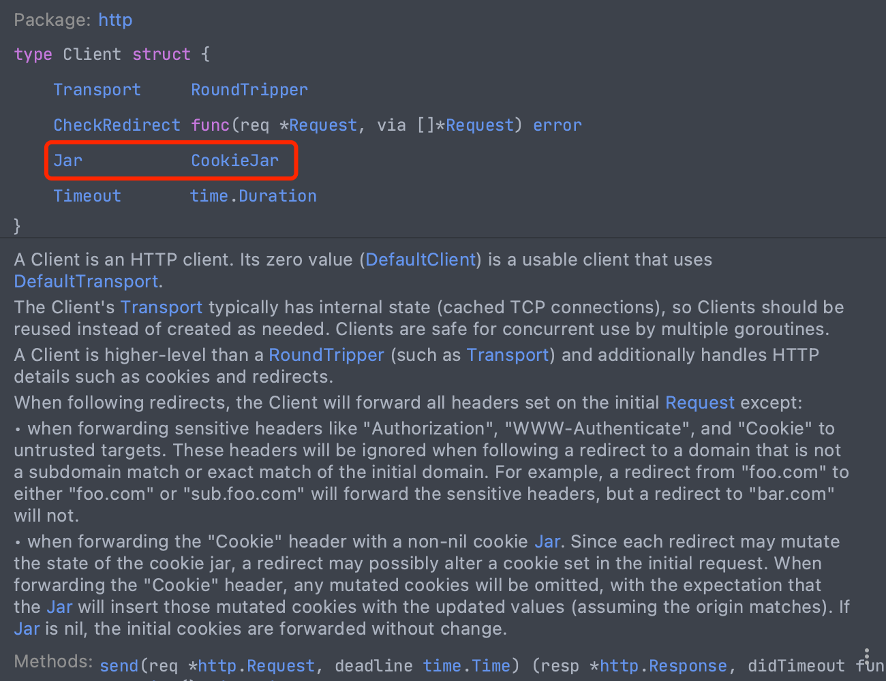
试一下便知
根据经验，第一次访问百度的时候，百度会给咱们分配cookie，那咱们就可以用它来试试能不能自动保存更新Cookie
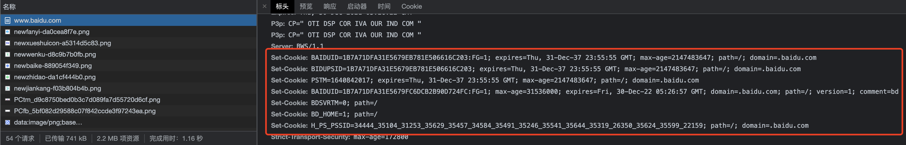
然后根据它的参数构造一个`CookieJar`出来
```go
jar, _ := cookiejar.New(&cookiejar.Options{PublicSuffixList: publicsuffix.List})
```
再创建个http客户端给它放进去，发起请求，查看结果
```go
package main
import (
	"fmt"
	"golang.org/x/net/publicsuffix"
	"net/http"
	"net/http/cookiejar"
)
func main() {
	// 创建客户端
	jar, _ := cookiejar.New(&cookiejar.Options{PublicSuffixList: publicsuffix.List})
	client := http.Client{Jar: jar}
	fmt.Printf("访问前：\n")
	fmt.Println(client.Jar)
	client.Get("https://www.baidu.com")
	fmt.Printf("\n\n访问后：\n")
	fmt.Println(client.Jar)
}
```
可以看到我们的Cookie成功自动保存了，那就说明之前的猜想是对的
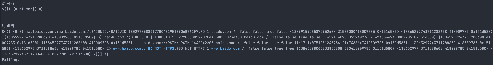
后面对百度发起访问，就会自动带上Cookie了
## 实战
实战模拟登陆CTFD平台：[https://cloud.ctfd.io/login](https://cloud.ctfd.io/login)
主要分为3步：

1. 获取nonce
2. 登陆
3. 验证登陆是否成功

**完整代码：**
```go
package main
import (
	"fmt"
	"github.com/PuerkitoBio/goquery"
	"golang.org/x/net/publicsuffix"
	"io/ioutil"
	"net/http"
	"net/http/cookiejar"
	"net/url"
	"strings"
)
// 登陆账号密码
var Config = map[string]string{
	"email": "yeciyar420@zherben.com",
	"passwd": "xxxxx",
}
// 登陆客户端
var Client http.Client
/* *
1. 获取登陆需要的Nonce，同时初始化客户端
*/
func getNonce() string {
	req, _ := http.NewRequest("GET", "https://cloud.ctfd.io/login", nil)
	req.Header.Set("User-Agent", "Mozilla/5.0 (Macintosh; Intel Mac OS X 10_15_7) AppleWebKit/537.36 (KHTML, like Gecko) Chrome/96.0.4664.55 Safari/537.36")
	// 初始化client
	jar, _ := cookiejar.New(&cookiejar.Options{PublicSuffixList: publicsuffix.List})
	Client = http.Client{Jar: jar}
	resp, _ := Client.Do(req)
	dom, _ := goquery.NewDocumentFromReader(resp.Body)
	val, _ := dom.Find("input[name=nonce]").Attr("value")
	return val
}
/* *
2. 登陆
 */
func login(nonce string) (bool) {
	// 构造请求
	param := url.Values{}
	param.Set("email", Config["email"])
	param.Set("password", Config["passwd"])
	param.Set("nonce", nonce)
	data := param.Encode()
	req, _ := http.NewRequest("POST", "https://cloud.ctfd.io/login", strings.NewReader(data))
	req.Header.Set("authority", "cloud.ctfd.io")
	req.Header.Set("content-type", "application/x-www-form-urlencoded")
	req.Header.Set("user-agent", "Mozilla/5.0 (Macintosh; Intel Mac OS X 10_15_7) AppleWebKit/537.36 (KHTML, like Gecko) Chrome/96.0.4664.55 Safari/537.36")
	req.Header.Set("referer", "https://cloud.ctfd.io/admin")
	// 发起请求
	resp, _ := Client.Do(req)
	source, _ := ioutil.ReadAll(resp.Body)
	if strings.Contains(string(source), "Your password is wrong"){
		fmt.Println("账号或密码错误")
		return false
	} else {
		return true
	}
}
/* *
3. 验证是否登陆成功
 */
func getInfo() {
	req, _ := http.NewRequest("GET", "https://cloud.ctfd.io/profile", nil)
	req.Header.Set("authority", "cloud.ctfd.io")
	req.Header.Set("content-type", "application/x-www-form-urlencoded")
	req.Header.Set("user-agent", "Mozilla/5.0 (Macintosh; Intel Mac OS X 10_15_7) AppleWebKit/537.36 (KHTML, like Gecko) Chrome/96.0.4664.55 Safari/537.36")
	req.Header.Set("referer", "https://cloud.ctfd.io/admin")
	resp, _ := Client.Do(req)
	if resp.StatusCode == 200 {
		dom, _ := goquery.NewDocumentFromReader(resp.Body)
		val, exists := dom.Find("#name-input").Attr("value")
		if exists {
			fmt.Printf("Success, Login as %s\n", val)
		}
	}
}
func main() {
	nonce := getNonce()
	fmt.Println("Nonce: ", nonce)
	res := login(nonce)
	if res {
		fmt.Println("登陆成功，尝试获取个人信息...")
		getInfo()
	}
}
```
**效果：**
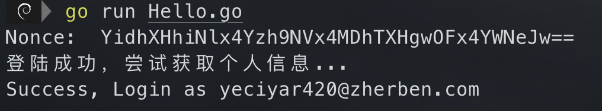
