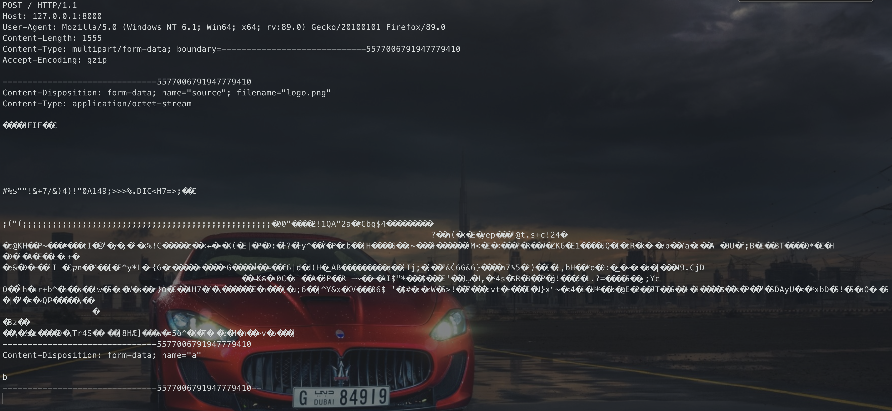
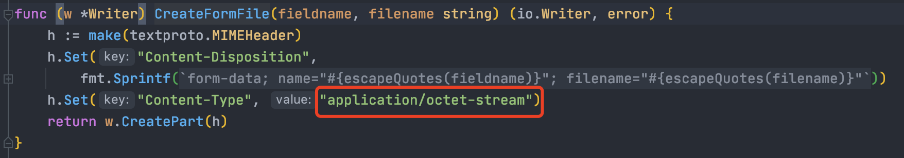
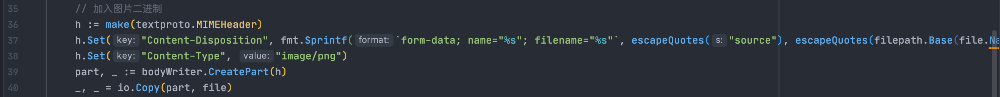
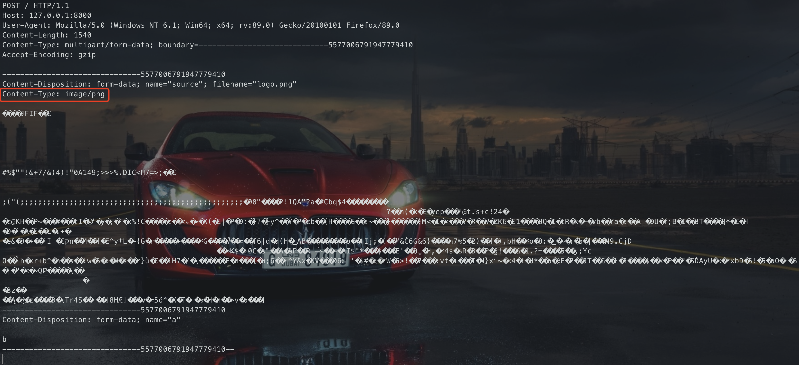
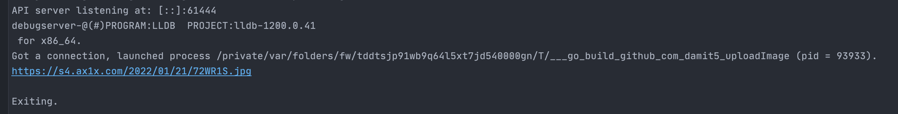

## 前言
需要批量上传图片到图床，之前用python写脚本倒是很简单，不过GO因为并发太强大了，所以这次用GO来试试
## 基础版
构建一个上传图片的请求，主要代码在`imgkr()`函数中
```go
package main
import (
	"bytes"
	"fmt"
	"golang.org/x/net/publicsuffix"
	"io"
	"math/rand"
	"mime/multipart"
	"net/http"
	"net/http/cookiejar"
	"os"
	"path/filepath"
)
var client http.Client
func imgkr() {
	// 要上传的文件
	imgFilePath := "/Users/d4m1ts/d4m1ts/Upload/logo.png"
	file, _ := os.Open(imgFilePath)
	defer file.Close()
	// 设置body数据并写入缓冲区
	bodyBuff := bytes.NewBufferString("") //bodyBuff := &bytes.Buffer{}
	bodyWriter := multipart.NewWriter(bodyBuff)
	_ = bodyWriter.SetBoundary(fmt.Sprintf("-----------------------------%d", rand.Int()))
	// 加入图片二进制
	part, _ := bodyWriter.CreateFormFile("source", filepath.Base(file.Name()))
	_, _ = io.Copy(part, file)
    // 其他字段
	_ = bodyWriter.WriteField("a", "b")
	// 自动补充boundary结尾
	bodyWriter.Close()
	fmt.Println(bodyBuff) //构建的完整数据包，没有header
	// 组合创建数据包
	req, _ := http.NewRequest("POST", "http://127.0.0.1:8000", bodyBuff)
	req.ContentLength = int64(bodyBuff.Len())
	req.Header.Set("Content-Type", bodyWriter.FormDataContentType())
	req.Header.Set("User-Agent", "Mozilla/5.0 (Windows NT 6.1; Win64; x64; rv:89.0) Gecko/20100101 Firefox/89.0")
	client.Do(req)
}
func main() {
	jar, _ := cookiejar.New(&cookiejar.Options{PublicSuffixList: publicsuffix.List})
	client = http.Client{Jar: jar}
	imgkr()
}
```
接收到的数据包

## 进阶版
上面的数据包大概是没什么问题，但是图片的`Content-Type`是`application/octet-stream`，而一般情况下图片的应该是形如`image/png`
分析了一下原因，是因为`CreateFormFile`函数里面硬编码了

看里面的一些函数，也没找到直接设置这个地方的`Content-Type`的，所以我决定根据他的规则重新写一下。

---

分析这个函数，前面`h`是header头，也是我们要修改的地方，后面是调用`*Writer.CreatePart`，我们也模拟这个行为就可以了
所以微调一下代码（直接给代码复制粘贴过来改就可以了，也可以直接[重写`CreateFormFile`函数](https://stackoverflow.com/questions/36320947/go-http-file-upload)，后者稍微麻烦一点点）

效果

目标达成，完整代码
```go
package main
import (
	"bytes"
	"fmt"
	"golang.org/x/net/publicsuffix"
	"io"
	"math/rand"
	"mime/multipart"
	"net/http"
	"net/http/cookiejar"
	"net/textproto"
	"os"
	"path/filepath"
	"strings"
)
var client http.Client
var quoteEscaper = strings.NewReplacer("\\", "\\\\", `"`, "\\\"")
func escapeQuotes(s string) string {
	return quoteEscaper.Replace(s)
}
func imgkr() {
	// 要上传的文件
	imgFilePath := "/Users/d4m1ts/d4m1ts/Upload/logo.png"
	file, _ := os.Open(imgFilePath)
	defer file.Close()
	// 设置body数据并写入缓冲区
	bodyBuff := bytes.NewBufferString("") //bodyBuff := &bytes.Buffer{}
	bodyWriter := multipart.NewWriter(bodyBuff)
	_ = bodyWriter.SetBoundary(fmt.Sprintf("-----------------------------%d", rand.Int()))
	// 加入图片二进制
	h := make(textproto.MIMEHeader)
	h.Set("Content-Disposition", fmt.Sprintf(`form-data; name="%s"; filename="%s"`, escapeQuotes("source"), escapeQuotes(filepath.Base(file.Name()))))
	h.Set("Content-Type", "image/png")
	part, _ := bodyWriter.CreatePart(h)
	_, _ = io.Copy(part, file)
	// 其他字段
	_ = bodyWriter.WriteField("a", "b")
	// 自动补充boundary结尾
	bodyWriter.Close()
	fmt.Println(bodyBuff) //构建的完整数据包，没有header
	// 组合创建数据包
	req, _ := http.NewRequest("POST", "http://127.0.0.1:8000", bodyBuff)
	req.ContentLength = int64(bodyBuff.Len())
	req.Header.Set("Content-Type", bodyWriter.FormDataContentType())
	req.Header.Set("User-Agent", "Mozilla/5.0 (Windows NT 6.1; Win64; x64; rv:89.0) Gecko/20100101 Firefox/89.0")
	client.Do(req)
}
func main() {
	jar, _ := cookiejar.New(&cookiejar.Options{PublicSuffixList: publicsuffix.List})
	client = http.Client{Jar: jar}
	imgkr()
}
```
## 完整版
写了一个上传到[https://imgtu.com/](https://imgtu.com/)的，大家有需可以参考
为了方便以后的复制粘贴，给构造上传图片请求单独写到`imgkr()`函数中的，不然应该给结果解析也写里面的
```go
package main
import (
	"bytes"
	"fmt"
	"golang.org/x/net/publicsuffix"
	"io"
	"io/ioutil"
	"math/rand"
	"mime/multipart"
	"net/http"
	"net/http/cookiejar"
	"net/textproto"
	"os"
	"path/filepath"
	"regexp"
	"strings"
	"time"
	"github.com/json-iterator/go"
)
var client http.Client
var quoteEscaper = strings.NewReplacer("\\", "\\\\", `"`, "\\\"")
func escapeQuotes(s string) string {
	return quoteEscaper.Replace(s)
}
/*
获取上传图片需要的token
 */
func getToken() string {
	u := "https://imgtu.com/"
	req, _ := http.NewRequest("GET", u, nil)
	req.Header.Set("User-Agent", "Mozilla/5.0 (Windows NT 6.1; Win64; x64; rv:89.0) Gecko/20100101 Firefox/89.0")
	resp, _ := client.Do(req)
	res,_ := ioutil.ReadAll(resp.Body)
	regex, _ := regexp.Compile("PF.obj.config.auth_token = \"(.*?)\";")
	if regex.MatchString(string(res)){
		token := regex.FindStringSubmatch(string(res))[1]
		return token
	}
	return ""
}
/*
构造上传请求
 */
func imgkr(token string, imgFilePath string) *http.Request {
	// 上传网址
	target := "https://imgtu.com/json"
	// 要上传的文件
	file, _ := os.Open(imgFilePath)
	defer file.Close()
	// 设置body数据并写入缓冲区
	bodyBuff := bytes.NewBufferString("") //bodyBuff := &bytes.Buffer{}
	bodyWriter := multipart.NewWriter(bodyBuff)
	_ = bodyWriter.SetBoundary(fmt.Sprintf("-----------------------------%d", rand.Int()))
	// 加入图片二进制
	h := make(textproto.MIMEHeader)
	h.Set("Content-Disposition", fmt.Sprintf(`form-data; name="%s"; filename="%s"`, escapeQuotes("source"), escapeQuotes(filepath.Base(file.Name()))))
	h.Set("Content-Type", "image/png")
	part, _ := bodyWriter.CreatePart(h)
	_, _ = io.Copy(part, file)
	// 其他字段
	_ = bodyWriter.WriteField("type", "file")
	_ = bodyWriter.WriteField("action", "upload")
	_ = bodyWriter.WriteField("timestamp", fmt.Sprintf("%d", time.Now().UnixNano()/1e6))
	_ = bodyWriter.WriteField("auth_token", token)
	_ = bodyWriter.WriteField("nsfw", "0")
	// 自动补充boundary结尾
	_ = bodyWriter.Close()
	//fmt.Println(bodyBuff) //构建的完整数据包，没有header
	// 创建请求
	req, _ := http.NewRequest("POST", target, bodyBuff)
	req.ContentLength = int64(bodyBuff.Len())
	req.Header.Set("Content-Type", bodyWriter.FormDataContentType())
	req.Header.Set("User-Agent", "Mozilla/5.0 (Windows NT 6.1; Win64; x64; rv:89.0) Gecko/20100101 Firefox/89.0")
	return req
}
func main() {
	jar, _ := cookiejar.New(&cookiejar.Options{PublicSuffixList: publicsuffix.List})
	client = http.Client{Jar: jar}
	token := getToken()
	req := imgkr(token, "/Users/d4m1ts/d4m1ts/Upload/logo.png")
	resp, _ := client.Do(req)
	res, _ := ioutil.ReadAll(resp.Body)
	imageUrl := jsoniter.Get(res, "image").Get("url")
	fmt.Println(imageUrl.ToString())
}
```
效果

