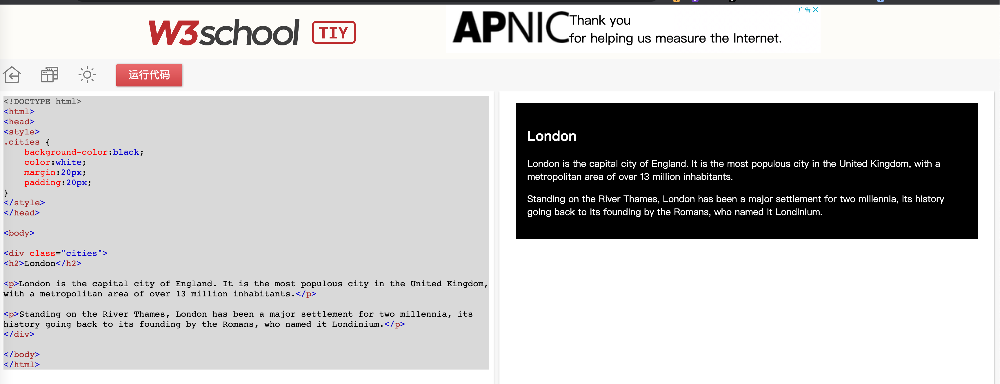
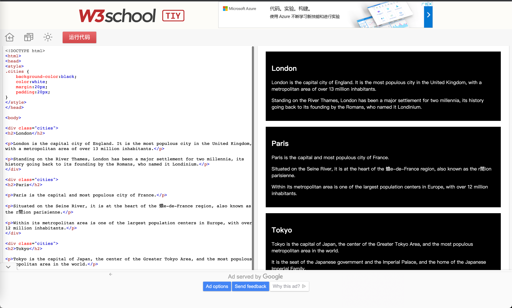
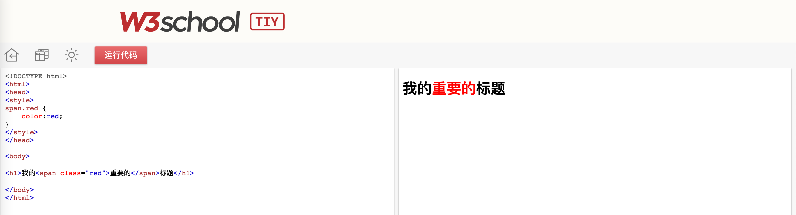
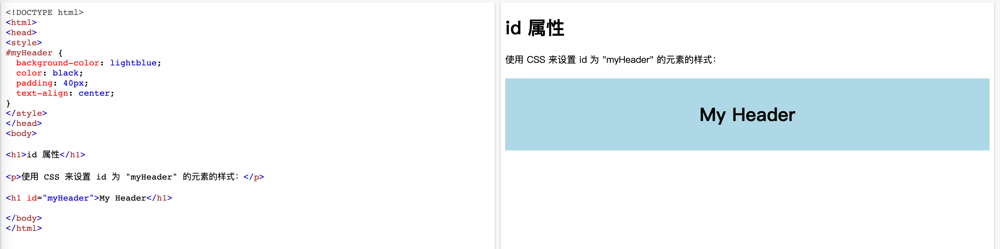

## HTML

### 什么是HTML

HTML是一种描述网页的一种语言

- HTML 指的是超文本标记语言 (**H**yper **T**ext **M**arkup **L**anguage)
- HTML 不是一种编程语言，而是一种**标记语言** (markup language)
- 标记语言是一套**标记标签** (markup tag)
- HTML 使用**标记标签**来描述网页

### HTML 标签

HTML 标记标签通常被称为 HTML 标签 (HTML tag)。

- HTML 标签是由**尖括号**包围的关键词，比如 `<html>`
- HTML 标签通常是**成对出现**的，比如 `<b>` 和 `</b>`
- 标签对中的第一个标签是开始标签，第二个标签是结束标签
- 开始和结束标签也被称为**开放标签**和**闭合标签**

### HTML 文档 = 网页

- HTML 文档描述网页
- HTML 文档包含 HTML 标签和纯文本
- HTML 文档也被称为网页

Web 浏览器的作用是读取 HTML 文档，并以网页的形式显示出它们。浏览器不会显示 HTML 标签，而是使用标签来解释页面的内容：

```html
<html>
<body>

<h1>我的第一个标题</h1>

<p>我的第一个段落。</p>

</body>
</html>
```

### HTML 元素

HTML 元素指的是从开始标签（start tag）到结束标签（end tag）的所有代码

| 开始标签                  | 元素内容            | 结束标签 |
| :------------------------ | :------------------ | :------- |
| `<p>`                     | This is a paragraph | `</p>`   |
| `<a href="default.htm" >` | This is a link      | `</a>`   |
| `<br />`                  |                     |          |

**注释：**开始标签常被称为开放标签（opening tag），结束标签常称为闭合标签（closing tag）

### 元素语法

- HTML 元素以**开始标签**起始
- HTML 元素以**结束标签**终止
- **元素的内容**是开始标签与结束标签之间的内容
- 某些 HTML 元素具有**空内容（empty content）**
- 空元素**在开始标签中进行关闭**（以开始标签的结束而结束）
- 大多数 HTML 元素可拥有**属性**

### 嵌套的 HTML 元素

大多数 HTML 元素可以嵌套（可以包含其他 HTML 元素）

HTML 文档由嵌套的 HTML 元素构成

**HTML文档实例**

```html
<html>

<body>
<p>This is my first paragraph.</p>
</body>

</html>
```

上面的例子包含三个 HTML 元素。

**HTML实例解释**

`<p>` 元素：

```html
<p>This is my first paragraph.</p>
```

这个` <p> `元素定义了 HTML 文档中的一个段落。

这个元素拥有一个开始标签` <p>`，以及一个结束标签` </p>`。

元素内容是：`This is my first paragraph`

`<body>` 元素：

```html
<body>
<p>This is my first paragraph.</p>
</body>
```

`<body> `元素定义了 HTML 文档的主体。

这个元素拥有一个开始标签 `<body>`，以及一个结束标签` </body>`。

元素内容是另一个 HTML 元素（p 元素）。

`<html>` 元素：

```html
<html>

<body>
<p>This is my first paragraph.</p>
</body>

</html>
```

`<html> `元素定义了整个 HTML 文档。

这个元素拥有一个开始标签` <html>`，以及一个结束标签 `</html>`。

元素内容是另一个 HTML 元素（body 元素）。

> [!TIP]
>
> 不要忘记结束标签

即使您忘记了使用结束标签，大多数浏览器也会正确地显示 HTML：

```html
<p>This is a paragraph
<p>This is a paragraph
```

上面的例子在大多数浏览器中都没问题，但不要依赖这种做法。忘记使用结束标签会产生不可预料的结果或错误。

**注释：**未来的 HTML 版本不允许省略结束标签。

### 空的 HTML 元素

没有内容的 HTML 元素被称为空元素。空元素是在开始标签中关闭的。

`<br>` 就是没有关闭标签的空元素（`<br>` 标签定义换行）。

在 XHTML、XML 以及未来版本的 HTML 中，所有元素都必须被关闭。

在开始标签中添加斜杠，比如` <br />`，是关闭空元素的正确方法，HTML、XHTML 和 XML 都接受这种方式。

即使 `<br>` 在所有浏览器中都是有效的，但使用` <br />` 其实是更长远的保障。

> [!TIP]
>
> HTML 标签对大小写不敏感：`<P>` 等同于 `<p>`。许多网站都使用大写的 HTML 标签。
>
> W3School 使用的是小写标签，因为万维网联盟（W3C）在 HTML 4 中**推荐**使用小写，而在未来 (X)HTML 版本中**强制**使用小写

### HTML 属性

> [!TIP]
>
> HTML 提示：使用小写属性；属性和属性值对大小写**不敏感**。不过，万维网联盟在其 HTML 4 推荐标准中推荐小写的属性/属性值。而新版本的 (X)HTML 要求使用小写属性。
>
> 属性值应该始终被包括在引号内。双引号是最常用的，不过使用单引号也没有问题。在某些个别的情况下，比如属性值本身就含有双引号，那么您必须使用单引号
>
> ```text
> name='Bill "HelloWorld" Gates'
> ```

下面列出了适用于大多数 HTML 元素的属性：

| 属性  | 值               | 描述                                     |
| :---- | :--------------- | :--------------------------------------- |
| class | classname        | 规定元素的类名（classname）              |
| id    | id               | 规定元素的唯一 id                        |
| style | style_definition | 规定元素的行内样式（inline style）       |
| title | text             | 规定元素的额外信息（可在工具提示中显示） |

如需更多关于标准属性的信息，请访问：

[HTML 标准属性参考手册](https://www.w3school.com.cn/tags/html_ref_standardattributes.asp)

### 块元素和内联元素

块级元素”译为 block level element，“内联元素”译为 inline element。

块级元素在浏览器显示时，通常会以新行来开始（和结束）。

比如：`<h1>`,` <p>`,` <ul>`,` <table>`

内联元素在显示时通常不会以新行开始。

例子：`<b>`,` <td>`,` <a>`,` `

**div**

` <div>` 元素是块级元素，它是可用于组合其他 HTML 元素的容器。

`<div>` 元素没有特定的含义。除此之外，由于它属于块级元素，浏览器会在其前后显示折行。

如果与 CSS 一同使用，`<div>` 元素可用于对大的内容块设置样式属性。

`<div> `元素的另一个常见的用途是文档布局。它取代了使用表格定义布局的老式方法。使用 `<table>` 元素进行文档布局不是表格的正确用法。`<table>` 元素的作用是显示表格化的数据。

**span**

 `<span> `元素是内联元素，可用作文本的容器。

`<span>` 元素也没有特定的含义。

当与 CSS 一同使用时，`<span> `元素可用于为部分文本设置样式属性。

### class

对 HTML 进行分类（设置类），使我们能够为元素的类定义 CSS 样式。

为相同的类设置相同的样式，或者为不同的类设置不同的样式。

类的写法是在css中使用`.`来标记这一类标签

```html
<!DOCTYPE html>
<html>
<head>
<style>
.cities {
    background-color:black;
    color:white;
    margin:20px;
    padding:20px;
}	
</style>
</head>

<body>

<div class="cities">
<h2>London</h2>

<p>London is the capital city of England. It is the most populous city in the United Kingdom, with a metropolitan area of over 13 million inhabitants.</p>

<p>Standing on the River Thames, London has been a major settlement for two millennia, its history going back to its founding by the Romans, who named it Londinium.</p>
</div> 

</body>
</html>

```



#### 分类块级元素

`<div>` 元素是块级元素。它能够用作其他 HTML 元素的容器。

设置 `<div>` 元素的类，使我们能够为相同的` <div> `元素设置相同的类

```html
<!DOCTYPE html>
<html>
<head>
<style>
.cities {
    background-color:black;
    color:white;
    margin:20px;
    padding:20px;
} 
</style>
</head>

<body>

<div class="cities">
<h2>London</h2>
<p>London is the capital city of England. 
It is the most populous city in the United Kingdom, 
with a metropolitan area of over 13 million inhabitants.</p>
</div>

<div class="cities">
<h2>Paris</h2>
<p>Paris is the capital and most populous city of France.</p>
</div>

<div class="cities">
<h2>Tokyo</h2>
<p>Tokyo is the capital of Japan, the center of the Greater Tokyo Area,
and the most populous metropolitan area in the world.</p>
</div>

</body>
</html>
```



#### 分类行内元素

HTML `<span> `元素是行内元素，能够用作文本的容器。

设置` <span>` 元素的类，能够为相同的 `<span>` 元素设置相同的样式。

```html
<!DOCTYPE html>
<html>
<head>
<style>
  span.red {color:red;}
</style>
</head>
<body>

<h1>My <span class="red">Important</span> Heading</h1>

</body>
</html>
```



### id

HTML<span style="color:red">id</span> 属性用于 为HTML 元素指定<span style="color:red">唯一</span>的 id。
一个 HTML文档中不能存在多个有相同 id 的元素。

`id` 属性指定 HTML 元素的唯一 ID。 `id` 属性的值在 HTML 文档中必须是唯一的。

`id` 属性用于指向样式表中的特定样式声明。JavaScript 也可使用它来访问和操作拥有特定 ID 的元素。

id 的语法是：写一个井号 (#)，后跟一个 id 名称。然后，在花括号 {} 中定义 CSS 属性。

下面的例子中我们有一个 `<h1>` 元素，它指向 id 名称 "myHeader"。这个 `<h1>` 元素将根据 head 部分中的 `#myHeader` 样式定义进行样式设置：

```html
<!DOCTYPE html>
<html>
<head>
<style>
#myHeader {
  background-color: lightblue;
  color: black;
  padding: 40px;
  text-align: center;
}
</style>
</head>
<body>

<h1 id="myHeader">My Header</h1>

</body>
</html>
```



> [!TIP]
>
> Class 与 ID 的差异:
>
> 同一个类名可以由多个 HTML 元素使用，而一个 id 名称只能由页面中的一个 HTML 元素使用

#### 通过 ID 和链接实现 HTML 书签(锚点)

HTML 书签用于让读者跳转至网页的特定部分。如果页面很长，那么书签可能很有用。要使用书签，您必须首先创建它，然后为它添加链接。然后，当单击链接时，页面将滚动到带有书签的位置。

首先，用 `id` 属性创建书签：

```html
<h2 id="C4">第四章</h2>
```

然后，在同一张页面中，向这个书签添加一个链接（“跳转到第四章”）

```html
<a href="#C4">跳转到第四章</a>
```

或者，在另一张页面中，添加指向这个书签的链接（“跳转到第四章”）：

```html
<a href="html_demo.html#C4">Jump to Chapter 4</a>
```

####  JavaScript 中使用 id 属性

JavaScript 也可以使用 id 属性为特定元素执行某些任务。

JavaScript 可以使用 `getElementById()` 方法访问拥有特定 id 的元素：

**示例**

使用 id 属性通过 JavaScript 来处理文本

```javascript
function displayResult() {
  document.getElementById("myHeader").innerHTML = "Have a nice day!";
}
```

更多参考[W3School](https://www.w3school.com.cn/html/html_jianjie.asp)

## Doctype作用？标准模式与兼容模式各有什么区别?

DOCTYPE 是用来声明文档类型和 DTD 规范的。 `<!DOCTYPE html>`声明位于 HTML 文档中的第一行，不是一个 HTML 标签，处于 html 标签之前。告知浏览器的解析器用什么文档标准解析这个文档。DOCTYPE 不存在或格式不正确会导致文档以兼容模式呈现。

标准模式的排版 和 JS 运作模式都是以该浏览器支持的最高标准运行。在兼容模式中，页面以宽松的向后兼容的方式显示,模拟老式浏览器的行为以防止站点无法工作。

在 HTML4.01 中<!doctype>声明指向一个 DTD，由于 HTML4.01 基于 SGML，所以 DTD 指定了标记规则以保证浏览器正确渲染内容 HTML5 不基于 SGML，所以不用指定 DTD

## HTML 全局属性

全局属性是所有 HTML 元素共有的属性; 它们可以用于所有元素，即使属性可能对某些元素不起作用。

[全局属性 | MDN](https://developer.mozilla.org/zh-CN/docs/Web/HTML/Global_attributes)

## canvas 和 svg 的区别

`canvas` 是 `html5` 提供的新元素`<canvas>`，而` svg `存在的历史要比` canvas `久远，已经有十几年了。`svg `并不是 `html5` 专有的标签，最初 `svg` 是用` xml` 技术（超文本扩展语言，可以自定义标签或属性）描述二维图形的语言。在 `H5` 中看似 `canvas` 与` svg` 很像，但是，他们有巨大的差别。

首先，从它们的功能上来讲，`canvas `可以看做是一个画布。，其绘制出来的图形为**标量图**，因此，可以在 `canvas `中引入` jpg `或` png` 这类格式的图片，在实际开发中，大型的网络**游戏**都是用` canvas `画布做出来的，并且` canvas `的技术现在已经相当的成熟。另外，我们喜欢用 `canvas `来做一些统计用的图表，如柱状图曲线图或饼状图等。 而 `svg`，所绘制的图形为**矢量图**，所以其用法上受到了限制。因为只能绘制矢量图，所以` svg` 中不能引入普通的图片，因为矢量图的不会失真的效果，在项目中我们会用来**做小图标**。但是由于其本质为矢量图，可以被无限放大而不会失真，这很适合被用来做地图，而百度地图就是用` svg` 技术做出来的。

另外从技术发面来讲 `canvas` 里面绘制的图形不能被引擎抓取，如我们要让 `canvas` 里面的一个图片跟随鼠标事件: `canvas.onmouseover=function(){}`。 而 `svg` 里面的图形可以被引擎抓取，支持事件的绑定。另外 canvas 中我们绘制图形通常是通过` javascript` 来实现，`svg` 更多的是通过标签来来实现，如在 svg 中绘制正矩形形就要用，这里我们不能用属性 `style="width:XXX;height:XXX;"`来定义。

## 行内元素有哪些？块级元素有哪些？ 空(void)元素有那些？

定义：CSS 规范规定，每个元素都有 display 属性，确定该元素的类型，每个元素都有默认的 display 值，如 div 的 display 默认值为“block”，则为“块级”元素；span 默认 display 属性值为“inline”，是“行内”元素

- 行内元素有：a b span img input select strong（强调的语气）
- 块级元素有：div ul ol li dl dt dd h1 h2 h3 h4…p
- 空元素：
  - 常见: br hr img input link meta
  - 不常见: area base col command embed keygen param source track wb

不同浏览器（版本）、HTML4（5）、CSS2 等实际略有差异 参考: http://stackoverflow.com/questions/6867254/browsers-default-css-for-html-elements

## 页面导入样式时，使用 link 和@import 有什么区别？

- link 属于 XHTML 标签，除了加载 CSS 外，还能用于定义 RSS, 定义 rel 连接属性等作用；而@import 是 CSS 提供的，只能用于加载 CSS;
- 页面被加载的时，link 会同时被加载，而@import 引用的 CSS 会等到页面被加载完再加载;
- import 是 CSS2.1 提出的，只在 IE5 以上才能被识别，而 link 是 XHTML 标签，无兼容问题;
- link 支持使用 js 控制 DOM 去改变样式，而@import 不支持;

## 浏览器内核

主要分成两部分：渲染引擎(layout engineer 或 Rendering Engine)和 JS 引擎。

渲染引擎：负责取得网页的内容（HTML、XML、图像等等）、整理讯息（例如加入 CSS 等），以及计算网页的显示方式，然后渲染到用户的屏幕上。

JS 引擎则：解析和执行 javascript 来实现逻辑和控制 DOM 进行交互。

最开始渲染引擎和 JS 引擎并没有区分的很明确，后来 JS 引擎越来越独立，内核就倾向于只指渲染引擎。

## HTML5 变化

- 新的语义化元素
  - header footer nav main article section
  - 删除了一些纯样式的标签
- [表单增强](http://caibaojian.com/html5/form.html)
- 新 API
  - 离线 （applicationCache ）
  - 音视频 （audio, vidio）
  - 图形 （canvans）
  - 实时通信（websoket）
  - 本地存储（localStorage, indexDB）
  - 设备能力（地图定位，手机摇一摇）

## em 与 i 的区别

- 效果都是斜体
- em 是语义化标签，表强调
- i 是样式标签， 表斜体

## 哪些元素可以自闭合？

- 表单元素 input
- img
- br, hr
- meta, link

## HTML 和 DOM 的关系

- HTML 只是一个字符串
- DOM 由 HTML 解析而来
- JS 可以维护 DOM

## property 和 attribute 的区别

例如一个 input 标签 `<input value="3" />` 他的 attribute 是 3 但如果使用`input.value = 4` 或 直接修改值为 4，这时再去 getAttribute 得到的还是"3"

## form 作用

- 直接提交表单
- 使用 submit / reset 按钮
- 便于浏览器保存表单
- 第三方库可以整体取值
- 第三方库可以进行表单验证

## 主流浏览器机器内核

| 浏览器  |      内核      |                             备注                             |
| :-----: | :------------: | :----------------------------------------------------------: |
|   IE    |    Trident     |           IE、猎豹安全、360 极速浏览器、百度浏览器           |
| firefox |     Gecko      |                                                              |
| Safari  |     webkit     | 从 Safari 推出之时起，它的渲染引擎就是 Webkit，一提到 webkit，首先想到的便是 chrome，Webkit 的鼻祖其实是 Safari。 |
| chrome  | Chromium/Blink | 在 Chromium 项目中研发 Blink 渲染引擎（即浏览器核心），内置于 Chrome 浏览器之中。Blink 其实是 WebKit 的分支。大部分国产浏览器最新版都采用 Blink 内核。二次开发 |
|  Opera  |     blink      |   Opera 内核原为：Presto，现在跟随 chrome 用 blink 内核。    |

## HTML 语义化

- 用正确的标签做正确的事情。
- html 语义化让页面的内容结构化，结构更清晰，便于对浏览器、搜索引擎解析;
- 即使在没有样式 CSS 情况下也以一种文档格式显示，并且是容易阅读的;
- 搜索引擎的爬虫也依赖于 HTML 标记来确定上下文和各个关键字的权重，利于 SEO;
- 使阅读源代码的人对网站更容易将网站分块，便于阅读维护理解。

## HTML中 title 属性和 alt 属性的区别

```html

```

当图片不输出信息的时候，会显示 alt 信息 鼠标放上去没有信息，当图片正常读取，不会出现 alt 信息

```html

```

- 当图片不输出信息的时候，会显示 alt 信息 鼠标放上去会出现 title 信息；
- 当图片正常输出的时候，不会出现 alt 信息，鼠标放上去会出现 title 信息。
- 除了纯装饰图片外都必须设置有意义的值，搜索引擎会分析。

其他部分title知识点

- title 属性可以用在除了 base，basefont，head，html，meta，param，script 和 title 之外的所有标签。
- title 属性的功能是提示。额外的说明信息和非本质的信息请使用 title 属性。title 属性值可以比 alt 属性值设置的更长。
- title 属性有一个很好的用途，即为链接添加描述性文字，特别是当连接本身并不是十分清楚的表达了链接的目的。

## ~~table标签~~

table 的缺点在于服务器把代码加载到本地服务器的过程中，本来是加载一行执行一行，但是 table 标签是里面的东西**全都下载完之后才会显示出来**，那么如果图片很多的话就会导致网页一直加载不出来，除非所有的图片和内容都加载完。如果要等到所有的图片全都加载完之后才显示出来的话那也太慢了，所以 table 标签现在基本放弃使用了 

##  head 元素

head 子元素大概分为三类，分别是

- 描述网页基本信息的
- 指向渲染网页需要其他文件链接的
- 各大厂商根据自己需要定制的

### 网页基本信息

一个网页，首先得有个标题，就跟人有名字一样。除此之外，还可以根据实际需要补充一些基本信息。

- 文档标题（浏览器标签中显示的文本）：<title>深入了解 head 元素</title>
- 编码格式： 如果你的页面出现乱码，那一般就是编码格式不对
- 视窗设置：
- 搜索引擎优化相关内容：

- IE 浏览器版本渲染设置：

### 其他文件链接

- CSS 文件：
- JavaScript 文件：`<script src=“script.js"></script>`

但是为了让页面的样子更早的让用户看到，一般把 JS 文件放到 body 的底部

### 厂商定制

同样分享页面到 QQ 的聊天窗口，有些页面直接就是一个链接，但是有些页面有标题，图片，还有文字介绍。为什么区别这么明显呢？其实就是看有没有设置下面这三个内容

```html
<meta itemprop="name" content="这是分享的标题" />
<meta
  itemprop="image"
  content="http://imgcache.qq.com/qqshow/ac/v4/global/logo.png"
/>
<meta name="description" itemprop="description" content="这是要分享的内容" />
```

## 移动端项目需要注意的 4 个问题

### meta 中设置 viewport

阻止用户手滑放大或缩小页面，需要在 index.html 中添加 meta 元素,设置 viewport。

```html
<meta
  name="viewport"
  content="width=device-width,initial-scale=1.0,minimum-scale=1.0,maximum-scale=1.0,user-scalable=no"
/>
```

### CSS 样式统一问题

我们需要重置页面样式，因为在不同的手机浏览器上，默认的 css 样式不是统一的。 解决方法：使用 reset.css 重置所有元素的默认样式

### 一像素边框问题

有的手机分辨率比较高，是 2 倍屏或 3 倍屏，手机上的浏览器就会把 CSS 中的 1 像素值展示为 2 个或 3 个物理宽度 解决方法： 添加一个 border.css 库，将利用**scroll 缩放的原理**将边框重置。当我们需要使用一像素边框时只需要在标签上添加对应类名，如设置底部一像素边框就在标签上加入"border-bottom"的 class 名

### 300 毫秒点击延迟问题

在移动端开发中，某些机型上使用 click 事件会延迟 300ms 才执行，这样影响了用户体验。 解决方法： 引入[fastclick.js](https://www.jianshu.com/p/05b142d84780)。 

## Cookies，sessionStorage 和 localStorage 的区别

- cookie 是网站为了标示用户身份而储存在用户本地终端（Client Side）上的数据（通常经过加密）
- cookie 数据始终在同源的 http 请求中携带（即使不需要），记会在浏览器和服务器间来回传递。
- sessionStorage 和 localStorage 不会自动把数据发给服务器，仅在本地保存。
- 存储大小：
  - cookie 数据大小不能超过 4k。
  - sessionStorage 和 localStorage 虽然也有存储大小的限制，但比 cookie 大得多，可以达到 5M 或更大。
- 有效期（生命周期）：
  - localStorage: 存储持久数据，浏览器关闭后数据不丢失除非主动删除数据；
  - sessionStorage: 数据在当前浏览器窗口关闭后自动删除。
  - cookie: 设置的 cookie 过期时间之前一直有效，即使窗口或浏览器关闭
- 共享
  - sessionStorage 不能共享，localStorage 在同源文档之间共享，cookie 在同源且符合 path 规则的文档之间共享

## 参考链接

https://www.w3school.com.cn/html/html_jianjie.asp

https://github.com/huyaocode/webKnowledge/tree/master/0-%E5%89%8D%E7%AB%AF%E5%9F%BA%E7%A1%80/HTML

