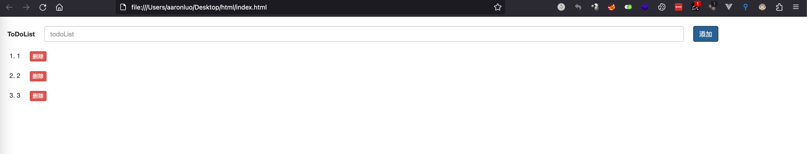
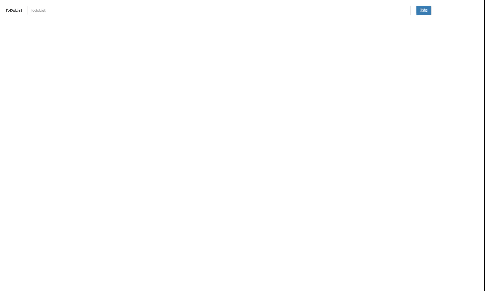

### 要求

- 界面美观
- 有输入，显示
- 通过javascript操作dom
- 点击删除能删除指定元素
- 有序列表或者自己生成列表

样式如下



### 代码实现

```html
<!DOCTYPE html>
<html>
<head>
  <meta charset="UTF-8" />
  <title>todoList</title>
  <link rel="stylesheet" href="https://cdn.bootcdn.net/ajax/libs/twitter-bootstrap/3.4.1/css/bootstrap.min.css" integrity="sha384-HSMxcRTRxnN+Bdg0JdbxYKrThecOKuH5zCYotlSAcp1+c8xmyTe9GYg1l9a69psu" crossorigin="anonymous">
  <style type="text/css">
    #div_id_input_box{
      margin-top: 2rem;
      margin-left: 2rem;
      display: flex;
      height: 34px;
      line-height: 34px;
    }
    #input_id_value{
      width: 80%;
      margin: 0 2rem;
    }
    .li_class_content{
      margin-top: 2rem;
    }
    .button_class{
      margin-left: 2rem;
    }
  </style>
</head>
<body>
  <div id="div_id_input_box">
    <label >ToDoList</label>
    <input type="text" class="form-control" placeholder="todoList" aria-describedby="basic-addon1" id="input_id_value">
    <button type="button" class="btn btn-primary" onClick="add()">添加</button>
  </div>
  <ol id="ol_id_content">
  </ol>
</body>
<script>
let input = document.getElementById('input_id_value')
let ol = document.getElementById('ol_id_content')
window.onload = function(){
  input.value = ''
}
function add(){
  let li = document.createElement('li')
  let text = document.createTextNode(input.value)
  li.setAttribute('class','li_class_content')
  let button = document.createElement('button')
  button.innerHTML='删除'
  button.setAttribute('class','btn btn-danger button_class btn-xs')
  button.setAttribute('type','button')
  button.addEventListener('click',deleteLi.bind(li,li),false)
  li.append(text)
  li.append(button)
  ol.appendChild(li)
  input.value = ''
}

function deleteLi(e,a){
  ol.removeChild(e)
}
</script>
</html>
```

### 解析

#### HTML

1. `input` 框输入可以通过dom.value获取
2. 使`ol` 完成有序列表布局，并且使用其作为容器，来装载`li`

#### CSS

1. `<link>`标签加载`bootstrap css`

#### JavaScript

1. `document.createElement()` 创建标签
2. `document.createTextNode()`创建文本节点
3. `dom.setAttribute()` 设置dom的属性
4. `dom.addEventListener`给dom绑定事件
5. `function.bind(this,[args])` bind函数创建一个新函数，并且绑定函数会以创建它时传入bind方法的第一个参数作为this

最重要的是 `bind函数` 这样才能实现`点击删除能删除指定元素`要求

剩下为使用`javascript`操作dom，设置属性，就没有什么了




