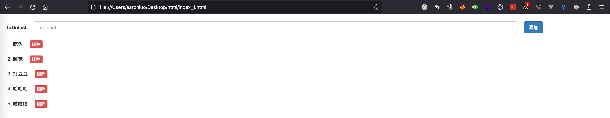

### 要求

- 界面美观
- 有输入，显示
- 通过javascript操作dom
- 点击删除能删除指定元素
- 有序列表或者自己生成列表
- 创建一个array，当windows.onload之后，将array的数据展示在页面上

样式如下：



### 代码实现

```html
<!DOCTYPE html>
<html>
<head>
  <meta charset="UTF-8" />
  <title>todoList</title>
  <link rel="stylesheet" href="https://cdn.bootcdn.net/ajax/libs/twitter-bootstrap/3.4.1/css/bootstrap.min.css" integrity="sha384-HSMxcRTRxnN+Bdg0JdbxYKrThecOKuH5zCYotlSAcp1+c8xmyTe9GYg1l9a69psu" crossorigin="anonymous">
  <style type="text/css">
    #div_id_input_box{
      margin-top: 2rem;
      margin-left: 2rem;
      display: flex;
      height: 34px;
      line-height: 34px;
    }
    #input_id_value{
      width: 80%;
      margin: 0 2rem;
    }
    .li_class_content{
      margin-top: 2rem;
    }
    .button_class{
      margin-left: 2rem;
    }
  </style>
</head>
<body>
  <div id="div_id_input_box">
    <label >ToDoList</label>
    <input type="text" class="form-control" placeholder="todoList" aria-describedby="basic-addon1" id="input_id_value">
    <button type="button" class="btn btn-primary" onClick="add()">添加</button>
  </div>
  <ol id="ol_id_content">
  </ol>
</body>
<script>
  let input = document.getElementById('input_id_value')
  let ol = document.getElementById('ol_id_content')
  let liArray = ['吃饭','睡觉','打豆豆','哈哈哈','嘻嘻嘻']
  window.onload = function(){
    input.value = ''
    for(let value of liArray){
      add(value)
    }
  }
  function add(data) {
    let li = document.createElement('li')
    let text = ''
    if(data === undefined){
      text = document.createTextNode(input.value)
    }else{
      text = document.createTextNode(data)
    }
    li.setAttribute('class','li_class_content')
    let button = document.createElement('button')
    button.innerHTML='删除'
    button.setAttribute('class','btn btn-danger button_class btn-xs')
    button.setAttribute('type','button')
    button.addEventListener('click',deleteLi.bind(li,li),false)
    li.append(text)
    li.append(button)
    ol.appendChild(li)
    input.value = ''
  }
  function deleteLi(e){
    ol.removeChild(e)
  }
</script>
```

> [!TIP]
>
> 这里需要注意的是因为是通过add函数（button共用同一个函数），这里就需要传入参数用于装载array中的值，在参数中就需要判断是否有值，在没有值的情况下就为input框输入的值

