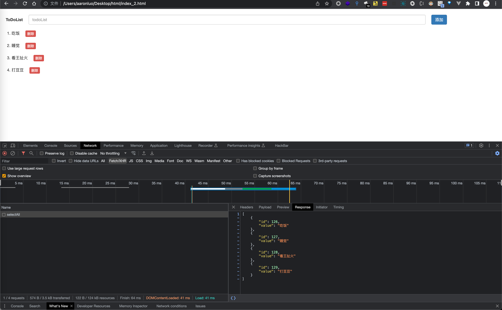

### 要求

- 界面美观
- 有输入，显示
- 通过javascript操作dom
- 点击删除能删除指定元素
- 有序列表或者自己生成列表
- 使用ajax获取后端数据，并且点击提交使用ajax发送数据到后端，并存储到数据库，点击删除，删除指定元素并使用ajax访问后端，并实现在数据库中删除

### 接口文档

| 接口          | 方法 | 数据类型           | 请求体                                                       | 响应体                                                       | 备注                                              |
| ------------- | ---- | ------------------ | ------------------------------------------------------------ | ------------------------------------------------------------ | ------------------------------------------------- |
| /selectAll    | POST | `application/json` | null                                                         | Array<br />[<br/>    {<br/>        "id": 126,<br/>        "value": "吃饭"<br/>    },<br/>    {<br/>        "id": 127,<br/>        "value": "睡觉"<br/>    },<br/>    {<br/>        "id": 128,<br/>        "value": "看王扯火"<br/>    },<br/>    {<br/>        "id": 129,<br/>        "value": "打豆豆"<br/>    }<br/>] |                                                   |
| /submitAll    | POST | `application/json` | Array<br />[<br/>  {<br/>    "value": "吃饭"<br/>  },<br/>  {<br/>      "value": "睡觉"<br/>  },<br/>  {<br/>    "value": "看王扯火"<br/>  },<br/>  {<br/>    "value": "打豆豆"<br/>  }<br/>] | status_code:200                                              |                                                   |
| /add          | POST | `application/json` | Object<br />{ value: 'test' }                                | status_code:200                                              | 通过传递value在数据库中增加，不用传id（id为索引） |
| /deleteRecord | POST | `application/json` | Object<br />{id: 131}                                        | status_code:200                                              | 通过id删除                                        |

### 代码实现

#### 后端

```javascript
// app.js
const express = require('express')
const app = new express()
const bodyParser = require('body-parser')
const jsonParser = bodyParser.json()
const sqlDao = require('./sql.js')

app.all('*', function(req, res, next) {
  res.header('Access-Control-Allow-Origin', req.headers.origin) //需要显示设置来源
  // 'Access-Control-Allow-Headers', 'Content-Type'
  res.header(
    'Access-Control-Allow-Headers',
    'Origin, X-Requested-With, Content-Type, Accept, Authorization'
  )
  res.header('Access-Control-Allow-Methods', 'POST,GET,OPTIONS')
  res.header('Access-Control-Allow-Credentials', true) //带cookies7
  res.header('Content-Type', 'application/json;charset=utf-8')

  if (req.method == 'OPTIONS') {
    res.sendStatus(200)
  } else {
    next()
  }
})

app.post('/selectAll',async (req,res)=>{
	let sql = `select *  from event`
	try{
		let results = await sqlDao.selectData(sql)
		console.log(results)
		res.send(results)
	}catch(e){
		res.send(e)
	}
	
})

app.post('/submitAll',jsonParser,async (req,res)=>{
	let array = []
	for(let i = 0,len = req.body.length; i < len; i++){
		let data = []
		data.push(req.body[i].value)
		array.push(data)
	}
	let sql = `insert into event(value) values ?`
	try{
		await sqlDao.insertData(sql,[array])
		res.sendStatus(200)
	}catch(e){
		res.send(e)
	}
	
})
app.post('/add',jsonParser,async(req,res)=>{
	let sql = `insert into event(value) values (?)`
	try{
		let result = await sqlDao.insertData(sql,req.body.value)
		res.sendStatus(200)
	}catch(e){
		res.send(e)
	}
	
})

app.post('/deleteRecord',jsonParser,async(req,res)=>{
	let sql = `delete from event where id = ${req.body.id}`
	try{
		console.log(req.body.id)
		await sqlDao.deleteData(sql)
		res.sendStatus(200)
	}catch(e){
		res.send(e)
	}
	
})


app.listen(8080,()=>{
	console.log('running!')
})

//sql.js
const mysql = require('mysql')
const con = mysql.createPool({
  host: '127.0.0.1',
  user: 'root',
  password: '****************',
  port: '3306',
  database: 'Test',
})
// con.connect()
module.exports = {
  selectData(sql) {
    return new Promise((resolve, reject) => {
      try {
        con.query(sql, (err, result) => {
          if (err) {
            reject(err)
          } else {
            resolve(result)
          }
        })
      } catch (e) {
        reject(e)
      }
    })
  },
  insertData(sql, sqlParams) {
    return new Promise((resolve, reject) => {
      try {
        con.query(sql, sqlParams, (err, result) => {
          if (err) {
            reject(err)
          } else {
            resolve(result)
          }
        })
      } catch (e) {
        reject(e)
      }
    })
  },
  updateData(sql) {
    return new Promise((resolve, reject) => {
      try {
        con.query(sql, (err, result) => {
          if (err) {
            reject(err)
          } else {
            resolve(result)
          }
        })
      } catch (e) {
        reject(e)
      }
    })
  },
  deleteData(sql) {
    return new Promise((resolve, reject) => {
      try {
        con.query(sql, (err, result) => {
          if (err) {
            reject(err)
          } else {
            resolve(result)
          }
        })
      } catch (e) {
        reject(e)
      }
    })
  },
}
```

#### 前端

```html
<!DOCTYPE html>
<html>
<head>
  <meta charset="UTF-8" />
  <title>todoList</title>
  <link rel="stylesheet" href="https://cdn.bootcdn.net/ajax/libs/twitter-bootstrap/3.4.1/css/bootstrap.min.css" integrity="sha384-HSMxcRTRxnN+Bdg0JdbxYKrThecOKuH5zCYotlSAcp1+c8xmyTe9GYg1l9a69psu" crossorigin="anonymous">
  <style type="text/css">
    #div_id_input_box{
      margin-top: 2rem;
      margin-left: 2rem;
      display: flex;
      height: 34px;
      line-height: 34px;
    }
    #input_id_value{
      width: 80%;
      margin: 0 2rem;
    }
    .li_class_content{
      margin-top: 2rem;
    }
    .button_class{
      margin-left: 2rem;
    }
  </style>
</head>
<body>
  <div id="div_id_input_box">
    <label >ToDoList</label>
    <input type="text" class="form-control" placeholder="todoList" aria-describedby="basic-addon1" id="input_id_value">
    <button type="button" class="btn btn-primary" onClick="add()">添加</button>
  </div>
  <ol id="ol_id_content">
  </ol>
</body>
<script>
  let input = document.getElementById('input_id_value')
  let ol = document.getElementById('ol_id_content')
  window.onload = function(){
    input.value = ''
    getAll()
  }
  function getAll(){
    let url = 'http://127.0.0.1:8080/selectAll'
    ajaxContent(null,url,function(data){
      let liArray = JSON.parse(data)
      for(let data of liArray){
        let li = document.createElement('li')
        li.setAttribute('class','li_class_content')
        let button = document.createElement('button')
        button.innerHTML = '删除'
        button.setAttribute('class','btn btn-danger button_class btn-xs')
        button.setAttribute('type','button')
        button.addEventListener('click',deleteLi.bind(li,li,data.id),false)
        li.append(data.value)
        li.append(button)
        ol.appendChild(li)    
      }
    })
  }
  function add() {
    let text = document.createTextNode(input.value)
    ajaxContent({value:text.data},'http://127.0.0.1:8080/add',function(){
      input.value = ''
      let liArray = ol.childNodes
      if(liArray.length > 0){
        for(let i = liArray.length - 1 ;i > 0; i --){
          ol.removeChild(liArray[i])
        }
      }
      getAll()
    })
    
  }
  function deleteLi(e,id){
    ajaxContent({id:id},'http://127.0.0.1:8080/deleteRecord',function(){
      let liArray = ol.childNodes
      if(liArray.length > 0){
        for(let i = liArray.length - 1 ;i > 0; i --){
          ol.removeChild(liArray[i])
        }
      }
      getAll()
    })
  }

  function ajaxContent(data,url,callback){
    let xhr = new XMLHttpRequest()
    xhr.open('POST',url)
    xhr.setRequestHeader('Content-Type','application/json')
    data = JSON.stringify(data)
    xhr.send(data)
    xhr.onreadystatechange = function(){
      if(xhr.readyState === 4){
        if(xhr.status === 200) {
          callback(xhr.responseText)
        }
      }
    }
  }
 </script>
```

> [!TIP]
>
> 状态更新需要使用`/selectAll` 接口获取数据库中所有的数据，当获取所有的数据就需要将最未更新的节点销毁，然后再用来装载新的数据
>
> 1. ajax 为异步，需要使用回调函数直到获取到数据之后，再更新节点（async/await 也行）
> 2. removeChild， 在for循环的时候一定要倒序删除，才能避免删不干净的情况。浏览器会把空行当做一个子节点，会占一行位置，导致删除失败
> 3. 状态更新，需要在调用`/add` 接口之后再调用一遍`/selectAll`，需要前端重新渲染，来达到数据双向绑定的效果




