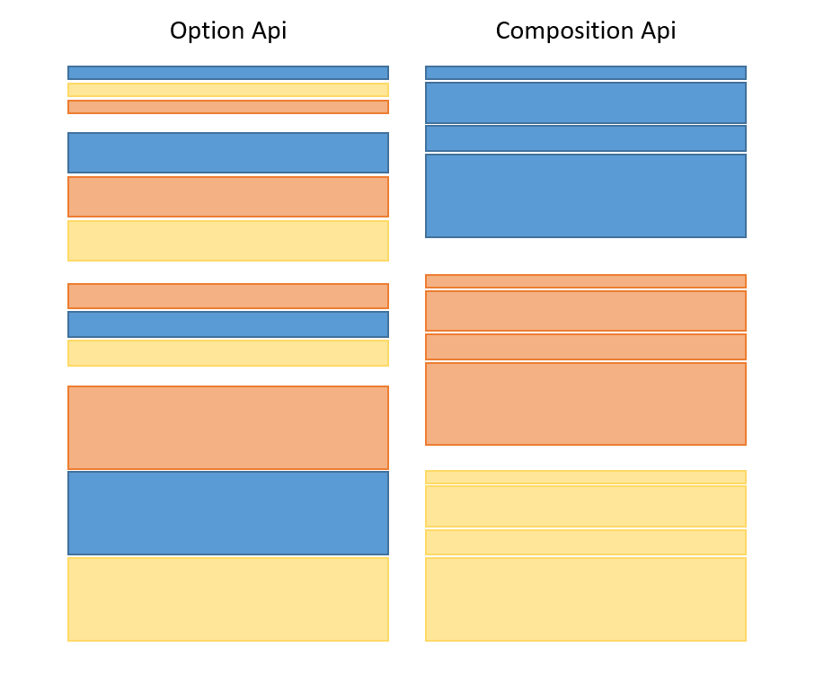

## 简介

Vue3 组合式 API（Composition API） 主要用于在大型组件中提高代码逻辑的可复用性。

传统的组件随着业务复杂度越来越高，代码量会不断的加大，整个代码逻辑都不易阅读和理解。

Vue3 使用组合式 API 的地方为 **setup**。

在 setup 中，我们可以按逻辑关注点对部分代码进行分组，然后提取逻辑片段并与其他组件共享代码。因此，组合式 API（Composition API） 允许我们编写更有条理的代码。



## 选项式 VS 组合式

### 选项式

在vue2 中，我们使用选项式Api，这样将整个层级分得很清楚，响应式数据全在**data()**函数中，**created()**则是生命周期函数，**methods**则是所有执行的方法，**computed**则是计算属性等等，这样对于新手来说很简单就能掌握学习**vue**的层级关系，以及对响应式数据的理解

```javascript
export default{
  data(){
    return{
      isShow: flase
    }
  },
  created(){
    this.show()
  },
  methods:{
    show(){
      this.isShow = true
    }
  },
  computed:{
    
  }
}
```

### 组合式

组合式Api，使用**setup**函数，在其内部声明响应式或非响应式变量，定义方法，虽然没有像选项式那样分明层级关系，但是是用户自己编写的结构，在大型项目中就能体现出逻辑性更优秀，且用户可以按逻辑关注点对部分代码进行分组，对于后期维护，可以减少不少的工作量

```javascript
import { ref, onMounted } from 'vue'
export default {
  setup(){
    const name = ref('Compostion Api')
    const showName = () => {
      console.log(`Hello ${name.value}`)
    }
    const status = ref(false)
    const changeStatus = () => {
      status.value = true
    }
    onMounted(() => {
      showName()
    })
    return { name, status, changeStatus}
  }
}
```

在Vue3.2及以上版本，setup语法糖，完全替代了setup函数，不用再return变量了

```html
<script setup>
import {ref,onMounted} from 'vue'
const name = ref('Compostion Api')
const showName = () => {
  console.log(`Hello ${name.value}`)
}
const status = ref(false)
const changeStatus = () => {
  status.value = true
}
onMounted(() => {
  showName()
})
</script>
```

## setup()组件

setup() 函数在组件创建 created() 之前执行

setup() 函数接收两个参数 props 和 context

第一个参数 props，它是响应式的，当传入新的 prop 时，它将被更新。

第二个参数 context 是一个普通的 JavaScript 对象，它是一个上下文对象，暴露了其它可能在 setup 中有用的值

> [!WARNING]
>
> **注意：** **在 setup 中你应该避免使用 this，因为它不会找到组件实例。setup 的调用发生在 data property、computed property 或 methods 被解析之前，所以它们无法在 setup 中被获取。**

以下实例使用组合 API 定义一个计数器

```html
<template>
    <div>
        <p>计数器实例: {{ count }}</p>
        <input @click="myFn" type="button" value="点我加 1">
    </div>
</template>

<script>
import {ref, onMounted} from 'vue';

export default {
    setup(){
        //定义初始值为0的变量，要使用ref方法赋值，直接赋值的话变量改变不会更新 UI
        let count = ref(0);

        // 定义点击事件 myFn
        function myFn(){
            console.log(count);
            count.value += 1;
        }
       
       // 组件被挂载时，我们用 onMounted 钩子记录一些消息
        onMounted(() => console.log('component mounted!'));

        // 外部使用组合API中定义的变量或方法，在模板中可用。
        return {count,myFn} // 返回的函数与方法的行为相同
    }
}
</script>
```

在 Vue 3.0 中，我们可以通过一个新的 ref 函数使任何响应式变量在任何地方起作用，如下所示：

```javascript
import { ref } from 'vue'

let count = ref(0);
```

**ref()** 函数可以根据给定的值来创建一个响应式的数据对象，返回值是一个对象，且只包含一个 **.value** 属性。

在 setup() 函数内，由 ref() 创建的响应式数据返回的是对象，所以需要用 **.value** 来访问。

```javascript
import { ref } from 'vue'

const counter = ref(0)

console.log(counter) // { value: 0 }
console.log(counter.value) // 0

counter.value++
console.log(counter.value) // 1
```

## Vue 组合式 API 生命周期钩子

在 Vue2 中，我们通过以下方式实现生命周期钩子函数

```javascript
export default {
  beforeMount() {
    console.log('V2 beforeMount!')
  },
  mounted() {
    console.log('V2 mounted!')
  }
}
```

在 Vue3 组合 API 中实现生命周期钩子函数可以在 **setup()** 函数中使用带有 **on** 前缀的函数：

```javascript
import { onBeforeMount, onMounted } from 'vue';
export default {
  setup() {
    onBeforeMount(() => {
      console.log('V3 beforeMount!');
    })
    onMounted(() => {
      console.log('V3 mounted!');
    })
  }
}
```

下表为 Options API 和 Composition API 之间的映射，包含如何在 setup () 内部调用生命周期钩子：

| Vue2 Options-based API | Vue Composition API |
| :--------------------- | :------------------ |
| beforeCreate           | setup()             |
| created                | setup()             |
| beforeMount            | onBeforeMount       |
| mounted                | onMounted           |
| beforeUpdate           | onBeforeUpdate      |
| updated                | onUpdated           |
| beforeDestroy          | onBeforeUnmount     |
| destroyed              | onUnmounted         |
| errorCaptured          | onErrorCaptured     |

因为 setup 是围绕 beforeCreate 和 created 生命周期钩子运行的，所以不需要显式地定义它们。换句话说，在这些钩子中编写的任何代码都应该直接在 setup 函数中编写。

```javascript
setup() {
...
    // 组件被挂载时，我们用 onMounted 钩子记录一些消息
    onMounted(() => console.log('component mounted!'));
...
}
```

## 模板引用

在使用组合式 API 时，响应式引用和模板引用的概念是统一的。

为了获得对模板内元素或组件实例的引用，我们可以像往常一样声明 ref 并从 setup() 返回

```html
<template>
  <div ref="root">This is a root element</div>
</template>

<script>
  import { ref, onMounted } from 'vue'

  export default {
    setup() {
      const root = ref(null)

      onMounted(() => {
        // DOM 元素将在初始渲染后分配给 ref
        console.log(root.value) // <div>This is a root element</div>
      })

      return {
        root
      }
    }
  }
</script>
```

以上实例中我们在渲染上下文中暴露 root，并通过 ref="root"，将其绑定到 div 作为其 ref。

作为模板使用的 ref 的行为与任何其他 ref 一样：它们是响应式的，可以传递到 (或从中返回) 复合函数中。

### v-for 中的用法

组合式 API 模板引用在 v-for 内部使用时没有特殊处理。相反，请使用函数引用执行自定义处理：

```html
<template>
  <div v-for="(item, i) in list" :ref="el => { if (el) divs[i] = el }">
    {{ item }}
  </div>
</template>

<script>
  import { ref, reactive, onBeforeUpdate } from 'vue'

  export default {
    setup() {
      const list = reactive([1, 2, 3])
      const divs = ref([])

      // 确保在每次更新之前重置ref
      onBeforeUpdate(() => {
        divs.value = []
      })

      return {
        list,
        divs
      }
    }
  }
</script>
```

### 侦听模板引用

侦听模板引用的变更可以替代前面例子中演示使用的生命周期钩子。

但与生命周期钩子的一个关键区别是，watch() 和 watchEffect() 在 DOM 挂载或更新之前运行会有副作用，所以当侦听器运行时，模板引用还未被更新。

```html
<template>
  <div ref="root">This is a root element</div>
</template>

<script>
  import { ref, watchEffect } from 'vue'

  export default {
    setup() {
      const root = ref(null)

      watchEffect(() => {
        // 这个副作用在 DOM 更新之前运行，因此，模板引用还没有持有对元素的引用。
        console.log(root.value) // => null
      })

      return {
        root
      }
    }
  }
</script>
```

因此，使用模板引用的侦听器应该用 flush: 'post' 选项来定义，这将在 DOM 更新后运行副作用，确保模板引用与 DOM 保持同步，并引用正确的元素。

```html
<template>
  <div ref="root">This is a root element</div>
</template>

<script>
  import { ref, watchEffect } from 'vue'

  export default {
    setup() {
      const root = ref(null)

      watchEffect(() => {
        console.log(root.value) // => <div>This is a root element</div>
      },
      {
        flush: 'post'
      })

      return {
        root
      }
    }
  }
</script>
```

