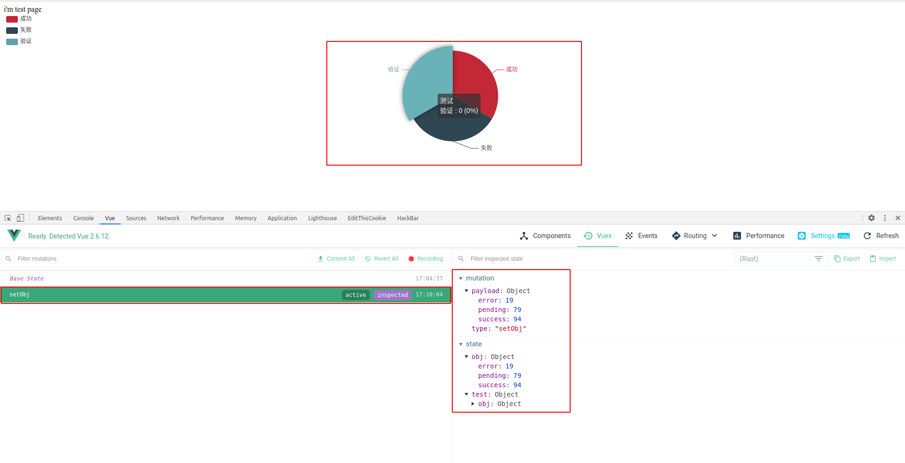
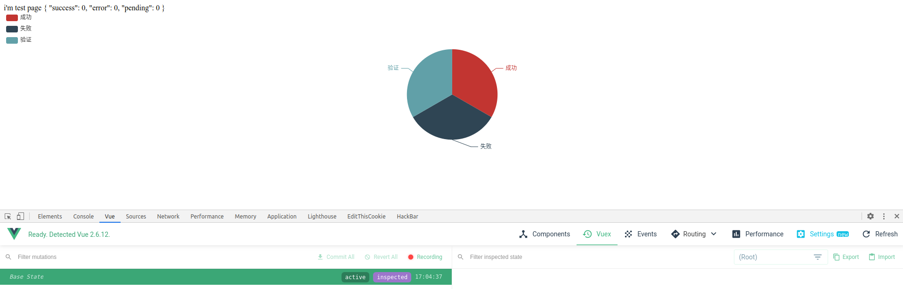
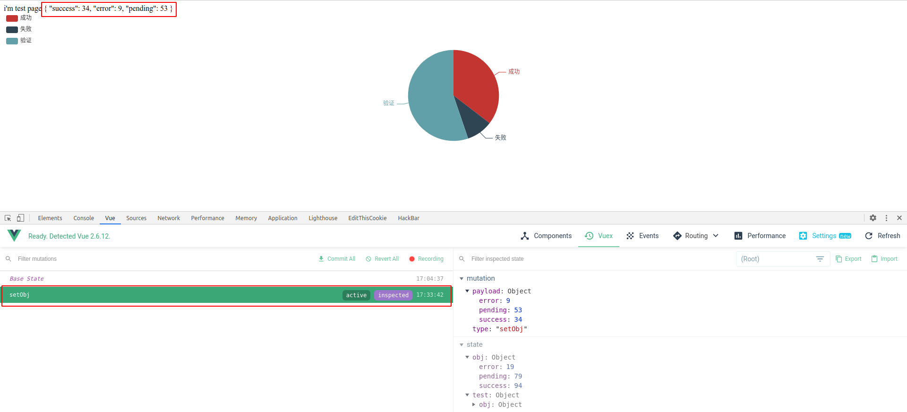
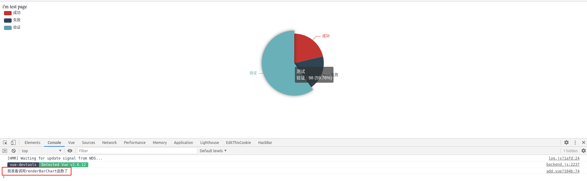
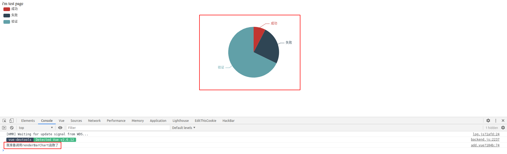

### 使用Vuex做Echarts数据当页面初始化后如何更新dom

#### 需求

子组件只装载数据，不进行HTTP请求，父组件在created的时候，拿到数据之后，并存入到store中,要求在异步I/O操作之后再重新渲染dom

#### 问题描述

子组件为echarts图表，当子组件取数据时，由于echarts图表dom已经渲染，异步I/O操作在页面渲染之后才会将数据存入store中，使用`computed`计算属性获取`object`，初值为`{}`，当页面渲染完成，计算得到object不能被watch属性监听，故不能将新计算出数据重新渲染并显示在页面中（只针对echarts初始化渲染dom为初值，数据修改之后无法响应式修改的问题）

#### 代码分析

```javascript
// vuex
import Vue from 'vue'
import Vuex from 'vuex'

Vue.use(Vuex)

export default new Vuex.Store({
  state: {
    obj: {
      success: 0,
      error: 0,
      pending: 0
    }
  },
  mutations: {
    setObj (state, data) {
      state.obj.success = data.success
      state.obj.error = data.error
      state.obj.pending = data.pending
    }
  },
  actions: {
  },
  modules: {
  }
})

```

子组件

```html
<template>
  <div>
    i'm test page
    <div ref="basicBarChart" style="width:100%;height:350px">
    </div>
  </div>

</template>
<script>
// import { mapState } from 'vuex'
export default {
  data () {
    return {

    }
  },
  mounted () {
    this.renderBarChart()
  },
  methods: {
    renderBarChart () {
      const chart = this.$refs.basicBarChart
      const myChart = this.$echarts.init(chart)
      if (myChart) {
        myChart.setOption({
          tooltip: {
            trigger: 'item',
            formatter: '{a} <br/>{b} : {c} ({d}%)'
          },
          legend: {
            orient: 'vertical',
            left: 'left ',
            data: ['成功', '失败', '验证']
          },
          series: [
            {
              name: '测试',
              type: 'pie',
              radius: '55%',
              data: [
                { value: this.obj.success, name: '成功' },
                { value: this.obj.error, name: '失败' },
                { value: this.obj.pending, name: '验证' }
              ],
              emphasis: {
                itemStyle: {
                  shadowBlur: 10,
                  shadowOffsetX: 0,
                  shadowColor: 'rgba(0, 0, 0, 0.5)'
                }
              }
            }
          ]
        })
        window.addEventListener('resize', function () {
          myChart.resize()
        })
      }
      this.$on('hook:destroyed', () => {
        window.removeEventListener('resize', function () {
          myChart.resize()
        })
      })
    }
  },
  computed: {
    obj () {
      return this.$store.state.obj
    }
  },
  watch: {
    obj (newVal, oldVal) {
      console.log(newVal)
    }
  }
}
</script>

```

父组件

```html
<template>
<div>
  <my-add></my-add>
</div>

</template>
<script>
import add from '@/components/add'
export default {
  data () {
    return {

    }
  },
  mounted () {
    this.getTest()
  },
  beforeDestroy () {
    this.$store.commit('count/setObj', { success: 0, error: 0, pending: 0 })
  },
  methods: {
    async getTest () {
      setTimeout(() => {
        this.$store.commit('setObj', { success: Math.ceil(Math.random() * 100), error: Math.ceil(Math.random() * 100), pending: Math.ceil(Math.random() * 100) })
      }, 2000)
    }
  },
  components: {
    'my-add': add
  }
}
</script>

```

效果图如下，可以看到echarts图表未更新，这里模拟了一个异步操作，2s之后，父组件才把数据写入store中



我们知道，computed属性的数据为响应式数据，那么为什么echarts图表未更新呢？我们看代码

```javascript
<script>
// import { mapState } from 'vuex'
export default {
  data () {
    return {
    }
  },
  mounted () {
    this.renderBarChart()
  },
  methods: {
    renderBarChart () {
    }
  },
  computed: {
    obj () {
      return this.$store.state.obj
    }
  }
}
</script>

```

dom渲染之后，也就是mounted的时候，调用`renderBarChart`函数，这个时候对dom进行渲染，而正在这个时候，computed计算出来的值为初值`obj:{success: 0,error: 0,pending: 0}`，而就在这时就已经渲染dom到页面上，而当得到真正的数据之后，dom已经渲染完成了，而我们使用`renderBarChart`函数中的数据虽然是响应式数据，但是需要再调用一次这个函数才能重新渲染这个dom

那么如何重新渲染这个dom呢？

#### 0x1 声明式渲染&&update钩子

最简单的做法是将变量obj放置在dom中，因为obj为响应式数据，当obj在dom里发生改变，随即调用update钩子，dom被修改，再手动调用`renderBarChart`函数将echarts的canvas dom重新渲染

子组件

```html
<template>
  <div>
    i'm test page
    {{obj}}
    <div ref="basicBarChart" style="width:100%;height:350px"></div>
  </div>
</template>
<script>
    export default{
        updated(){
           this.renderBarChart() 
        },
        // ...略
    }
</script>
```

初始化页面



异步I/O得到数据之后



当然，将数据放置在dom中，是很影响美观的，这时候可以使用`css` `display:none`修饰一下

```html
 <div style="display:none">{{obj}}</div>
```

#### 0x2 深度监听

Vue中的watch 方法其实默认写的是`handler`函数，Vue.js会去处理这个逻辑，最终编译出来其实就是这个`handler`

Vue 不能检测到对象属性的添加或删除。由于 Vue 会在初始化实例时对属性执行 `getter/setter` 转化过程，所以属性必须在 `data` 对象上存在才能让 Vue 转换它，这样才能让它是响应的，默认情况下 handler 只监听`obj`这个属性它的引用的变化，我们只有整个`obj`赋值的时候它才会监听到

如果我们需要监听`obj`里的属性的值呢？这时候就要用上`deep`属性了

```html
<template>
  <div>
    i'm test page
    {{obj}}
    <div ref="basicBarChart" style="width:100%;height:350px"></div>
  </div>
</template>
<script>
  export default{
    // ...略
    watch:{
      obj:{
        handler(newVal,oldVal){
          console.log('我准备调用renderBarChart函数了')
          this.renderBarChart()
        },
        deep:true
      }
    }
}
</script>
```



深度监听肯定是会消耗资源的，当object里内嵌object，监听器会一层层的往下遍历，给对象的所有属性都加上这个监听器，任何修改`obj`里面任何一个属性都会触发这个监听器里的 handler

但是这样不用修改Vuex中的代码，适合object里属性少，且无引用类型

#### 0x3 修改obj引用

当object的引用发生变化，那么watch就能监听得到object的变化

修改Vuex的代码

```javascript
// vuex
import Vue from 'vue'
import Vuex from 'vuex'

Vue.use(Vuex)

export default new Vuex.Store({
  state: {
    obj: {}
  },
  mutations: {
    setObj (state, data) {
      state.obj = data
    }
  },
  actions: {
  },
  modules: {
  }
})

```



推荐使用第三种方法，直接修改对象引用，这样直接监听整个object比深度监听开销更小