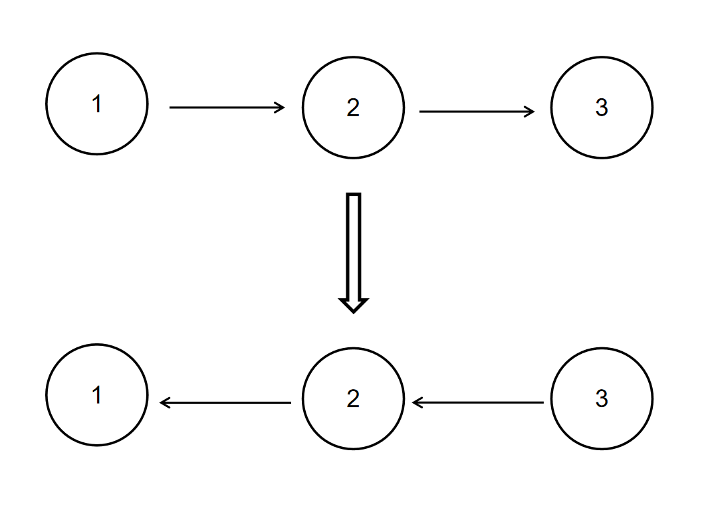
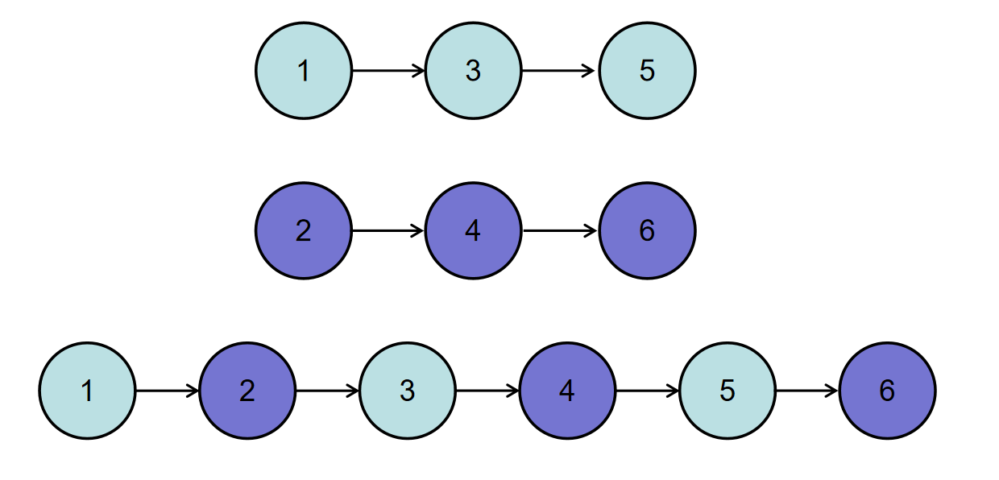
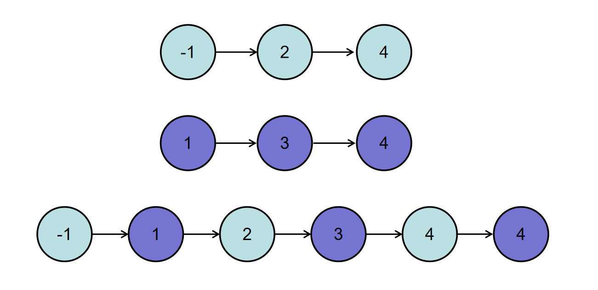
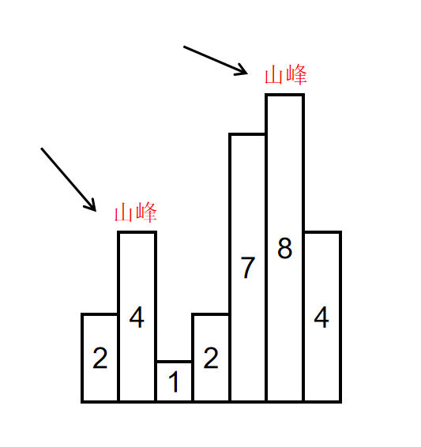

## 0x1 **反转链表**

### 描述

给定一个单链表的头结点pHead(该头节点是有值的，比如在下图，它的val是1)，长度为n，反转该链表后，返回新链表的表头。

数据范围： 0≤n≤10000≤*n*≤1000

要求：空间复杂度 O(1)*O*(1) ，时间复杂度 O(n)*O*(*n*) 。

如当输入链表{1,2,3}时，

经反转后，原链表变为{3,2,1}，所以对应的输出为{3,2,1}。

以上转换过程如下图所示：



### 示例1

```
输入：
{1,2,3}
返回值：
{3,2,1}
```

### 示例2

```
输入：
{}
返回值：
{}
说明：
空链表则输出空   
```

### AC代码

```javascript
/*
 * function ListNode(x){
 *   this.val = x;
 *   this.next = null;
 * }
 */
/**
 * 代码中的类名、方法名、参数名已经指定，请勿修改，直接返回方法规定的值即可
 *
 * 
 * @param head ListNode类 
 * @return ListNode类
 */
function ReverseList( head ) {
    // write code here
    let prev = null
    let cur = head
    while(cur){
        let next = cur.next
        cur.next = prev
        prev = cur
        cur = next
    }
    return prev
}
module.exports = {
    ReverseList : ReverseList
};
```

## 0x2**数组中出现次数超过一半的数字**

### 描述

给一个长度为 n 的数组，数组中有一个数字出现的次数超过数组长度的一半，请找出这个数字。

例如输入一个长度为9的数组[1,2,3,2,2,2,5,4,2]。由于数字2在数组中出现了5次，超过数组长度的一半，因此输出2。

数据范围：n≤50000*n*≤50000，数组中元素的值 0≤val≤100000≤*v**a**l*≤10000

要求：空间复杂度：O(1)*O*(1)，时间复杂度 O(n)*O*(*n*)

### 输入描述：

保证数组输入非空，且保证有解

### 示例1

```
输入：
[1,2,3,2,2,2,5,4,2]
返回值：
2
```

### 示例2

```
输入：
[3,3,3,3,2,2,2]
返回值：
3
```

### 示例3

```
输入：
[1]
返回值：
1
```

### AC代码1

```javascript
/**
 * 代码中的类名、方法名、参数名已经指定，请勿修改，直接返回方法规定的值即可
 *
 * 
 * @param numbers int整型一维数组 
 * @return int整型
 */
function MoreThanHalfNum_Solution( numbers ) {
    // write code here
    let hashMap = new Map()
    for(let item of numbers){
        let value = hashMap.get(item)
        if(value){
            value += 1
            hashMap.set(item,value)
        }else{
            hashMap.set(item,1)
        }
    }
    const len = numbers.length / 2
    for(const [key,value] of hashMap.entries()){
        if(value > len){
            return key
        }
    }
}
module.exports = {
    MoreThanHalfNum_Solution : MoreThanHalfNum_Solution
};
```

### AC代码2

```javascript
/**
 * 代码中的类名、方法名、参数名已经指定，请勿修改，直接返回方法规定的值即可
 *
 * 
 * @param numbers int整型一维数组 
 * @return int整型
 */
function MoreThanHalfNum_Solution( numbers ) {
    // write code here
    numbers = numbers.sort((a,b)=> {return a-b})
    const len = parseInt(numbers.length / 2)
    return numbers[len] 
}
module.exports = {
    MoreThanHalfNum_Solution : MoreThanHalfNum_Solution
};
```

## 0x3 **合并两个排序的链表**

### 描述

输入两个递增的链表，单个链表的长度为n，合并这两个链表并使新链表中的节点仍然是递增排序的。

数据范围： 0≤n≤10000≤*n*≤1000，−1000≤节点值≤1000−1000≤节点值≤1000
要求：空间复杂度 O(1)*O*(1)，时间复杂度 O(n)*O*(*n*)

如输入{1,3,5},{2,4,6}时，合并后的链表为{1,2,3,4,5,6}，所以对应的输出为{1,2,3,4,5,6}，转换过程如下图所示



或输入{-1,2,4},{1,3,4}时，合并后的链表为{-1,1,2,3,4,4}，所以对应的输出为{-1,1,2,3,4,4}，转换过程如下图所示：



### AC代码

```javascript
/*
 * function ListNode(x){
 *   this.val = x;
 *   this.next = null;
 * }
 */
/**
 * 代码中的类名、方法名、参数名已经指定，请勿修改，直接返回方法规定的值即可
 *
 *
 * @param pHead1 ListNode类
 * @param pHead2 ListNode类
 * @return ListNode类
 */
function Merge(l1, l2) {
    // write code here
    let dummy = new ListNode(-1); // 伪头节点
    let cur = dummy; // 用于遍历的指针

    while (l1 !== null && l2 !== null) {
        if (l1.val < l2.val) {
            cur.next = l1;
            l1 = l1.next;
        } else {
            cur.next = l2;
            l2 = l2.next;
        }
        cur = cur.next; // 移动指针
    }

    // 连接剩余的部分
    cur.next = l1 !== null ? l1 : l2;

    return dummy.next; // 返回合并后的链表头部
}
module.exports = {
    Merge: Merge,
};

```

## 0x4**二分查找-I**

### 描述

请实现无重复数字的升序数组的二分查找

给定一个 元素升序的、无重复数字的整型数组 nums 和一个目标值 target ，写一个函数搜索 nums 中的 target，如果目标值存在返回下标（下标从 0 开始），否则返回 -1

数据范围：`0≤len(nums)≤2×10^5` ， 数组中任意值满足` ∣val∣≤10^9`

进阶：时间复杂度 O(log⁡n) ，空间复杂度 O(1)

### 示例一

```
输入：
[-1,0,3,4,6,10,13,14],13
返回值：
6
说明：
13 出现在nums中并且下标为 6
```

### AC代码

```javascript
/**
 * 代码中的类名、方法名、参数名已经指定，请勿修改，直接返回方法规定的值即可
 *
 *
 * @param nums int整型一维数组
 * @param target int整型
 * @return int整型
 */
function search(nums, target) {
    // write code here
    let left = 0
    let right = nums.length-1
    while(left <= right){
        let mid = parseInt((left + right)/2)
        if(nums[mid] === target){
            return mid
        }else if(nums[mid]< target){
            left = mid + 1
        }else{
            right = mid -1
        }
    }
    return -1
}
module.exports = {
    search: search,
};

```

## 0x5**寻找峰值**

### 描述

给定一个长度为n的数组nums，请你找到峰值并返回其索引。数组可能包含多个峰值，在这种情况下，返回任何一个所在位置即可。

1.峰值元素是指其值严格大于左右相邻值的元素。严格大于即不能有等于

2.假设 nums[-1] = nums[n] = −∞

3.对于所有有效的 i 都有 nums[i] != nums[i + 1]

4.你可以使用O(logN)的时间复杂度实现此问题吗？

**二分查找**

如输入[2,4,1,2,7,8,4]时，会形成两个山峰，一个是索引为1，峰值为4的山峰，另一个是索引为5，峰值为8的山峰，如下图所示：



### 示例一

```
输入：
[2,4,1,2,7,8,4]
返回值：
1
说明：
4和8都是峰值元素，返回4的索引1或者8的索引5都可以     
```

### 示例二

```
输入：
[1,2,3,1]
返回值：
2
说明：
3 是峰值元素，返回其索引 2 
```

这里使用二分查找

1. 单调性规律
   1. 如果 `nums[mid] > nums[mid + 1]`，说明峰值可能在 `mid` 或左侧，因为右侧正在下降。
   2. 如果 `nums[mid] < nums[mid + 1]`，说明峰值一定在 `mid` 右侧，因为右侧在上升。
   3. 根据以上规则，每次都可以排除一半元素，达到 `O(log n)` 的时间复杂度。
2. 边界情况
   1. 由于 `nums[-1] = nums[n] = -∞`，所以峰值一定存在，不用担心找不到峰值

### AC代码

```javascript
/**
 * 代码中的类名、方法名、参数名已经指定，请勿修改，直接返回方法规定的值即可
 *
 * 
 * @param nums int整型一维数组 
 * @return int整型
 */
function findPeakElement( nums ) {
    // write code here
    let left = 0, right = nums.length - 1
    while(left < right){
        let mid = parseInt((left + right) / 2)
        if(nums[mid] > nums[mid+1]){
            right = mid
        }else{
            left = mid + 1
        }
    }
    return left
}
module.exports = {
    findPeakElement : findPeakElement
};
```

