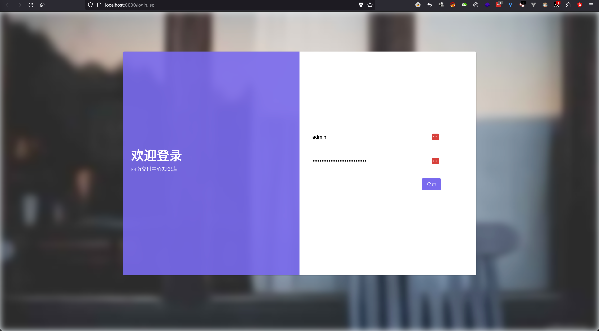
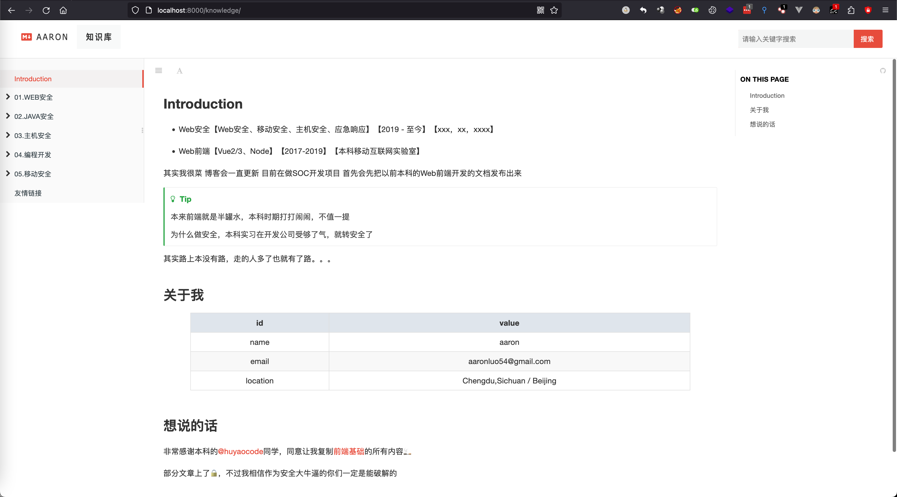
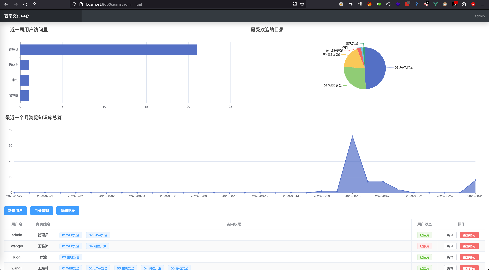
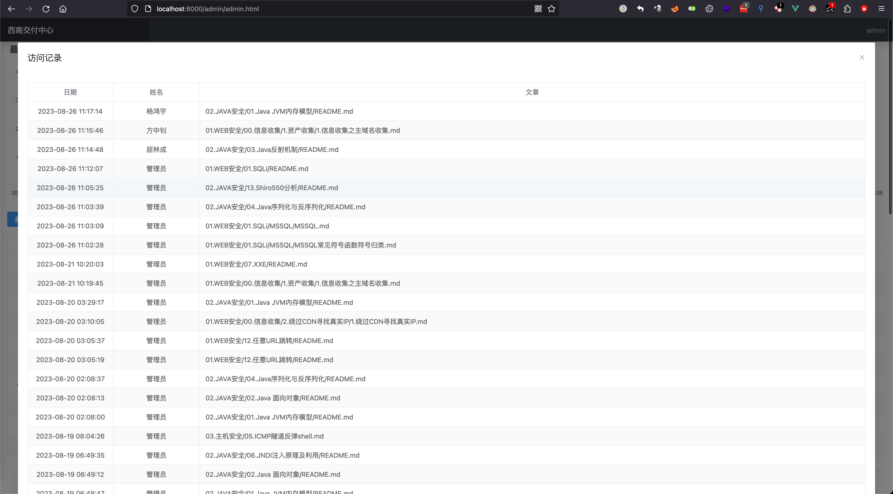
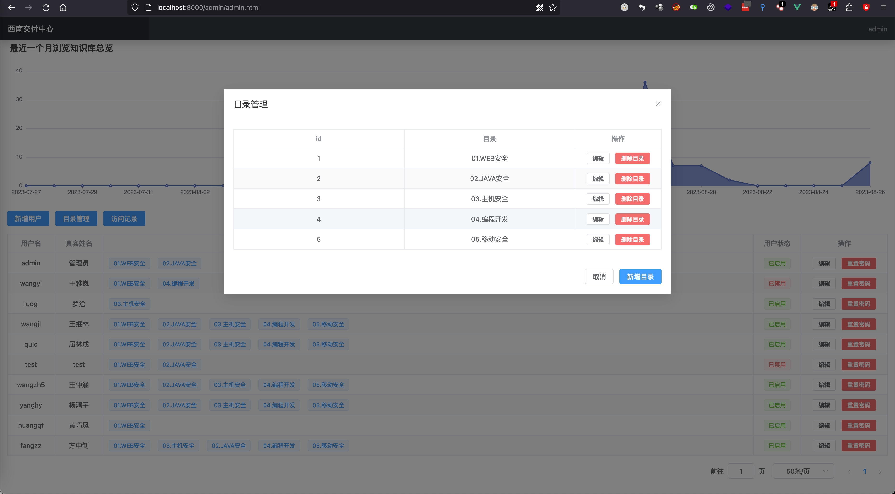
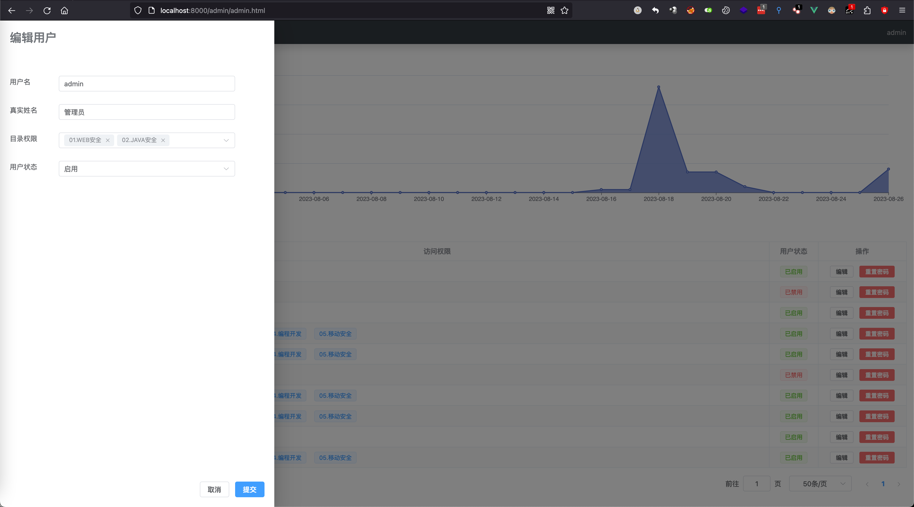
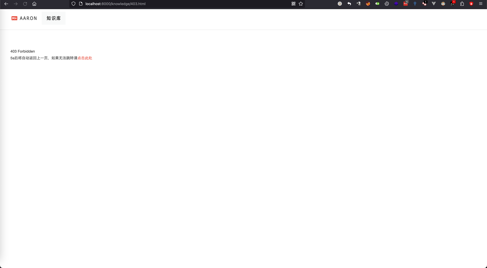
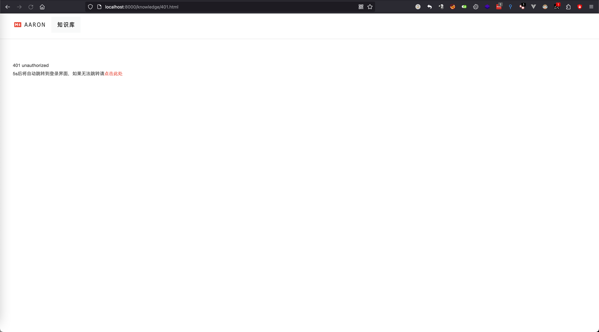

%pageLock%

## 背景

由于知识库是GitBook编译成的全静态HTML，有些文章比较敏感，需要权限校验，最开始使用gitbook插件，但是其是使用前端校验，稍微用点力就可以直接绕过，并且还需要对目录进行管理，综合以上，需要后端来控制权限，以及对用户进行鉴权

最开始的时候，本以为很简单，就想使用Express 这种简单框架直接上手就完成了，但是发现以下问题

- Express对静态资源的处理，使用`app.use()` 声明之后，在拦截器里拦截静态资源(设置了`Cache-Contro`为`no-store`)特别麻烦
- 拦截到之后刷新几次又拦截不到，并且拦截到之后，需要拼接路径
- Express最好是作为中间件这样处理接口请求以及路由转发等，用作一整个Web服务，我感觉性能还是差了点

## 需求

对于该项目其实要求很简单，就是需要对用户进行鉴权，以及对用户权限进行划分

需要规避的风险：

- 登录
  - HTTP 明文传输（主要为密码）
  - SQLi
- 访问文章
  - 权限校验
  - 文章记录的SQLi
- 后台
  - 权限校验
  - SQLi
  - HTTP明文传输（主要为密码）

需要使用的组件：

- Servlet（4.1）
- MySQL（8.x）
- jackson（2.15.2）

静态资源访问一次后，浏览器会缓存，导致下次请求不会经过拦截器，添加header头，告知浏览器不要缓存

```java 
response.setHeader("Cache-Control", "no-store");
response.setHeader("Pragma", "no-cache");
response.setHeader("Expires", "0");
```

需要记录用户访问了哪些文章，但是要对扫描行为进行阻断（或者插件（findSomething）扫描静态资源）

- 需要编写一个gitbook插件
  - 用于监听`page change`方法，当页面改变之后则需要在前端进行第一次校验
    - 利用sessionStorage存储一个时间戳，当间隔没有10s不允许发起请求
    - 这样第一步减缓客户端利用插件等扫描静态资源
- 在后端对其进行校验
  - 时间都存储在session中，当时间差大于10s，则存入数据库，并修改session当中的时间为当前时间
  - 对首次登录需要格外处理，当首次登录之后需要将其登录状态修改为非首次登录状态

## 代码实现过程中的问题

### 前端跳转

在`knowledge`中，由于`gitbook`编译好了目录之后，如果跳转到非编译生成的目录中，前端的js会拦截跳转

需要按照gitbook生成的index.html（首页）进行重新编辑，`401.html`，`403.html`

在以上目录中，需要引入所有的插件，但是需要将实例化gitbook部分代码删除，这样才能正常跳转至登录界面

当跳转之后url未改变，也会导致无法再重定向到登录界面（`401.html`），或者返回上一个页面（`403.html`）

```javascript
if(window.location.pathname !== '/knowledge/401.html'){
    location.reload()
}
setTimeout(()=>{
  window.location.href="/login.do"
},5000)
```

```javascript
if (window.location.pathname !== '/knowledge/403.html') {
    location.reload()
}
setTimeout(() => {
    history.back()
}, 5000)
```

当session过期之后，ajax请求，无法跳转至登录界面

由于ajax是异步请求，如果后端拦截器中使用了`sendRedirect()`,前端无感，需要在后端处理将状态码更改为401，前端设置响应拦截器，当拦截到状态码为401，则前端跳转至登录界面
```java
// 拦截器
if(URI.matches(".*\\.do")){
    // ajax 请求 不能处理302
    // 需要配合状态码在前端跳转到login
    response.setStatus(401);
}else{
    response.sendRedirect("/login.jsp");
}
```

```javascript
// 前端
axios.interceptors.response.use((response) => {
    return response
}, (error) => {
    if (401 === error.response.status) {
        window.location = '/login.jsp'
    } else {
        return Promise.reject(error);
    }
})
```

### Filter

**`MainFilter`**对所有的请求进行拦截

首先需要定义白名单路由，对未登录的路由进行拦截，如果存在session，则继续往下执行到`knowledgeFilter`或者`adminFilter`

```java
package com.knownsec.Filter;

import javax.servlet.*;
import javax.servlet.annotation.WebFilter;
import javax.servlet.http.HttpServletRequest;
import javax.servlet.http.HttpServletResponse;
import javax.servlet.http.HttpSession;
import java.io.IOException;
import java.net.URLDecoder;
import java.util.Arrays;
import java.util.List;

@WebFilter("/*")
public class MainFilter implements Filter {
    // 白名单
    private List<String> routesAndResources = Arrays.asList(
            "/login.do", "/login.jsp", "/knowledge/401.html", "/knowledge/403.html"
    );

    @Override
    public void init(FilterConfig filterConfig) throws ServletException {
    }

    @Override
    public void doFilter(ServletRequest servletRequest, ServletResponse servletResponse, FilterChain filterChain) throws IOException, ServletException {
        HttpServletRequest request = (HttpServletRequest) servletRequest;
        HttpServletResponse response = (HttpServletResponse) servletResponse;
        HttpSession session = request.getSession();
        String id = (String) session.getAttribute("id");
        String URI = URLDecoder.decode(request.getRequestURI(), "UTF-8");
        // 白名单直接过
        if (routesAndResources.contains(URI) || isStaticResource(URI)) {
            // 在列表中或是静态资源，放行
            filterChain.doFilter(servletRequest, servletResponse);
        } else {
            // 禁止浏览器缓存
            if (URI.startsWith("/knowledge")) {
                response.setHeader("Cache-Control", "no-store");
                response.setHeader("Pragma", "no-cache");
                response.setHeader("Expires", "0");
            }
            // 需要鉴权的资源
            if (id != null) {
                // 登录状态
                if (URI.equals("/")) {
                    // 如果在登录的时候访问了/,则跳转knownledge
                    response.sendRedirect("/knowledge/");
                } else {
                    filterChain.doFilter(servletRequest, servletResponse);
                }

            } else {
                // 非登录状态
                // 如果失效状态在gitbook中，需要重定向到/knowledge/401.html
                if (URI.matches("(/knowledge/)|(/knowledge/.*)")) {
                    response.sendRedirect("/knowledge/401.html");
                } else {
                    //
                    response.sendRedirect("/login.jsp");
                }

            }
        }
    }

    @Override
    public void destroy() {
        Filter.super.destroy();
    }


    private boolean isStaticResource(String uri) {
        return uri.endsWith(".js") || uri.endsWith(".css") || uri.endsWith(".jpg")
                || uri.endsWith(".png") || uri.endsWith(".gif") || uri.endsWith(".svg")
                || uri.contains(".woff") || uri.endsWith(".tff") || uri.endsWith(".map");
    }

}

```

**`knowledgeFilter`**对访问知识库的请求进行拦截

对资源进行拦截，判断该用户是否拥有权限，有权限则继续执行，无权限则跳转到`/knowledge/403.html`

```java
package com.knownsec.Filter;

import com.knownsec.DataBase.DataBaseConnection;

import javax.servlet.*;
import javax.servlet.annotation.WebFilter;
import javax.servlet.http.HttpServletRequest;
import javax.servlet.http.HttpServletResponse;
import javax.servlet.http.HttpSession;
import java.io.IOException;
import java.net.URLDecoder;
import java.sql.Connection;
import java.sql.PreparedStatement;
import java.text.SimpleDateFormat;
import java.util.Arrays;
import java.util.List;
import java.util.UUID;
import java.util.regex.Matcher;
import java.util.regex.Pattern;

@WebFilter("/knowledge/*")
public class knowledgeFilter implements Filter {
    private List<String> routesAndResources = Arrays.asList(
            "/knowledge/401.html", "/knowledge/403.html", "/knowledge/", "/knowledge/index.html", "/knowledge",
            "/knowledge/友情链接.html"
    );

    @Override
    public void init(FilterConfig filterConfig) throws ServletException {
//        Filter.super.init(filterConfig);
    }

    @Override
    public void doFilter(ServletRequest servletRequest, ServletResponse servletResponse, FilterChain filterChain) throws IOException, ServletException {
        HttpServletRequest request = (HttpServletRequest) servletRequest;
        HttpServletResponse response = (HttpServletResponse) servletResponse;
        HttpSession session = request.getSession();
        List<String> persmissionArray = (List<String>) session.getAttribute("persmissionArray");
        String URI = URLDecoder.decode(request.getRequestURI(), "UTF-8");
        // 默认到该拦截器就是登录状态
        // 白名单直接过
        if (routesAndResources.contains(URI) || isStaticResource(URI)) {
            // 在列表中或是静态资源，放行
            filterChain.doFilter(request, response);
        } else {
            // 权限校验
            String regex_html = "/knowledge/知识库/(.*)\\.html";
            String regex_dir = "/knowledge/知识库/(.*)/$";
            String regex_persmission = "/knowledge/知识库/(.+?)/";
            Pattern pattern = Pattern.compile(regex_persmission);
            Matcher matcher = pattern.matcher(URI);
            String matchedCharacter = null;


            while (matcher.find()) {
                matchedCharacter = matcher.group(1); // 获取匹配到的字符 (一级目录)
            }
            // 如果没有权限
            if (!persmissionArray.contains(matchedCharacter)) {
                response.sendRedirect("/knowledge/403.html");
            } else {
                filterChain.doFilter(request, response);
            }
        }
    }

    @Override
    public void destroy() {
        Filter.super.destroy();
    }

    private boolean isStaticResource(String uri) {
        return uri.endsWith(".js") || uri.endsWith(".css") || uri.endsWith(".jpg")
                || uri.endsWith(".png") || uri.endsWith(".gif") || uri.endsWith(".svg")
                || uri.contains(".woff") || uri.endsWith(".tff") || uri.endsWith(".ico");
    }
}

```

**`adminFilter`**对访问后台的请求进行拦截

主要针对用户权限进行校验，只有admin用户的id为1，其余都为UUID

```java
package com.knownsec.Filter;

import javax.servlet.*;
import javax.servlet.annotation.WebFilter;
import javax.servlet.http.HttpServletRequest;
import javax.servlet.http.HttpServletResponse;
import javax.servlet.http.HttpSession;
import java.io.IOException;
import java.net.URLDecoder;

@WebFilter("/admin/*")
public class adminFilter implements Filter {
    @Override
    public void init(FilterConfig filterConfig) throws ServletException {

    }

    @Override
    public void doFilter(ServletRequest servletRequest, ServletResponse servletResponse, FilterChain filterChain) throws IOException, ServletException {
        HttpServletRequest request = (HttpServletRequest) servletRequest;
        HttpServletResponse response = (HttpServletResponse) servletResponse;
        HttpSession session = request.getSession();
        String id = (String) session.getAttribute("id");
        String URI = URLDecoder.decode(request.getRequestURI(), "UTF-8");
        if (id != null) {
            //id 不为null 则说明是登录状态，否则为401
            if (id.equals("1")) {
                // session 中的id为1 确认为admin账户登录
                filterChain.doFilter(servletRequest, servletResponse);
            } else {
                response.sendRedirect("/401.jsp");
            }
        } else {
            // 非登录状态
            // 如果失效状态在gitbook中，需要重定向到/knowledge/401.html
            if (URI.matches("(/knowledge/)|(/knowledge/.*)")) {
                response.sendRedirect("/knowledge/401.html");
            } else {
                if(URI.matches(".*\\.do")){
                    // ajax 请求 不能处理302
                    // 需要配合状态码在前端跳转到login
                    response.setStatus(401);
                }else{
                    response.sendRedirect("/login.jsp");
                }
            }
        }
    }

    @Override
    public void destroy() {
        Filter.super.destroy();
    }
}
```

### Servlet

**`LoginServlet`**执行登录操作

**`RecordServlet`**记录用户访问的知识库操作

**`userServlet`**前台用户执行操作

**`ContorlUserServlet`**管理员对用户的管理操作

**`DirectoryServlet`**管理员对目录的管理操作

**`RecordListServlet`**获取图表信息以及所有访问记录的操作

### SQL（图表）

`一个月内每天访问次数记录`

```sql
SELECT  DATE_FORMAT(date,'%Y-%m-%d') AS day, count(paper) AS count FROM record WHERE DATE_FORMAT(date,'%Y-%m-%d') BETWEEN ? - INTERVAL 30 DAY AND ? GROUP BY day ORDER BY day
```

第一个`?`为当天时间，第二个`?`为`tomorrow`时间 这样才能保证能完整获取31天的数据

执行完这个sql之后，没有访问的日期是不会显示出来的，所以需要在后端进行处理，将没有访问的日期添加上，并且设置访问量为0

- 使用Map存储取出来的日期，因为`map`的`key`值是不能重复的
- 生成前31天的所有日期，然后遍历该日期，将遍历的值作为map的key，判断是否有该key，如果有则存入新的一个map中，如果没有则用该日期作为一个key，value为0
- 在遍历过程中将这个新的map一个个存入一个`List<String,Object>`

```java
LocalDate now = LocalDate.now();
LocalDate tomorrow = now.plusDays(1);
DateTimeFormatter formatter = DateTimeFormatter.ofPattern("yyyy-MM-dd");
String beginTime = now.format(formatter);
String endTime = tomorrow.format(formatter);

int daysToSubtract = 31; // 往前推算的天数
List<LocalDate> previousDates = new ArrayList<>();
LocalDate currentDate = now;

for (int i = 0; i < daysToSubtract; i++) {
    previousDates.add(currentDate);
    currentDate = currentDate.minusDays(1);
}
// SQL 执行
Map<LocalDate, Integer> dataFromDatabase = new HashMap<>();
while (resultSet.next()) {
    String date = resultSet.getString("day");
    int count = resultSet.getInt("count");
    dataFromDatabase.put(LocalDate.parse(date, formatter), count);
}
List<Map<String, Object>> resultRecord = new ArrayList<>();
  for (int i = previousDates.size() - 1; i >= 0; i--) {
      Map<String, Object> recordMap = new HashMap<>();
      String dateString = previousDates.get(i).format(formatter);
      if (dataFromDatabase.containsKey(previousDates.get(i))) {
          recordMap.put("date", dateString);
          recordMap.put("count", dataFromDatabase.get(previousDates.get(i)));
      } else {
          recordMap.put("date", dateString);
          recordMap.put("count", 0);
      }
      resultRecord.add(recordMap);
  }
```

`一周内访问次数排名`

```sql
select realName, count(paper) count from record a LEFT JOIN users b on a.userId = b.id where DATE_FORMAT(date,'%Y-%m-%d') BETWEEN ? - INTERVAL 1 WEEK AND ? GROUP BY a.userId
```

获取最多访问的目录（倒序排列）

```sql
select `directory` ,count(*) `count`  from record GROUP BY `directory` ORDER BY count desc
```

### JackSon

JackSon 对返回体中没有的数据需要处理为null

```java
package com.knownsec.Utils;

import com.fasterxml.jackson.core.JsonGenerator;
import com.fasterxml.jackson.databind.JsonSerializer;
import com.fasterxml.jackson.databind.ObjectMapper;
import com.fasterxml.jackson.databind.SerializerProvider;

import java.io.IOException;

public class NullObjectToEmptyObjectSerializer extends JsonSerializer<Object> {
    @Override
    public void serialize(Object value, JsonGenerator jsonGenerator, SerializerProvider serializerProvider) throws IOException {
        if (value == null) {
            jsonGenerator.writeString("null");
        } else {
            //使用nullsUsing时理论上不会走到这里， 但为了防止开发人员误用， 这里仍旧做了健壮性处理
            ObjectMapper mapper = new ObjectMapper();
            String res = mapper.writeValueAsString(value);
            jsonGenerator.writeString(res);
        }
    }
}

```

JackSon返回体中对初始化的数据设置隐藏

在Model类中添加如下注解，表示如果在序列化的时候Model中的值为null，则不序列化（不显示在response body中）

```java
@JsonInclude(JsonInclude.Include.NON_NULL)
```

JackSon不通过Model类进行序列化（自定义一个对象进行序列化）

> [!WARNING]
>
> 可能会出现类型出错


```java
// SQL执行操作
while (resultSet.next()) {
  // 自定义一个Map，用于存数据库的数据
    Map<String, Object> recordMap = new HashMap<>();
    String directory = resultSet.getString("directory");
    int count = resultSet.getInt("count");
    recordMap.put("name", directory);
    recordMap.put("value", count);
  // List add这个map
    resultList.add(recordMap);
}
// 序列化这个resultList即可
```

## 最终效果


















## GitLab 项目地址

https://gitlab.carinago.com/luogan/knowlegdeauth

