在本章中，我们将研究 Android 设备的网络流量，并分析平台和应用程序的流量数据。 通常应用程序会在其网络数据中泄漏敏感信息，因此发现它是渗透测试程序最重要的任务之一。 此外，你经常会遇到通过不安全的网络协议执行身份验证和会话管理的应用程序。 因此，在本章中，我们将学习如何拦截和分析 Android 设备中，各种应用程序的流量。

## Android 流量拦截

根据 OWASP 移动 Top10，不完善的传输层保护是第三大威胁。实际上，假设一个应用程序通过 HTTP 将用户的登录凭据提交到服务器。 如果用户位于咖啡店或机场，并在有人嗅探网络时登录到他的应用程序，会怎么样？ 攻击者能够获得特定用户的整个登录凭据，它以后可能用于恶意目的。 假设应用程序正在通过 HTTPS 进行身份验证，通过 HTTP 的会话管理，并且在请求中传递身份验证 Cookie。 在这种情况下，攻击者也能够通过在执行中间人攻击时拦截网络来获取身份验证 Cookie。 使用这些认证 cookie，他可以直接作为受害用户登录到应用程序。

## 流量分析方式

在任何情况下都有两种不同的流量捕获和分析方法。 我们将研究 Android 环境中可能的两种不同类型，以及如何在真实场景中执行它们。 被动和主动分析如下：

- 被动分析：这是一种流量分析的方法，其中应用程序发送的网络数据不会被拦截。 相反，我们将尝试捕获所有网络数据包，然后在网络分析器（如Wireshark）中打开它，然后尝试找出应用程序中的漏洞或安全问题。
- 主动分析：在主动分析中，渗透测试者将主动拦截所有正在进行的网络通信，并可以即时分析，评估和修改数据。 这里，他需要设置代理，并且由应用/设备生成和接收的所有网络流量会通过该代理。

### 被动分析

被动分析的概念是。将所有网络信息保存到特定文件中，之后使用数据包分析器查看。 这就是我们将在 Android 设备中进行被动分析。 我们将使用`tcpdump`来将所有的信息保存到设备中一个位置。 此后，我们将该文件拉取到我们的系统，然后使用 Wireshark 或 Cocoa 包分析器查看它。 请参阅以下步骤：

1. 我们从 Timur Alperovich 的网站`http://www.eecs.umich.edu/~timuralp/tcpdump-arm`下载为 ARM 编译的`tcpdump`二进制文件。 如果我们需要，我们还可以下载`tcpdump`的原始二进制文件并交叉编译（为 Android 交叉编译你的二进制文件，请按照链接`http://machi021.blogspot.jp/2011/03/compile-busybox-for-android.html`。链接展示了交叉编译 BusyBox，但相同的步骤可以应用于`tcpdump`）

   一旦我们下载了`tcpdump`，我们可以通过在我们刚刚下载的二进制上执行一个文件，来确认它是否为 ARM 编译。对于 Windows 用户，你可以使用 Cygwin 来执行命令。 输出类似于以下屏幕截图中所示：

   

2. 这里的下一步是将`tcpdump`二进制文件推送到设备中的一个位置。 我们还必须记住，我们需要继续执行这个文件。 因此，我们将它推送到一个位置，我们可以从中更改权限，以及执行二进制来捕获流量。

3. 现在，继续并使用`adb`的`push`命令推送二进制来将二进制推送到设备。 同样，在我们需要从设备中拉取内容的情况下，我们可以使用`pull`而不是`push`。

4. 这里，我们将使用`adb push`将其推送到 Android 中的`/data/local/tmp`：

   ```shell
   adb push tcpdump-arm /data/local/tmp/tcpdump
   ```

5. 一旦我们将`tcpdump`二进制推送到设备，然后需要使用`adb`在 shell 中访问设备，并更改二进制的权限。 如果我们试图运行`tcpdump`，它会给我们一个权限错误，因为我们没有执行权限。

   为了更改权限，我们需要访问`/data/local/tmp`，使用`chmod`命令，并授予其权限`777`，这意味着应用程序将具有所有权限。 以下屏幕截图显示了上述命令的结果输出：

   

6. 这里的最后一步是启动`tcpdump`并将输出写入`.pcap`文件。 使用`-s`，`-v`和`-w`标志启动`tcpdump`。 参考以下描述：

   1. -s：这表示从每个封包抽取给定（在我们的例子中为 0）字节的数据，而不是默认的 65535 字节。
   2. -v：这表明详细输出。
   3. -w：这表明写入原始数据包的文件名。 例如，我们可以使用`./tcpdump -v -s 0 -w output.pcap`，以便将所有文件写入`output.pcap`，并输出详细信息。

7. 在流量捕获执行期间，打开手机浏览器并访问位于`http://attify.com/data/login.html`的漏洞登录表单，该表单通过 HTTP 发送所有数据并使用 GET 请求：

   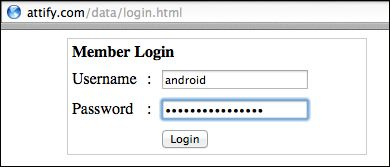

8. 这里使用用户名`android`和密码`mysecretpassword`登录应用程序。

9. 我们现在可以在任何时候通过`adb shell`服务终止进程（使用`Ctrl + C`）。 下一步是将捕获的信息从设备拉取到我们的系统。 为此，我们将简单地使用`adb pull`如下：

   ```shell
   adb pull /data/local/tmp/output.pcap output.pcap
   ```

10. 你可能还需要更改`output.pcap`的权限才能拉取它。 在这种情况下，只需执行以下命令：

    ```shell
    chmod 666 output.pcap
    ```

11. 一旦我们下载了捕获的网络数据的.pcap文件，我们可以在 Wireshark 中打开它并分析流量。 在这里，我们将尝试查找捕获的登录请求。 我们可以从网站`http://www.wireshark.org/download.html`下载 Wireshark。 一旦下载并安装完毕，打开 Wireshark 并在里面打开我们新拉取的文件`output.pcap`，通过访问`File | Open`。

    一旦我们在 Wireshark 中打开`.pcap`文件，我们会注意到一个类似下面截图所示的屏幕：

    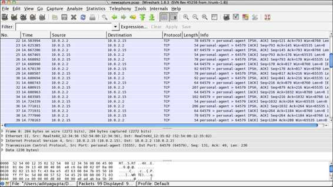

    Wireshark 是一个开源封包分析器，它帮助我们发现敏感信息，并分析来自所有网络连接的流量数据。 在这里，我们正在搜索我们对`http://attify.com`所做的请求，并输入了我们的登录凭据。

12. 现在，访问`Edit`并单击`Find Packets`。 在这里，我们需要查找我们提交登录凭据的网站，并检查`String`。

    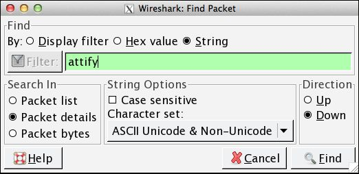

13. 在这里，我们可以看到与`http://attify.com/data/login.html`的连接。 如果我们在底部窗格中查找有关此数据包的更多信息，我们可以看到包含我们输入的用户名和密码的请求网址。

    

因此，我们使用`tcpdump`成功捕获了网络数据，并将其存储在`.pcap`文件中，然后使用 Wireshark 进行分析。 然而，被动流量捕获也可以通过`adb shell`直接完成。

```shell
adb shell /data/local/tmp/tcpdump -i any -p -s 0 -w /mnt/sdcard/output.pcap
```

这里，`-i`代表接口。 在这种情况下，它从所有可用接口捕获数据。 `-p`指定`tcpdump`不将设备置于混杂模式（这是在执行嗅探攻击时经常使用的模式，并且不适合我们目前使用的模式）。 在使用`-tcpdump`标志启动模拟器时，我们还可以指定使用`tcpdump`。 我们还需要使用`-avd`标志，指定要捕获流量的 AVD 名称。

```shell
emulator -avd Android_Pentesting --tcpdump trafficcapture.pcap
```

### 主动分析

主动分析的基本规则是，使每个请求和响应通过我们定义的中间设备。 在这种情况下，我们将设置一个代理，并使所有请求和响应通过该特定代理。 此外，我们可以选择操纵和修改请求和响应中的数据包，从而评估应用程序的安全性：

1. 为了为 HTTP 创建代理，请使用指定代理 IP 和端口以及`-http-proxy`标志启动模拟器。 由于我们在同一个系统上运行模拟器，我们使用IP `127.0.0.1`和任何可用的端口。 在这种情况下，我们使用端口 8080。

   ```shell
   emulator -avd Android_Pentesting –http-proxy 127.0.0.1:8080
   ```

2. 在设备上，我们还可以访问`Settings | Wi-Fi`，然后长按我们连接的网络 Wi-Fi。 此外如果我们使用一个实际的设备，我们用于拦截的系统应该在同一个网络上。

3. 一旦我们长按 Wi-Fi 连接，我们将会得到一个类似于下面的截图所示的屏幕。 此外，如果你使用真实设备执行此练习，设备需要与代理位于同一个网络。

   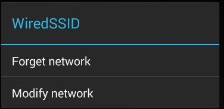

4. 一旦进入连接修改屏幕，请注意，代理配置会询问网络上的设备的 IP 地址和代理系统的端口。

   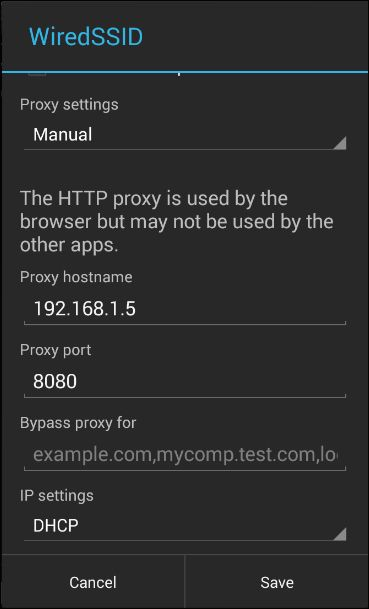

   但是，这些设置仅存于从 4.0 开始的最新版本的 Android 中。 如果我们要在小于 4.0 的设备上实现代理，我们将必须安装第三方应用程序，例如 Play Store 上可用的 ProxyDroid

5. 一旦我们在设备/模拟器中设置了代理，请继续并启动 Burp 代理，来拦截流量。 下面`Options`选项卡中 Burp 代理的样子，以便有效拦截浏览器和应用程序的流量。

6. 我们还需要检查不可见的代理，以确保我们的代理也捕获 nonproxy 请求。

   

7. 为了检查代理是否工作，打开浏览器并启动网站。 然后我们能够看到它是否在代理中被拦截。

   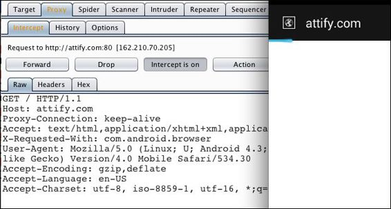

正如我们在上面的屏幕截图中看到的，我们打开了 URL`http://attify.com`，请求现在显示在 Burp Proxy 屏幕中。 因此，我们成功地拦截了来自设备和应用程序的所有基于 HTTP 的请求。

## HTTPS 代理拦截

当通过 HTTP 协议进行通信时，上述方法可以正常用于应用和流量器的流量拦截。 在 HTTPS 中，由于证书不匹配，我们将收到错误，因此我们无法拦截流量。

然而，为了解决这个挑战，我们需要创建自己的证书或 Burp/PortSwigger 并将其安装在设备上。 为了创建我们自己的证书，我们需要在 Firefox（或任何其他浏览器或全局代理）中设置代理：

1. 为了在 Firefox 中设置代理，请访问`Tools`中显示的`Options`（Mac上为`Firefox | Preferences`），然后访问`Advanced`选项卡。 在`Advanced`选项卡下，我们单击`Network`选项

   

2. 在`Network`标签中，我们需要点击`Settings`来使用 Firefox 配置代理。

   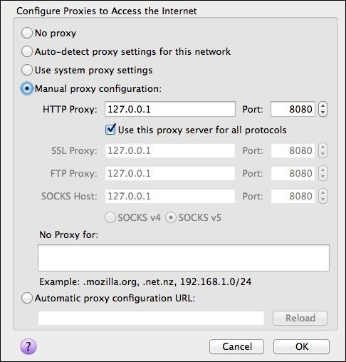

3. 完成后，在我们的系统浏览器上访问 HTTPS 网站，我们能跟拦截我们设备上的流量。 这里我们将收到一个`The Network is Untrusted`消息。 点击`I understand the Risks`，并点击`Add Exception`。

4. 然后，单击`Get Certificate`，最后单击`View`，然后单击`Export`来保存证书。

   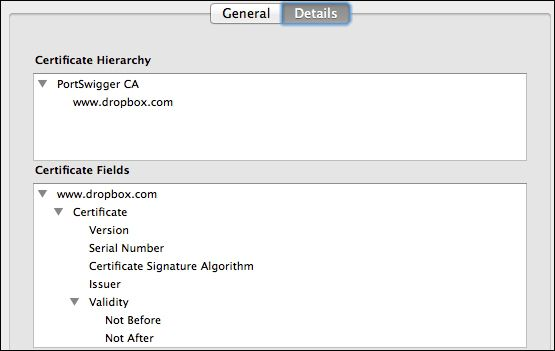

5. 一旦证书保存在我们的系统上，我们现在可以使用`adb`将其推送到我们的设备。

   ```shell
   adb push portswiggerca.crt /mnt/sdcard/portswiggerca.crt
   ```

6. 现在，在我们的设备中，访问`Settings`，在`Personal`类别下，我们可以找到`Security`。 一旦我们进入`Security`，请注意，你可以选择从 SD 卡安装证书。 点击它使我们可以保存具有给定名称的证书，这适用于所有应用程序和浏览器，甚至是 HTTPS 站点。

   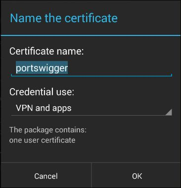

7. 通过返回到我们的浏览器，并打开 HTTPS 网站（例如`https://gmail.com`）来确认。 正如我们在下面的截图中可以看到的，我们在这种情况下也成功地拦截了通信：

   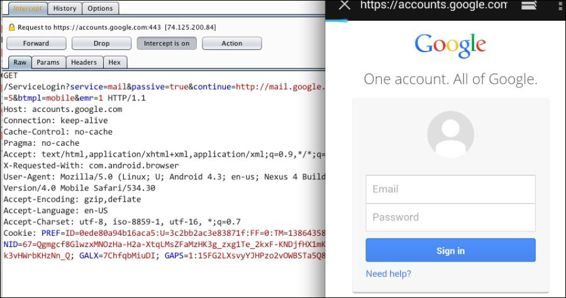

### 其它用于拦截 SSL 流量的方式

还有用于 SSL 流量拦截的其他方法，以及在设备上安装证书的不同方法。

其他方法之一是从 Android 设备的`/system/etc/security`位置拉取`cacerts.bks`文件。 一旦我们拉取了它，我们就可以使用密钥工具以及 Bouncy Castle（位于 Java 安装目录中）来生成证书。 如果你在 Java 安装目录中找不到 Bouncy Castle，也可以从`http://www.bouncycastle.org/latest_releases.html`下载并将其放置在已知路径。 此后，我们需要挂载`/system`分区作为读/写分区，以便将更新的`cacerts.bks`证书推送回设备。 然而，为了使这种更改长期有效，如果我们使用模拟器，我们将需要使用`mks.yaffs2`来创建一个新的`system.img`然后使用它。

此外，还有其他工具可用于拦截 Android 设备的流量，例如C harles Proxy 和 MITMProxy（`http://mitmproxy.org`）。 我强烈建议你在 Burp 代理的知识的基础上尝试他们，因为它们在可用性方面是相同的，但是更强大。 在使用 Charles Proxy 时，我们可以直接从`www.charlesproxy.com/charles.crt`下载证书。

在一些渗透测试中，应用程序可能正在和服务器通信并获得响应。 例如，假设用户试图访问应用的受限区域，该应用由用户从服务器请求。 然而，由于用户没有被授权查看该区域，服务器使用`403 Forbidden`进行响应。 现在，我们作为渗透测试人员，可以拦截流量，并将响应从`403 Forbidden`改为`200 OK`。 因此，用户现在甚至能够访问应用的未授权区域。修改类似响应的示例可以在第8章“ARM 利用”中找到，其中我们将讨论可通过流量拦截利用的一些其他漏洞。

在应用程序中，保护流量的安全方法是让所有内容通过 HTTPS 传递，同时在应用程序中包含一个证书。 这样做使得当应用程序尝试与服务器通信时，它将验证服务器证书是否与应用程序中存在的证书相对应。 但是，如果有人正在进行渗透测试并拦截流量，则由渗透测试程序添加的设备使用的新证书（如 portswigger 证书）与应用程序中存在的证书不匹配。 在这些情况下，我们必须对应用程序进行逆向工程，并分析应用程序如何验证证书。 我们甚至可能需要修改和重新编译应用程序。

## 使用封包捕获来提取敏感文件

现在我们来看看如何使用 Wireshark 从流量数据中提取敏感文件。 为了做到这一点，我们可以捕获数据包，并加载到 Wireshark 进行分析。

从网络捕获中提取文件的基本概念是，它们含有指定文件类型的头部（`multipart/form-data`）。 以下是从网络流量捕获中提取任何类型文件的步骤：

1. 在 Wireshark 中，只需访问编辑并从包详细信息中搜索字符串`multipart`。

   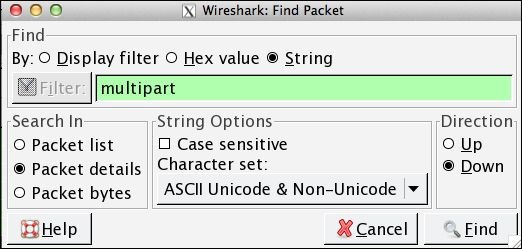

2. 一旦我们收到了向服务器发送 POST 请求的数据包（或者极少数情况下是 GET），右键单击该数据包，然后点击`Follow TCP Stream`。

   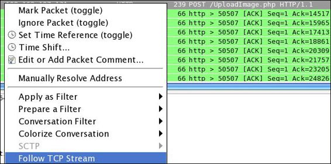

3. 此后，根据文件起始值（如 PDF 的情况下为`%PDF`），从以下选项中选择`Raw`，然后使用扩展名`.pdf`保存文件。 因此，我们拥有了最终的 PDF，通过 Android 设备上传到网站，而且我们恰巧在我们的渗透中开启了网络捕获。

   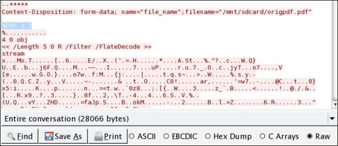

4. 我们还可以使用其他工具，如 Windows 上的 NetworkMiner（可从`http://www.netresec.com/?page=NetworkMiner`下载），它提供了一个精心构建的 GUI 来与之交互，并显式指定保存的网络流量捕获文件。

## 总结

在本章中，我们了解了在 Android 设备上执行流量分析的各种方法。 此外，我们会继续拦截来自应用程序和浏览器的 HTTP 和 HTTPS 流量数据。 我们还看到如何从网络捕获信息中提取敏感文件。

在下一章中，我们将介绍 Android 取证，并使用手动方式以及在不同工具的帮助下，从 Android 设备中提取一些敏感信息。