## 取证类型

取证是使用不同的手动和自动方法从设备中提取和分析数据。它可以大致分为两类：

- 逻辑采集：这是的一种取证方法，其中取证员与设备交互并从文件系统提取数据。该数据可以是任何内容，诸如应用特定数据，联系人，通话记录，消息，web 浏览器历史，社交网络用户信息和财务信息。逻辑采集的优点是，在大多数情况下比物理采集更容易获取逻辑信息。然而，在一些情况下，该方法的一个限制是，在这种情况下的证据（智能手机及其数据）具有被篡改的高风险。
- 物理采集：这意味着对整个物理存储介质进行逐位拷贝。我们还可以在执行物理采集时定位不同的单个分区。与逻辑采集相比，这种方法慢得多，但更可靠和可信赖。此外，为了在智能手机上执行物理采集，检查者需要熟悉不同类型的文件系统，例如 Yet Another Flash File System 2（YAFFS2），ext3，ext4，rfs 等。

## 文件系统

在我们深入取证以及从设备提取数据之前，我们应该清楚地了解文件系统类型和它们之间的差异。正如我们前面讨论的，在 Android 中进行物理采集有点棘手，一个主要原因是文件系统不同。

Android 文件系统的主分区通常被分区为 YAFFS2。在 Android 中使用 YAFFS2 的原因是，它为设备提供了优势，这包括更高的效率和性能，以及更低的占用空间。几年前，当 Android 刚刚推出时，取证是平台上的一个大问题，因为几乎没有支持 YAFFS2 文件系统格式的取证工具。

SD 卡是 FAT32 类型，是正常系统用户中的共享格式。因此，为了获取 SD 卡的映像，可以使用任何常规的数据采集取证工具。

制作副本或创建现有数据系统映像的最有名的工具之一是 dd，它从原始来源到系统进行逐块复制。然而，由于该工具的一些缺点，例如缺少内存块以及跳过坏块，会导致数据损坏，因此不推荐在取证调查期间使用。在接下来的章节中，我们将深入介绍 Android 文件系统，并将研究如何以最有效的方式从文件系统中提取数据。

### Android 文件系统分区

正如我们在前面的章节中讨论的，Android 基于 Linux 内核，并从 Linux 本身派生其大部分功能和属性。 在 Android 中，文件系统被划分为不同的分区，每个分区都具有重要意义。

为了在 Android 设备上查看分区，我们可以使用`adb shell`然后查看`proc`下的`mtd`文件，如下面的命令所示。 在一些不存在`mtd`文件的设备中，在`proc`下有另一个名为`partitions`的文件，如下面的命令所示：

```shell
adb shell
cat /proc/mtd
```

以下是在设备上执行上述命令来列出所有分区后的输出的屏幕截图。

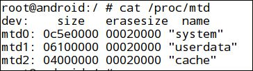

正如我们在上面截图中看到的，存在各种文件系统分区及其各自的大小。 在大多数 Android 设备上，我们通常会看到一些数据分区，如`system`，`userdata`，`cache`，`recovery`，`boot`，`pds`，`kpanic`和`misc`，它们安装在`dev`列指定的不同位置。 为了看到不同的分区和类型，我们可以在`adb shell`中键入`mount`。

正如我们在下面的截图中可以看到的，通过执行`mount`命令列表，所有不同的分区及其位置将被挂载：

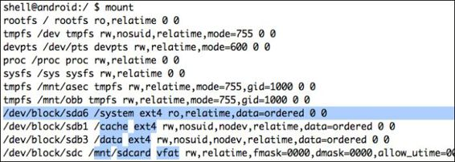

## 使用`dd`提取数据

`dd`工具是取证中最常用的工具之一，以便为数据提取过程创建映像。 换句话说，它用于将指定的输入文件转换并复制为输出文件。 通常在分析期间，我们不允许与证据直接交互和更改。 因此，获得设备文件系统的映像，然后对其执行分析总是一个好的选择。

默认情况下，`dd`工具在大多数基于 Linux 的系统中，以及在 Android 设备中的`/system/bin`中都存在。 如果它不存在于你的设备中，您可以安装 BusyBox，它将安装`dd`以及一些其他有用的二进制文件。 你可以从 BusyBox 应用程序（`https://play.google.com/store/apps/details?id=stericson.busybox`）获取`dd`的二进制文件，或者你甚至可以自己交叉编译。

`dd`的标准语法如下:

```
dd if = [source file which needs to be copied] of = [destination file to be created]
```

有几个命令行选项可以与`dd`一起传递，其中包括：

- `if`：这是要复制的输入文件
- `of`：这是内容要复制给它的输出文件
- `bs`：这是块大小（一个数字），指定`dd`复制映像的块大小
- `skip`：这是在开始复制过程之前要跳过的块数

让我们现在继续，并取得现有分区之一的映像来进行取证

1. 我们需要找到的第一个东西是不同的分区，它们存在于我们的 Android 设备上，就像我们之前做的一样。 这可以通过查看`/proc/mtd`文件的内容来完成。

   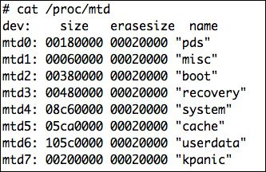

2. 接下来，我们需要了解数据分区的位置，因为这里我们采集数据分区的备份。 在这种情况下，它位于`mtdblock6`。 这里，我们将启动`dd`，并将映像存储在`sdcard`中，稍后我们将使用`adb pull`命令拉取映像。 `adb pull`命令只是简单地允许你将文件从设备拉取到本地系统。

   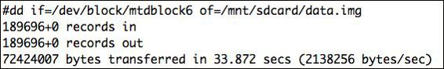

3. 复制可能需要一些时间，一旦复制完成，我们可以退出`adb shell`，访问我们的终端，并键入以下代码：

   ```shell
   adb pull /mnt/sdcard/data.img data.img
   ```

4. 我们还可以使用 Netcat 工具将映像直接保存到远程位置/系统。 为此，我们首先需要将端口从设备转发到系统。

   ```shell
   adb forward tcp:5566 tcp:5566
   ```

5. 同时，我们需要在这里启动 Netcat 工具，监听端口 5566。

   ```shell
   nc 127.0.0.1 5566 > data.img
   ```

6. 此后，我们必须执行`adb shell`进入设备，然后启动`dd`工具，并将输出转发到 Netcat。

   ```shell
   nc -l -p 5566 -e dd if=/dev/block/mtdblock6
   ```

这将把映像保存到系统中，而不是保存在设备上的任何位置，然后再拉取它。 如果你的手机上没有`dd`二进制，你也可以安装 BusyBox 来获得`dd`二进制。

开始取证调查之前应该确保的一件事是，检查设备是否被设置为在超级用户模式下操作，这通常需要设备的 root。 然而，我们遇到的所有设备并不都是 root。 在这些情况下，我们将使用我们的自定义恢复映像来启动手机，然后 root 设备。

## 使用 Andriller 提取应用数据

Andriller 是由 Denis Sazonov 以 Python 编写的开源多平台取证工具，它有助于从设备中提取一些基本信息，并且有助于进行取证分析。 分析完成后，将生成 HTML 格式的取证报告。

为了下载它，我们可以访问官方网站`http://android.saz.lt/cgi-bin/download.py`并下载必要的包。 如果我们在 Linux 或 Mac 环境中，我们可以简单地使用`wget`命令来下载并解压软件包。 因为它只是一个 Python 文件，以及一些其他必要的二进制文件，所以没有必要安装它; 相反，我们可以直接开始使用它。

```shell
wget https://github.com/den4uk/andriller/archive/refs/tags/3.6.3.tar.gz

Saving to: 'Andriller_multi.tar.gz'

100%[=============================>] 1,065,574    114KB/s   in 9.2s

2013-12-27 04:23:22 (113 KB/s) - 'Andriller_multi.tar.gz' saved [1065574/1065574]  

tar -xvzf Andriller_multi.tar.gz
```

一旦解压完成，我们可以访问 Andriller 文件夹

下载对应的adb工具以及库

```shell
sudo apt-get install android-tools-adb python3-tk
python3 -m venv env
source env/bin/activate
pip install andriller -U
python -m andriller
```

一旦开始运行，我们会注意到，它会打印出设备的几个信息，如 IMEI 号码，内部版本号和安装的社交网络应用程序。 这里，它检测到 WhatsApp 应用程序以及与其相关联的电话号码，因此它将继续并拉取 WhatsApp 应用程序的所有数据库。

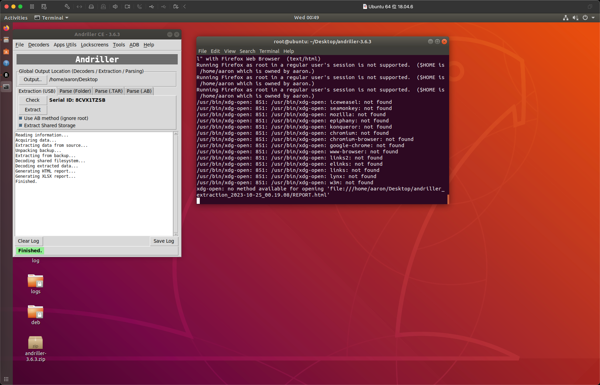

分析完成后，我们将看到类似以下屏幕截图的屏幕：

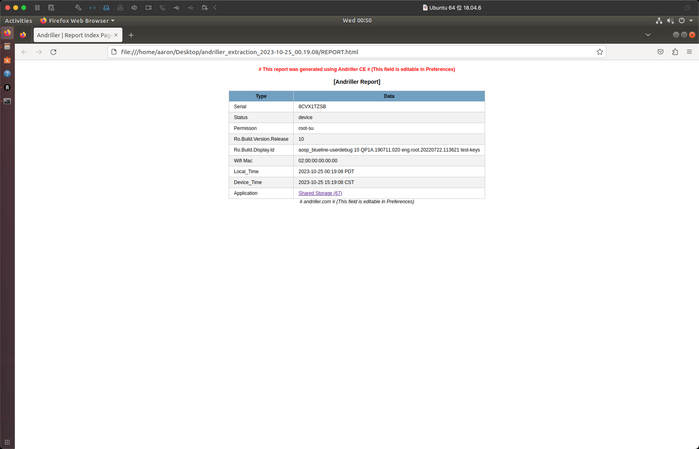

如果我们查看它为我们创建的 HTML 文件，它将显示一些关于设备的基本信息，如下面的屏幕截图所示。 它还在文件夹`db`下的同一文件夹目录中创建所有数据库的转储。

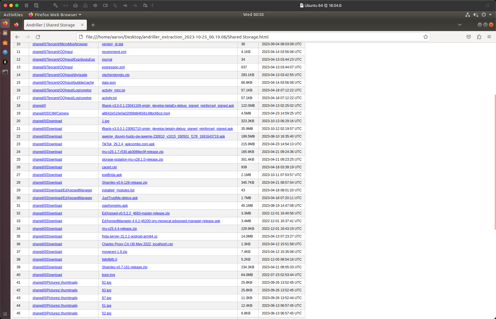

## 使用 AFLogical 提取所有联系人、通话记录和短信

AFLogical 是由 viaForensics 编写的工具，以便从设备创建逻辑采集并将结果呈现给取证员。它从设备中提取一些关键组件，包括短信，联系人和通话记录。

为了使用 AFLogical，我们需要从 GitHub 库`https://github.com/viaforensics/android-forensics`下载项目的源代码。下载后，我们可以将此项目导入我们的 Eclipse 工作区并进行构建。我们可以从我们现有的代码中访问`File | New | Other | Android | Android Project`，然后选择下载的源代码路径。

一旦我们将项目导入到我们的工作区，我们就可以在我们的设备上运行它，方法是右键单击项目并选择“运行为 Android 应用程序”。一旦我们运行它，我们将注意到，我们的设备上的`AFLogical`应用程序提供了选项来选择要提取什么信息。在以下屏幕截图中，你将看到 AFLogical 在设备上运行，并询问用户有关要提取的详细信息：

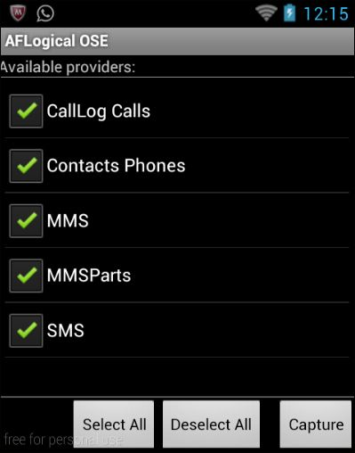

我们将检查所有东西，然后单击`Capture`。 AFLogical 将开始从不同来源捕获详细信息，并将捕获的详细信息保存在 SD 卡中的`csv`文件中。 捕获过程完成后，我们会注意到一个警告框。

我们现在可以查看我们的 SD 卡路径，我们可以找到保存的`.csv`文件。

然后我们可以在任何`.csv`文件查看器中打开这些`.csv`文件来查看详细信息。 因此，AFLogical 是一个快速有效的工具，用于从设备中提取一些信息，如联系人，通话记录和消息。

## 手动转储应用的数据库

既然我们已经看到，很多工具可以帮助我们进行取证，我们还可以使用`adb`和我们的手动技能从设备中提取一些信息。 正如我们之前学到的，应用程序文件存储在`/data/data/[应用程序的包名]/`位置。 由于大多数应用程序也使用数据库来存储数据，我们注意到在名为`directory`的包中有另一个名为`databases`的文件夹。 这里需要注意的一点是，这只会帮助我们从使用数据库的应用程序中提取信息，以便转储应用程序和其他相关信息。 在某些应用程序中，我们可能还会注意到，应用程序将数据存储在 XML 文件中或使用共享首选项，我们需要手动审计它们。

Android 使用 SQLite 数据库（我们将在下一章深入讨论）与`.db`文件格式。 下面是手动提取所有数据库的步骤：

- 进入设备，并创建一个文件夹来存储所有数据库
- 查找所有`.db`文件并将其复制到创建的文件夹
- 压缩文件夹并拉取它

因此，我们可以使用`adb shell`查找`/data/data/location`中的所有数据库文件，将它们压缩到归档文件中，然后将其拉取出来。

1. 在 SD 卡中创建一个名为`BackupDBS`的文件夹

2. 为此，我们可以简单地执行`adb shell`，然后在`/mnt/sdcard`下创建一个名为`BackupDBS`的文件夹：

   ```shell
   adb shell 
   mkdir /mnt/sdcard/BackupDBS
   ```

3. 查找所有`.db`文件并将其复制到`BackupDBS`

4. 为此，我们可以使用一个简单的命令行绝技来查找和复制`/data/data`中的所有`.db`文件。 我们首先使用`find`命令查找所有`.db`文件。 在以下命令中，我们使用`find`工具，并指定从当前位置搜索，然后查找具有任何文件名（通配符`*`）以及扩展名`db`的所有文件（即`*.db`），以及类型为文件`f`。

   ```shell
   find . -name "*.db" -type f
   ```

   下面的截图展示了输出：

   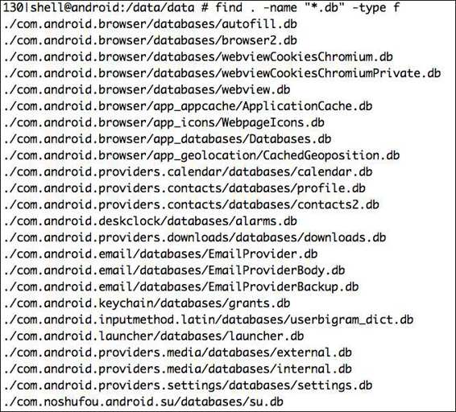

5. 现在，我们可以简单地使用`cp`和`find`，以便将其复制到`BackupDBS`目录

   ```shell
   find . -name "*.db" -type f -exec  cp {} /mnt/sdcard/BackupDBS \;
   ```

6. 现在，如果我们查看`/mnt/sdcard`下的`BackupDBS`目录，我们的所有数据库都已成功复制到此位置。

   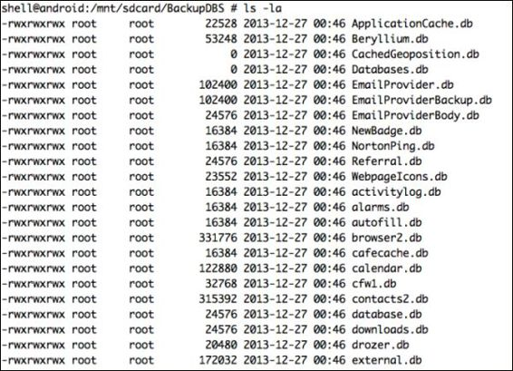

7. 压缩并拉取文件。 现在，在同一位置，我们可以使用`tar`工具创建一个压缩包，并使用`adb pull`。

   ```shell
   tar cvf backups.tar BackupDBS/
   ```

8. 然后，从系统中，我们可以简单地像这样拉取它。 此方法也可以用于通过在`/data/app`和`/data/app-private`文件夹中查找文件类型`.apk`，来从手机中拉取所有`.apk`文件。

9. 如果我们仔细看一看，在我们的`backups.tar`中，还有一个名为`msgstore.db`的 WhatsApp 应用程序的数据库。 让我们继续分析和研究数据库内部的内容。 为此，我们需要首先解压我们刚才拉取的`tar`归档文件。

   ```shell
   tar -xvf backups.tar
   ```

10. 现在，为了分析名为`msgstore.db`的 WhatsApp 的 SQLite 数据库，我们可以下载并使用任何 SQLite 浏览器。 对于本书，我们使用 SQLite 数据库浏览器，可以从`http://sourceforge.net/projects/sqlitebrowser/`下载。

11. 现在，如果我们在 SQLite 数据库浏览器中打开`msgstore.db`文件并访问浏览器数据，我们可以在 SQLite 浏览器中看到我们的所有 WhatsApp 对话。 在以下截图中，我们可以看到在 SQLite 数据库浏览器中打开的`msgstore.db`，它显示 WhatsApp 应用程序的所有聊天对话：

    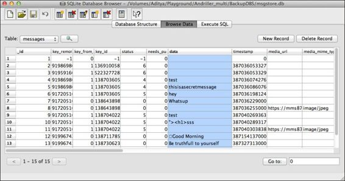