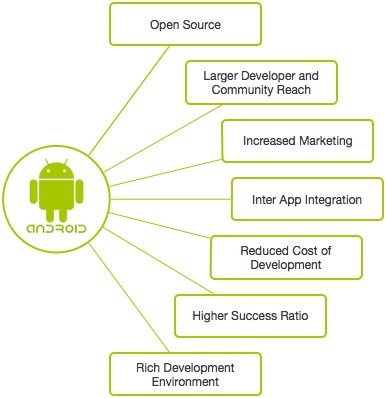
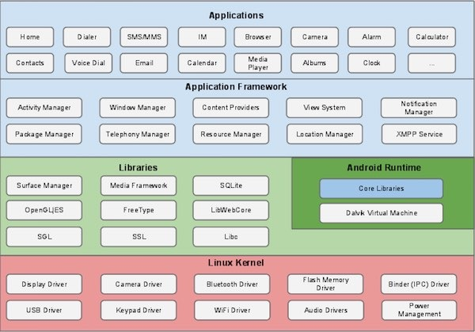
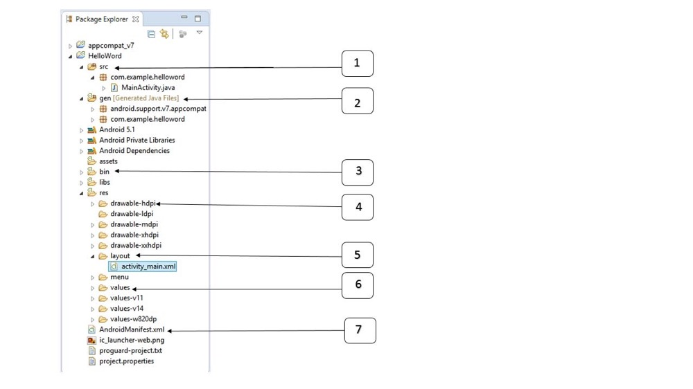

## 介绍
Android 是一个开源的，基于 Linux 的移动设备操作系统，如智能手机和平板电脑。Android 是由谷歌及其他公司带领的开放手机联盟开发的。 
Android 提供了一个统一的应用程序开发方法，这意味着开发人员只需要为 Android 进行开发，这样他们的应用程序就能够运行在不同搭载 Android 的移动设备上。 
谷歌在2007年发布了第一个测试版本的 Android 软件开发工具包（SDK），第一个商业版本的 Android 1.0，则发布于2008年9月。 
2012年6月27日，在谷歌I/O大会上，谷歌宣布发布了 Android 版本4.1 Jelly Bean。 Jelly Bean 是一个在功能和性能方面的渐进的更新，主要目的是改进用户界面， 
Android 源代码是根据自由和开放源码软件许可证。谷歌发布的大部分代码遵循 Apache 许可证2.0版，Linux 内核的变化遵循 GNU 通用公共许可证版本2。 
### Android 开发优势

- 开放源代码
- 众多开发者及强大的社区
- 不断增长的市场
- 国际化的 App 集成
- 低廉的开发成本
- 更高的成功几率
- 丰富的开发环境


### Android 应用程序
Android 应用程序一般使用 Android 软件开发工具包，采用 Java 语言来开发。
一旦开发完成，Android 应用程序可以容易的打包，并在诸如 Google Play 和亚马逊应用商店上出售。
## 架构 
Android 操作系统是一个软件组件的栈，在架构图中它大致可以分为五个部分和四个主要层。


### Linux 内核
在所有层的最底下是 Linux - 包括大约115个补丁的 Linux 3.6。它提供了基本的系统功能，比如进程管理，内存管理，设备管理（如摄像头，键盘，显示器）。同时，内核处理所有 Linux 所擅长的工作，如网络和大量的设备驱动，从而避免兼容大量外围硬件接口带来的不便。
### 程序库
在 Linux 内核层的上面是一系列程序库的集合，包括开源的 Web 浏览器引擎 Webkit ，知名的 libc 库，用于仓库存储和应用数据共享的 SQLite 数据库，用于播放、录制音视频的库，用于网络安全的 SSL 库等。
### Android程序库
这个类别包括了专门为 Android 开发的基于 Java 的程序库。这个类别程序库的示例包括应用程序框架库，如用户界面构建，图形绘制和数据库访问。一些 Android 开发者可用的 Android 核心程序库总结如下：

- android.app - 提供应用程序模型的访问，是所有 Android 应用程序的基石。
- android.content - 方便应用程序之间，应用程序组件之间的内容访问，发布，消息传递。
- android.database - 用于访问内容提供者发布的数据，包含 SQLite 数据库管理类。
- android.opengl - OpenGL ES 3D 图片渲染 API 的 Java 接口。
- android.os - 提供应用程序访问标注操作系统服务的能力，包括消息，系统服务和进程间通信。
- android.text - 在设备显示上渲染和操作文本。
- android.view - 应用程序用户界面的基础构建块。
- android.widget - 丰富的预置用户界面组件集合，包括按钮，标签，列表，布局管理，单选按钮等。
- android.webkit - 一系列类的集合，允许为应用程序提供内建的 Web 浏览能力。
### Android运行时
这是架构中的第三部分，自下而上的第二层。这个部分提供名为 Dalvik 虚拟机的关键组件，类似于 Java 虚拟机，但专门为 Android 设计和优化。
Dalvik 虚拟机使得可以在 Java 中使用 Linux 核心功能，如内存管理和多线程。Dalvik 虚拟机使得每一个 Android 应用程序运行在自己独立的虚拟机进程。
Android 运行时同时提供一系列核心的库来为 Android 应用程序开发者使用标准的 Java 语言来编写 Android 应用程序。
### 应用框架
应用框架层以 Java 类的形式为应用程序提供许多高级的服务。应用程序开发者被允许在应用中使用这些服务。

- 活动管理者 - 控制应用程序生命周期和活动栈的所有方面。
- 内容提供者 - 允许应用程序之间发布和分享数据。
- 资源管理器 - 提供对非代码嵌入资源的访问，如字符串，颜色设置和用户界面布局。
- 通知管理器 - 允许应用程序显示对话框或者通知给用户。
- 视图系统 - 一个可扩展的视图集合，用于创建应用程序用户界面。
### 应用程序
顶层中有所有的 Android 应用程序。你写的应用程序也将被安装在这层。这些应用程序包括通讯录，浏览器，游戏等。
## Android 应用程序组件
应用程序组件是一个Android应用程序的基本构建块。这些组件由应用清单文件松耦合的组织。AndroidManifest.xml描述了应用程序的每个组件，以及他们如何交互。
以下是可以在Android应用程序中使用的四个主要组件。

| 组件 | 描述 |
| --- | --- |
| Activities | 描述UI，并且处理用户与机器屏幕的交互。 |
| Services | 处理与应用程序关联的后台操作。 |
| Broadcast Receivers | 处理Android操作系统和应用程序之间的通信。 |
| Content Providers | 处理数据和数据库管理方面的问题。 |

### Activities
一个活动标识一个具有用户界面的单一屏幕。举个例子，一个邮件应用程序可以包含一个活动用于显示新邮件列表，另一个活动用来编写邮件，再一个活动来阅读邮件。当应用程序拥有多于一个活动，其中的一个会被标记为当应用程序启动的时候显示。
一个活动是**Activity**类的一个子类，如下所示：
```java
public class MainActivity extends Activity {
    
}
```
### Services
服务是运行在后台，执行长时间操作的组件。举个例子，服务可以是用户在使用不同的程序时在后台播放音乐，或者在活动中通过网络获取数据但不阻塞用户交互。
一个服务是**Service**类的子类，如下所示：
```java
public class MyServices extends Services{

}
```
### Broadcast Receivers
广播接收器简单地响应从其他应用程序或者系统发来的广播消息。举个例子，应用程序可以发起广播来让其他应用程序知道一些数据已经被下载到设备，并且可以供他们使用。因此广播接收器会拦截这些通信并采取适当的行动。
广播接收器是**BroadcastReceiver**类的一个子类，每个消息以**Intent**对象的形式来广播。
```java
public class MyReceiver  extends  BroadcastReceiver {

}
```
### Content Providers
内容提供者组件通过请求从一个应用程序到另一个应用程序提供数据。这些请求由**ContentResolver**类的方法来处理。这些数据可以是存储在文件系统、数据库或者其他其他地方。
内容提供者是**ContentProvider**类的子类，并实现一套标准的API，以便其他应用程序来执行事务。
```java
public class MyContentProvider extends  ContentProvider {

}
```
### 附加组件
有一些附件的组件用于以上提到的实体、他们之间逻辑、及他们之间连线的构造。这些组件如下：

| 组件 | 描述 |  |
| --- | --- | --- |
| Fragments | 代表活动中的一个行为或者一部分用户界面。 |  |
| Views | 绘制在屏幕上的UI元素，包括按钮，列表等。 |  |
| Layouts | 控制屏幕格式，展示视图外观的View的继承。 |  |
| Intents | 组件间的消息连线。 | 组件间的消息连线。 |
| Resources | 外部元素，例如字符串资源、常量资源及图片资源等。 |  |
| Manifest | 应用程序的配置文件。 |  |

## Android 项目目录结构


| 序号 | 文件夹、文件和说明 |
| --- | --- |
| 1 | src:包含项目中所有的.java源文件，默认情况下，它包括一个 MainActivity.java源文件对应的活动类，当应用程序通过应用图标启动时，将运行它。 |
| 2 | gen:这包含由编译器生成的.R文件，引用了所有项目中的资源。该文件不能被修改。 |
| 3 | bin:这个文件夹包含Android由APT构建的.apk包文件，以及运行Android应用程序所需要的其他所有东西。 |
| 4 | res/drawable-hdpi:这个目录下包括所有的为高密度屏幕设计所需的drawable对象。 |
| 5 | res/layout:这个目录存放用于定义用户界面的文件。 |
| 6 | res/values:这个目录存放各种各样的包含一系列资源的XML文件，比如字符串和颜色的定义。 |
| 7 | AndroidManifest.xml:这个是应用程序的清单文件，描述了应用程序的基础特性，定义它的各种组件。 |

### 主要活动文件（MainActivity.java）
主要活动代码在MainActivity.java文件，这是实际的应用程序文件，将被转化为Dalvik可执行文件并运行。
```java
package com.example.helloworld;

import android.os.Bundle;
import android.app.Activity;
import android.view.Menu;
import android.view.MenuItem;
import android.support.v4.app.NavUtils;

public class MainActivity extends Activity {

   @Override
   public void onCreate(Bundle savedInstanceState) {
      super.onCreate(savedInstanceState);
      setContentView(R.layout.activity_main);
   }

   @Override
   public boolean onCreateOptionsMenu(Menu menu) {
      getMenuInflater().inflate(R.menu.activity_main, menu);
      return true;
   }
}
```
> 这里，R.layout.activity_main引用自res/layout目录下的activity_main.xml文件。onCreate()是活动被加载之后众多被调用的方法之一。

### Manifest文件
无论开发什么组件用作应用程序中的一部分，都需要在应用程序项目根目录下的manifest.xml文件中声明所有的组件。这个文件是Android操作系统与你的应用程序之间的接口，因此，如果没有在这个文件中声明你的组件，将无法被操作系统所识别。举个例子，一个默认的清单文件看起来如下：
```xml
<manifest xmlns:android="http://schemas.android.com/apk/res/android"
   package="com.example.helloworld"
   android:versionCode="1"
   android:versionName="1.0" >

   <uses-sdk
      android:minSdkVersion="8"
      android:targetSdkVersion="22" />

   <application
       android:icon="@drawable/ic_launcher"
       android:label="@string/app_name"
       android:theme="@style/AppTheme" >

       <activity
          android:name=".MainActivity"
          android:label="@string/title_activity_main" >

          <intent-filter>
             <action android:name="android.intent.action.MAIN" />
             <category android:name="android.intent.category.LAUNCHER"/>
          </intent-filter>

       </activity>

   </application>
</manifest>
```
这里，...标签之间是应用程序相关的组件。andnroid:icon属性指出位于res/drawable-hdpi下面的应用程序图标。这个应用使用drawable文件夹下名为ic_launcher.png的图片。
标签用于指定一个活动，android:name属性指定一个Activity类子类的全名。android:label属性指定用于活动名称的字符串。可以使用标签来指定多个活动
意图过滤器的action被命名为android.intent.action.MAIN，表明这个活动被用做应用程序的入口。意图过滤器的category被命名为android.intent.category.LAUNCHER，表明应用程序可以通过设备启动器的图标来启动。
@string指的是strings.xml(将在后面介绍)。因此，@string/app_name指的是定义在strings.xml中的app_name，实际为"Hello World"。类似的，应用中的其他字符串也很流行。
下面是你的清单文件中将用到的标签，用于指定不同的Android应用程序组件：

-  活动元素
-  服务元素
-  广播接收器元素
-  内容提供者元素
### Strings 文件
strings.xml文件在res/value文件夹下，它包含应用程序使用到的所有文本。例如，按钮、标签的名称，默认文本，以及其他相似的strings。这个文件为他们的文本内容负责。一个默认的strings文件看起来如下：
```java
<resources>
   <string name="app_name">HelloWorld</string>
   <string name="hello_world">Hello world!</string>
   <string name="menu_settings">Settings</string>
   <string name="title_activity_main">MainActivity</string>
</resources>
```
### R 文件
gen/com.example.helloworld/R.java文件是活动的Java文件，如MainActivity.java的和资源如strings.xml之间的胶水。这是一个自动生成的文件，不要修改R.java文件的内容。下面是一个R.java文件的示例：
```java
/* AUTO-GENERATED FILE.  DO NOT MODIFY.
 *
 * This class was automatically generated by the
 * aapt tool from the resource data it found.  It
 * should not be modified by hand.
 */

package com.example.helloworld;

public final class R {
   public static final class attr {
   }

   public static final class dimen {
      public static final int padding_large=0x7f040002;
      public static final int padding_medium=0x7f040001;
      public static final int padding_small=0x7f040000;
   }

   public static final class drawable {
      public static final int ic_action_search=0x7f020000;
      public static final int ic_launcher=0x7f020001;
   }

   public static final class id {
      public static final int menu_settings=0x7f080000;
   }

   public static final class layout {
      public static final int activity_main=0x7f030000;
   }

   public static final class menu {
      public static final int activity_main=0x7f070000;
   }

   public static final class string {
      public static final int app_name=0x7f050000;
      public static final int hello_world=0x7f050001;
      public static final int menu_settings=0x7f050002;
      public static final int title_activity_main=0x7f050003;
   }

   public static final class style {
      public static final int AppTheme=0x7f060000;
   }
}
```
### Layout 文件
activity_main.xml是一个在res/layout目录下的layout文件。当应用程序构建它的界面时被引用。你将非常频繁的修改这个文件来改变应用程序的布局。在"Hello World"应用程序中，这个文件具有默认的布局，内容如下：
```java
<RelativeLayout xmlns:android="http://schemas.android.com/apk/res/android"
    xmlns:tools="http://schemas.android.com/tools"
    android:layout_width="match_parent"
    android:layout_height="match_parent" >

    <TextView
    android:layout_width="wrap_content"
    android:layout_height="wrap_content"
    android:layout_centerHorizontal="true"
    android:layout_centerVertical="true"
    android:padding="@dimen/padding_medium"
    android:text="@string/hello_world"a
    tools:context=".MainActivity" />

    </RelativeLayout>
```
TextView是一个Android的控件用于构建用户图形界面。它包含有许多不同的属性，诸如android:layout_width, android:layout_height等用来设置它的宽度和高度等。@string指的是res/values文件夹下的strings.xml文件。因此，@string/hello_world指的是定义在strings.xml中的名为hello的字符串："Hello World!"。
## Android 资源（Resources）访问
有许多东西用来构建一个优秀的 Android 应用程序。除了应用程序的编码，你需要关注各种各样的资源，诸如你用到的各种静态内容，如位图，颜色，布局定义，用户界面字符串，动画等等。这些资源一般放置在项目的 res/ 下独立子目录中。
这节教程将学习如何来组织应用程序资源，指定替代资源，并在应用程序中访问它们。
### 组织资源
开发之前需要将每种资源放置在项目中 res/ 目录的特定子目录下。例如，这是一个简单项目的文件层级
```java
MyProject/
    src/  
        MyActivity.java  
    res/
        drawable/  
            icon.png  
        layout/  
            activity_main.xml
            info.xml
        values/  
            strings.xml 
```
res/ 目录在各种子目录中包含了所有的资源。这里有一个图片资源，两个布局资源和一个字符串资源文件。下表详细的给出了在项目中 res/ 目录里面支持的资源。

| 目录 | 资源类型 |
| --- | --- |
| anim/ | 定义动画属性的XML文件。它们被保存在res/anim/文件夹下，通过R.anim类访问 |
| color/ | 定义颜色状态列表的XML文件。它们被保存在res/color/文件夹下，通过R.color类访问 |
| drawable/ | 图片文件，如.png,.jpg,.gif或者XML文件，被编译为位图、状态列表、形状、动画图片。它们被保存在res/drawable/文件夹下，通过R.drawable类访问 |
| layout/ | 定义用户界面布局的XML文件。它们被保存在res/layout/文件夹下，通过R.layout类访问 |
| menu/ | 定义应用程序菜单的XML文件，如选项菜单，上下文菜单，子菜单等。它们被保存在res/menu/文件夹下，通过R.menu类访问 |
| raw/ | 任意的文件以它们的原始形式保存。需要根据名为R.raw.filename的资源ID，通过调用Resource.openRawResource()来打开raw文件 |
| values/ | 包含简单值(如字符串，整数，颜色等)的XML文件。这里有一些文件夹下的资源命名规范。arrays.xml代表数组资源，通过R.array类访问；integers.xml代表整数资源，通过R.integer类访问；bools.xml代表布尔值资源，通过R.bool类访问；colors.xml代表颜色资源，通过R.color类访问；dimens.xml代表维度值，通过R.dimen类访问；strings.xml代表字符串资源，通过R.string类访问；styles.xml代表样式资源，通过R.style类访问 |
| xml/ | 可以通过调用Resources.getXML()来在运行时读取任意的XML文件。可以在这里保存运行时使用的各种配置文件 |

## adb 导出一个app
0x1 找到对应的app
```shell
╭─[aaronluo@localhost]-[~]
╰─➤ adb shell am monitor
Monitoring activity manager...  available commands:
(q)uit: finish monitoring
** Activity starting: com.oppo.launcher
** Activity starting: com.android.mms
** Activity starting: com.android.mms
** ERROR: PROCESS CRASHED
processName: com.nsfocus.softkeyboard
processPid: 12273
```
0x2 查看包存放的路径
```shell
╭─[aaronluo@localhost]-[~]
╰─➤ adb shell pm path com.nsfocus.softkeyboard
package:/data/app/com.nsfocus.softkeyboard-1/base.apk
```
0x3 导出
```shell
╭─[aaronluo@localhost]-[~/Desktop]
╰─➤ adb pull /data/app/com.nsfocus.softkeyboard-1/base.apk
/data/app/com.nsfocus.softkeyboard-1/base.apk: 1 file pulled, 0 skipped. 1.4 MB/s (35164 bytes in 0.024s)
```
