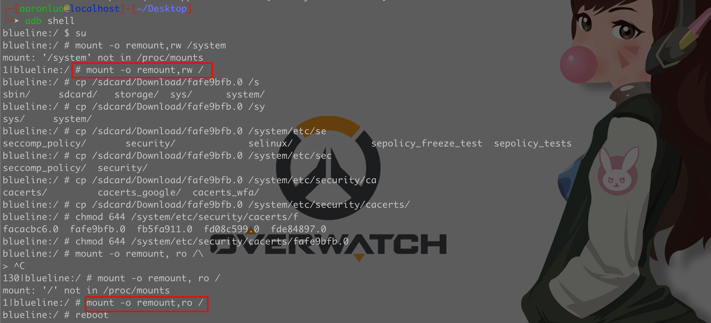

这里使用公司的小米6做为测试机型
## 安卓手机相关科普
### 基本分区
#### BootLoader（fastboot）
Android 系统虽然也是基于 Linux 系统的，但是由于 Android 属于嵌入式设备，并没有像 PC 那样的 BIOS 程序。 取而代之的是 Bootloader —— 系统启动加载器。
一旦bootloader分区出了问题，手机变砖就很难救回了。除非借由高通9008或者MTK-Flashtool之类更加底层的模式来救砖。
一般刷机不动这个分区。
#### recovery
用于存放recovery恢复模式的分区，刷机、root必须要动的分区。里面有一套linux内核，但并不是安卓系统里的那个，相当于一个小pe的存在。现阶段的刷机、root基本都要用第三方rec来覆盖官方rec。
#### boot
引导分区，虽然说是引导，但实际是在bootloader之后，与recovery同级的启动顺序。里面装了安卓的linux内核相关的东西，magisk就是修改了这部分程序，实现的root权限的获取。
#### userdata（/Data）
用户数据分区，被挂载到/data路径下。内置存储器（内置存储卡）实际也存在这个分区里，用户安装的apk、app的数据都在这个分区。目前主流安卓版本中data分区通过fuse进行了强制加密，密码一般都是屏锁密码，且加密的data分区未必能在recovery下成功解密，所以有时刷机需要清除整个data分区。
#### cache
缓存分区，一般用于OTA升级进入recovery前，临时放置OTA升级包以及保存OTA升级的一些临时输出文件。
### 安卓系统启动流程


一般来说，安卓系统的刷机都是在fastboot和recovery进行的，因为此时安卓系统本身还没有启动，直接无视各种权限进行操作。
fastboot通常又被叫做线刷模式，PC端通过fastboot程序直接向手机刷写分区镜像文件，fastboot无法进行更加细致的操作，一刷就是整个分区，而不能对某个、某些文件进行特定的修改。
recovery模式下可以刷入带有脚本的zip包，可以实现对系统的增量修补，修改特定文件等更细致、强大的功能，但问题在于官方的recovery拥有签名校验，非官方的zip包无法通过官方的recovery刷入，于是我们需要刷入第三方的recovery来运行非官方签名的刷机包的刷入。于是我们就需要在fastboot下刷入第三方的recovery。
但是，fastboot的刷入也有限制，未解锁的fastboot（也就是bootloader锁、bl锁）不允许刷入非官方签名过的img镜像，所以我们需要对bootloader进行解锁，国内允许解锁bl锁的厂商就只有小米了，所以像搞机得用小米的机子。
通过解锁bootloader来刷入第三方的recovery，再通过第三方的recovery来刷入第三方的刷机包（如magisk或是其它的系统)达到直接或间接修改boot、system等分区的文件，这就是刷机的真谛。
其中Magisk作用于boot.img的阶段。Magisk的安装实际是将boot分区导出然后进行patche后再重新刷入。magisk通过直接修改boot.img中的linux内核相关文件实现了root权限的获取，也是由于其在很靠前的位置，可以通过在system分区挂载时，额外挂载分区、文件、目录来实现对系统文件的替换、修改而不修改原始文件。

### 开发者模式
开发者模式是安卓给安卓开发人员提供的高级调试，以小米6为例子，打开开发者模式
点击`设置`->`我的设备`->`全部参数`
多次点击`MIUI版本`，当出现您已处于“开发者模式，无需进行此操作”即表示已进入开发者模式


在`设置`->`更多设置`->`开发者选项`->`开启开发者选项`
点击开启开发者选项，即表示已开启开发者选项


### 解锁bootloader
用于解锁小米手机的bootloader的工具包，如果你的手机有bl锁就需要进行解锁。
bl锁解锁教程见“小米、红米手机解锁bootloader”
下载地址：[http://www.miui.com/unlock/download.html](http://www.miui.com/unlock/download.html)

1. 在需要解锁的设备中登录已经具备解锁权限的小米账号，并进入“设置 -> 开发者选项 -> 设备解锁状态”中绑定账号和设备；
2. 绑定成功后，手动进入Bootloader模式（关机后，同时按住开机键和音量下键）；
3. 下载手机解锁工具(解锁工具官网)，在PC端的小米解锁工具中，登录相同的小米账号，并通过USB连接手机；
4. 点击PC端解锁工具的“解锁”按钮，根据提示信息等待指定时间后再次尝试或者立即解锁； 

解锁Bootloader过程中可能遇到的问题Q：解锁工具提示“账号设备不一致”是怎么回事？
A：这是在解锁过程中没有通过账号与设备验证，解决办法是先将手机升级到最新的稳定版或者从稳定版卡刷到最新的开发版，在待解锁的设备和解锁工具上要登陆同一个账号，并进入“设置 -> 开发者选项 -> 设备解锁状态”中绑定账号和设备。
Q：解锁工具提示“无法获取手机信息”是怎么回事？
A：这种情况一般是电脑上的设备驱动没有装好，可以尝试重插USB线或者换个USB接口或者换根USB线来等待电脑慢慢安装驱动，或在工具右上角驱动安装模块中主动安装驱动。
Q：解锁失败显示“账号与设备的绑定时间太短，xxx个小时后再解锁”
A：在售的新机型一般需要等待，用户账号安全评分较低的需要等待，等待时间目前是7天起，如果本年度解锁手机数超过2台，等待时间会相应增长。
Q：解锁失败显示“此账号本月解锁次数达到上限”
A：一个小米账号每月限制解锁一台设备。
Q：解锁失败显示“此账号本年累计解锁次数已达上限”
A：一个小米账号每年限制解锁4台不同设备。
Q：解锁失败显示“账号权限不足或者账号受限”
A：账号存在安全风险，无法处理解锁操作，建议更换账号。
Q：解锁失败显示“未知错误-1”
A：网络异常，请更换时间段或更换网络进行解锁。
### 手机root
这里我选择的是先线刷一个稳定版本的包，然后曲线救国安装开发版本包
线刷：[http://www.miui.com/shuaji-393.html](http://www.miui.com/shuaji-393.html)
卡刷：[http://www.miui.com/shuaji-329.html](http://www.miui.com/shuaji-329.html)
其中线刷的时候千万不要上锁，上锁之后解锁很麻烦
卡刷在手动选择安装包的时候，也需要手工开启
点击`设置`->`我的设备`->`系统更新`，多次点击logo，再点右上角的三个点（更多），即可看到手动选择安装包


当刷上开发版本之后，在`授权管理`处，将手机root


## 刷入第三方Recovery
由于官方的recovery模式功能有限，且不允许刷入非官方签名的刷机包，于是我们需要刷入第三方recovery。
目前全球最大的主流第三方recovery是TWRP项目，其官网为[https://twrp.me/](https://twrp.me/)
### 下载TWRP Recovery
点击devices


选择xiaomi


选择机型


点击下载


下载后得到一个镜像文件


这个时候就已经准备好了recovery文件了

### 刷入recovery
**注：需要用到的fastboot.exe，在adb工具包里是有的**：[https://developer.android.com/studio/releases/platform-tools#downloads](https://developer.android.com/studio/releases/platform-tools#downloads)


手动进入Bootloader模式（关机后，同时按住开机键和音量下键)，通过数据线连接到电脑。
通过cmd或powershell打开fastboot工具

```shell
# 查看已连接的设备
fastboot.exe devices 
# 刷入下载好的文件 
fastboot.exe flash recovery recovery.img
```
其命令原型为 fastboot flash [要刷入的分区] [要刷入的镜像文件]
**注意：这里一定要注意手机一定要解开bootloader锁才能写入成功**


此时twrp已被刷入，但别急着重启，直接重启系统会导致系统将recovery还原，我们需要直接进入到twrp中。
先按下音量加和电源键，在手机屏幕熄灭时松开电源键，手机显示小米logo并震动时松开音量键，等待片刻即可进入recovery。

### 进入Recovery
**注：进入recovery的按键组合是音量加与电源键长按**
首次进入twrp时系统会提示是否修改系统分区，先去点击Change Language，将语言改成中文。然后将蓝色的条滑动到右侧，表示允许修改。
**图片引用一下**[**GLRpiz**](https://forum.butian.net/people/912)**师傅的图，我也是按照**[**GLRpiz**](https://forum.butian.net/people/912)**师傅的步骤一步一步做出来的**


## 刷入magisk
Magisk的官方下载连接在：[https://github.com/topjohnwu/Magisk](https://github.com/topjohnwu/Magisk)


下载后我们得到了Magisk-v23.0.apk文件

**注意：Magisk的apk安装包经过特殊处理，扩展名改为zip即为recovery下使用的刷机包，apk即为安卓使用的magisk管理app。**

### 刷入安装包
警告：以下操作将会清空手机内所有用户数据

将手机进入到TWRP Recovery下，通过数据线连接电脑，电脑此时会弹出一个MTP设备，我们会发现文件夹和文件都是乱码的，这是因为高版本安卓下整个Data分区使用了fuse作为强制加密，Recovery下无法将其解密。但是我们必须要通过某种渠道，将刷机包放在Recovery能够访问的路径中，此时有两种选择，OTG插U盘读取刷机包，或者直接格式化整个Data分区，此处使用后者

点击TWRP的清除按钮、选择格式化Data分区


成功后点击**重启按钮中的Recovery**，手机将重启到TWRP Recovery中，此时电脑中的MTP设备就会变成一个空设备，这时我们在将Magisk-v23.0.apk改名为Magisk-v23.0.**zip**复制到手机中，点击安装按钮刷入该刷机包。我们需要到/sdcard路径里去找这个包


选中后，滑动确认刷入，当出现done字样且控制台不再有输出，点击reboot system重启系统即可。
此时magisk应该以及成功装入到boot分区了

**注意：重启系统后，data分区将被安卓系统本身再次格式化、并进行强制加密。如果中间出了什么岔子，需要再到TWRP中刷入刷机包，需要再次手动格式化Data分区。**

### 启动Magisk
进入系统后会发现Magisk还需要进一步安装，此时需要将Magisk-v23.0.apk安装到手机中，之后Magisk会提示系统需要重启之类的，等待系统重启再次进入系统


## 安装Edxposed
安卓7以上就不支持xposed了，因为xposed没有去适配新系统，在这里我们使用开源的Edxposed
首先需要在Magisk上先安装`riru`，因为`riru-edxposed`依赖`Riru`，这里需要注意，`riru-Edxposed` 不支持`riru 26` 的版本，所以在这里需要在github上下载低一个版本的riru，比如V25版本，[https://github.com/RikkaApps/Riru/releases](https://github.com/RikkaApps/Riru/releases)


然后安装 justtrustme，这个justtrustme是无图形化的app，用于解决app内ssl证书校验的，简单来说，JustTrustMe 是将 APK 中所有用于校验 SSL 证书的 API 都进行了 Hook，从而绕过证书检查。

**那么这里就有疑问了，为什么不直接安装justtrustme？**

因为justtrustme依赖于xposed框架，它是xposed框架里支持的一个模块，而xposed框架需要root且magisk的支持
安装好了之后，在Edxposed框架->模块中，就会出现justtrustme的这个模块，然后重启一下，抓包测试


## 抓包测试
**注意，安装好模块且启用之后，需要重启**
**由于之前将Charles的根证书写到了/system/etc/security/cacerts,这里我将该证书关闭，使用Edxposed+justtrustme来抓包**


然后设置代理，在Charles中可以看到可以抓到weibo，支付宝


## ROOT后写入根证书
安卓7.0以后，安卓不信任用户安装的证书，所以抓https时无法解码请求，对于第三方应用，需要将证书添加为系统证书，比如使用安卓模拟器(兼容性差，很多应用闪退)，使用xposed框架等，这里再推荐一种添加系统证书的方法
注意：需要手机有root权限,以下操作以小米6为准,其他品牌手机操作可能有差别

### 导出证书（以Charles为准）
help --> SSL Proxying --> Save Charles Root Certificate...


### 制作安卓系统证书
将导出的证书计算hash值，并生成系统系统预设格式证书文件
```shell
//.cer格式证书
openssl x509 -inform DER -subject_hash_old -in 证书文件.cer
//.pem格式证书
openssl x509 -inform PEM -subject_hash_old -in 证书文件.pem

//cer格式
openssl x509 -inform DER -text -in xxx.cer > 43340bc0.0
//pem格式
openssl x509 -inform PEM -text -in xxx.pem > 43340bc0.0
```


最后编辑一下输出的文件，把 -----BEGIN CERTIFICATE----- 到最后的这部分移动到开头。结果如下


### 上传证书
```shell
adb push 43340bc0.0 /sdcard/Download
adb root shell
adb shell
mount -o remount,rw /system
cp /sdcard/Download/43340bc0.0 /system/etc/security/cacerts/
chmod 644 /system/etc/security/cacerts/43340bc0.0
mount -o remount,ro /system
```
**自己入手了一台测试机是Google的Pixel3，在挂载/system目录的时候会报错（自己刷的安卓9，boot.img 写入magisk）**


**这时，只需要挂根目录（/）就可以了**



最后一步必不可少，把拥有写权限的system目录更改为原设定为只可读，不然就会变砖
写进去之后，在系统证书中，就可以看到我们添加的证书了


安卓9以上需要先解锁verity

```shell
$ adb root
#restarting adbd as root
$ adb remount
#dm_verity is enabled on the system partition.
#Use "adb disable-verity" to disable verity.
#If you do not, remount may succeed, however, you will still not be able to write to these volumes.
remount succeeded
$ adb disable-verity
#Verity disabled on /system
#Now reboot your device for settings to take effect
$ adb reboot
$ adb root
#restarting adbd as root
$ adb remount
#remount succeeded
```

解锁后一样的流程

```shell
cd /data/local/tmp
cp 9a5ba575.0 /system/etc/security/cacerts/
cd /system/etc/security/cacerts
chmod 644 9a5ba575.0
reboot
```

然后，为了防止丢失ROOT，需要再次启用verity锁定

```shell
$ adb root
$ adb remount
#remount succeeded
$ adb enable-verity
$ adb reboot
$ adb root
$ adb remount
#remount disable
```


## 参考链接
[https://forum.butian.net/share/1068](https://forum.butian.net/share/1068)

[https://forum.butian.net/share/1069](https://forum.butian.net/share/1069)

[https://blog.csdn.net/weixin_31702225/article/details/117694829](https://blog.csdn.net/weixin_31702225/article/details/117694829)

