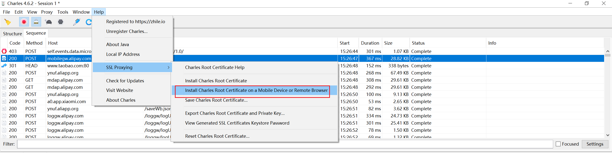
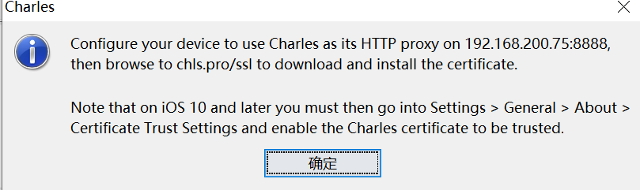
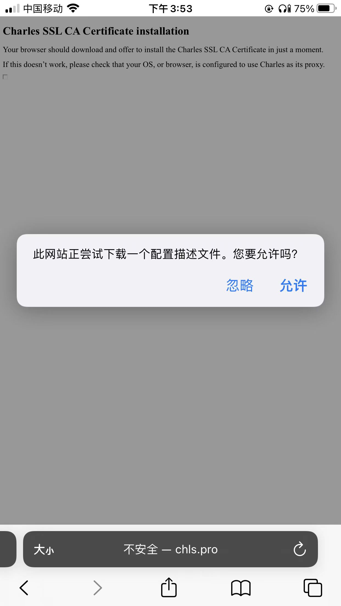
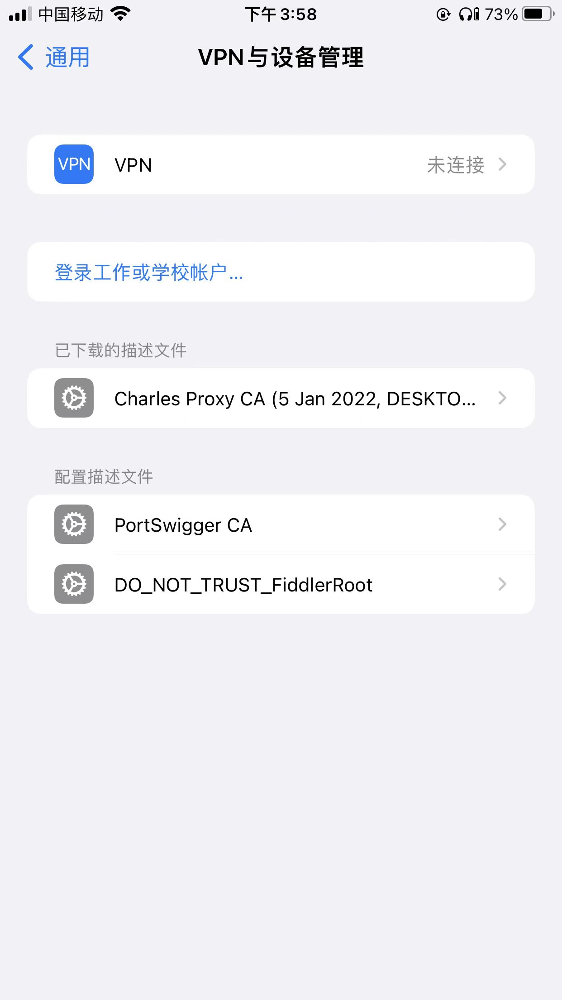
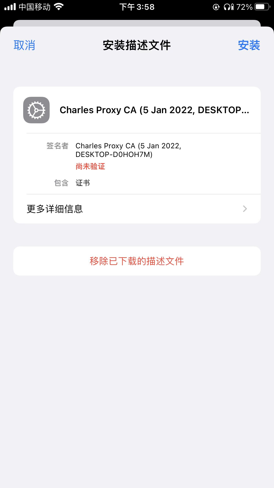
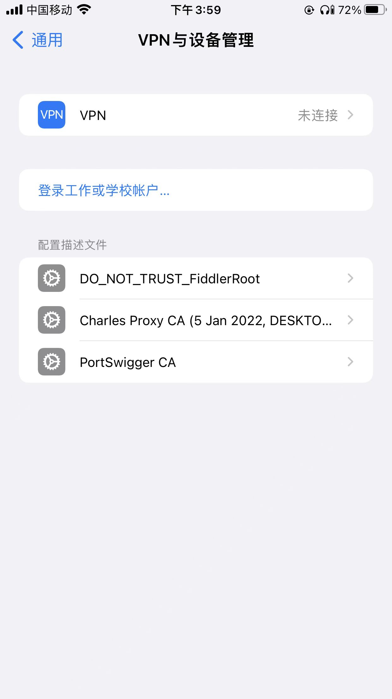
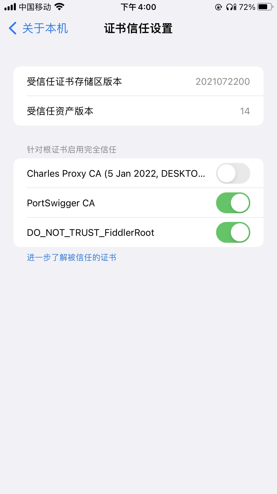
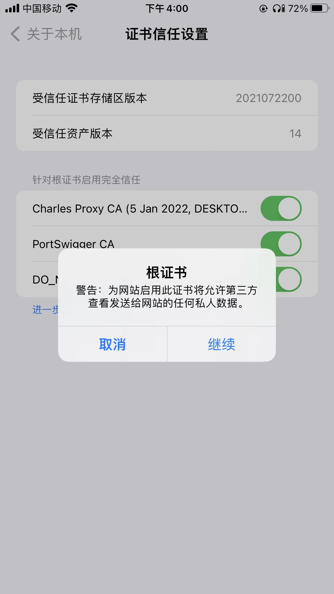
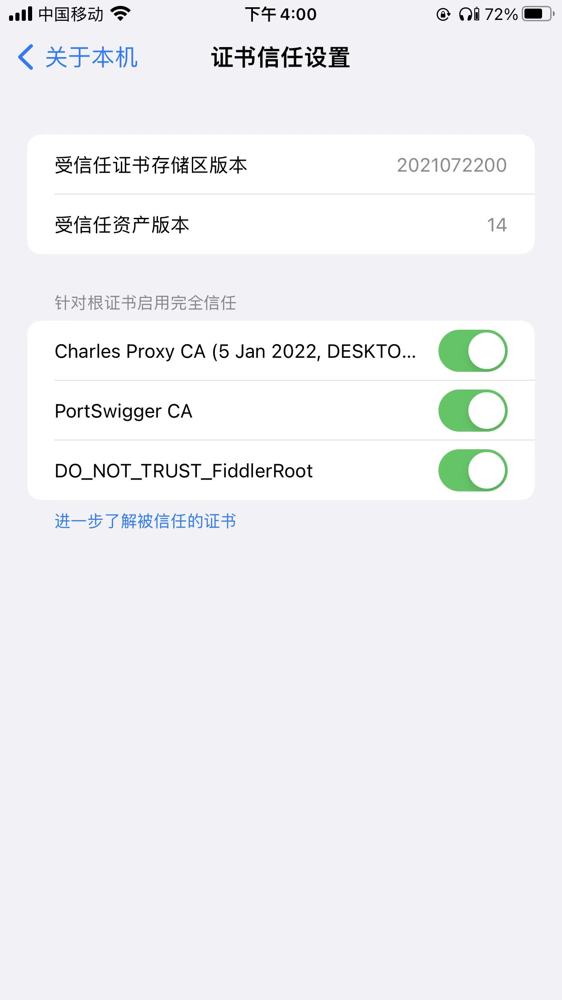
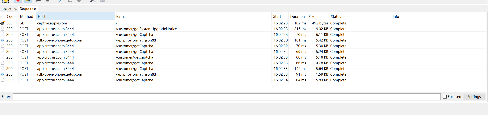

ios app 在没有SSL双向认证的情况下，是不用越狱就可以抓到https的，在这里使用Charles为例
## 移动设备下载证书
help --> SSL Proxying --> Install Charles Root Certificate on a Mobile Device Remote Browser..

首先配置好WiFi 代理，然后在**Safari**浏览器中输入chls.pro/ssl

## 安装证书

然后到设置->通用->VPN 与设备管理

点击Charles的证书，点击安装

## 信任证书
打开设置-通用-关于本机-证书信任设置，打开刚刚安装的证书开关

## 测试
app.crctrust.com:8444 这个app在安卓平台是okhttp框架，且ssl为双向认证，导致无法抓包，但是在ios上是可以抓包如下，这个项目也只做到了ios就到此为止了

