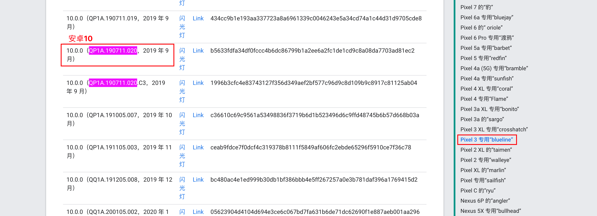
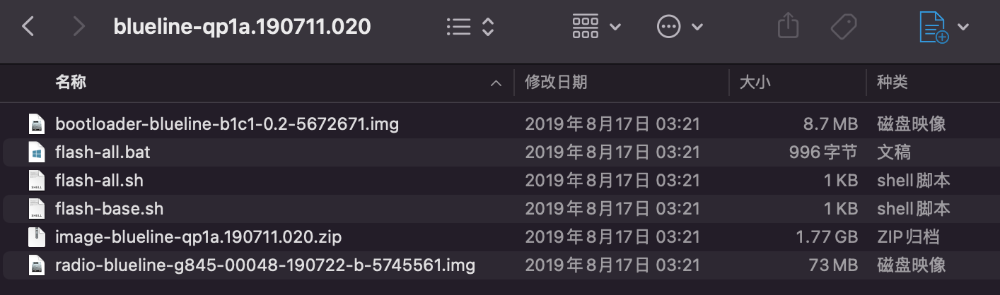
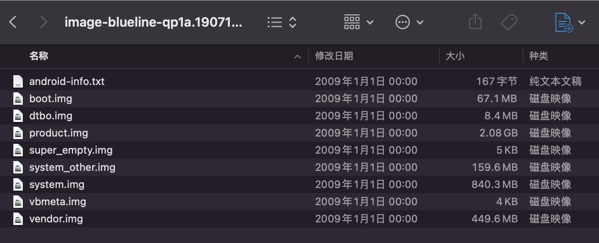
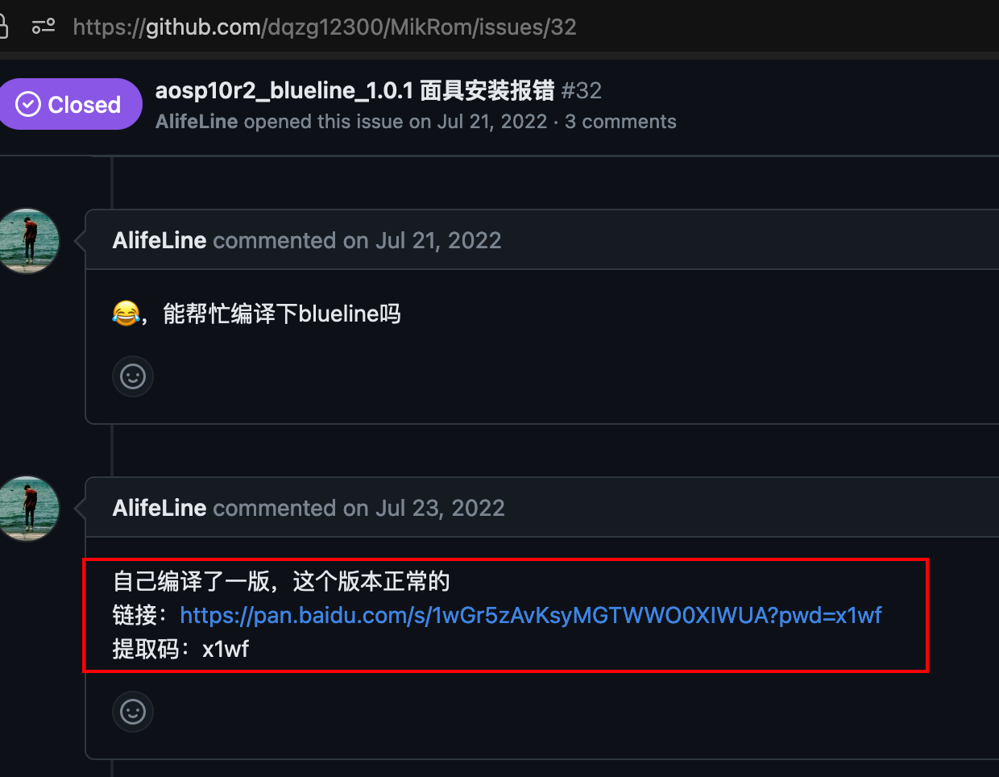
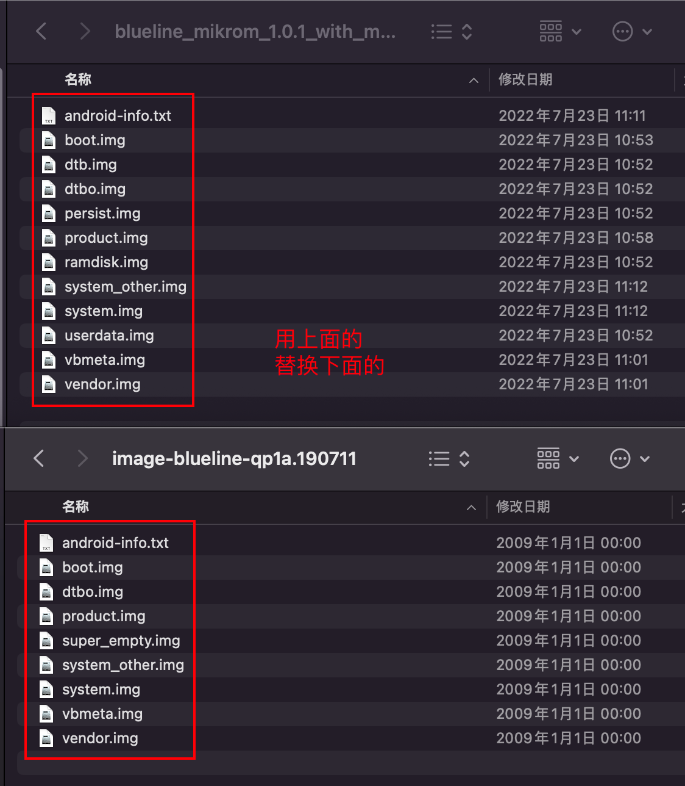
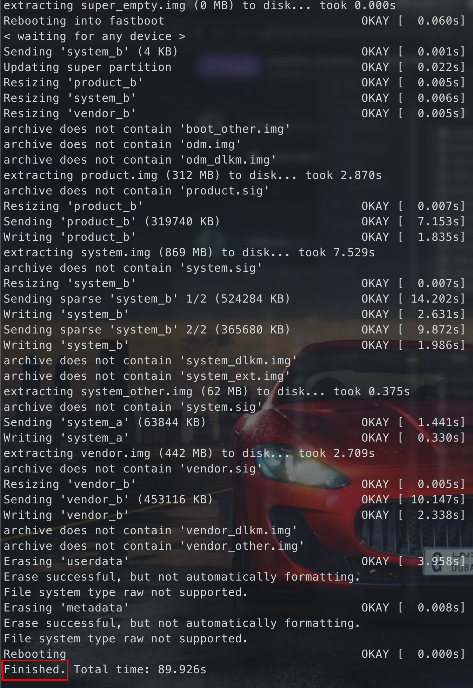
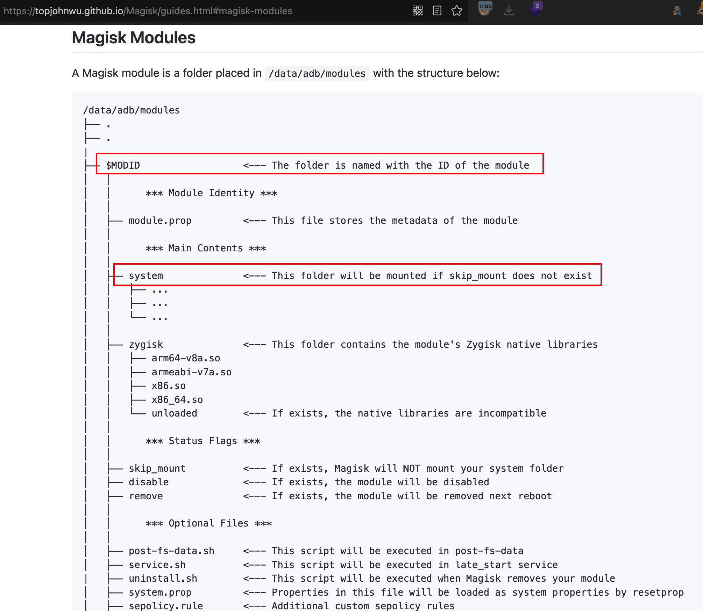
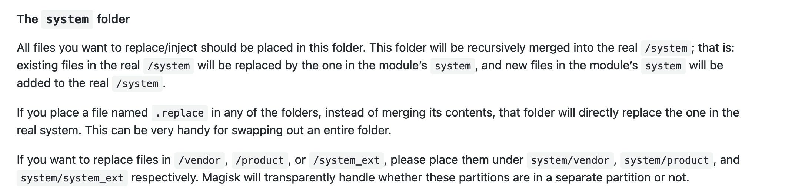
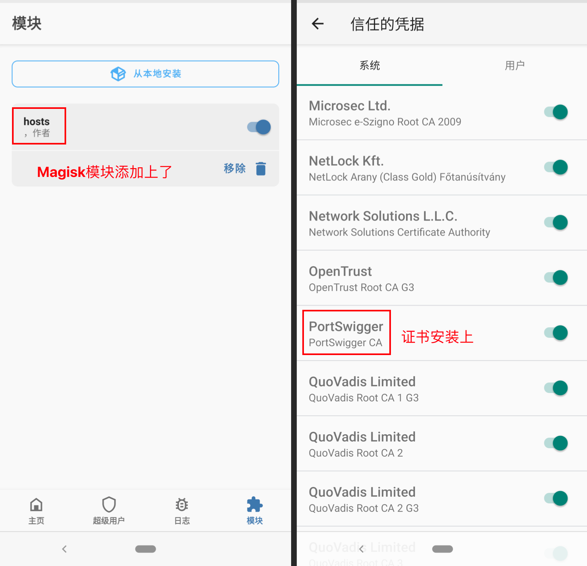

## 刷机前置信息

目的：脱壳

## 解锁BL

"解锁BL"通常是指解锁Android设备的Bootloader（引导程序）。Bootloader是Android设备的一部分，它是负责启动Android操作系统的程序。当设备的Bootloader被锁定时，用户将无法在设备上安装自定义操作系统或修改系统文件等。因此，解锁Bootloader可以让用户获得更高的设备控制权和更广泛的自定义选项，但也可能导致设备的保修失效或安全风险增加。

要确定Android设备的Bootloader（引导程序）是否已解锁，可以按照以下步骤操作：

1. 打开设备并进入“开发者选项”。如果你不知道如何打开开发者选项，请前往设备设置，然后找到“关于手机”或“关于平板电脑”，在其中找到“版本号”并连续点击7次，直到提示你已进入开发者选项。
2. 进入开发者选项后，在其中找到“**OEM解锁**”或“解锁引导程序”等选项，如果它是开启的，那么设备的Bootloader已经解锁。

## 开始刷机

先升级一下本地的ADB

```shell
brew upgrade android-platform-tools --cask
```

镜像下载地址：https://developers.google.cn/android/images?hl=zh-cn

> 小版本选`QP1A.190711.020`



点击“Link”开始下载，下载好后解压，大概长这个样



再解压`image-blueline-qp1a.190711.020.zip`这个压缩包



然后去[GitHub](https://github.com/dqzg12300/MikRom)下载专门拖壳镜像，主页选择自己合适的版本，我是pixel 3，就选blueline。

> 这里因为刷主页原来的ROM，magisk一直有问题，所以找了一个[偏方](https://github.com/dqzg12300/MikRom/issues/32)



解压新下载的，然后替换覆盖



替换后把`image-blueline-qp1a.190711.020`压缩回去

```shell
zip -r image-blueline-qp1a.190711.020.zip *
```

运行

```shell
adb reboot bootloader
fastboot flashing unlock
# 按下音量键，选择unlock

adb reboot fastboot
bash flash-all.sh
```



运行完出现`Finished.`就说明OK了，手机也会启动，到这刷机就OK了

## 安装管理界面

MikManager是一个rom逆向工具的管理界面。该软件用于对接MikRom来实现rom层面的逆向工具。仅仅提供界面化操作管理，并将用户需求保存为json数据，由MikRom解析后进行相应的执行，并导出结果到对应的目录。

```shell
wget https://github.com/dqzg12300/MikManager/releases/download/v1.0.1/mikmanager.apk
adb install -t mikmanager.apk
```

## ROM相关教程

参考[`GitHub`](https://github.com/dqzg12300/MikRom)

### 脱壳

1. 每次脱壳前记得删除原脱壳保留的`dump`目录
2. 正常脱壳，打开APP后会等待60秒才开始脱壳
3. 如果脱壳失败，或者脱壳太慢，可以选择白名单进行脱壳，出现`xxx_repair.dex`就说明是脱完了

### frida hook

```shell
pip3 install frida==15.1.11
pip3 install frida-tools==10.0.0
```


## 其他

### 安装Magisk

参考：https://blog.isteed.cc/post/pixel-3-install-magisk/

先安装好[Magisk apk](https://github.com/topjohnwu/Magisk/releases/tag/v25.2)

```shell
adb install Magisk-v25.2.apk
```

然后在刚才刷机ROM替换的文件中找到`boot.img`


传送`boot.img`文件到手机上

```shell
adb push boot.img /sdcard/Download/
```

再用Magisk修补这个文件

`Magisk Manager` - 安装 - 选择并修补一个文件 - 选择传到手机上的`boot.img`文件 - 开始


修补后拷贝到电脑上（如果拷贝到一半总断开，然后连不上设备，大概率是USB电源供电不足的问题，可以采用其他办法如通过ES文件浏览器开一个FTP来下载）

```shell
adb pull /sdcard/Download/magisk_patched-25200_5RDnr.img ./
```

进入`fastboot`模式

```shell
adb reboot bootloader
```

运行修补的img

```shell
fastboot boot magisk_patched-25200_5RDnr.img
```

然后会开机，拥有临时的 Magisk ，打开Magisk，选择安装，选择”直接安装“即可。


最后重启就OK了

> [!NOTE]
>
> 如果提示“检测到不属于Magisk的su文件”可以不管，不影响使用，这是因为ROM中自带了一个su。
>
> 本来想解决的，尝试用`adb disable-verity`再挂载也不行，放弃了，等到后期不得不改再想办法吧。

### 安装系统证书

> [!DANGER]
>
> 正常情况下，在Android7上通过[《移动端各种方式抓包》](/个人知识库/07.移动安全/06.移动端各种方式抓包/#android--7_1)就可以安装系统证书，但是这个ROM不行，尝试了`disable-verity`、`remount`等等都不行，查了好久的资料，最后还是通过`magisk`来成功安装证书。

在[Magisk官方介绍](https://topjohnwu.github.io/Magisk/guides.html#magisk-modules)中，可见magisk模块保存在`/data/adb/modules`里



且模块中的`system`目录下的内容会递归合并到真实的`system`目录下



所以我们直接将证书放到这个目录下就可以了，操作如下：

```shell
# 计算证书hash
openssl x509 -inform der -subject_hash_old -in cacert.der -noout
# 重命名为<hash>.0
mv cacert.der 9a5ba575.0
# 在magisk模块目录下创建对应的文件夹
adb root
adb shell "mkdir -p /data/adb/modules/hosts/system/etc/security/cacerts"
# 推送证书到对应的目录
adb push 9a5ba575.0 /data/adb/modules/hosts/system/etc/security/cacerts/
```

安装后在Magisk的模块应该就能看到了，重启后系统里面也会添加上对应的证书。



### 安装EdXposed

> [!TIP]
>
> `*posed`系列的东西不是很有必要，主要还是装了有解决不了的BUG，模块会提示“此模块因被安装在SD卡中而导致无法加载，请将其移动到内部存储”

参考GitHub: https://github.com/ElderDrivers/EdXposed/wiki/%E7%AE%80%E4%BB%8B

先下载 [`Riru`](https://github.com/RikkaApps/Riru/releases/tag/v25.4.4)、[`EdXposed`](https://github.com/ElderDrivers/EdXposed/releases)

> 注意：Riru要下载v25.4.4的，不然会有BUG，参考[issue](https://github.com/ElderDrivers/EdXposed/issues/878)

```shell
adb push riru-v25.4.4-release.zip /sdcard/Download/
adb push EdXposed-v0.5.2.2_4683-master-release.zip /sdcard/Download/
```

在Magisk管理端中从本地安装模块，先安装Riru，再安装EdXposed，最后重启，重启后在Magisk里面就可以看到刚才安装的模块了。

然后下载[`EdXposedManager`](https://github.com/ElderDrivers/EdXposedManager/releases)并安装

```shell
adb install EdXposedManager-4.6.2-46200-org.meowcat.edxposed.manager-release.apk
```

在面具中安装好对应的Riru版本，以及Riru-EdXposed模块之后


在对应的EdXposed 仲可以看到框架已被激活


但是当我们安装如JustTrustMe模块，会显示此模块因被安装在SD卡中而导致无法加载，请将其移动到内部存储中，试过搜索引擎提供的所有方法，包括ChatGPT，都告知需要将其存储更改为内部存储，但是该机器是无外置内存卡，只有一种可能就是在分区的时候给划分区域弄错了，但是可以不使用xposed框架吗，答案是可以的，但是每次都需要去hook SSL，不易持久化，所以尽量还是想想解决办法


最后在设置中，将关闭状态勾选上，重启EdXposed就可以使用模块了（一定要重启EdXposed app）


当勾选上JustTrustMe之后，重启手机即可使用


为什么我一定要用这个？

1. 因为持久化会比较方便
2. 其次为了解决一些简单的app的双向认证（frida也可以，但是每次都要动手操作，很麻烦），以及浏览器不信任证书的问题（主要是浏览器不信任burp、charles证书的问题）
3. 不想再折腾了，搞这个rom以及配置所有的环境遇到了各种各样的问题，最后得出结论，让其保持相对稳定即可

### ~~安装LSPosed~~

先下载[`Riru`](https://github.com/RikkaApps/Riru/releases/tag/v26.1.7)、[`LSPosed`](https://github.com/LSPosed/LSPosed/releases)

```shell
adb push riru-v26.1.7.r530.ab3086ec9f-release.zip /sdcard/Download/
adb push LSPosed-v1.8.6-6712-riru-release.zip /sdcard/Download/
```

在Magisk管理端中从本地安装模块，先安装Riru，再安装LSPosed，最后重启，重启后在Magisk里面就可以看到刚才安装的模块了。

在消息提示栏中就可以看到LSPosed的管理界面了。


### 模块推荐

* Magisk: 
    * https://github.com/Magisk-Modules-Repo

* EdXposed | LSPosed: 
    * https://github.com/Xposed-Modules-Repo
    * https://modules.lsposed.org/

### 时间校准的问题

在“设置 -> 系统 -> 时间”处，时区选择中国上海，也就是`GMT+08:00`

```shell
adb shell settings put global ntp_server ntp1.aliyun.com
adb reboot
```

### 手机投屏到PC

安装[scrcpy](https://github.com/Genymobile/scrcpy)进行屏幕镜像，安装过程记得挂代理，不然会很慢很慢，而且会经常失败。

```shell
brew install scrcpy
```

使用

```shell
scrcpy -h
scrcpy
```

可以在电脑上直接操作手机


