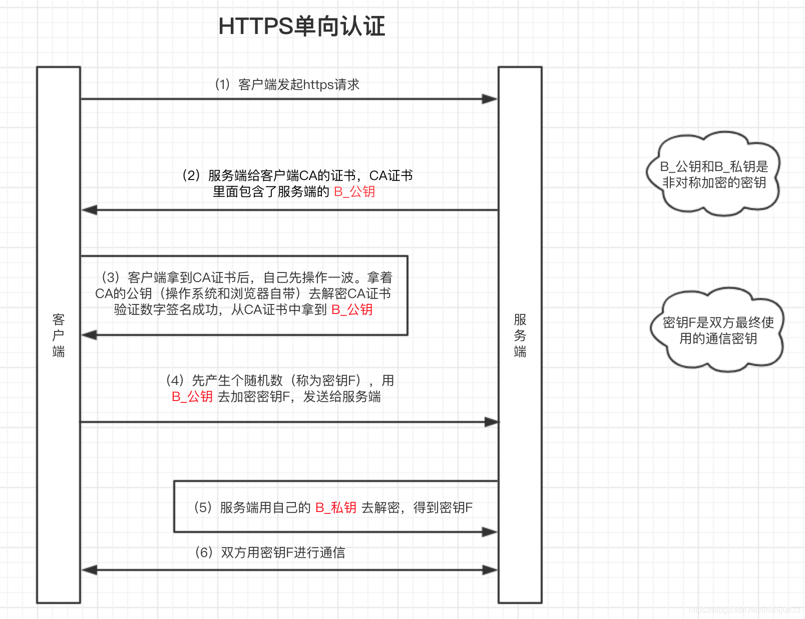
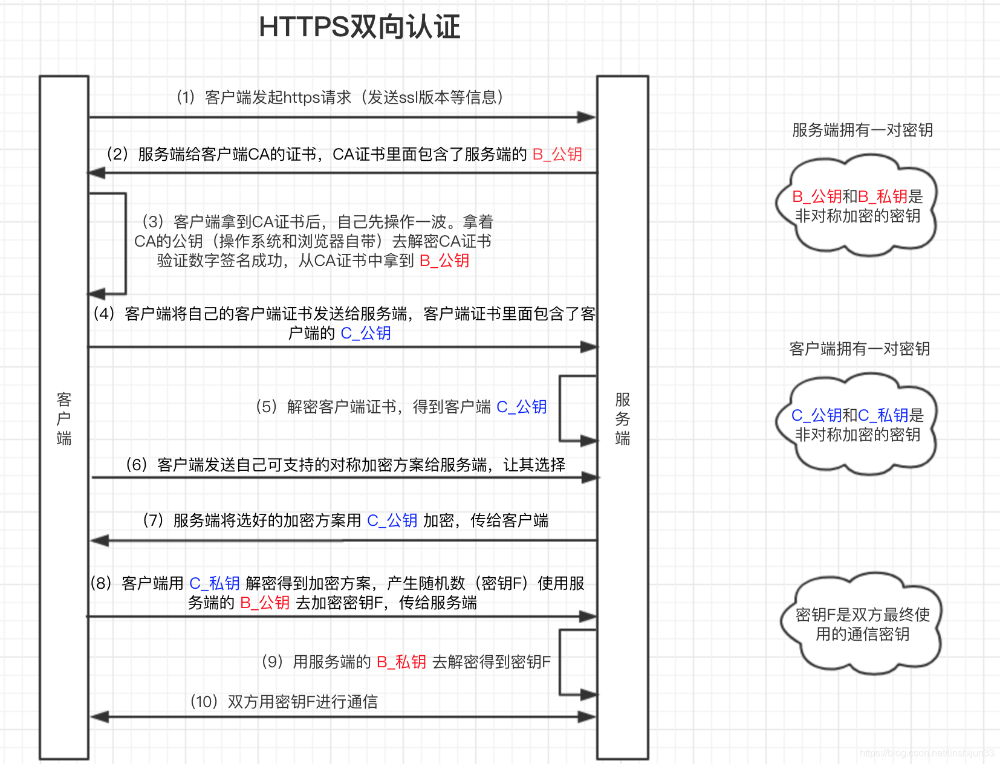
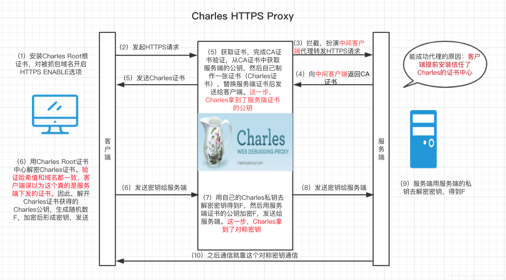

# HTTP简介
HTTP（HyperText Transfer Protocol，超文本传输协议）被用于在Web浏览器和网站服务器之间传递信息，在TCP/IP中处于应用层。这里提一下TCP/IP的分层共分为四层：**应用层、传输层、网络层、数据链路层;**
分层的目的是：分层能够解耦，动态替换层内协议
各个层包含的内容：
**应用层**：向用户提供应用服务时的通讯活动（ftp，dns，http）
**传输层**：网络连接中两台计算机的数据传输（tcp、udp）
**网络层**：处理网络上流动的数据包，通过怎样的传输路径把数据包传送给对方（ip）
**数据链路层**：与硬件相关的网卡、设备驱动等等
然而HTTP也有以下明显缺点：

1. 通信使用明文，内容可能被窃听
2. 不验证通信方的身份，因此有可能遭遇伪装
3. 无法证明报文的完整性，所以有可能遭到篡改

这样，HTTPS就登场了。**HTTPS中的S表示SSL或者TLS，就是在原HTTP的基础上加上一层用于数据加密、解密、身份认证的安全层**，即

- `HTTP + 加密 + 认证 + 完整性保护 = HTTPS`

加密相关的预备知识：对称加密和非对称加密。

1. 对称加密 ： 加密和解密数据使用同一个密钥。这种加密方式的特点是速度很快，常见对称加密的算法有 AES；
2. 非对称加密： 加密和解密使用不同的密钥，这两个密钥形成有且仅有唯一的配对，叫公钥和私钥。数据用公钥加密后必须用私钥解密，数据用私钥加密后必须用公钥解密。一般来说私钥自己保留好，把公钥公开给别人（一般公钥不会单独出现，而是会写进证书中），让别人拿自己的公钥加密数据后发给自己，这样只有自己才能解密。 这种加密方式的特点是速度慢，CPU 开销大，常见非对称加密算法有 RSA。

**CA证书的相关知识：**
CA证书是由CA（Certification Authority）机构发布的数字证书。其内容包含：电子签证机关的信息、公钥用户信息、公钥、签名和有效期。这里的公钥服务端的公钥，这里的签名是指：用hash散列函数计算公开的明文信息的信息摘要，然后采用CA的私钥对信息摘要进行加密，加密完的密文就是签名。
即：`证书 = 公钥 + 签名 +申请者和颁发者的信息`。
客户端中因为在操作系统中就预置了CA的公钥，所以支持解密签名（因为签名使用CA的私钥加密的）
有了这些预备知识后，就可以来看看HTTPS是如何怎么做到安全认证的。
# HTTPS单向认证

从上图可以看出，服务端拥有一对非对称密钥：B_公钥和B_私钥。详细过程如下：
（1）客户端发起HTTPS请求，将SSL协议版本的信息发送给服务端。
（2）服务端去CA机构申请来一份CA证书，在前面提过，证书里面有服务端公钥和签名。将CA证书发送给客户端
（3）客户端读取CA证书的明文信息，采用相同的hash散列函数计算得到信息摘要（hash目的：验证防止内容被修改），然后用操作系统带的CA的公钥去解密签名（因为签名是用CA的私钥加密的），对比证书中的信息摘要。如果一致，则证明证书是可信的，然后取出了服务端公钥
（4）客户端生成一个随机数（密钥F），用刚才等到的服务端B_公钥去加密这个随机数形成密文，发送给服务端。
（5）服务端用自己的B_私钥去解密这个密文，得到了密钥F
（6)服务端和客户端在后续通讯过程中就使用这个密钥F进行通信了。和之前的非对称加密不同，这里开始就是一种对称加密的方式

# HTTPS双向认证
**双向认证和单向认证原理基本差不多，单向认证客户端需要认证服务端，而在双向认证中增加了服务端对客户端的认证**

双向认证详细过程如下：
（1）客户端发起HTTPS请求，将SSL协议版本的信息发送给服务端。
（2）服务端去CA机构申请来一份CA证书，在前面提过，证书里面有服务端公钥和签名。将CA证书发送给客户端
（3）客户端读取CA证书的明文信息，采用相同的hash散列函数计算得到信息摘要（hash目的：验证防止内容被修改），然后用操作系统带的CA的公钥去解密签名（因为签名是用CA的私钥加密的），对比证书中的信息摘要。如果一致，则证明证书是可信的，然后取出了服务端公钥
（4）客户端发送自己的客户端证书给服务端，证书里面有客户端的公钥：C_公钥
（5）客户端发送支持的对称加密方案给服务端，供其选择
（6）服务端选择完加密方案后，用刚才得到的C_公钥去加密选好的加密方案
（7）客户端用自己的C_私钥去解密选好的加密方案，客户端生成一个随机数（密钥F），用刚才等到的服务端B_公钥去加密这个随机数形成密文，发送给服务端。
（8)服务端和客户端在后续通讯过程中就使用这个密钥F进行通信了。和之前的非对称加密不同，这里开始就是一种对称加密的方式

# HTTPS基本思路总结
HTTPS在保证数据安全传输上使用对称加密和非对称加密相结合的方式来进行的，简单来说就是通过一次非对称加密算法进行了**最终通信密钥**的生成、确认和交换，然后在后续的通信过程中使用最终通信密钥进行对称加密通信。之所以不是全程非对称加密，是因为非对称加密的计算量大，影响通信效率。
# 抓包原理
常用的HTTPS抓包方式是作为中间人，对客户端伪装成服务端，对服务端伪装成客户端。简单来说：

- 截获客户端的HTTPS请求，伪装成中间人客户端去向服务端发送HTTPS请求
- 接受服务端返回，用自己的证书伪装成中间人服务端向客户端发送数据内容。

具体过程如下图所示：

# 反抓包策略
为了防止中间人攻击，可以使用SSL-Pinning的技术来反抓包。

可以发现中间人攻击的要点的伪造了一个假的服务端证书给了客户端，客户端误以为真。解决思路就是，客户端也预置一份服务端的证书，比较一下就知道真假了。

SSL-pinning有两种方式： 证书锁定（Certificate Pinning） 和公钥锁定（ Public Key Pinning）。

- **证书锁定**
需要在客户端代码内置仅接受指定域名的证书，而不接受操作系统或浏览器内置的CA根证书对应的任何证书，通过这种授权方式，保障了APP与服务端通信的唯一性和安全性，因此客户端与服务端（例如API网关）之间的通信是可以保证绝对安全。但是CA签发证书都存在有效期问题，缺点是在 证书续期后需要将证书重新内置到APP中。
- **公钥锁定**
提取证书中的公钥并内置到客户端中，通过与服务器对比公钥值来验证连接的正确性。制作证书密钥时，公钥在证书的续期前后都可以保持不变（即密钥对不变），所以可以避免证书有效期问题，一般推荐这种做法。
# 突破SSL-Pinning抓包
思路是这样的：**内置证书或者公钥的时候，常常会有对比验证的函数，直接控制这个函数的返回结果让验证通过不就好了吗。**

于是就有了一个突破SLL-Pinning的经典操作：采用`Xposed+justTrustme`模块。

这个方案使用的是JustTrustMe这个Xposed模块，它所做的事情就是将各种已知的的HTTP请求库中用于校验证书的API都进行Hook，使无论是否是可信证书的情况，校验结果返回都为正常状态，从而实现绕过证书检查的效果。

# 突破证书双向验证抓包
参考[安卓ROOT抓包及绕过SSLPinning](/知识库/05.移动安全/01.安卓ROOT抓包及绕过SSLPinning.html#root后写入根证书)
# 总结

- 单向认证客户端需要认证服务端，而在双向认证中增加了服务端对客户端的认证。
- https抓不到包可能是使用了**SSL Pinning**或者**证书双向验证**来防止的。

HTTPS抓不到包的情况下，进行以下尝试

- 判断是不是SSL Pinning的技术来反抓包（直接用`Xposed+justTrustme`模块看看能不能抓包）
- 突破证书双向验证进行抓包
