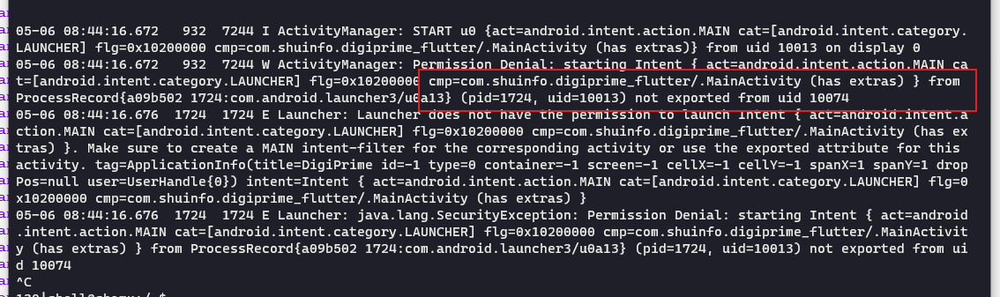
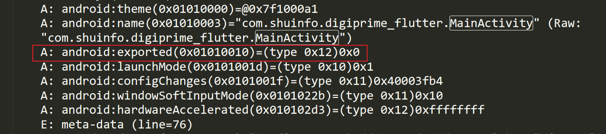
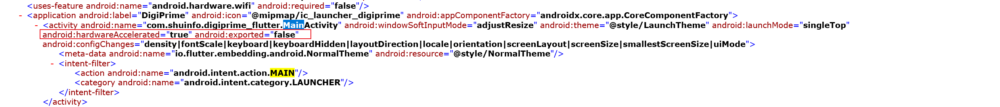

## 背景
今天在做安卓的项目的时候，发现安装好的apk不管在测试机还是模拟器中都无法打开，并且提示`此应用未安装`
在进行安装的时候，使用adb install 以及下载远程apk文件进行安装都报此错
## 报错详情
使用logcat 抓取app在运行态中的日志，发现如下报错

首先可以看到运行app的时候提示是没有权限，进而分析，通过`aapt`获取`AndroidManifest.xml`在mainActivity中可以看到设置的exported为0x0，这里就很奇怪了，mainActivity是app入口，如果属性exported为false则不能被android调用，则不能正常启动程序

然后再反编译查看`AndroidManifest.xml`，可以看到android.exported确实是为false。。。

log的意思是说不能app的进程不能被其他进程(这里指的是com.android.launcher，即手机的launcher应用)调用。解决方法就是在MainActivity的属性中添加exported="true"

## 参考链接
[https://blog.csdn.net/u013270444/article/details/52860854](https://blog.csdn.net/u013270444/article/details/52860854)

