## 获取微信小程序的源码

### 方法一：直接抓包法

小程序一般会先向微信服务器上下载小程序的资源，所以抓包一定情况下可以看到

> 新版的微信小程序采用了`zstd`压缩，所以下载后需要先解压，老版本没压缩可以直接下载源码，这是一个需要注意的地方

#### 前提

手机上无该小程序的缓存文件，如果有，进行如下操作

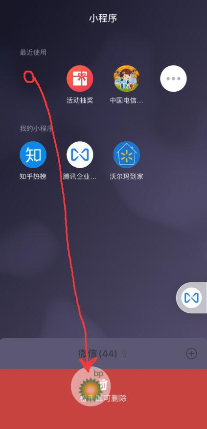

#### 操作步骤

1、使用fiddler抓包，获取小程序资源下载链接

> PS：burp也可以，只是感觉fiddler抓手机包更快

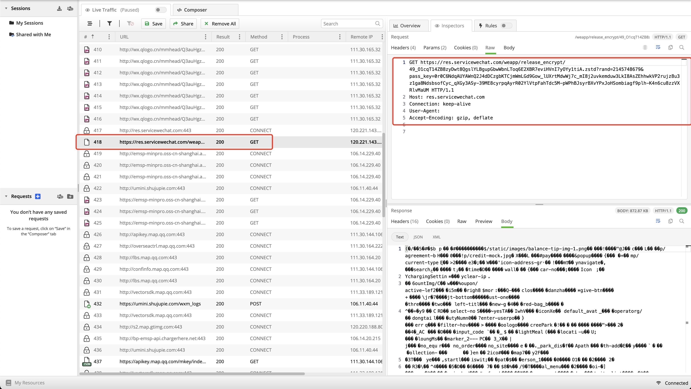

2、下载小程序

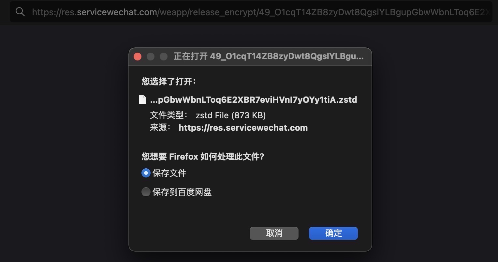

3、zstd解压

```bash
zstd -d xxx.zstd
```

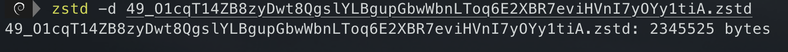

4、解压后添加后缀`.wxapkg`，然后进行反编译，此处以[`wxappUnpacker`](#其他)为例

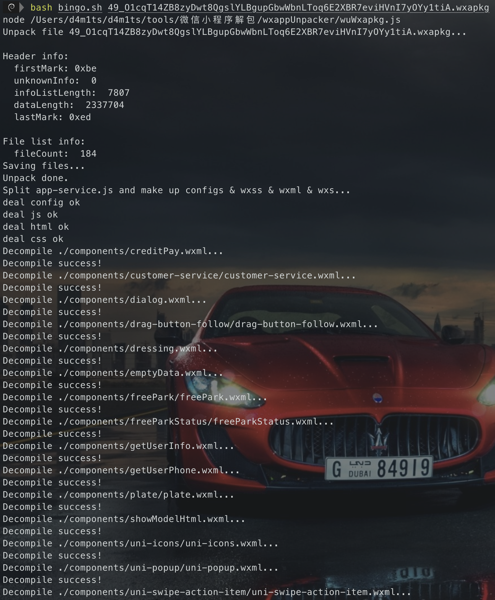


#### 结果

反编译后的目录结果

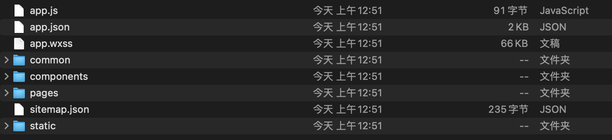

反编译后的内容

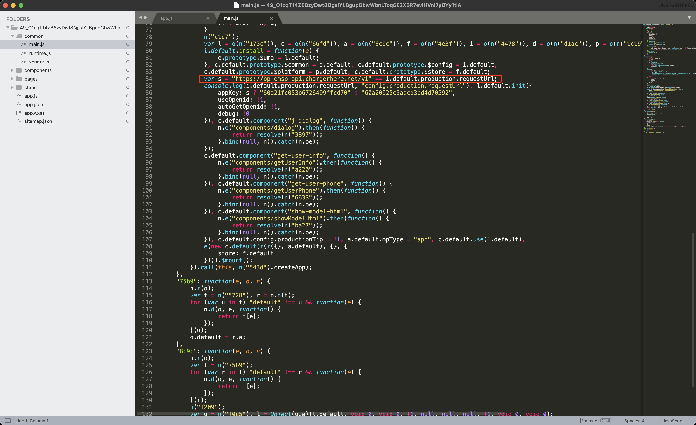

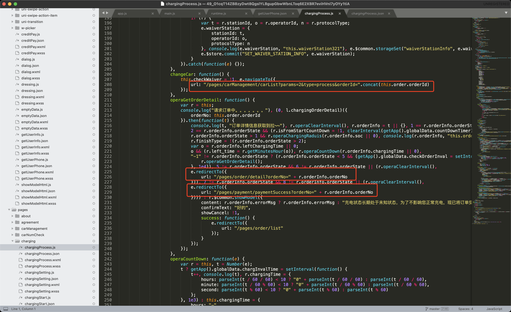

---

### 方法二：本地缓存文件读取法

网上基本都用的这个办法，感觉不如上面那个好用，还麻烦！！！

> 这是2019年记录的，可能现在存在一些误差，有问题及时[联系我](mailto:1979139113@qq.com)

#### 前提

* 手机root
* 手机已经访问过小程序，在系统中存在缓存
* 安装[RE文件管理器](https://github.com/damit5/GraphBed/raw/master/file/RE%E6%96%87%E4%BB%B6%E7%AE%A1%E7%90%86%E5%99%A8.apk)

#### 操作步骤

1、首先访问如下目录`/data/data/com.tencent.mm/MicroMsg/`，找到`wxapkg`文件

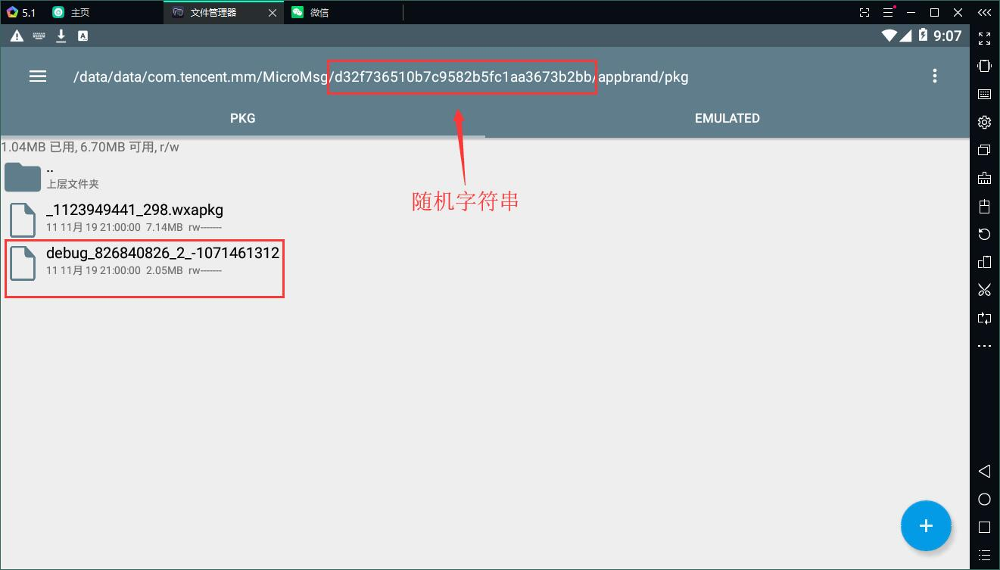

2、拖到电脑（此处我用的adb，也可以使用模拟器的共享文件夹等）

```bash
## adb命令
adb pull /data/data/com.tencent.mm/MicroMsg/d32f736510b7c9582b5fc1aa3673b2bb/appbrand/pkg/debug_826840826_2_-1071461312
```
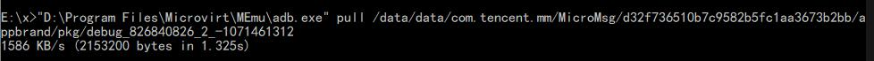

3、使用[`WxApkgUnpacker.exe`](https://raw.githubusercontent.com/damit5/GraphBed/master/file/WxApkgUnpacker.exe)反编译wxapkg获取源文件

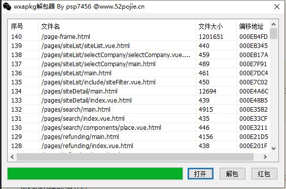

#### 结果

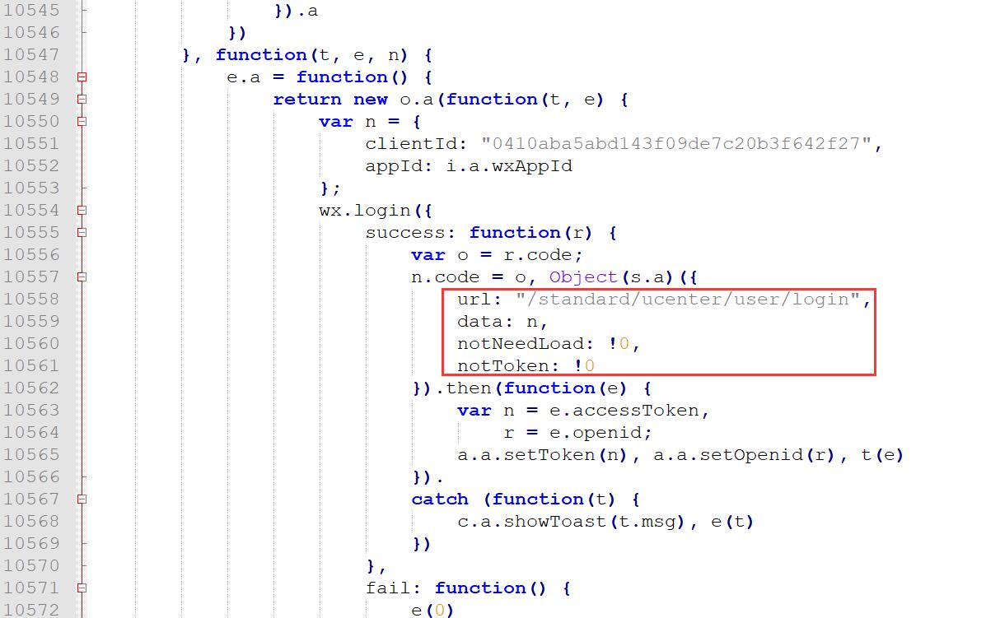

---

### 其他

有些工具下载地址挂了，可以多在github上找找，这里提供一些本地下载吧

- [WxApkgUnpacker.exe](https://byaaronluo.github.io/%E7%9F%A5%E8%AF%86%E5%BA%93/05.%E7%A7%BB%E5%8A%A8%E5%AE%89%E5%85%A8/%E8%8E%B7%E5%8F%96%E5%BE%AE%E4%BF%A1%E5%B0%8F%E7%A8%8B%E5%BA%8F%E6%BA%90%E7%A0%81.assets/WxApkgUnpacker.exe)
- [wxappUnpacker-master.zip](https://byaaronluo.github.io/%E7%9F%A5%E8%AF%86%E5%BA%93/05.%E7%A7%BB%E5%8A%A8%E5%AE%89%E5%85%A8/%E8%8E%B7%E5%8F%96%E5%BE%AE%E4%BF%A1%E5%B0%8F%E7%A8%8B%E5%BA%8F%E6%BA%90%E7%A0%81.assets/wxappUnpacker-master.zip)
- [mp-unpack.Setup.1.1.1.exe](https://byaaronluo.github.io/%E7%9F%A5%E8%AF%86%E5%BA%93/05.%E7%A7%BB%E5%8A%A8%E5%AE%89%E5%85%A8/%E8%8E%B7%E5%8F%96%E5%BE%AE%E4%BF%A1%E5%B0%8F%E7%A8%8B%E5%BA%8F%E6%BA%90%E7%A0%81.assets/mp-unpack.Setup.1.1.1.exe)
- [mp-unpack-1.1.1.dmg](https://byaaronluo.github.io/%E7%9F%A5%E8%AF%86%E5%BA%93/05.%E7%A7%BB%E5%8A%A8%E5%AE%89%E5%85%A8/%E8%8E%B7%E5%8F%96%E5%BE%AE%E4%BF%A1%E5%B0%8F%E7%A8%8B%E5%BA%8F%E6%BA%90%E7%A0%81.assets/mp-unpack-1.1.1.dmg)

## 微信开发者工具调试

**可选步骤，一般不需要**

> 下载地址：https://developers.weixin.qq.com/miniprogram/dev/devtools/download.html

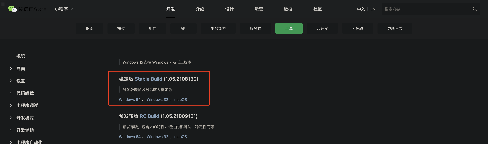

### 调试过程

下载安装后打开，导入反编译的源码

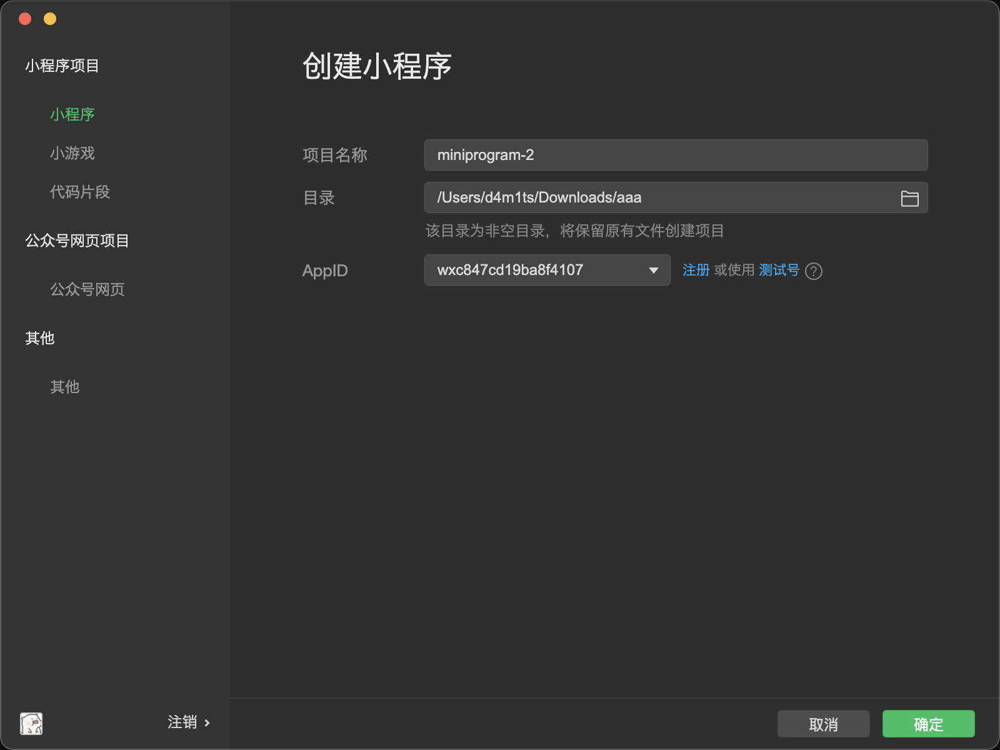

点击编译（不编译看着也比较舒服吧哈哈）

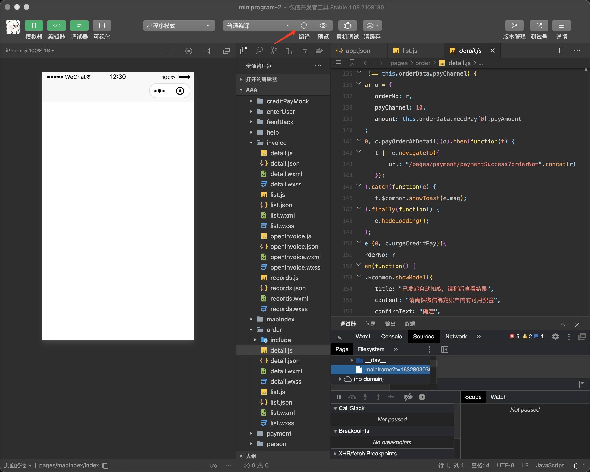

编译完成后就可以自己调试了

> 如果代码存在混淆等情况，可能编译不成功，不过也不太影响我们测试，因为我们也主要是分析各个接口的东西；如果有加密什么的，能调试就很方便

放一张别人编译成功的图吧

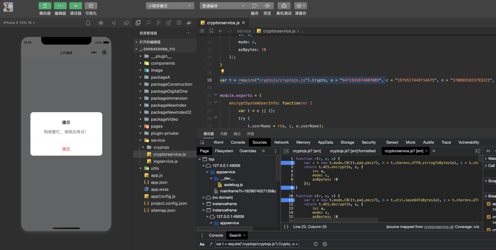

### 参考

- [小程序渗透测试-前端打包调试解密](https://blog.csdn.net/god_zzZ/article/details/120011021)


## 获取支付宝小程序的源码

和微信小程序差不多，只是路径不一样，支付宝小程序的路径为

```
/data/data/com.eg.android.AlipayGphone/files/nebulaInstallApps
```

另外具体目录名为小程序**tinyAppId值**，其中的tar包即为源码文件。tar包未加密，`adb pull`出来之后直接解压即可


## JS美化

源码基本都是前后端分离的前端，所以基本都是js、html什么的，直接看比较费眼睛，结合一下效果挺好。

1. 用微信开发者工具调试，会自动高亮，不过混淆的也不好看
2. 搜索引擎搜索 **js在线美化**

