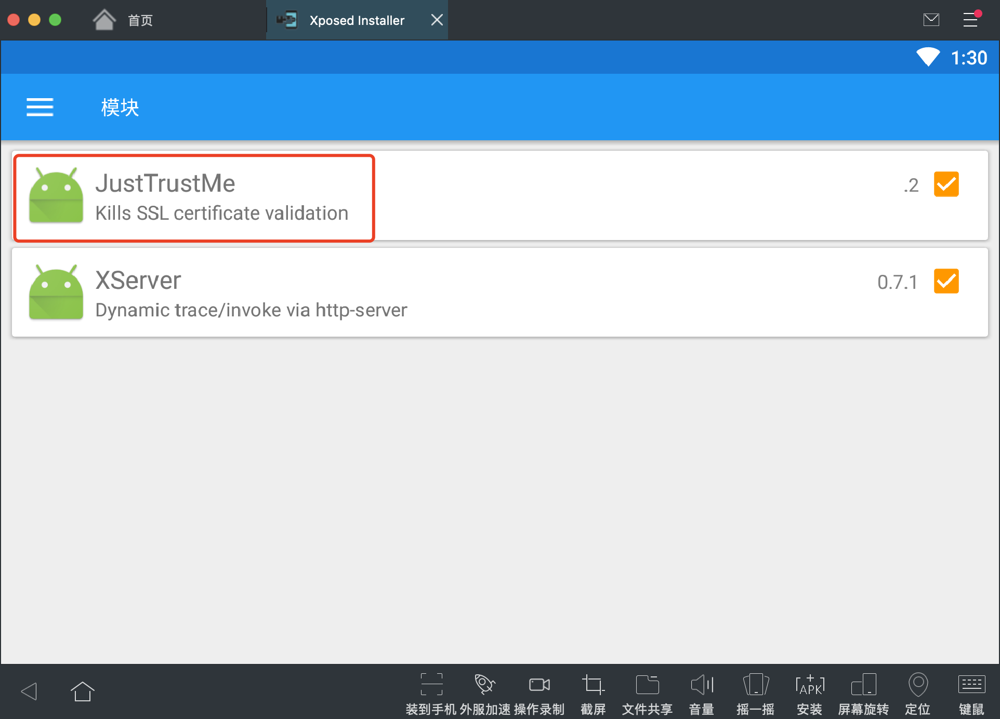
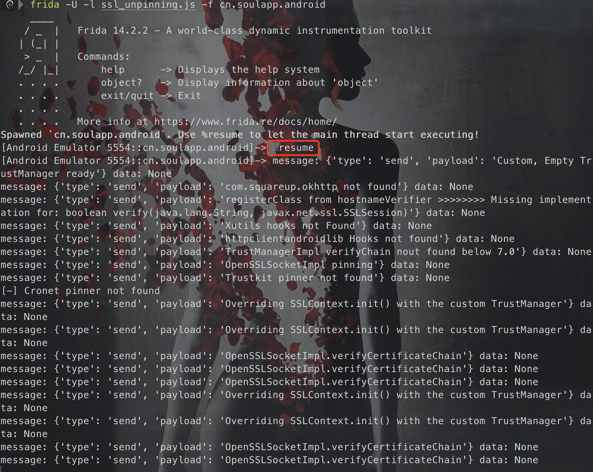
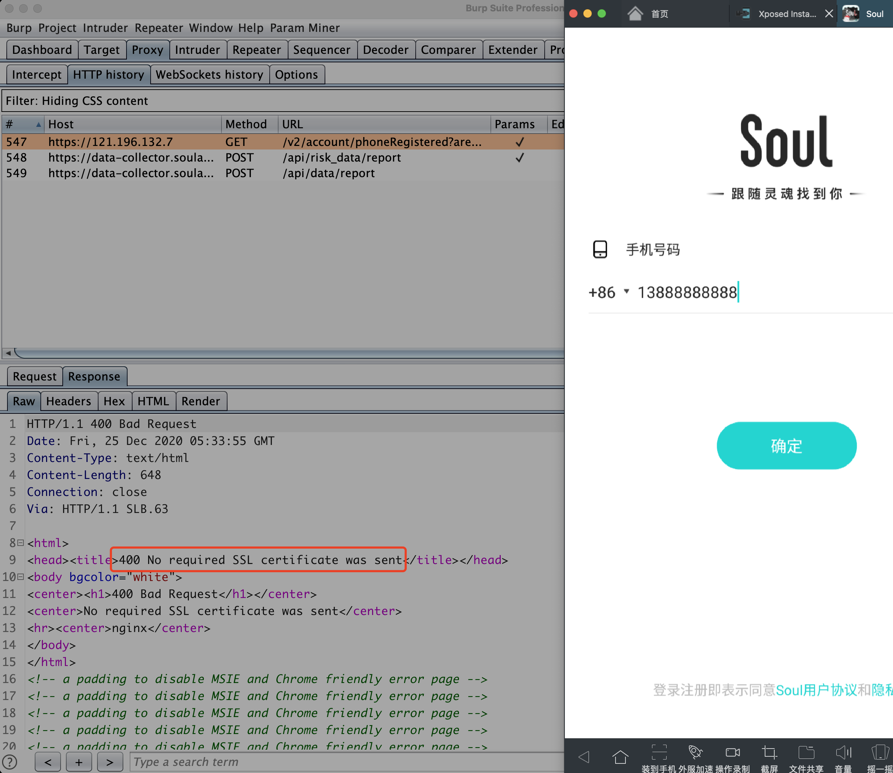
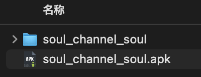
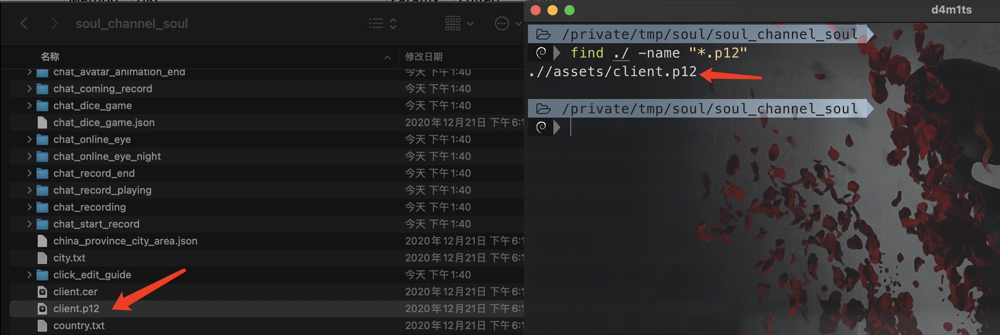
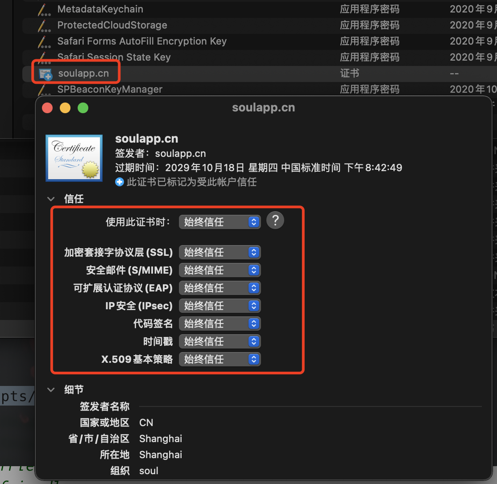
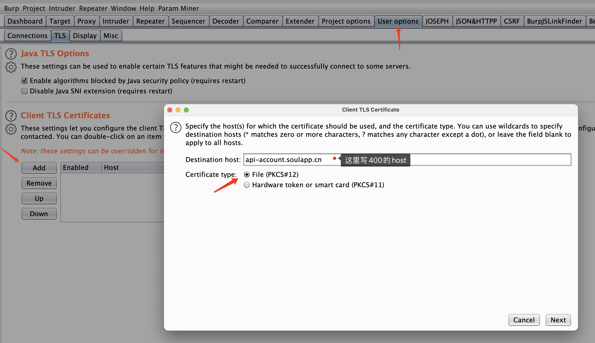
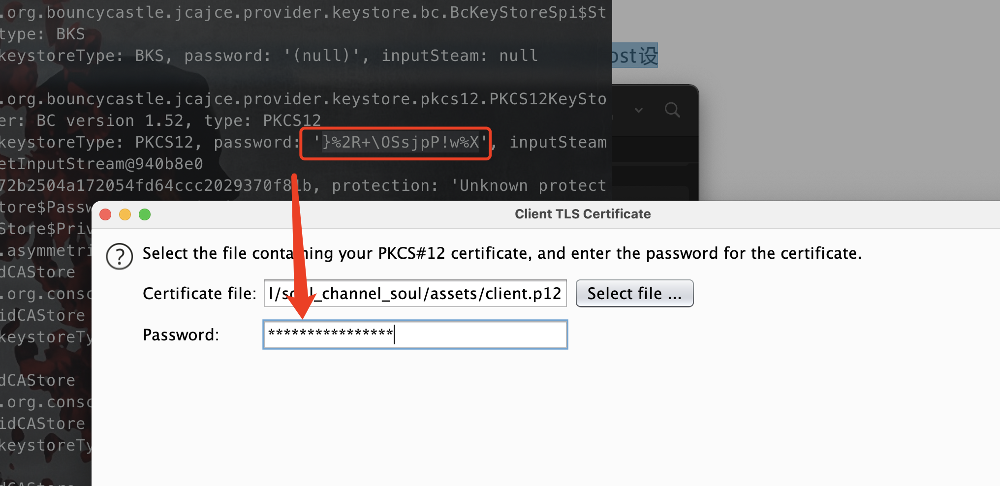
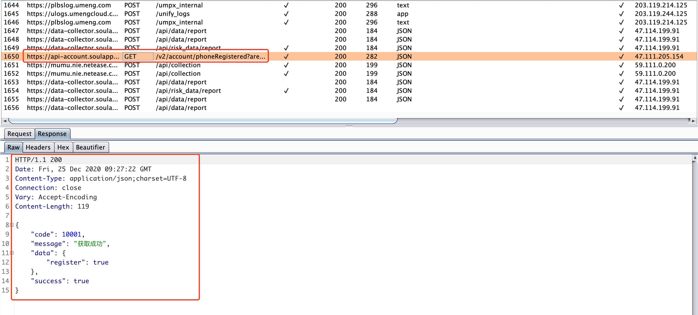

# 证书双向验证抓包

此处以soal app为例

首先需要下载soul app，然后安装

---


## 先尝试一下是不是单向验证+SSL pinning来防止抓包的

### 方法一：Xposed加载[JustTrustMe](https://github.com/Fuzion24/JustTrustMe/releases/latest)模块



### 方法二：使用frida的ssl_pinning的js模块

```bash
frida -U -l ssl_unpinning.js -f cn.soulapp.android
# 注意 -f 后面接的是 package name，从设备中读取的
```



### 打开soul app，抓包

提示 `400 No required SSL certificate was sent`，说明是证书双向验证的




## 双向验证抓包开始

### 直接解压apk



### 找一下证书

如果服务器端会对客户端证书进行校验, 证书应该就直接存放在apk里

证书一般放到目录 `/asset` 或者 `/res/raw` 目录下的，如果没找到，可以用 find 找一下后缀为 `.cer .p12 .pfx` 的文件



这里找到证书为 `client.p12`

### 找一下证书密码

在我们要使用该证书的时候, 需要输入安装证书的密码。

找到p12证书的话，可以通过这个证书+密码转换成本机安装的证书格式，比如cer。

#### 反编译分析啥的太麻烦了，不太会，所以还是用frida吧

```bash
frida -U -l tracer_keystore.js -f cn.soulapp.android
```


### 本地安装并信任证书



### burp添加p12证书

* 打开Burp --> User Options-->Client SSL Certificates --> Add -->Host设置前面返回400的地址，证书类型选 PKCS#12



* 选择刚才看到的p12证书，然后输入frida提取到的密码。



## 验证

再次抓包，可见能成功抓取到https的包。



