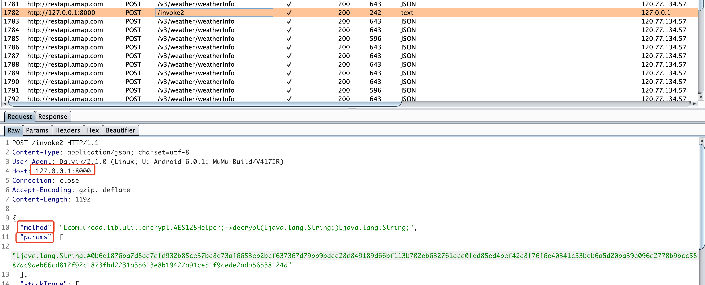

# Xserver

## 下载地址

[xserver](https://github.com/monkeylord/XServer/releases/latest)

## Hook

### adb端口转发

> 如果转发了8000端口本地还访问不到，那可能因为某些原因它初始化的时候没有在8000上，所以这个时候需要通过找PID的值进行转发。

```bash
adb forward tcp:8000 tcp:8000
```


### 选择一个app


### 打开app


### 打开本地127.0.0.1:8000，即可成功hook的web界面了


## 使用

### 模拟器设置好burp代理，打开测试的app

主要介绍两个功能，一个是trace，访问地址是http://localhost:8000/tracer

一个是hook，访问地址是http://localhost:8000/invoke

### 加载所有方法


可以看到加载了136759个方法。


### 输入规则过滤，并且hook

>  这个靠猜，比如decode、decrypt、AES、DES等


### hook后运行app，发起网络请求

可以看到明文数据，说明找到了对应的解密方式


### 点击decrypt方法

进入后，在框内输入加密后的内容，点击`invoke`即可解密，可以在burp中看到过程


### burp中看到的数据，后面app操作中所有解密的地方burp都能看到



