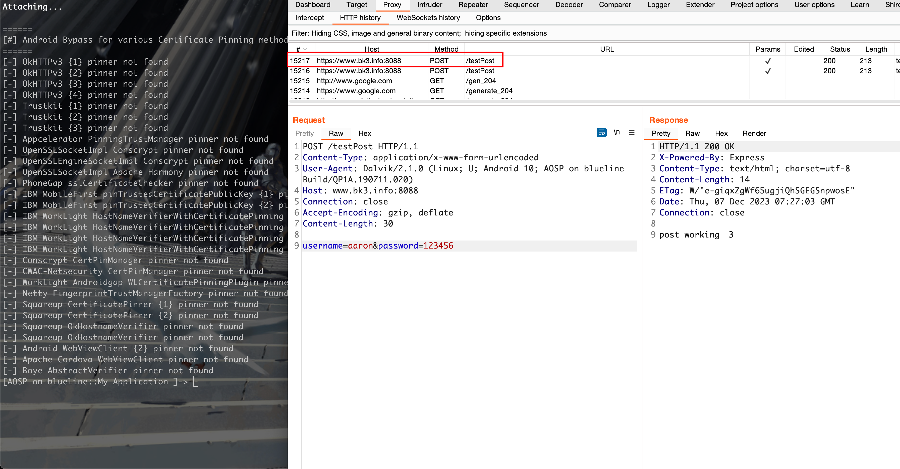
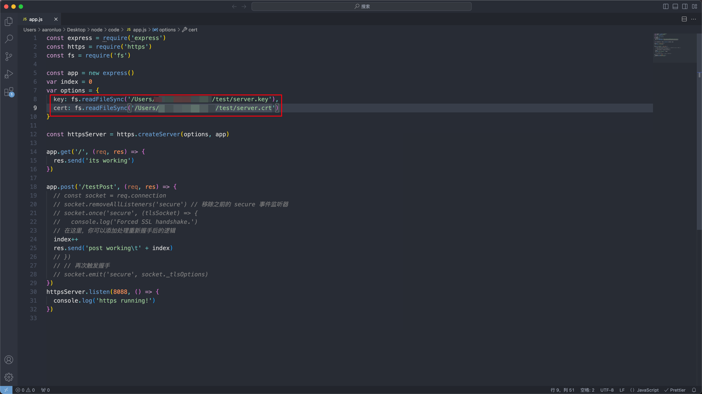
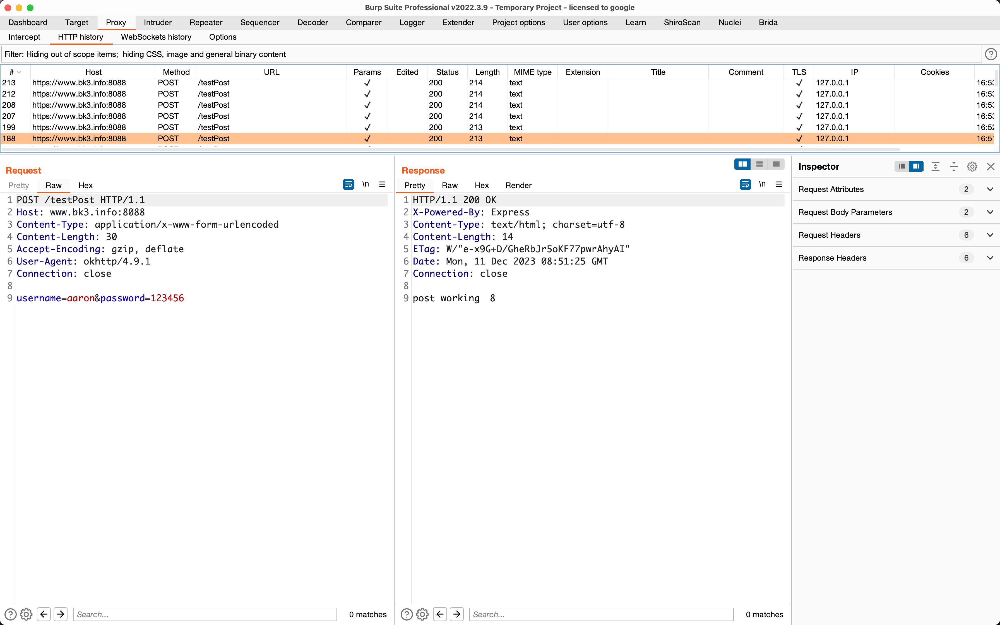

## 简介

由于手机银行app项目的原因，需要详细了解一下 SSL Pinning 和 双向认证的全过程，所以需要对android 抓包做一个详细的总结，这里我将自己手撸一个android app，且申请受信任的根证书（非自签名证书）来对SSL 进行详细的总结

| key              | Value         |
| ---------------- | ------------- |
| Android 版本     | Android 10    |
| Android 手机型号 | Pixel3        |
| 证书机构         | Let's Encrypt |
| Android SDK      | SDK 34        |

## SSL/TLS中间人攻击

### HTTPS

`https`是基于`http`协议和`TCP`之间添加一个`TLS/SSL`层来加密传输的数据，以确保传输过程中的隐私和安全。

### BurpSuite 抓包过程

BurpSuite不光是一个代理的功能，它还是一个自签名的私有CA，当Client请求SSL站点时，burpsuite会返回PortSwigger CA颁发的伪造的证书给Client，Client前期由于导入了信任CA的根证书，因此就信任了这个伪造的证书，从而实现了Client与burp之间的SSL加密通信。然后，BrupSuite再与真实web Server 进行正常https通讯，把client的请求直接转发给服务器，从而实现burpsuite和Web Server之前的SSL加密通信。在中间形成一个基于https的代理，从而获取client与Web Server之间通信的解密报文


## APP抓包

在PC上可以将BurpSuite（此类抓包工具）的自签名CA证书导入到受信任的根证书CA中，所以我们在PC上抓包就可以直接SSL的包，其实根据上图中可以看到BurpSuite其实是利用客户端默认信任自签名的CA证书，所以在抓包过程中做了一层SSL加解密处理，所以才能抓到request明文包，然后再用自己的身份和Server 通信，转发Client的包，用Server的证书来加解密，所以我们能看到response明文包，当理解了之后再来看android抓包

在这里我先使用nodejs 快速搭建了一个Web服务器

```javascript
const express = require('express')
const https = require('https')
const fs = require('fs')

const app = new express()
var index = 0
var options = {
  key: fs.readFileSync('./privkey.pem'),
  cert: fs.readFileSync('./fullchain.pem')
}

const httpsServer = https.createServer(options, app)

app.get('/', (req, res) => {
  res.send('its working')
})

app.post('/testPost', (req, res) => {
  index++
  res.send('post working\t' + index)
})
httpsServer.listen(8088, () => {
  console.log('https running!')
})
```

在这里我新建了一个app项目

```java
// MainActivity
package com.example.myapplication;

import android.os.Bundle;
import androidx.appcompat.app.AppCompatActivity;

import android.view.Menu;
import android.view.View;
import android.widget.Button;
import android.widget.Toast;

import com.google.android.material.snackbar.Snackbar;

public class MainActivity extends AppCompatActivity {

    @Override
    protected void onCreate(Bundle savedInstanceState) {
        super.onCreate(savedInstanceState);
        setContentView(R.layout.activity_main);

        Button myButton = findViewById(R.id.myTestButton);
        myButton.setOnClickListener(v -> {
            try{
                MyAsyncTask myAsyncTask = new MyAsyncTask(MainActivity.this);
                User user = new User();
                user.setUsername("aaron");
                user.setPassword("123456");
                String news = String.valueOf(myAsyncTask.execute("https://www.bk3.info:8088/testPost",user.toString()));
                if(news != null){
                    Toast.makeText(MainActivity.this, news, Toast.LENGTH_SHORT).show();
                }
                System.out.println(news);
            }catch (Exception e){
                e.printStackTrace();
            }
        });
    }


    @Override
    public boolean onCreateOptionsMenu(Menu menu) {
        // Inflate the menu; this adds items to the action bar if it is present.
        getMenuInflater().inflate(R.menu.menu_main, menu);
        return true;
    }

}
```

```java
// MyAsyncTask
package com.example.myapplication;
import android.app.Activity;
import android.content.Context;
import android.os.AsyncTask;
import android.widget.Button;
import android.widget.TextView;
import android.view.View;
import java.io.BufferedReader;
import java.io.InputStreamReader;
import java.net.HttpURLConnection;
import java.io.DataOutputStream;
import java.net.URL;

public class MyAsyncTask extends AsyncTask<String, Void, String>{
    private Context mContext;
    public MyAsyncTask(Context mContext){
        this.mContext = mContext;
    }
    @Override
    protected String doInBackground(String...params) {
        String result = "";
        try {
            URL url = new URL(params[0]);
            HttpURLConnection connection = (HttpURLConnection) url.openConnection();
            connection.setRequestMethod("POST");
            connection.setDoOutput(true);
            DataOutputStream outputStream = new DataOutputStream(connection.getOutputStream());
            String postData = params[1]; // 替换为你的POST参数
            outputStream.writeBytes(postData);
            outputStream.flush();
            outputStream.close();

            BufferedReader reader = new BufferedReader(new InputStreamReader(connection.getInputStream()));
            String line;
            while ((line = reader.readLine()) != null) {
                result += line;
            }
            reader.close();
            connection.disconnect();
        } catch (Exception e) {
            e.printStackTrace();
        }
        System.out.println(result);
        return result;
    }

    @Override
    protected void onPostExecute(String result) {
        TextView textView = ((Activity)mContext).findViewById(R.id.MainTextView);
        textView.setText(result);
    }
}

```

具体功能表现为点击按钮，将response显示在TextView上


当将BurpSuite的CA证书导入到系统证书目录下，抓包的时候发现Burp无法抓包


且用frida hook的时候会显示使用了SSL Pinning（TrustManagerImpl）

Frida 脚本的关键代码如下

```javascript
var TrustManagerImpl = Java.use('com.android.org.conscrypt.TrustManagerImpl');
TrustManagerImpl.verifyChain.implementation = function (untrustedChain, trustAnchorChain, host, clientAuth, ocspData, tlsSctData) {
  console.log('[+] Bypassing TrustManagerImpl (Android > 7): ' + host);
	return untrustedChain;
};
```


> [!INFO]
>
> 我并没有添加SSL Pinning 专门来校验服务端的证书，但是直接抓包不成功，且在使用frida hook SSL Pinning 之后会发现存在TrustManagerImpl.verifyChain(untrustedChain, trustAnchorChain, host, clientAuth, ocspData, tlsSctData)这个函数的调用

### 证书问题

此时，我还未发现是证书问题，还以为是我在开发打包过程中莫名其妙添加了一些认证框架进来，当我询问Android开发大佬`yksqn35919@gmail.com`，他告诉我如果是使用了框架去看看依赖，如果存在的话，按照[安卓网络安全配置](https://developer.android.com/privacy-and-security/security-config?hl=zh-cn)将系统证书添加进去，我尝试过，还是不行

最后我想起我PC的Charles的证书已经过期了，且我重新申请之后，又需要将新证书导入到信任的CA机构中这样我的PC才能抓到包

这时我手机里的BurpSuite证书还是@屈大佬的BurpSuite的CA证书（且未过期）

当我使用openssl重新计算CA证书，并重新添加到Android的系统证书中，发现可以抓包了


且Frida hook 不会有 Kill SSL Pinning 的操作




所以到这里可以看到其实是证书的问题

然后捋清楚了SSL/TLS的中间人攻击，我通过WireShark抓包查看SSL 握手包 终于发现了问题

由于我重新生成了BurpSuite的CA证书，但是我一直以为

```shell
openssl x509 -inform DER -subject_hash_old -in xxx.der 
```

算出来的hash 是一样的，所以我没有更新我android手机里系统里的burp CA证书，导致app 与 burp 通信的时候，证书不被信任，就抓不到包，且使用frida去hook时发现存在ssl pinning，是因为新生成的证书和以前的证书签名没过，所以frida 其实hook到的是app 与 burp 通信的时候证书校验

通过WireShark可以看到，首先是和BurpSuite建立连接，然后有SSL/TLS握手的包（但是这个包我之前抓到过，但是现在与BurpSuite建立长连接之后抓不到了）就将就看与BurpSuite的HTTPS的连接


可以看到第二个图中在建立连接之后，明显包的数量比第一个图的数量多，就可以推导在SSL/TLS握手之后成功之后就会有下一步操作（中间人攻击，burp拿到数据之后再发送给app）


我们可以看一下SSL/TLS握手的数据包（这个是在android中使用tcpdump抓取到的SSL/TLS握手）这里我就将我的域名指向了我公网的老毛子服务器，流程如下：

- 客户端向服务器发送Client Hello,告诉服务器，我支持的协议版本，加密套件等信息。
- 服务器收到响应，选择双方都支持的协议，套件，向客户端发送Server Hello。同时服务器也将自己的证书发送到客户端(Certificate)。

- 客户端自己生产预主密钥，通过公钥加密预主秘钥，将加密后的预主秘钥发送给服务器 (Client Exchange)。

- 服务器用自己的私钥解密加密的预主密钥。

- 之后，客户端与服务器用相同的算法根据客户端随机数，服务器随机数，预主秘钥生产主密钥，之后的通信将都用主密钥加密解密。


在了解了SSL/TLS握手的全过程之后，那么可以推导出以下结论：

1. 在只有SSL/TLS中，只要BurpSuite的证书被信任，那么就一定是可以抓包

2. 如果BurpSuite的证书没有被信任，那么只要可以Hook到app与burpsuite的SSL/TLS握手，让其信任burpsuite的CA就可以抓包

   1. root过的机器，可以使用Xposed+JustTrustMe或frida hook ssl无视app与burpsuite的证书信任问题
   2. 非root的机器，可以使用[VirtualXposed](https://github.com/android-hacker/VirtualXposed/)+JustTrustMe无视app与burpsuite的证书问题
3. 如果存在受信任的CA证书和私钥，可以将其导入到BurpSuite中，无视app与BurpSuite的证书信任问题
   


### SSL Pinning（校验服务端证书）

在build.gradle中引入okhttp框架

```kotlin
plugins {
    id("com.android.application")
}

android {
    namespace = "com.example.myapplication"
    compileSdk = 34

    defaultConfig {
        applicationId = "com.example.myapplication"
        minSdk = 29
        targetSdk = 33
        versionCode = 1
        versionName = "1.0"

        testInstrumentationRunner = "androidx.test.runner.AndroidJUnitRunner"
    }

    buildTypes {
        release {
            isMinifyEnabled = false
            proguardFiles(
                getDefaultProguardFile("proguard-android-optimize.txt"),
                "proguard-rules.pro"
            )
        }
    }
    compileOptions {
        sourceCompatibility = JavaVersion.VERSION_1_8
        targetCompatibility = JavaVersion.VERSION_1_8
    }
    buildFeatures {
        viewBinding = true
    }
}

dependencies {

    implementation("androidx.appcompat:appcompat:1.6.1")
    implementation("com.google.android.material:material:1.10.0")
    implementation("androidx.constraintlayout:constraintlayout:2.1.4")
    implementation("androidx.navigation:navigation-fragment:2.7.5")
    implementation("androidx.navigation:navigation-ui:2.7.5")
    testImplementation("junit:junit:4.13.2")
    androidTestImplementation("androidx.test.ext:junit:1.1.5")
    androidTestImplementation("androidx.test.espresso:espresso-core:3.5.1")
  // 引入oklhttp框架
    implementation("com.squareup.okhttp3:okhttp:4.9.1")
}
```

创建`OkHttpAsyncTask`继承`AsyncTask`如下所示：

```java
package com.example.myapplication;

import android.app.Activity;
import android.content.Context;
import android.os.AsyncTask;
import android.widget.TextView;

import java.io.InputStream;
import java.security.cert.Certificate;
import java.security.cert.CertificateFactory;
import java.security.KeyStore;

import javax.net.ssl.SSLContext;
import javax.net.ssl.TrustManagerFactory;
import javax.net.ssl.X509TrustManager;

import okhttp3.*;

public class OkHttpAsyncTask extends AsyncTask<String, Void, String> {
    private Context mContext;
    public OkHttpAsyncTask(Context mContext){
        this.mContext = mContext;
    }
    @Override
    protected String doInBackground(String... params) {
        OkHttpClient client = getOkHttpClient();
        RequestBody formBody = new FormBody.Builder().add("username",params[1]).add("password",params[2]).build();
        Request request = new Request.Builder()
                .url(params[0]) // 使用一个示例API
                .post(formBody)
                .build();
        try{
            Response response = client.newCall(request).execute();
            if (response.isSuccessful()) {
                return response.body().string();
            } else {
                return "Error: " + response.code() + " " + response.message();
            }
        }catch (Exception e){
            e.printStackTrace();
            return "Error: " + e.getMessage();
        }
    }
    @Override
    protected void onPostExecute(String result) {
        TextView textView = ((Activity)mContext).findViewById(R.id.MainTextView);
        textView.setText(result);
    }
  // 添加SSL Pinning 代码 并且添加服务器证书（也就是验证服务端证书）
    private OkHttpClient getOkHttpClient(){
        try{
            // 从res/raw目录中读取证书
            InputStream inputStream = ((Activity)mContext).getResources().openRawResource(R.raw.fullchain);

            // 创建 Certificate 对象
            CertificateFactory certificateFactory = CertificateFactory.getInstance("X.509");
            Certificate certificate = certificateFactory.generateCertificate(inputStream);
            // 创建 KeyStore 并将证书添加进去
            KeyStore keyStore = KeyStore.getInstance(KeyStore.getDefaultType());
            keyStore.load(null, null);
            keyStore.setCertificateEntry("certificate", certificate);
            // 创建TrustManagerFactory，并将KeyStore初始化到TrustManagerFactory中
            TrustManagerFactory trustManagerFactory = TrustManagerFactory.getInstance(
                    TrustManagerFactory.getDefaultAlgorithm());
            trustManagerFactory.init(keyStore);

            // 创建SSLContext，使用TrustManagerFactory初始化
            SSLContext sslContext = SSLContext.getInstance("TLS");
            sslContext.init(null, trustManagerFactory.getTrustManagers(), null);
            // 构建OkHttpClient，设置SSL Socket Factory
            return new OkHttpClient.Builder()
                    .sslSocketFactory(sslContext.getSocketFactory(), (X509TrustManager) trustManagerFactory.getTrustManagers()[0])
                    .build();
        }catch (Exception e){
            e.printStackTrace();
            return null;
        }
    }
}

```

使用BurpSuite抓包可以看到由于Burp的证书没有被信任，导致抓包可以看到response的响应体告知证书不被信任


通过frida hook 可以看到使用的是okhttp框架的SSL Pinning


当存在SSL Pinning 的时候只要能hook到对服务端证书的校验，就可以直接抓包，所以只需要使用frida的脚本或者JustTrustMe包含足够多的框架对服务端的校验，就能完成正常抓包工作

在了解了SSL Pining的认证过程之后，可以看到其实是客户端强行校验了服务端证书，所以在中间人攻击的流程中，在SSL握手的时候，由于会校验后端证书，导致Burp的证书在进行证书校验的时候证书校验不通过就会出现SSL连接错误，正常的app就会出现网络连接失败的错误（logcat中可以看见）

1. root过的机器，通过frida hook 可以直接绕过SSL Pinning 检测，直接抓包
2. root过的机器，通过Xposed + JustTruestMe（足够强的hook 脚本 ），可以绕过SSL Pinning检测，直接抓包
3. 非root的机器，通过VirtualXposed + JustTrustMe，可以绕过SSL Pinning检测，直接抓包
4. 自签证书，get shell之后拿到服务器Server.key,Server.crt，生成PK12格式证书，导入到BurpSuite，此时在中间人攻击的时候app与burp通信的时候就是app对自签服务端证书进行校验，通过之后，burp在与服务端进行通信最后再转发至app

针对第4点进行阐述如下：

1. 生成自签名CA私钥，CA证书、Server.key、Server.crt

   ```shell
   openssl genpkey -algorithm RSA -out ca.key
   openssl req -new -key ca.key -out ca.csr
   openssl x509 -req -in ca.csr -signkey ca.key -out ca.crt
   
   # 生成服务端证书私钥
   openssl genpkey -algorithm RSA -out server.key
   # 生成服务器证书请求，这里需要将CN改变成我们的域名
   openssl req -new -key server.key -out server.csr
   # 生成服务器证书文件，因为要生成包含 SAN 信息的证书，为了不去更改/etc/ssl/openssl.cnf的配置文件，所以手动添加subjectAltName=DNS:www.bk3.info
   openssl x509 -req -in server.csr -out server.crt -CA ca.crt -CAkey ca.key -CAcreateserial -days 365 -sha256 -extfile <(printf "subjectAltName=DNS:www.bk3.info")
   ```

2. 在web浏览器中查看自签的域名

   

3. 此时我们可以将CA证书导入到系统证书中，就不会再报SSL错误

   

   

4. 在okhttp框架校验服务器证书中添加自签的Server证书

   ```java
   private OkHttpClient getOkHttpClient(){
           try{
               // 从res/raw目录中读取证书
               InputStream inputStream = ((Activity)mContext).getResources().openRawResource(R.raw.server);
   
               // 创建 Certificate 对象
               CertificateFactory certificateFactory = CertificateFactory.getInstance("X.509");
               Certificate certificate = certificateFactory.generateCertificate(inputStream);
               // 创建 KeyStore 并将证书添加进去
               KeyStore keyStore = KeyStore.getInstance(KeyStore.getDefaultType());
               keyStore.load(null, null);
               keyStore.setCertificateEntry("certificate", certificate);
               // 创建TrustManagerFactory，并将KeyStore初始化到TrustManagerFactory中
               TrustManagerFactory trustManagerFactory = TrustManagerFactory.getInstance(
                       TrustManagerFactory.getDefaultAlgorithm());
               trustManagerFactory.init(keyStore);
   
               // 创建SSLContext，使用TrustManagerFactory初始化
               SSLContext sslContext = SSLContext.getInstance("TLS");
               sslContext.init(null, trustManagerFactory.getTrustManagers(), null);
               // 构建OkHttpClient，设置SSL Socket Factory
               return new OkHttpClient.Builder()
                       .sslSocketFactory(sslContext.getSocketFactory(), (X509TrustManager) trustManagerFactory.getTrustManagers()[0])
                       .build();
           }catch (Exception e){
               e.printStackTrace();
               return null;
           }
       }
   ```

   

   服务端证书为自签证书

   

5. 当burp的CA证书还是portSwigger的时候，会报SSL连接错误

   

6. 当通过其他手段获取到服务端证书、服务端证书私钥，将其做成能导入的burpsuite的pkcs#12格式的keyStore（证书交换文件）

   ```shell
   openssl pkcs12 -export -out certificate.pfx -inkey server.key -in server.crt
   Enter Export Password:
   Verifying - Enter Export Password:
   ```

   不推荐使用替换burp的根证书，下面还有其他方法，这一步只是解决困扰我两个晚上的问题，导入CA证书到底是什么意思

   

   

   

   可以再这里点击下载我们导入的server证书，通过openssl命令来校验证书是否是导入的证书

   

   ```shell
   openssl x509 -in cacert.der -text -noout
   ```

   

   或者如果不愿意直接修改BurpSuite的根证书，也可以在此处添加证书文件，如果应用程序使用的客户端需要特定的服务器证书（也就是客户端需要校验服务端证书 == 客户端存在服务端证书校验 == SSL Pinning）

   

   

7. 此时我们已经将burp的CA证书变成服务端自签名证书，此时就可以抓包测试了，就可以完成中间人攻击

   

8. 即使系统不信任自签的根证书一样可以抓包

   

   

   

### 双向认证

首先需要通过openssl获取自签名证书生成clientCA、clientCA_key、client.crt、client.key，然后将ClientCA证书放置到服务端，通过ClientCA证书来校验客户端证书的合法性

```javascript
const express = require('express')
const https = require('https')
const fs = require('fs')

const app = new express()
var index = 0

// Middleware for handling client certificate validation
app.use((req, res, next) => {
  const clientCert = req.connection.getPeerCertificate()
  console.log('Received client certificate request')
  if (!clientCert.subject) {
    // 利用clientCA证书来校验client证书是否有效
    return res.status(401).send('Client certificate not provided')
  }

  // Your custom validation logic here
  // For example, you might check the client certificate's subject or issuer
  // You can also perform additional checks like expiration date, etc.

  console.log('Client certificate validated:', clientCert.subject)
  next()
})

app.get('/', (req, res) => {
  res.send('its working')
})

app.post('/testPost', (req, res) => {
  index++
  res.send('post working\t' + index)
})

var options = {
  key: fs.readFileSync('./server.key'),
  cert: fs.readFileSync('./server.crt'),
  ca: fs.readFileSync('./client_ca.crt'), // Optional: Specify CA certificate for client verification
  requestCert: true,
  rejectUnauthorized: true
}

const httpsServer = https.createServer(options, app)

httpsServer.listen(8088, () => {
  console.log('https running!')
})

```

然后我们可以查看服务端，未提供client证书，导致无法访问


使用`client.crt、client.key`openssl生成burp可识别的pkcs#12文件，导入到burp中


最后我们挂上burp代理，就可以发现可以访问需要校验客户端证书的web服务，这个时候burp因为加载了我们的客户端证书，所以就是我们的客户端


再看客户端校验服务端的证书，这时就需要服务端的CA证书

> [!TIP]
>
> 为了安全起见，客户端CA和服务端CA不是同一个，可用于基础校验，通过各自的CA证书来校验传递到（客户端/服务端）证书的合法性，当然还可以校验除合法性之外的其他证书内容
>
> 由于我不知道怎么让客户端识别我自己生成的pkcs#12证书、所以我就用client.crt、client.key 在代码层重新生成keyStore

android 客户端使用client.crt、client.key、CA.crt（服务端CA证书）来完成将证书客户端证书信息发送给服务端，以及利用服务端CA证书来完成对服务端证书的校验，以此来完成客户端对服务端的校验

```java
package com.example.myapplication;

import android.app.Activity;
import android.content.Context;
import android.os.AsyncTask;
import android.widget.TextView;


import java.io.BufferedReader;
import java.io.InputStream;
import java.io.InputStreamReader;
import java.security.KeyFactory;
import java.security.SecureRandom;
import java.security.cert.Certificate;
import java.security.cert.CertificateException;
import java.security.cert.CertificateFactory;
import java.security.KeyStore;
import java.security.cert.X509Certificate;
import java.security.spec.PKCS8EncodedKeySpec;
import java.util.Base64;

import javax.net.ssl.KeyManagerFactory;
import javax.net.ssl.SSLContext;
import javax.net.ssl.SSLSocketFactory;
import javax.net.ssl.TrustManager;
import javax.net.ssl.TrustManagerFactory;
import javax.net.ssl.X509TrustManager;

import okhttp3.*;

public class OkHttpAsyncTask extends AsyncTask<String, Void, String> {
    private Context mContext;
    public OkHttpAsyncTask(Context mContext){
        this.mContext = mContext;
    }
    @Override
    protected String doInBackground(String... params) {
        OkHttpClient client = createOkHttpClient();
        // 检查 OkHttpClient 是否为 null
        if (client == null) {
            return "Error: OkHttpClient is null";
        }
        RequestBody formBody = new FormBody.Builder().add("username",params[1]).add("password",params[2]).build();
        Request request = new Request.Builder()
                .url(params[0]) // 使用一个示例API
                .post(formBody)
                .build();
        try{
            Response response = client.newCall(request).execute();
            if (response.isSuccessful()) {
                return response.body().string();
            } else {
                return "Error: " + response.code() + " " + response.message();
            }
        }catch (Exception e){
            e.printStackTrace();
            return "Error: " + e.getMessage();
        }
    }
    @Override
    protected void onPostExecute(String result) {
        TextView textView = ((Activity)mContext).findViewById(R.id.MainTextView);
        textView.setText(result);
    }
    private OkHttpClient createOkHttpClient() {
        try{
            InputStream clientCertInputStream = ((Activity)mContext).getResources().openRawResource(R.raw.clienttest);
            InputStream clientKeyInputStream = ((Activity)mContext).getResources().openRawResource(R.raw.client);
            InputStream caCertInputStream = ((Activity)mContext).getResources().openRawResource(R.raw.ca);
            KeyStore keyStore = KeyStore.getInstance("PKCS12");
            keyStore.load(null, null); // Initialize empty keystore
            keyStore.setCertificateEntry("ca", loadCertificate(caCertInputStream));
            keyStore.setKeyEntry("client", loadPrivateKey(clientKeyInputStream), "your_protected_password".toCharArray(), new java.security.cert.Certificate[]{loadCertificate(clientCertInputStream)});

            // 创建 TrustManager，用于验证服务器证书
            TrustManager[] trustManagers = {new X509TrustManager() {
                @Override
                public void checkClientTrusted(X509Certificate[] chain, String authType) throws CertificateException {
                    // Client authentication is not needed in this context
                }

                @Override
                public void checkServerTrusted(X509Certificate[] chain, String authType) throws CertificateException {
                    // Implement server certificate validation logic here
                    try {
                        checkServerCertificate(chain);
                    } catch (Exception e) {
                        throw new RuntimeException(e);
                    }
                }

                @Override
                public X509Certificate[] getAcceptedIssuers() {
                    return new X509Certificate[0];
                }
            }};

            // 初始化 KeyManagerFactory
            KeyManagerFactory keyManagerFactory = KeyManagerFactory.getInstance(KeyManagerFactory.getDefaultAlgorithm());
            keyManagerFactory.init(keyStore, "your_protected_password".toCharArray());

            // 初始化 SSLContext
            SSLContext sslContext = SSLContext.getInstance("TLS");
            sslContext.init(keyManagerFactory.getKeyManagers(), trustManagers, new SecureRandom());

            // 获取 SSLSocketFactory
            SSLSocketFactory sslSocketFactory = sslContext.getSocketFactory();

            // 配置 OkHttpClient
            OkHttpClient okHttpClient = new OkHttpClient.Builder()
                    .sslSocketFactory(sslSocketFactory, (X509TrustManager) trustManagers[0])
                    .build();

            return okHttpClient;
        }catch (Exception e){
            e.printStackTrace();
            return null;
        }
    }
    private X509Certificate loadCertificate(InputStream inputStream) throws Exception {
        CertificateFactory certificateFactory = CertificateFactory.getInstance("X.509");
        return (X509Certificate) certificateFactory.generateCertificate(inputStream);
    }

    private java.security.PrivateKey loadPrivateKey(InputStream inputStream) throws Exception {
        // Implement logic to load private key from inputStream (e.g., using KeyFactory)
        // ...
        try (BufferedReader reader = new BufferedReader(new InputStreamReader(inputStream))) {
            StringBuilder keyLines = new StringBuilder();
            String line;

            while ((line = reader.readLine()) != null) {
                if (!line.startsWith("-----") && !line.isEmpty()) {
                    keyLines.append(line);
                }
            }

            // Base64解码
            byte[] encoded = Base64.getDecoder().decode(keyLines.toString());

            // 生成私钥对象
            KeyFactory keyFactory = KeyFactory.getInstance("RSA");
            return keyFactory.generatePrivate(new PKCS8EncodedKeySpec(encoded));
        } catch (Exception e) {
            e.printStackTrace();
            return null;
        }
    }

    private void checkServerCertificate(X509Certificate[] chain) throws Exception {
        // 在这里添加服务端证书验证逻辑
        // 例如：检查证书是否在有效期内，是否由受信任的 CA 签发等

        // 获取客户端信任的 CA 证书
        InputStream caCertInputStream = ((Activity)mContext).getResources().openRawResource(R.raw.ca);
        X509Certificate trustedCACertificate = loadCertificate(caCertInputStream);
        // 验证证书链
        verifyCertificateChain(chain, trustedCACertificate);
    }
    private void verifyCertificateChain(X509Certificate[] chain, X509Certificate trustedCACertificate) throws CertificateException {
        // 在这里实现验证证书链的逻辑
        // 例如：检查证书是否在有效期内，是否由受信任的 CA 签发等
        // 获取服务器证书
        X509Certificate serverCertificate = chain[0];

        // 验证证书是否由受信任的 CA 签发
        try {
            serverCertificate.verify(trustedCACertificate.getPublicKey());
        } catch (Exception e) {
            throw new CertificateException("Server certificate verification failed.", e);
        }

        // 其他验证逻辑...
    }
}

```

当我们启动app之后，代理到burp中可以看到服务端证书不被信任（也就是app校验burp的证书失败）


可以看到这个时候我们的app和服务端已经完全开启双向认证了

此时我们需要对apk进行反编译，获取到`${app_home}/res/raw/client.crt`、`${app_home}/res/raw/client.key`或者`${app_home}/res/raw/client.p12`，如果是p12格式的文件，需要去获取到密钥，如果是证书文件，可以先试用openssl命令尝试是否能通过校验

> [!TIP]
>
> 我这里只是为了方便使用android的R方法直接获取在这个目录下的证书文件
>
> 查阅部分资料，发现大部分是放在这个文件里的（纯java android），还有其他放在assets目录下，目前暂未遇到

```shell
openssl s_client -connect www.bk3.info:8088 -cert client.crt -key client.key
```


当证书校验通过之后，那么在read BLOCK处就可以发送request请求


如果证书校验不通过是如下状态


当明白证书的双向校验逻辑之后，那么将burpsuite当作客户端，导入客户端证书，那么就只需要解决客户端对服务端证书的校验，那么和SSL Pinning 方法同理

1. root过的机器，通过frida hook 可以直接绕过SSL Pinning 检测，直接抓包

   

   

2. root过的机器，通过Xposed + JustTruestMe（足够强的hook 脚本 ），可以绕过SSL Pinning检测，直接抓包

   

   

   

3. 非root的机器，通过VirtualXposed + JustTrustMe，可以绕过SSL Pinning检测，直接抓包

4. 自签证书，get shell之后拿到服务器Server.key,Server.crt，生成PK12格式证书，导入到BurpSuite，此时在中间人攻击的时候app与burp通信的时候就是app对自签服务端证书进行校验，通过之后，burp在与服务端进行通信最后再转发至app

   

   

   当然也可以导入由server.crt、和server.key 生成的p12格式证书，替换burpsuite格式的证书，但是不推荐，SSL Pining章节只是为了完成之前一个项目的纠结点

## 一些小TIPS

Q：如果我们能拿到受信任的证书颁发机构的根证书（CA.crt）以及证书颁发机构的根证书私钥（CA.key），将burpsuite证书替换，是否可以实现客户端不用导入证书抓包

A: 理论上应该是的，通过对中间人攻击的梳理，应该是可以的。

受信任的证书颁发机构的根证书（CA.crt）以及证书颁发机构的根证书密钥(CA.key)，是肯定不可能泄漏给任何个人及组织，如果泄漏了，那么可以使用根证书和根证书私钥任意签发受信任的证书，那么受信任的根证书机构就变得不受信任了。所以burpsuite的CA证书，也是自签名的，必须要导入到系统根证书目录下，且默认信任才能实现中间人攻击


Q：根证书校验服务器/客户端证书的流程

A：CA证书中包含了CA机构的信息，以及CA机构的公钥。在验证服务端/客户端证书时，客户端/服务端需要使用CA证书来验证服务端/客户端证书的合法性。如果CA证书无效或者未通过验证，客户端/服务端将无法信任任何由该CA机构颁发的证书
