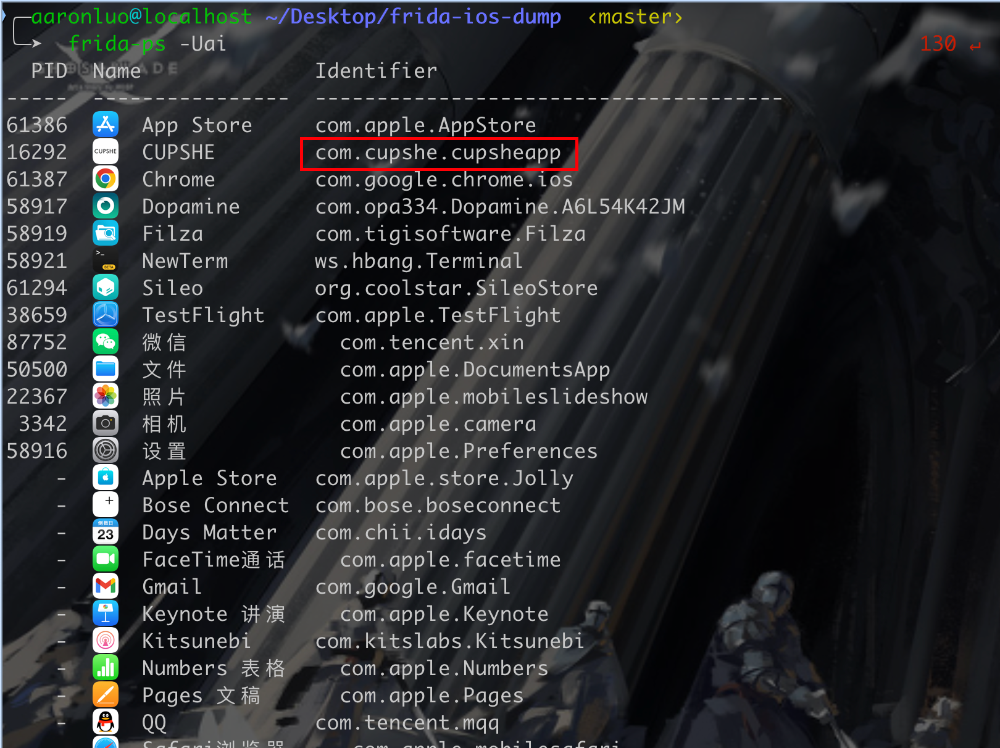
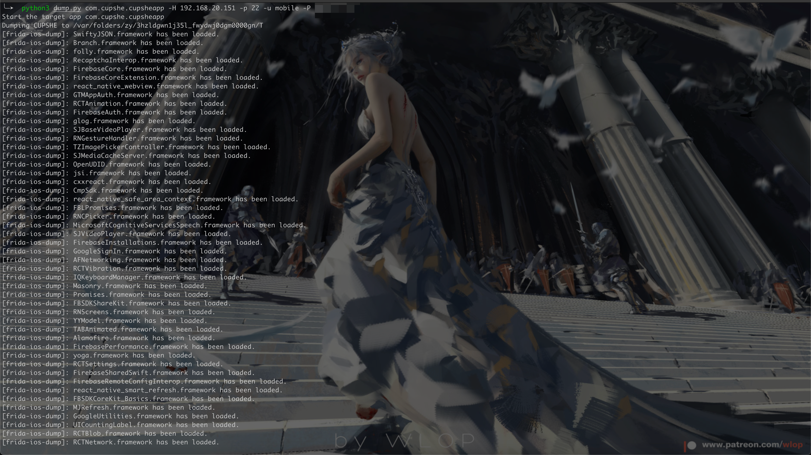
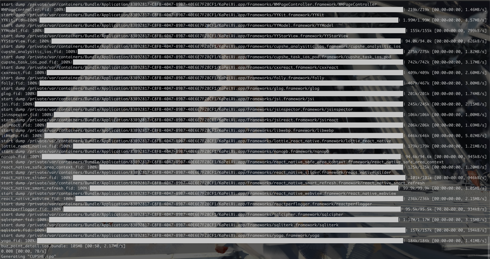
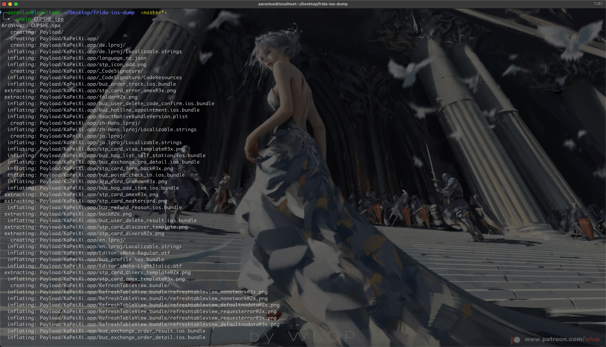
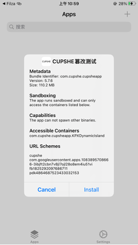
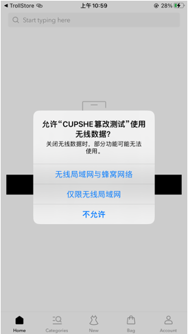
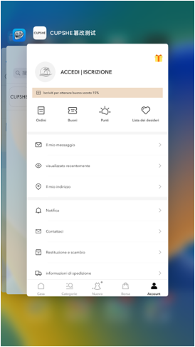
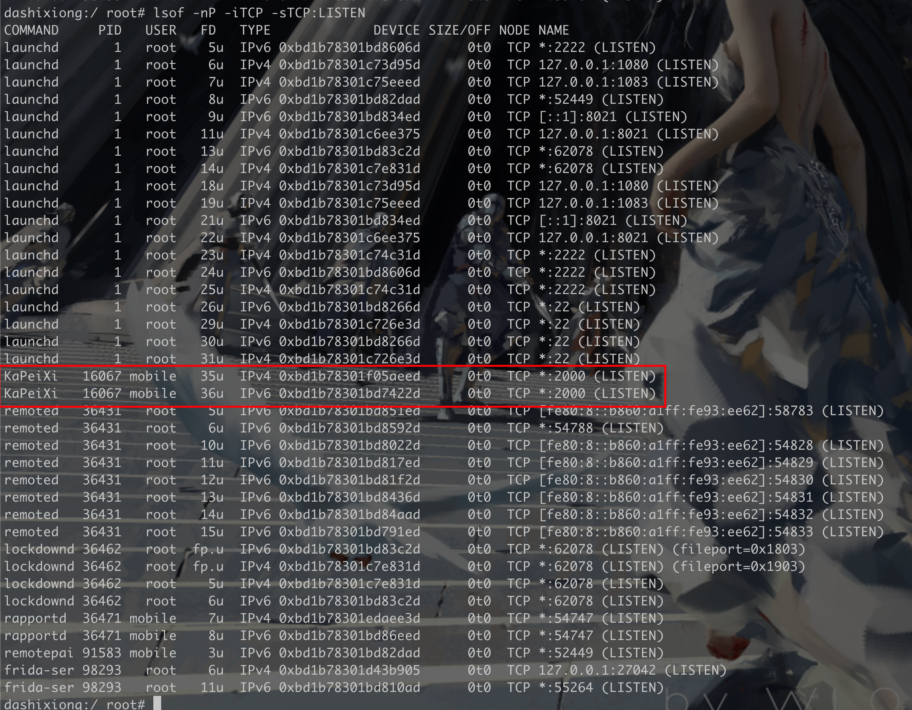
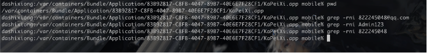
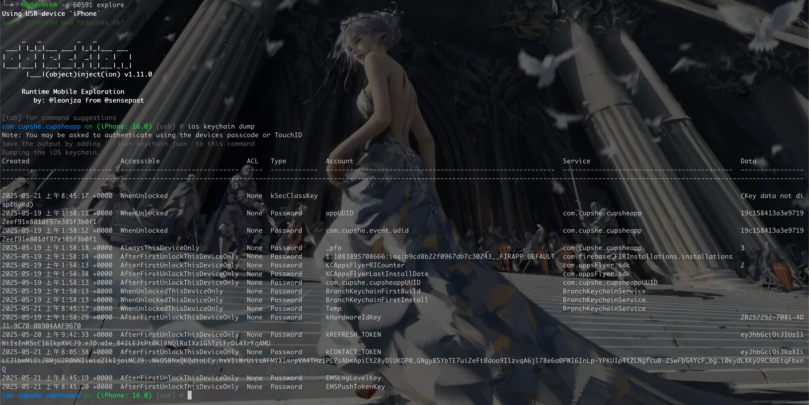

# IOS15 越狱+基础项测试

## 越狱

IOS15 版本越狱使用[dopamine](https://ellekit.space/dopamine/)越狱，使用爱思助手可以无脑下载多巴胺且按照操作可直接安装好app
安装好之后，信任该APP，打开之后点击越狱按钮，完成越狱后如图所示


在越狱过程中选择Sileo 做为应用管理器，输入的密码为登录SSH的密码，这里为 `admin@123`,用户默认为 `mobile`

由于该项目与之前的越狱项目（如chimera等）不通，该项目采用的是RootLess的模式，传统的为RootFul模式，导致部分基础项测试不能使用爱思助手完成，需要配合 `frida`，`objection`来完成测试

### 必要的应用

- openssh(Sileo)
- Filza File Manager(Sileo)
- NewTerm(Sileo)
- lsof(Sileo)
- Apple File Conduit "2"(Sileo)
- frida-server-iphone([frida-server](https://github.com/frida/frida/releases))
- 巨魔商店([TrollStore](https://github.com/opa334/TrollStore/releases))

安装好之后如图所示


## 基础项测试

### 应用完整性校验

**漏洞说明：** 测试客户端程序是否对自身完整性进行校验。

**危险等级：中**

**测试步骤：**

使用[frida-ios-dump](https://github.com/AloneMonkey/frida-ios-dump)脱壳，由于APP上线之后苹果会给二进制文件进行加壳操作，如果使用Filza File Manager打包ZIP之后，修改为ipa的后缀，再篡改内容，重新打包就无法完成验证，所以在导出的时候就需要使用脱壳，然后对配置文件等进行修改，再打包

1. 脱壳
   ```shell
   # 安装好对应版本的frida-client
   # 首先使用frida 查看对应软件的包名
   frida-ps -Uai
   ```



```shell
# 使用脱壳工具脱壳
python3 dump.py <packageName> -H <iphone's host> -p 22 -u mobile -P <your passord>
```





此时在当前目录下可以得到该应用的已脱壳后的IPA文件

```shell
# 解压该IPA文件
unzip ${packageName}.ipa
```



```shell
# 解包后会生成Payload目录（后期安装的时候要按这个目录压缩）
cd  Payload
cd ${APPNAME}.app
```

2. 篡改

修改相关信息，我一般修改APPNAME
修改完之后，打包 `Payload`目录，并修改后缀为ipa

```shell
zip  -r Payload.zip  Payload/*
mv Payload.zip Payload.ipa
```

3. 上传至手机

使用scp上传ipa文件至手机

```shell
scp Payload.ipa  mobile@<iphones's host>:/var/mobile/Downloads/
```


在Filza里分享到TrollStore 然后安装




### 端口开放

**​漏洞说明：​**通过监听本地端口作为一个服务启动。

**危险等级：低**

**测试步骤：**

检查app启动之后是否监听本地端口

```shell
# 需要root权限
 lsof -nP -iTCP -sTCP:LISTEN
```

找到对应的app



### 数据文件

**​漏洞说明：​**检查客户端程序存储在手机中的配置文件，防止账号密码等敏感信息保存在本地。

**危险等级：中**

**​测试步骤：​** 检查app路径下的文件是否有敏感信息存储在配置文件中

远程连接手机，进入目录`/var/containers/Bundle/Application/`,当前目录为UUID值，可通过Filza查看对应的UUID是多少


然后再进入到该app中，使用grep快速搜索敏感信息



### 密钥链数据

**​漏洞说明：​**检查客户端是否在密钥链（Keychain）中存放明文密码。

**危险等级：中**

**​测试步骤：​**检查密钥链（Keychain）是否存放明文信息

常规工具keychain_dumper 在ios15上无法使用，由于ios15以上为rootless模式，底层的权限做得更高级，无法直接获取keychain的数据

在这里使用`objection` 来获取keychain 的数据，需要frida-server

```shell
# 正常是使用包名打开，但是该应用打开直接崩溃
objection -g com.cupshe.cupsheapp explore
#使用PID ATTACH上去
frida-ps -Uai
objection -g <PID> explore
# 在objection中输入
ios keychain dump
```



### 系统日志

**​漏洞说明：​**检测系统中是否抛出或泄露该应用的敏感信息。

**危险等级：中**

**​测试步骤：​**使查看系统实时日志，检测是否抛出该应用的敏感信息，如用户账号密码等

这个就用爱思助手就可以看了

