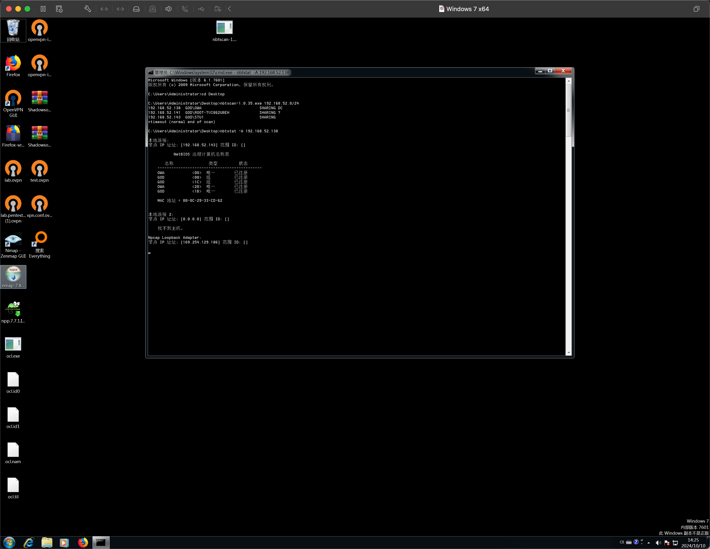
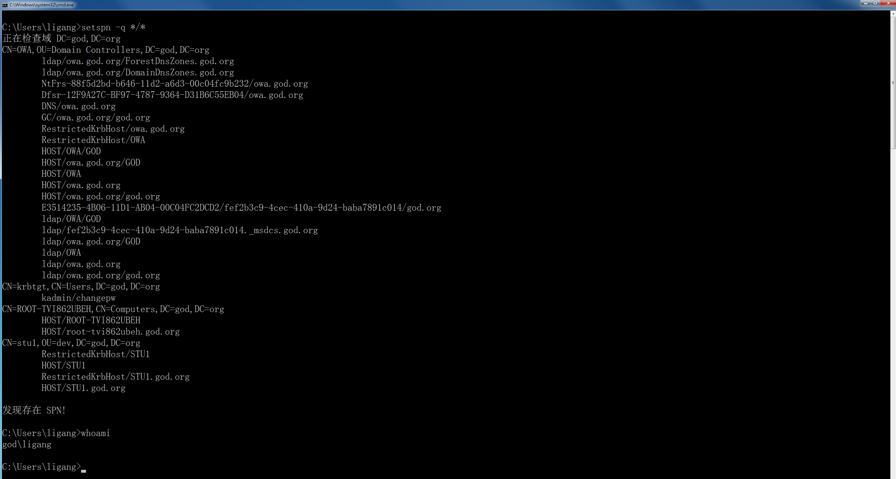
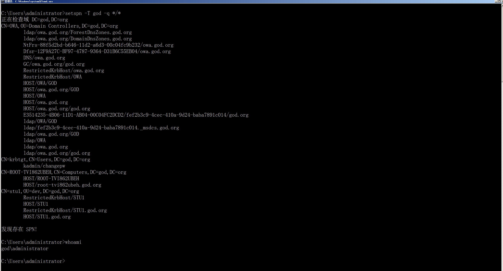
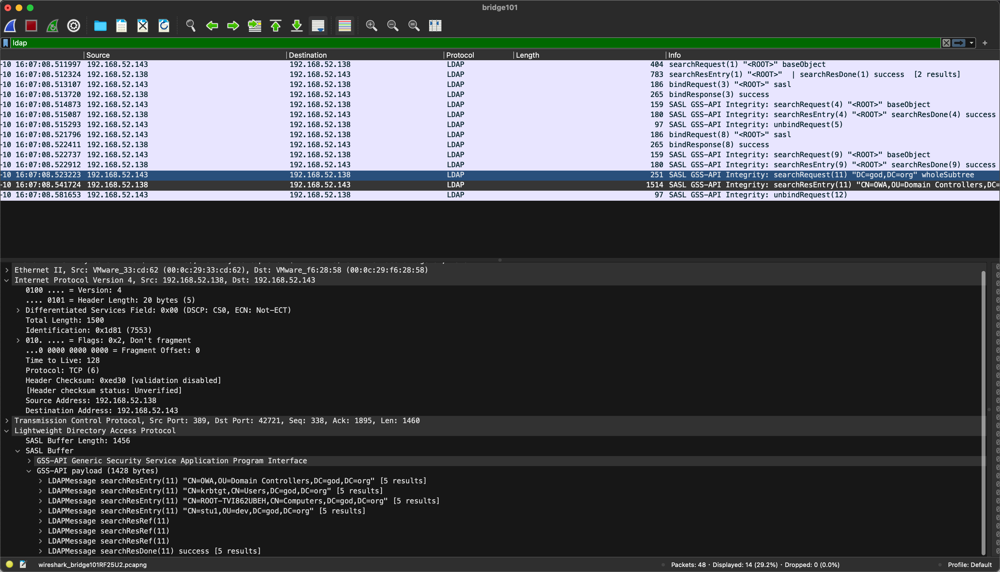
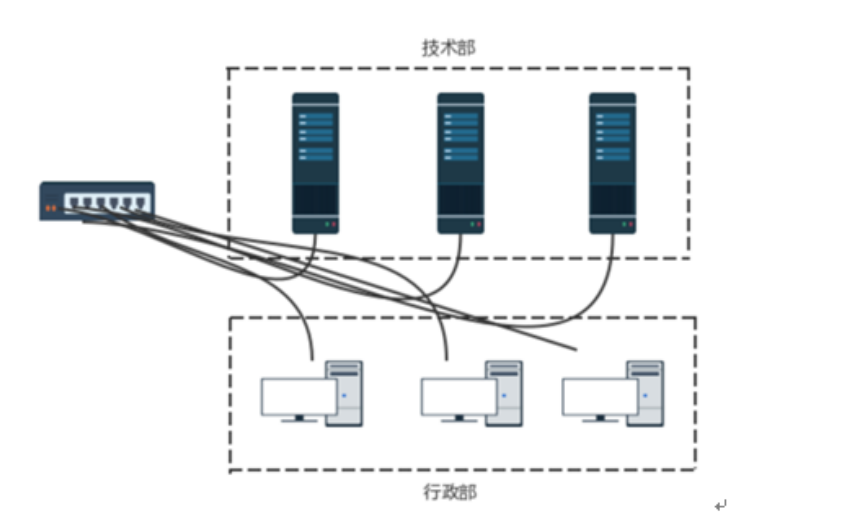
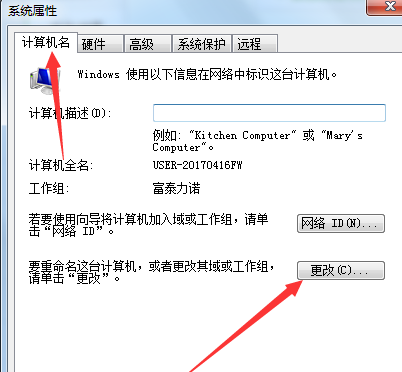

内网也指局域网（Local Area Network，LAN），是指在某一区域内由多台计算机互联成的计算机组。一般是方圆几千米以内。局域网可以实现文件管理、应用软件共享、打印机共享、工作组内的历程安排、电子邮件和传真通信服务等功能。

内网是封闭型的，它可以由办公室内的两台计算机组成，也可以由一个公司内的上千台计算机组成。列如银行、学校、企业工厂、政府机关、网吧、单位办公网等都属于此类。

# 基础概念

## SAM

**SAM(安全账户管理器)**，`SAM`是用来存储`Windows`操作系统密码的数据库文件，为了避免明文密码泄漏，`SAM`文件中保存的是明文密码经过一系列算法处理过的`Hash`值，被保存的`Hash`分为`LM Hash`、`NTLM Hash`。在用户在本地或远程登陆系统时，会将`Hash`值与`SAM`文件中保存的`Hash`值进行对比

在后期的Windows系统中，SAM文件中被保存的密码Hash都被密钥SYSKEY加密。

SAM文件在磁盘中的位置在`C:\windows\system32\config\sam` `SAM`文件在`Windows`系统启动后被系统锁定，无法进行移动和复制

## HASH

`Windows`系统为了保证用户明文密码不会被泄漏，将明文密码转换为`Hash`值进行身份验证，被保存在`SAM`或`ntds.dit`中

## HASH 示例

冒号前半段为`LM Hash`，冒号后半段为`NTLM Hash`

格式如下：

`用户名`:`RID`:`LM-Hash`:`NTLM-Hash`

```powershell
Administrator:500:64822E174CBB6CD287916C896CBF48D9:C7C654DA31CE51CBEECFEF99E637BE15
```

### NTLM HASH产生

> [!WARNING]
>
> 此处只讨论NTLM HASH是如何得到的，LM HASH由于采用**DES加密**，易被破解，从Windows vista系统开始被禁用。LM-Hash如果是`AAD3B435B51404EEAAD3B435B51404EE`，则表示LM-Hash被禁用或值为空。

1. hex(16进制)编码
1. Unicode编码
1. Md4 HASH计算

假设密码为`Admin@66`

1. 将明文密码转换为16进制的格式

```
Admin@666    ->    41646d696e40363636
```

2. 将16进制转换成Unicode格式，即在每个`字节` 之后添加0x00

```
41646d696e40363636    ->    410064006d0069006e004000360036003600
```

3. 使用MD4摘要算法对Unicode编码数据进行Hash计算，结果即为NTLM-HASH值

```
410064006d0069006e004000360036003600    ->    c7c654da31ce51cbeecfef99e637be15
```

### 获取HASH

1. 使用卷影副本将SAM文件导出，配合`SYSKEY`利用`mimikatz`等工具获得`NTLM Hash`
2. 使用`mimikatz`等工具读取`lsass.exe`进程，获取Hash
3. 配合其他漏洞和手法获取 `Net-NTLM Hash` 
4. `Net-NTLM Hash`可以使用Responder或Inveigh等工具获取

### 破解HASH

- LM HASH
  - `john –format=lm hash.txt`
  - `hashcat -m 3000 -a 3 hash.txt`
- NTLM Hash
  - `john –format=nt hash.txt`
  - `hashcat -m 1000 -a 3 hash.txt`
- Net-NTLMv1
  - `john –format=netntlm hash.txt`
  - `hashcat -m 5500 -a 3 hash.txt`
- Net-NTLMv2
  - `john –format=netntlmv2 hash.txt `
  - `hashcat -m 5600 -a 3 hash.txt`

## NTLM 协议

`NTLM`，`"NT LAN Manager"`是一种网络认证协议，它是基于挑战`（Challenge）`/响应`（Response）`认证机制的一种认证模式。

NTLM协议的认证， 包括` NTLMv1` 和` NTLMv2 `两个版本且这个协议只支持`Windows`

**NTLM协议的认证过程分为三步：**

1. 协商（主要用于确认双方协议版本，NTLM协议版本）
2. 质询（就是挑战（Chalenge）/响应（Response）认证机制起作用的范畴）
3. 验证（验证主要是在质询完成后，验证结果）

**质询完整过程：**

1. 协商
   1. 发送用户身份信息请求，将明文密码转化为NTLM HASH值发送给服务端

2. 质询
   1. 服务器生成一个随机的挑战（challenge）并将其发送给客户端。
   2. 客户端接收挑战后，使用用户的密码（NTLM HASH）和一些其他信息（如用户名和域名）来计算一个响应（response）。
   3. 客户端将响应发送回服务器。
3. 验证
   1. 服务器接收响应后，使用相同的信息和存储在数据库中的用户密码的哈希值来计算一个期望的响应。
   2. 服务器将期望的响应与客户端发送的响应进行比较。如果它们匹配，客户端被授权访问请求的资源

也就是说：
`winlogon.exe    -> 接受用户输入   -> lsass.exe -> 认证`

>[!NOTE]
>
>Windows Logon Process(即 winlogon.exe)，是Windows NT 用户登 陆程序，用于管理用户登录和退出。
>
>LSASS用于微软Windows系统的安全机 制。它用于本地安全和登陆策略

用户登录时，操作系统通过`winlogon.exe`进程显示登录页面输入框，用户输入账号密码后，将密码传输给lsass进程将明文密码加密成`NTLM HASH`，然后与`SAM`中的`HASH`进行对比

**NTLM(V1/V2)的hash是存放在安全账户管理(SAM)数据库以及域控的NTDS.dit数据库中，获取该Hash值可以直接进行PTH攻击**

**NTLM V2协议**

NTLM v1与NTLM v2最显著的区别就是Challenge与加密算法不同，共同点就是加密的原料都是NTLM Hash。

下面细说一下有什么不同:

- Challage:NTLM v1的Challenge有8位，NTLM v2的Challenge为16位。
- Net-NTLM Hash:NTLM v1的主要加密算法是DES，NTLM v2的主要加密算法是HMAC-MD5

## SMB

`SMB(Server Message Block)`被称为服务器消息块，又叫网络文件共享系统(`CIFS`)。在`Windows2000`中，`SMB`除了基于`NBT`实现，还可以直接通过`445`端口实现

#### 主要功能

使网络上的机器能够共享计算机文件、打印机、串行端口和通讯等资源。

#### 原理

CIFS消息一般使用NetBIOS或TCP协议发送，分别使用不同的端口139或445，当前倾向于使用445端口。

- 直接运行在 TCP 上 port 445
- 通过使用 NetBIOS API
  - 基于 UDP ports 137, 138 & TCP ports 137, 139
  - 基于一些传统协议，例如 NBF

#### 历史版本

1. SMB 1.0（没有数字签名功能）

2. SMB 2.0

3. SMB 2.1

4. SMB 3.0

## IPC（进程通信）

### 简介

指至少两个进程或线程间传送数据或信号的一些技术或方法

### 作用

- 信息共享：Web服务器，通过网页浏览器使用进程间通信来共享web文件（网页等）和多媒体
- 加速：维基百科使用通过进程间通信进行交流的多服务器来满足用户的请求
- 模块化
- 私有权分离

## IPC\$

### 简介

`IPC$（Internet Process Connection）`是共享“命名管道”的资源，为了让进程间通信而开放的命名管道，通过提供可信任的用户名和口令，连接双方可以建立安全的通道并以此通道进行加密数据的交换，从而实现对远程计算机的访问，从`NT/2000`开始使用

**其实说白了`IPC$`有点类似于共享目录，但功能比他多得多。通过`IPC$`与目标机建立连接，不仅可以访问目标机器中的文件，进行上传、下载，还可以在目标机上运行命令。**

`IPC$`在同一时间内，两个IP之间只允许建立一个连接。

`NT/2000`在提供了` IPC$ `功能的同时，在初次安装系统时还打开了默认共享，即所有的逻辑共享(`c$`,`d$`,`e$`……)和系统目录`winnt`或管理员目录(`admin$`)共享。

### IPC\$主要使用

#### IPC\$空连接

对于NT，在默认安全设置下，借助空连接可以列举目标主机上的用户和共享，访问everyone权限的共享，访问小部分注册表等；在WIndows Server 2000及以后作用更小，因为在Windows 2000 和以后版本中默认只有管理员有权从网络访问到注册表。

常用命令：

```shell
net use \\192.168.1.101\ipc$ "" /user:"domain\username" #建立IPC$空连接
net use \\192.168.1.101\ipc$ "password" /user:"domain\username" #建立IPC$非空连接
net use \\192.168.1.101\ipc$ /del #删除IPC$连接
net use z: \\192.168.1.101\c$ #已经建立IPC$连接并且有权限，将目标C盘映射到本地Z盘
net use z: /del #删除映射
net use ipc$ /del #关闭IPC$默认共享
```

> [!NOTE]
>
> 1. 现在绝大多数的Windows操作系统默认策略不允许来自远程网络验证的空密码，所以**IPC空连接已经被废弃**。
> 2. 如果远程服务端未开启139、445端口，无法使用IPC$进行连接。

## NETBIOS

### 简介

NETBIOS(网络基本输入输出系统),严格讲不属于网络协议，NETBIOS是应用程序接口(API),早期使用NetBIOS Frames(NBF)协议进行运作,是一种非路由网络协议，位于传输层；

后期NetBIOS over TCP/IP（缩写为NBT、NetBT）出现，使之可以连接到TCP/IP，是一种网络协议，位于会话层。基于NETBIOS协议广播获得计算机名称——解析为相应IP地址，WindowsNT以后的所有操作系统上均可用，不支持IPV6

### 类型

NETBIOS提供三种服务

1. NetBIOS-NS（名称服务）：为了启动会话和分发数据报，程序需要使用Name Server注册NETBIOS名称，可以告诉其他应用程序提供什么服务，默认监听UDP137端口，也可以使用TCP 137端口
2. Datagram distribution service（数据报分发服务）：无连接，负责错误检测和恢复，默认在UDP 138端口。
3. Session Server（会话服务）：允许两台计算机建立连接，默认在TCP 139端口。

### 利用NETBIOS发现主机

**nbstat**（Windows 自带命令）

获取主机Mac地址

```shell
nbtstat -A 172.16.93.3
```

**nbtscan**

扫描指定网段的主机名和网络开放共享

```shell
nbtscan.exe 192.168.100.1/24
```



## LLMNR

### 简介

LLMNR是链路本地多播名称解析，当局域网中的DNS服务器不可用时，可以使用LLMNR解析本地网段上机器名称，只有WindowsVista和更高版本才支持LLMNR，支持IPV6

### 工作流程

1. 通过UDP发送到组播地址224.0.0.252:5355，查询主机名对应的IP，使用的是DNS格式数据包，数据包会被限制在本地子网中。

2. 本地子网中所有支持LLMNR的主机在受到查询请求时，会对比自己的主机名是否相同，不同就丢弃，相同就发送包含自己IP的单播信息给查询主机。
3. 主机在内部名称缓存中查询名称
4. 在主DNS查询名称
5. 在备用DNS查询名称
6. 使用LLMNR查询名称

## WMI

WMI(Windows管理规范)，由一系列对Windows Driver Model的扩展组成，它通过仪器组件提供信息和通知，提供了一个操作系统的接口。**在渗透测试过程中，攻击者往往使用脚本通过WMI接口完成对Windows操作系统的操作，远程WMI连接通过DCOM进行。例如：WMIC、Invoke-WmiCommand、Invoke-WMIMethod等。另一种方法是使用Windows远程管理（WinRM）。**

## SPN

在内网渗透的信息收集中，机器服务探测一般都是通过端口扫描去做的，但是有些环境不允许这些操作。通过利用 SPN 扫描可快速定位开启了关键服务的机器，这样就不需要去扫对应服务的端口，有效规避端口扫描动作。

`Kerberoasting` 是域渗透中经常使用的一项技术，是通过爆破 `TGS-REP` 实现。

### 简介

**Kerberos 身份验证使用 SPN 将服务实例与服务登录帐户相关联**。在内网中，SPN扫描通过查询向域控服务器执行服务发现，可以识别正在运行重要服务的主机，如终端，交换机等。SPN的识别是Kerberoasting攻击的第一步。

**SPN(ServicePrincipal Names)服务主体名称**，是服务实例(比如：HTTP、SMB、MySQL等服务)的唯一标识符。Kerberos认证过程使用SPN将服务实例与服务登录账户相关联，如果想使用 Kerberos 协议来认证服务，那么必须正确配置SPN。如果在整个林或域中的计算机上安装多个服务实例，则每个实例都必须具有自己的  SPN。如果客户端可能使用多个名称进行身份验证，则给定服务实例可以具有多个SPN。SPN  始终包含运行服务实例的主机的名称，因此服务实例可以为其主机的每个名称或别名注册SPN。一个用户账户下可以有多个SPN，但一个SPN只能注册到一个账户。在内网中，SPN扫描通过查询向域控服务器执行服务发现。这对于红队而言，可以帮助他们识别正在运行重要服务的主机，如终端，交换机等。**SPN的识别是kerberoasting攻击的第一步**。

SPN分为两种类型：

1. 注册在活动目录的机器帐户(Computers)下，当一个服务的权限为`Local System`或`Network Service`，则SPN注册在机器帐户(Computers)下。
2. 注册在活动目录的域用户帐户(Users)下，当一个服务的权限为一个域用户，则SPN注册在域用户帐户(Users)下。

**普通域用户账号**是没有权注册SPN：

```
域：test.com
机器名：W10b
普通域用户：test\fw
```

（手动注册）权限不够

```shell
# -S 参数：验证不存在重复项后，添加随意 SPN。注意： -S 从 Windows Server 2008 开始系统默认提供。
Setspn -S http/<computername>.<domainname> <domain-user-account>

Setspn -s http/WebDemo_PC.rcoil.me rcoil\web
Setspn -s http/WebDemo_PC.rcoil.me WebDemo_PC$
```

**格式**

```
<service class>/<host>:<port> <servername>
服务类型/对应机器名:服务端口[默认端口可不写]
MSSQLSvc/SQLServer.rcoil.me:1433
```

> [!NOTE]
>
> serviceclass可以理解为服务的名称，常见的有www, ldap, SMTP, DNS, HOST等
>
> host有两种形式，FQDN和NetBIOS名，例如server01.test.com和server01
>
> 如果服务运行在默认端口上，则端口号(port)可以省略

### 查询SPN

对域控制器发起LDAP查询，这是正常kerberos票据行为的一部分，因此查询SPN的操作很难被检测

#### SetSPN

Win7和Windows Server2008自带的工具

查看当前域内的所有SPN：

```shell
setspn.exe -q */*
```



查看God域内的所有SPN



以CN开头的每一行代表一个帐户，其下的信息是与该帐户相关联的SPN

对于上面的输出数据，机器帐户(Computers)为：

- ROOT-TVI862UBEH
- OWA
- stu1

#### 相关原理

`SPN 查询`，实际上就是就是查询 `LDAP` 中存储的内容。



#### 其他相关工具

> [!NOTE]
>
> 利用中的SPN扫描有说明用法
>
> 1. Discover-PAMSSQLServers(Powershell-AD-Recon)
> 2. GetUserSPNs(Powershell、vbs、Python)
> 3. PowerView(Powershell)
> 4. SetSPN(exe)

### [利用](/知识库/06.内网安全/02.域渗透/02.Kerberoasting利用.html)

## Windows Access Token

### 简介

Windows Access Token(访问令牌)，**它是一个描述进程或者线程安全上下文的一个对象**。不同的用户登录计算机后， 都会生成一个Access Token，这个Token在用户创建进程或者线程时会被使用，不断的拷贝，这也就解释了A用户创建一个进程而该进程没有B用户的权限。当用户注销后，系统将会使主令牌切换为模拟令牌，不会将令牌清除，只有在重启机器后才会清除 Access Token分为两种(主令牌、模拟令牌)

### 组成

- 用户帐户的安全标识符(SID)
- 用户所属的组的SID
- 用于标识当前登录会话的登录SID
- 用户或用户组所拥有的权限列表
- 所有者SID
- 主要组的SID
- 访问控制列表
- 访问令牌的来源
- 令牌是主要令牌还是模拟令牌
- 限制SID的可选列表
- 目前的模拟等级
- 其他统计数据

### SID

安全标识符是一个唯一的字符串，它可以代表一个账户、一个用户 组、或者是一次登录。通常它还有一个SID固定列表，例如 Everyone这种已经内置的账户，默认拥有固定的SID。

SID表现形式:

域SID-用户ID 计算机SID-用户ID

### Windows Access Token产生过程

每个进程创建时都会根据登录会话权限由LSA(Local Security Authority)分配一个Token(如果CreaetProcess时自己指定了 Token, LSA会用该Token， 否则就用父进程Token的一份拷贝

## 本地认证流程

- Windows Logon Process(即 winlogon.exe)，**Winlogon 是负责处理安全相关的用户交互界面的组件**。Winlogon的工作包括加载其他用户身份安全组件、提供图形化的登录界面，以及创建用户会话。
- LSASS(本地安全认证子系统服务)用于微软Windows系统的安全机制。**它负责Windows系统安全策略**。它负责用户在本地验证或远程登陆时验证用户身份，管理用户密码变更，并产生访问日志。

用户注销、重启、锁屏后，操作系统会让winlogon显示图形化登录界面，也就是输入框，接收域名、用户名、密码后交给lsass进程，将明文密码加密成NTLM Hash，对SAM数据库比较认证，相同则认证成功。

## 工作组

### 简介

工作组（ Work Group ）， 在一个大的单位内，可能有成百上千台电脑互相连接组成局域网，它们都会列在“网络（网上邻居）”内，如果这些电脑不分组，可想而知有多么混乱，要找一台电脑很困难。为了解决这一问题，就有了“工作组”这个概念，将不同的电脑一般按功能（或部门）分别列入不同的工作组中，如技术部的电脑都列入“技术部”工作组中，行政部的电脑都列入“行政部”工作组中。你要访问某个部门的资源，就在“网络”里找到那个部门的工作组名，双击就可以看到那个部门的所有电脑了。相比不分组的情况就有序的多了，尤其是对于大型局域网络来说。

工作组中的机器之间相互没有信任关系，每台机器的账号密码只是保存在自己的SAM文件中。那就意味着如果需要共享资源只能新建一个账号并指定相关资源授予该账号权限才可以完成共享。早期利用SMB协议在内网中传输明文口令，后为了安全出现LM Challenge/Response 验证机制，再之后LM Challenge/Response 验证机制因为安全性问题，从Windows Vista / Server 2008开始LM就被弃用，改用Windows NT挑战/响应验证机制，**常被人称为NTLM**，现在被更新到NTLMv2



### 加入/创建工作组

右击桌面上的“计算机”，在弹出的菜单出选择“属性”，点击“更改设置”，“更改”，在“计算机名”一栏中键入你想好的名称，在“工作组”一栏中键入你想加入的工作组名称。

如果你输入的工作组名称网络中没有，那么相当于新建了一个工作组，当然暂时只有你的电脑在组内。单击“确定”按钮后，Windows提示需要重新启动，重新启动之后，再进入“网络”就可以看到你所加入的工作组成员了。



### 退出工作组

只要将工作组名称改动即可。不过在网上别人照样可以访问你的共享资源。你也可以随便加入同一网络上的任何其它工作组。“工作组”就像一个可以自由进入和退出的“社团”，方便同一组的计算机互相访问。

所以工作组并不存在真正的集中管理作用, 工作组里的所有计算机都是对等的,也就是没有服务器和客户机之分的。

### 工作组的局限性

假如一个公司有200台电脑，我们希望某台电脑上的账户Alan可以访问每台电脑内的资源或者可以在每台电脑上登录。那么在“工作组”环境中，我们必须要在这200台电脑的各个SAM数据库中创建Alan这个账户。一旦Alan想要更换密码，必须要更改200次！现在只是200台电脑的公司，如果是有5000台电脑或者上万台电脑的公司呢?估计管理员会抓狂。

## 域

> [!NOTE]
>
> 升级版的工作组，多了一层权限管理控制

### 简介

域(Domain)是一个有安全边界的计算机集合（安全边界意思是在两个域中，一个域中的用户无法访问另一个域中的资源），可以简单的把域理解成升级版的“工作组”，相比工作组而言,它有一个更加严格的安全管理控制机制,如果你想访问域内的资源,必须拥有一个合法的身份登陆到该域中,而你对该域内的资源拥有什么样的权限,还需要取决于你在该域中的用户身份。

### 域控DC

域控制器（Domain Controller，简写为DC）是一个域中的一台类似管理服务器的计算机，相当于一个单位的门卫一样，它负责每一台联入的电脑和用户的验证工作，域中所有计算机想要互相访问，都要经过域控制器的审核

DC中存在**由这个域的账号，密码，属于这个域的计算机等信息构成的数据库**。当计算机连接到域的时候，域控制器首先要鉴别这台计算机是否属于这个域，以及用户使用的登录账号是否存在，密码是否正确

控制器是整个域的通信枢纽，所有的权限身份验证都在域控制器上进行，也就是说，域内所有用来验证身份的账号和密码列值都保存在域控制器中。

### 组织单元OU

在域中，一个组织单元OU是把对象组织成逻辑管理组的容器，其中包括一个或多个对象，如用户账号、组、计算机、打印机、应用、文件共享或其他OU等。

### 单域

在一般的具有固定地理位置的小公司里，建立一个域就可以满足所需。

一般在一个域内要建立至少两个域服务器，一个作为DC，一个是备份DC。如果没有第二个备份DC，那么一旦DC瘫痪了，则域内的其他用户就不能登陆该域了，因为活动目录的数据库（包括用户的帐号信息）是存储在DC中的。而有一台备份域控制器（BDC），则至少该域还能正常使用，期间把瘫痪的DC恢复了就行了。

### 父域和子域

出于管理及其他一些需求，需要在网络中划分多个域，第一个域称为父域，各分部的域称为该域的子域。

比如一个大公司，它的不同分公司在不同的地理位置，则需父域及子域这样的结构。如果把不同地理位置的分公司放在同一个域内，那么他们之间信息交互（包括同步，复制等）所花费的时间会比较长，而且占用的带宽也比较大。（因为在同一个域内，信息交互的条目是很多的，而且不压缩；而在域和域之间，信息交互的条目相对较少，而且压缩。）

还有一个好处，就是子公司可以通过自己的域来管理自己的资源。

还有一种情况，就是出于安全策略的考虑，因为每个域都有自己独有的安全策略。比如一个公司的财务部门希望能使用特定的安全策略（包括帐号密码策略等），那么可以将财务部门做成一个子域来单独管理。

### 域树

域树指若干个域通过建立信任关系组成的集合。

一个域管理员只能管理本域的内部，不能访问或者管理其他的域，二个域之间相互访问则需要建立信任关系(Trust Relation)。

信任关系是连接在域与域之间的桥梁。域树内的父域与子域之间不但可以按需要相互进行管理，还可以跨网分配文件和打印机等设备资源，使不同的域之间实现网络资源的共享与管理，以及相互通信和数据传输。

在一个域树中，父域可以包含很多子域，子域是相对父域来说的，指域名中的每一个段。子域只能使用父域作为域名的后缀，也就是说在一个域树中，域的名字是连续的。


